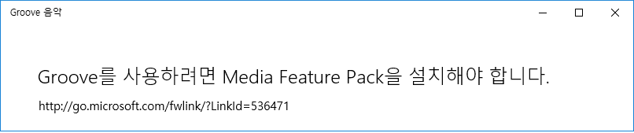
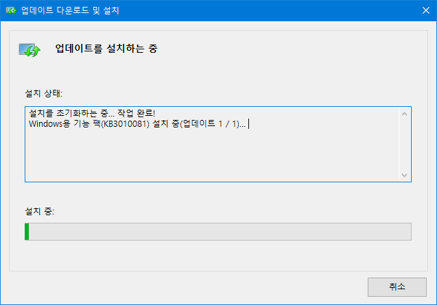
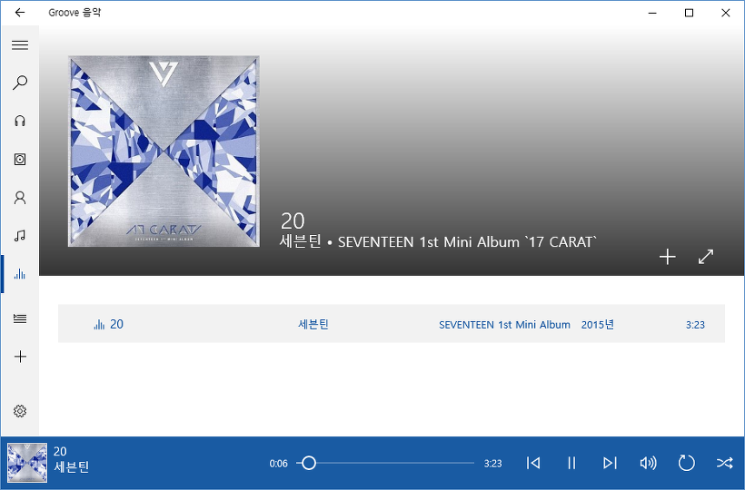

안녕하세요.

윈도우를 업데이트하거나, 포멧을 하고 재설치를 했더니 갑자기 Media Feature Pack을 설치해야 한다는 오류가 뜰때가 있습니다.

예를들면,

Windows Media Feature Pack 설치 또는 재설치가 필요합니다.

Groove를 사용하려면 Media Feature Pack을 설치해야 합니다.

와 같은 오류를 말하는 것 입니다.

저는 불편함 없이 지내다가 Groove Music을 실행하니 오류가 발생하더라고요.

그런데, 저는 분명히 Media Feature Pack을 설치한 상태였습니다.

마이크로소프트 홈페이지에서 프로그램을 받아 실행해도,

이미 설치되어 있습니다.

라는 알림만 뜨고 해결은 안됬지요.

그래서 수소문 끝에 이 Media Pack을 재설치하는 방법을 찾았습니다.

[http://answers.microsoft.com/ko-kr/windows/forum/windows\_10-windows\_install/%EC%9C%88%EB%8F%84%EC%9A%B0%EC%A6%8810-kb3010081/ec0cd22e-49e0-49f6-b8c8-871fe2aaabec](http://answers.microsoft.com/ko-kr/windows/forum/windows_10-windows_install/%EC%9C%88%EB%8F%84%EC%9A%B0%EC%A6%8810-kb3010081/ec0cd22e-49e0-49f6-b8c8-871fe2aaabec?auth=1)

원리는 레지스트리 상속을 통해 수정 권한을 얻은 뒤, Media Pack과 관련된 키값을 제거해서 업데이트가 설치되지 않은 상태로 속여(아마도..?) 재설치 하는 방법으로 생각됩니다.

레지스트리는 잘못 건들면 부팅이 아에 안되는 사태까지 발생할 수 있으므로 링크 폭파시를 위해 방법을 저장해두기만 하고 따로 설명하지 않겠습니다.

위 링크의 답변이 자세하게 나와 있어서 따로 설명해드릴 것도 없습니다. ㅎㅎ..

(열기) 링크가 사라졌을 때를 대비해서 방법을 적어둠

접기

이제 미디어 기능 팩을 마이크로소프트 홈페이지에서 다운받아 설치해도 이미 설치되어 있다고 뜨지 않고 위 스샷처럼 정상 설치됩니다.

Groove Music도 정상 작동하는 모습을 확인했습니다.
