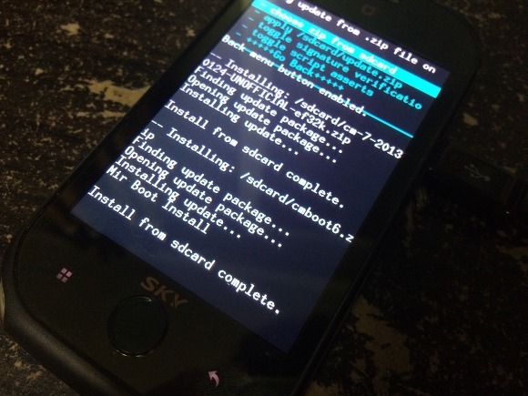
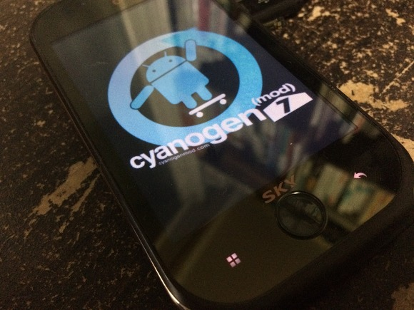
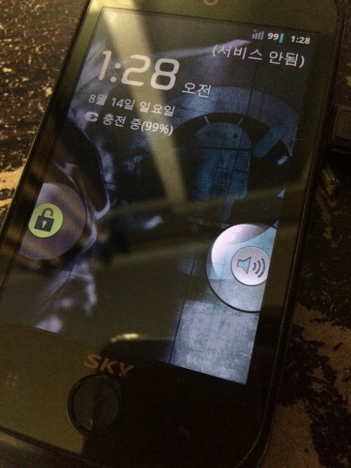
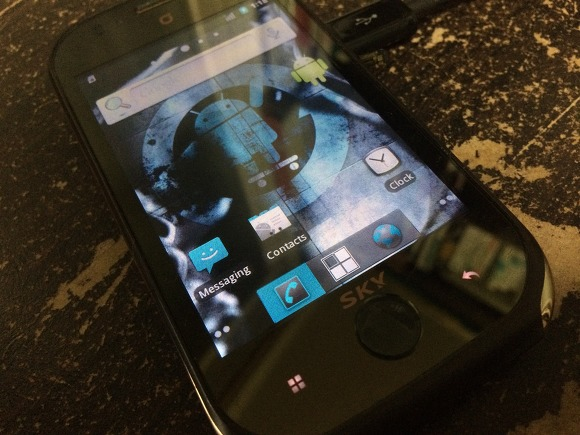
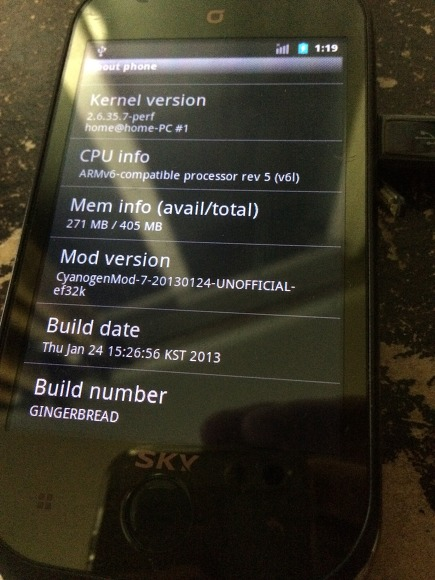
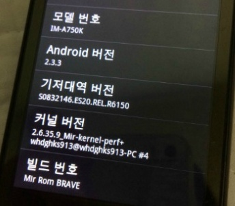
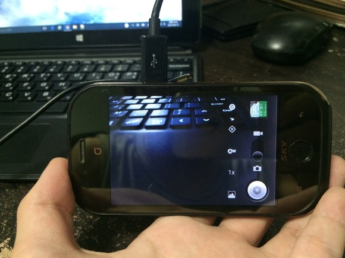
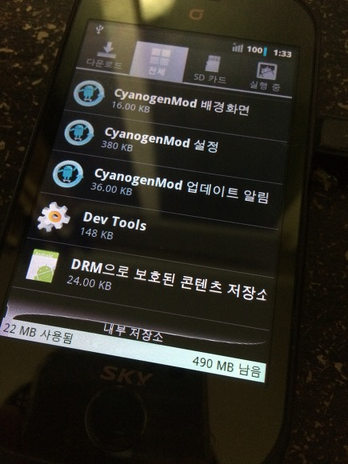
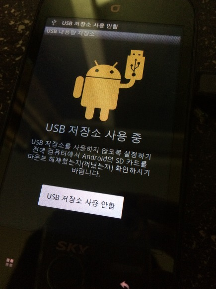

미라크 A CyanogenMod 7 (CM7)

안녕하세요.

오랜만에 블로그에 포스팅하는 것 같습니다.

자기소개서 작성하느라 요즘 정신이 없어서 블로그에도 소홀해지고 있네요..

다른건 아니고 제가 머리가 아파서 쉬다가 미라크a를 잡아봤습니다.

배터리가 문제인지 부팅이 안됬지만 집념을 가지고 충전기를 연결해보니 부팅에 성공해서 cm7을 올려봤습니다.

미라크a의 CyanogenMod 7은 2013년도에 제가 직접 포팅한 롬이며, 아래 게시글에서 흔적을 찾으실 수 있습니다.

[[Android Build] - cm-7-20130124-UNOFFICIAL-ef32k (미라크A CyanogenMod)](/archive/itmir/2013/102)

[[Android Build] - 빌드한 ClockWorkMod Recovery - 화면 안짤림 - 기기명 ef32k (KT미라크A)](/archive/itmir/2013/22)

[[Android Build] - ClockWorkMod Recovery for Mirach A](/archive/itmir/2013/8)

제 블로그를 [네이버 블로그](http://whdghks913.blog.me/)에서 티스토리 블로그로 옮긴 시기가 cm7을 포팅했을때 시기와 겹치기 때문에 제 티스토리에 올라온 게시글의 날짜는 비슷합니다.

원본 네이버 블로그 게시글은 아래와 같습니다.

cm-7-20130124-UNOFFICIAL-ef32k : <http://whdghks913.blog.me/20177902725>, 또는 [SDA 네이버 카페](http://cafe.naver.com/skydevelopers/205273)

빌드한 ClockWorkMod Recovery - 화면 안짤림 - 기기명 ef32k (KT미라크A) : <http://whdghks913.blog.me/20176732787>

그럼 CWM 사진부터 시작하겠습니다.

### ClockWorkMod Recovery for Mirach A

미라크a기기는 CWM을 비롯한 자료가 드물었습니다.

팬택 기기가 중국 포럼에서도 개발되기도 했지만 미라크a는 큰 인지도가 없었...기때문에 힘들었던 기억이 납니다.

제가 CM7을 빌드하며 딸려나온(!) CWM 리커버리를 이용해서 CM7을 설치했습니다.

원래 CWM을 빌드하는 것까진 쉬웠는데 CM7을 빌드하는건..

갑자기 노트북으로 24시간동안 빌드했던 기억이 납니다. ㅋㅋㅋㅋ

### CyanogenMod 7 for Mirach A by Mir

미라크a에 CM7을 올려본 사진들입니다.

부팅 화면이 나타나고 처음 부팅시 조금 시간이 걸린 뒤에 부팅이 완료됩니다.

잠금화면 사진입니다. (사진을 찍은 시간은 다르나 제 나름대로 재배치했습니다.)

홈화면 사진입니다.

처음으로 부팅했을때는 build.prop에 해상도 설정이 잘못 기록되어 있어서 아이콘이 매우 크게 나왔었습니다.

참고 : [[Android Build] - ★미라크a CM7부팅 성공★](/archive/itmir/2013/21)

배포한 버전은 해상도를 순정 상태로 설정한 버전입니다.

설정의 디바이스 정보란입니다.

그나저나 CM7에 사용한 커널이 home@home-PC네요. ㅋㅋ

Home PC가 저희집 메인 컴퓨터 이름인데 커널 빌드를 메인 PC VM웨어에서 돌렸나봐요.

제 노트북에서 빌드했다면 아래 스샷처럼 whdghks913이 뜰텐데 말이죠.

Mod Version을 보시면 아시겠지만, 2013년 1월 24일에 빌드한 롬이네요. ㅋㅋ

미라크a 카메라는 우연히 픽스되었습니다.

lib파일을 몇개 섞다가 픽스됬네요. ㅋㅋㅋ

참고 : [[Android Build] - CM7에서 카메라가 정삭적으로 작동합니다..](/archive/itmir/2013/93), <http://whdghks913.blog.me/20177516547>

내부 저장소 스샷입니다.

컴퓨터와 USB로 연결한 뒤 ADB install 명령어를 사용한다면 앱을 설치할 수 있지만, 와이파이가 불가능하므로 마켓에 접속할 수는 없습니다.

CM7을 빌드하기전 파티션 정보를 입력했기 때문에 SD카드 마운트와 USB 저장소 사용가능합니다.

매우 오랜만에 본 미라크a는 작았습니다. (그래도 아이폰 5s와 비슷합니다.)

### 미라크a cm7 오픈소스 디바이스 트리

cm7 배포당시 디바이스 소스를 바로 배포하지는 않았지만 이후 정리해서 github에 올려두었습니다.

<https://github.com/itmir913/Mir-kernel>

<https://github.com/itmir913/android_device_ef32k>

궁금하시거나 조사해보고 싶으시다면 위 링크를 클릭해주세요.

### 마무리

미라크a에 오랜만에 CM7을 올려봤습니다.

wi-fi만 픽스할 수 있었다면 정말 완벽했을텐데 조금 아쉬움이 느껴지네요. ㅎ