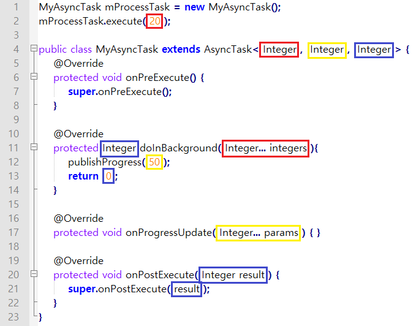
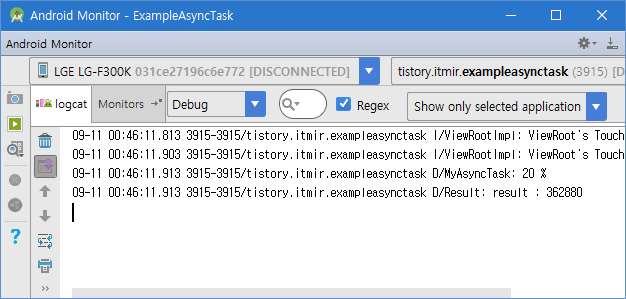

> 이 강좌부터 예제소스를 이클립스 버전이 아닌, 안드로이드 스튜디오 버전으로 기본 제공합니다.
>
> 안드로이드 스튜디오는 gradle과 sdk 의존성등 예제 소스를 import할 경우 많은 오류가 발생할 수 있습니다.
>
> gradle파일을 자신의 컴퓨터에 다운받은 sdk버전과, gradle버전으로 수정하시면 오류 없이 빌드하실 수 있습니다.

안녕하세요.

# 앱강좌는 중단되지 않았습니다.

..#33번글과 너무 많은 시간 간격이 있군요.

너무 늦어서 죄송합니다.

### AsyncTask란?

우리는 #강좌에서 쓰레드와 핸들러를 이용한 방법을 배웠습니다.

[[Development/App] - #20 쓰레드(Thread)와 핸들러(Handler)](http://itmir.tistory.com/366)

그런데, 안드로이드에서는 AsyncTask라는 클래스를 상속받아 사용할 수 있습니다.

왜 AsyncTask를 사용해야 할까요?

> 안드로이드는 UI를 담당하는 메인 쓰레드가 존재하는데, 이 쓰레드는 우리가 함부로 접근이 불가능하게 막아뒀습니다.
>
> 그런데 UI변경은 메인 쓰레드에서만 가능하고, 우리가 만든 쓰레드에서는 화면을 바꾸는 어떠한 일도 할 수 없습니다.

이러한 이유로 안드로이드는 Background 작업을 할 수 있도록 AsyncTask를 지원합니다.

AsyncTask는 쓰레드와 핸들러를 통해 UI를 처리했던 것을 한번에 작업할 수 있도록 지원해줍니다.

즉, UI작업을 위해 만들어야 했던 Handler가 필요없어지는 겁니다.

개발할 때의 부담을 덜어줍니다.

또한 백그라운드 작업을 하면서 진행 상황을 사용자에게 보여줄 수 있는 CallBack 메소드도 지원하면서 말이죠.

AsyncTask = Thread + Handler

이제부터 AsyncTask의 기본 구조를 살펴보겠습니다.

### 정해진 사용법이 없는 AsyncTask

AsyncTask는 UI가 아닙니다.

무슨 뜻이냐 하면 지금까지 배운 버튼이나 텍스트뷰처럼 사용자가 알아차릴수 있는 위젯이 아니라,

서비스처럼 사용자가 알 수 없는 형태의 기능이죠.

이 말은 버튼 위젯처럼 정해진 사용법이 없다는 뜻입니다.

왜 제가 이런 말을 하는지 구조를 살펴보겠습니다.

```
public class MyAsyncTask extends AsyncTask<Integer, Integer, Integer> {

    @Override
    protected void onPreExecute() {
        super.onPreExecute();
    }

    @Override
    protected Integer doInBackground(Integer... integers) 
        return 0;
    }

    @Override
    protected void onProgressUpdate(Integer... params) {

    }

    @Override
    protected void onPostExecute(Integer result) {
        super.onPostExecute(result);
    }
}
```

지금까지 배웠던 코드중에서는 가장 간단하다고 생각합니다.

이게 AsyncTask의 전부입니다.

백그라운드 작업이 시작되기 전 onPreExecute()메소드가 호출됩니다.

이 메소드에서 준비작업을 해주시면 됩니다. (네트워크 준비라던가 객체의 new라던가)

Pre메소드가 실행되고나면 본격적인 doInBackground()가 동작합니다.

doIn이 실행되는 도중 publishProgress()을 호출하면 onProgressUpdate()가 실행됩니다.

이 메소드는 사용자에게 진행을 알릴때 사용합니다.

마지막으로 onPostExecute()메소드는 백그라운드 작업이 완료된 후 결과값을 얻습니다.

안드로이드에서 AsyncTask는 추상 클래스 abstract로 정의되어 있습니다.

abstract가 무슨 뜻인지 모르시는 분들께 약간의 도움을 드리자면

> 다른 클래스에서 상속(extends)받아 사용하는 것만 가능한 클래스, 완전하지 않은 클래스이다.

즉, AsyncTask는 완성되어 있지 않은 상태(abstract)로 안드로이드에 포함되어 있으며, 우리가 완성시켜야 합니다.

이제 AsyncTask<>에서 <>안의 내용을 살펴보겠습니다.

- AsyncTask<Void, Void, Void>
- AsyncTask<Void, Integer, Integer>
- AsyncTask<Integer, Integer, Integer>
- AsyncTask<String, Integer, Integer>
- AsyncTask<Integer, Integer, Boolean>

이러한 형태등 필요에 따라 다양하게 정의할 수 있고 각각의 뜻은 아래와 같습니다.

AsyncTask<doInBackground()의 변수 종류, onProgressUpdate()에서 사용할 변수 종류, onPostExecute()에서 사용할 변수종류>

- doInBackground()의 변수 종류 : 우리가 정의한 AsyncTask를 execute할 때 전해줄 값의 종류
- onProgressUpdate()에서 사용할 변수 종류 : 진행상황을 업데이트할 때 전달할 값의 종류
- onPostExecute()에서 사용할 변수종류 : AsyncTask가 끝난 뒤 결과값의 종류

거창하게 말한 것 같지만 알고보면 쉽습니다.

첫번째 인자는 AsyncTask를 실행할 때 값을 넣어줘야 할때가 있잖아요?

그때 어떤 형태의 값을 넣어줘야 할지를 결정합니다.

아래에서 언급할 거지만

MyAsyncTask mProcessTask = new MyAsyncTask();

mProcessTask.execute(10);

이렇게 실행한다면 첫번째는 Integer가 되겠죠?

두번째는 doInBackground()에서 Background작업이 이루어지는 도중에 사용자에게 진행상황을 알리고 싶을때 어떠한 자료형을 사용할지 결정합니다.

doInBackground()에서 publishProgress(20)를 사용하면 onProgressUpdate()에 20이 들어오며 메소드가 호출됩니다.

publishProgress()를 사용하면 onProgressUpdate()메소드가 호출되고, 여기서 메인 메소드에게 UI작업을 시킬 수 있습니다.

만약 String으로 Background 상황을 전달하려면 두번째를 String으로 하신다음 publishProgress("Hello");로 작성하시면 됩니다.

세번째는 리턴값입니다.

doInBackground()에서 Background 작업이 완료된 후 값을 반환할겁니다.

그때 어떤 형태의 값을 반환할 건지 결정합니다.

Void는 아무것도 반환(또는 입력)하지 않을때 사용합니다.

재미있는건 일반적인 메소드와는 달리 여러개의 값도 던질 수 있습니다.

예를들어 mProcessTask.execute( 20, 30, 40 ); 이라는 코드를 작성했다면

doInBackground()의 integers를 배열처럼 []과 position을 이용해서 20, 30, 40의 값을 가져올 수 있습니다.

integers[0] : 20

integers[1] : 30

integers[2] : 40

중요한건 mProcessTask.execute( 20 ); 처럼 하나의 값만 넣어도 doInBackground()에서 값을 찾을 땐 integers[0]으로 찾아야한다는 점입니다.

### 한눈에 확인해보자

위에서 설명한 내용을 그림으로 확인해보겠습니다.



위 그림으로 어떻게 되는지 한 눈에 확인할 수 있습니다.

### 백그라운드에서 !(팩토리얼)을 계산하는 AsyncTask를 짜보자

이번 강좌의 예제는 매우 심플합니다.

버튼을 누르면 android:onClick에 의해 메소드가 호출되고, 그 메소드에는 단 두줄이 들어있습니다.

AsyncTask를 실행하는 코드가요.

그러므로 레이아웃을 설명하는 단계와 Activity,java부분은 넘어가고 AsyncTask만 설명드리겠습니다.

```java
package tistory.itmir.exampleasynctask;

import android.os.AsyncTask;
import android.util.Log;

public class MyAsyncTask extends AsyncTask<Integer, Integer, Integer> {
    @Override
    protected void onPreExecute() {
        super.onPreExecute();
    }

    @Override
    protected Integer doInBackground(Integer... integers) {
        // 1부터 integers[0]까지의 곱을 구한다.
        int result = 1;
        int num = integers[0];

        publishProgress(20);

        for (int i = 1; i <= num; i++) {
            result = result * i;
        }

        return result;
    }

    @Override
    protected void onProgressUpdate(Integer... params) {
        Log.d("MyAsyncTask", params[0] + " % ");
    }

    @Override
    protected void onPostExecute(Integer result) {
        super.onPostExecute(result);

        Log.d("Result", "result : " + result);
    }
}
```

  

복잡하지 않습니다.

위에서 모두 설명한 내용이므로 로그값만 확인하고 넘어가겠습니다.



execute값에 9를 넣어줬기 때문에 1부터 9까지의 곱이 result값으로 나온 것을 확인해보았습니다.

### 단점

아래는 대표적인 AsyncTask의 단점입니다.

- AsyncTask를 execute한 Activity가 종료되었을 때 별도의 지시가 없다면 AsyncTask는 종료되지 않고 계속 돌아간다.
- 한번 execute한 AsyncTask를 다시 execute하면 에러가 발생한다.

따라서 저는 자바 기본 지식인 변수의 스코프를 이용해서 AsyncTask를 execute할때 따로 메소드를 만들어서 execute를 넣어놓고 만든 메소드를 실행하는 방법을 사용했습니다.

### 예제 다운로드

[ExampleAsyncTask.zip](./file/ExampleAsyncTask.zip)

이번 강좌부터는 예제 앱 소스가 이클립스 버전이 아닌 안드로이드 스튜디오에서 작업한 버전으로 올라갑니다.

아직도 이클립스를 사용하고 계신 개발자분께서는 당장 안드로이드 스튜디오로 갈아타시는 것을 추천드립니다.

### 저는 AsyncTask를 급식 다운로드에 사용했습니다.

학교앱을 만들면서 처음에는 Thread로 작업했지만 얼마뒤 AsyncTask를 사용해서 작업했습니다.

제 학교앱 오픈소스를 확인해보시면 ProgressTask.java와 이 클래스를 다시 상속받은 BapDownloadTask class를 확인할 수 있습니다.

### 마무리하며

글에 문제가 있다면 댓글로 알려주세요!

---

## 첨부파일

- [ExampleAsyncTask.zip](https://github.com/itmir913/archive/releases/download/itmir-attachments/ExampleAsyncTask.zip) `276 KB`
