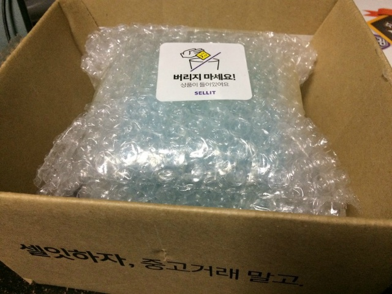
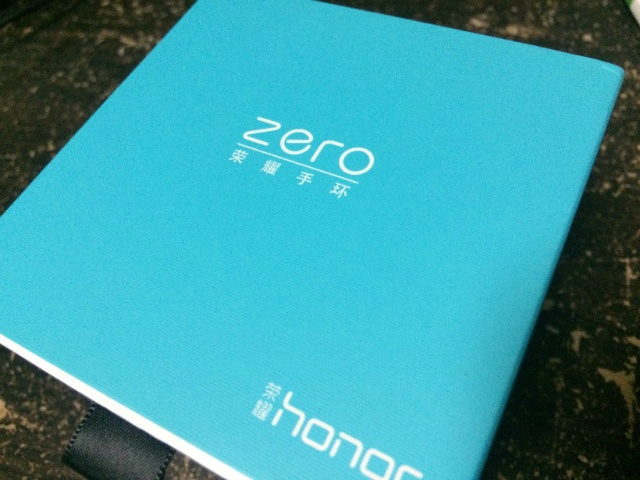
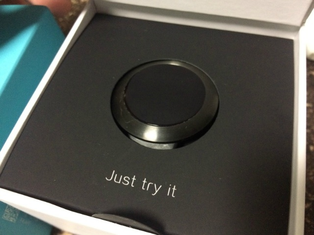
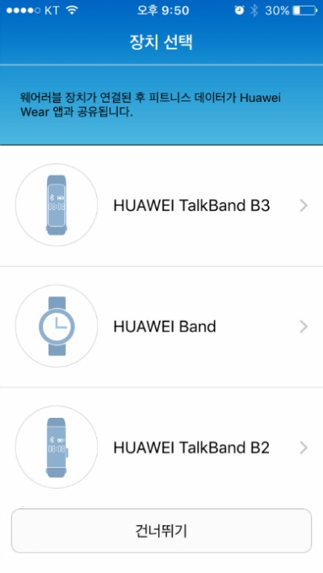
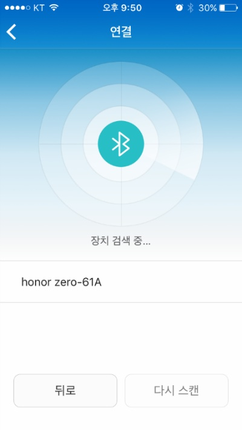
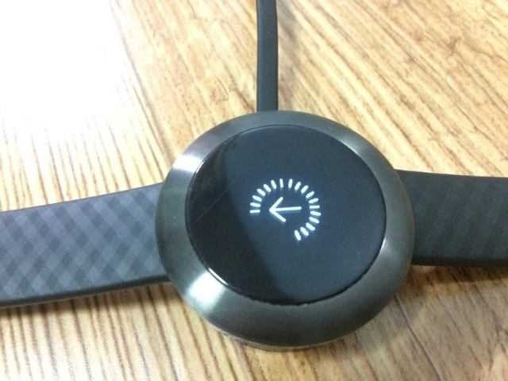
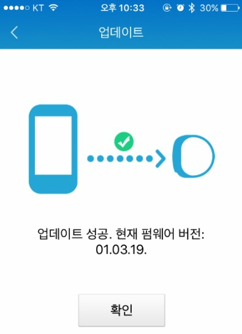
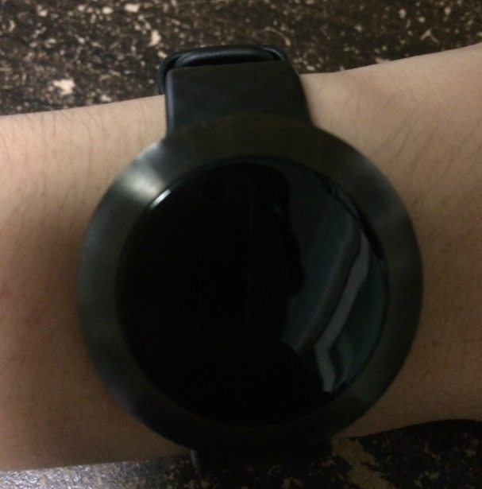

안녕하세요.

갑자기 스마트밴드가 가지고 싶어서 셀잇에서 화웨이 아너 제로 스마트 밴드를 구입했습니다.

일요일 저녁에 주문해서 수요일에 받아보았습니다.

뽁뽁이로 잘 감싸 포장되어 왔습니다.

아너 제로 스마트밴드의 박스 모습입니다.

박스를 열면 아너 제로가 가운데에 있습니다.

Just try it 이라는 글씨가 보이네요. ㅋㅋ

맨 위에 있는 종이를 들어 올린다음 아너 제로를 빼주시면 사용 가능합니다.

iOS 마켓에서 "Huawei Wear"라고 검색하시면 아너 제로 (Honor Zero)와 연동 가능한 전용 앱을 다운받을 수 있습니다.

HUAWEI BAND를 눌러서 아너 제로랑 연동해봅시다.

블루투스로 검색한 뒤 표시된 기기를 터치하면 등록할 수 있고,

초기화된 아너 제로 밴드는 언어도 중국어이고 시간도 엉망입니다만 연동을 한 뒤에 언어와 시간이 설정됩니다.

충전은 자석방식으로 거치대에 올려놓으면 충전됩니다.

충전을 시작하면 충전 표시도 뜹니다. (참고로 위 사진은 펌웨어 업데이트 사진이고, 충전 모습이 아닙니다.)

아너 제로를 받고, 펌웨어 업데이트를 실시했습니다.

작용을 해보았는데요, 제 팔이 얇아서 무난하게 착용할 수 있었습니다.

그러나 팔이 조금 굵으신 분들께서는 이 기기를 아에 착용하지 못할 수도 있다고 생각합니다.

줄의 길이가 그다지 긴 편은 아닙니다.

아너 제로 기기의 화면 표시 스크린 샷을 원하신다면 [이곳 http://underkg.co.kr/user\_review/1371664](http://underkg.co.kr/user_review/1371664) 을 방문해주세요.

몇일간 사용해본결과..

1. 배터리

많이 실망스러웠습니다. 미밴드 광고할 때 나오는 것 처럼 미친듯한 배터리 효율은 기대하지 않았지만.. 1-2일정도밖에 사용하지 못했습니다. 활동이 많아지면 배터리 소모도 상당히 큰 수준이었습니다.

2. 시계

UI는 깔끔해서 마음에 들었습니다. 그러나 기기의 화면이 정사각형이고 (128x128), 해상도도 좋지 않아 픽셀이 다 보입니다. 참고로 디스플레이 패널이 정사각형입니다.

손목 돌려 시계보기 기능도 생각만큼 바로 바로 작동하지 않네요.ㅜㅜ

3. 디자인

디자인은 매우 마음에 듭니다. 마감도 좋습니다. 작고 귀여운 디자인이라고 개인적으로 생각합니다.

4. 기능

개인적으로 칼로리와 걸음수를 측정하는 기능은 신뢰성이 없다고 생각합니다.

소모 칼로리는 걸음수를 바탕으로 공식에 대입해서 나오는 것 같은데, 걸음수가 머리를 말린다던가 등 손목을 사용하면 올라가기 때문에 신뢰를 할 수 없네요..

수면 체크 기능도 가만히 있으면 수면으로 넘어갈 때가 있습니다. 아이폰에서 측정하는 Runtastic Sleep Better보다 신뢰하지 못하겠네요... 따로 수면 설정 없이 자면 자동으로 수면 모드로 넘어가는 것은 좋습니다.

SMS가 오면 진동이 오고, 내용의 일부를 미리보기로 띄워주는 기능은 매우 마음에 듭니다. 전화도 아너 제로에서 바로 수신 거부할 수 있어 유용했습니다.

애플워치처럼 따로 앱을 받아 기능을 추가할 수 없다는 것은 아쉬웠습니다.

시계를 자주 보면 볼 수록 배터리가 미친듯이 소모되서 1-2일 쓰다가 결국 다시 셀잇에 환불을 요청했네요..

가볍게 입문용이나, 기능은 적지만 디자인이 끌리시는 분께 구입을 추천드리지만, 개인적으로는 좀 더 돈을 모와서 고급 기종을 구입하시는 것을 추천합니다.
