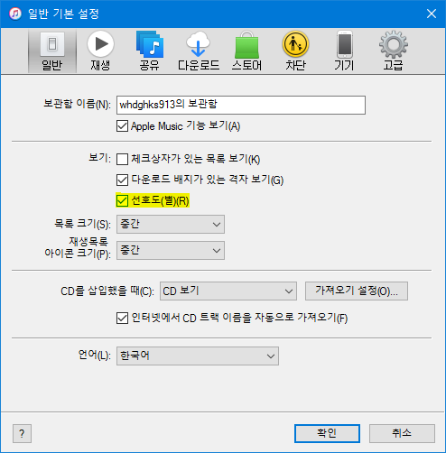
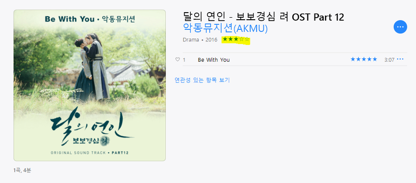

안녕하세요.

아이튠즈가 업데이트 되고, iOS 10이 나오면서 애플은 별점 기능을 서서히 줄이는 모습을 보이는 것 같습니다.

그 예로 아이폰 음악 앱에서 선호도(별점)를 지정하는 버튼이 없어졌습니다. (물론 다른 사용자가 개발해서 올린 Musis 앱이나 시리에게 부탁하면 됩니다.)

그래서인지 아이튠즈에서도 선호도가 숨김되어 있더라고요.

이번에 선호도 기반 재생목록을 구성하면서 앨범 선호도를 0으로 바꿔야 할 일이 생겼는데, 아무리 찾아도 선호도가 안보여서 삽질하다 해결한 기록을 블로그에 남깁니다.

아이튠즈의 기본 설정 메뉴에 들어가주세요.

형광펜 색칠되어 있는 '선호도(별)'을 체크해주시고 확인 눌러주시면 앨범 정렬에서 선호도(별)가 나옵니다.

왼쪽 사이드바의 앨범 보기에 들어가시면 보관함에 있는 노래들의 앨범 사진이 나올텐데,

위 스샷처럼 형광펜 칠해진 부분에 마우스 커서 가져가시면 안보이던 별점이 보입니다.

감사합니다.
