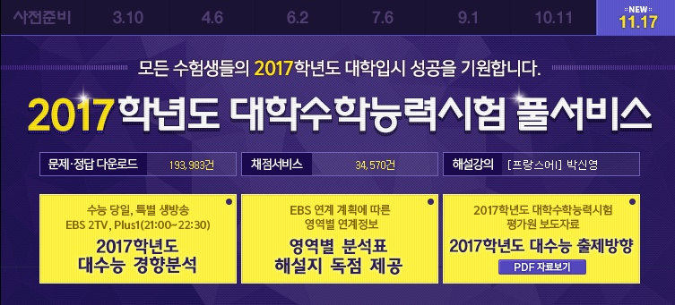
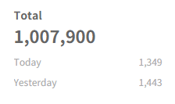
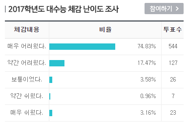

안녕하세요.

먼저 제가 11월달동안 활동이 매우 적었지만, 매일 방문해주신 방문자분들께 감사드립니다.

저도 모르게 총 방문자가 1,000,000명을 넘었습니다!

제 부족한 블로그에 방문해 주셔서 다시한번 감사드립니다!

2016년 올해 제가 고등학교 3학년에 올라온 뒤, 오지 않을 것만 같았던 수능을 무사히 보게 되었습니다.

1학년때만해도 수능날 하루 노는게 좋았는데...

음... 어제까지만 해도 수능 끝나고 뭘 해야 할지 고민이 많았는데

막상 끝나고 보니 허무하네요.

게다가 올해 수능은 평가원이 통수를 강하게 친 느낌이 없지않아 있어서..

국어 15번까지 풀고 '아, 이제 16번이다' 라고 생각했는데..

철학 지문 너무 어려웠습니다. 지문 두번 읽었는데도 이해를 못해서 결국 문제 다 풀고 다시 봤는데도 몰라서..

수학까지 풀고 점심시간부터 슬슬 머리가 아파오기 시작하더니 영어시간 끝날때 쯤 '해탈하다'라는 단어가 무슨 의미인지 알게 되었습니다. ㅋㅋㅋㅋㅋ

아무튼 다른 수험생 분들도 이번 수능에서 좋은 결과 있으시기를 바랍니다!

한마디로 요약하면.. 불수능! 그리고 블로그 지기는 재수를 시작합니다...
