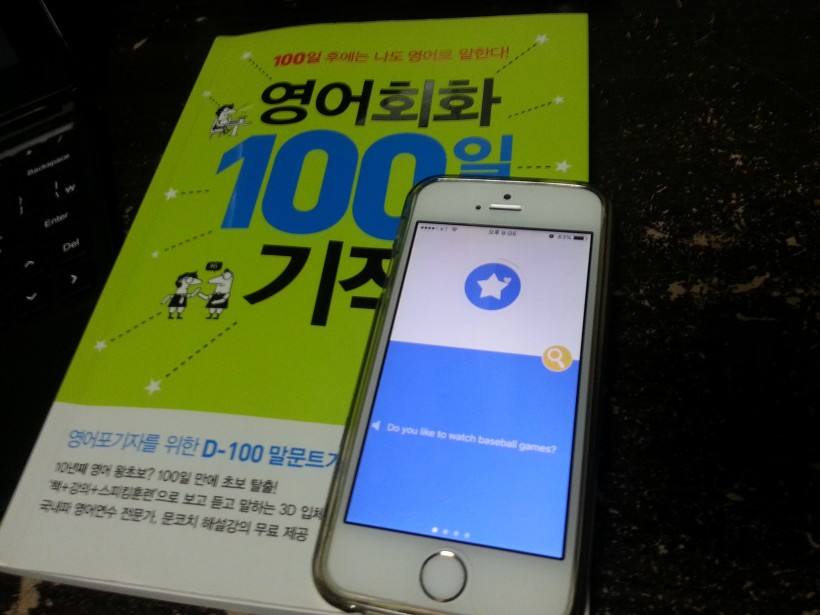
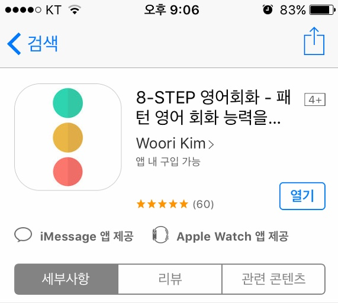

안녕하세요.

수능 끝나고 요즘 너무 놀기만 하는 것 같습니다.

분명히 수능 몇 주 전에, 수능 끝나고 영어 회화를 공부하려고 책까지 구입했는데..

조금 하다가 미루고 하니 벌써 12월 8일입니다. ㅋㅋㅋㅋ

시간만 낭비하는 것 같아서 구입한 책의 하루 분량과 아이폰 앱의 도움으로 다시 영어 회화 공부를 시작하려 합니다.

문성현 저자의 영어 회화 100일의 기적 책과, 앱 개발자 Woori Kim님의 8-STEP 영어 회화 앱을 통해

이번에는 작심삼일로 끝내지 말고 진짜 100일 동안, 또는 100일 이내로 저 책을 마스터 하고 회화를 끝내겠습니다.

앱 구매 인증 사진입니다.

$4.39 정도이고 원화로 약 5,000원 정도 하는 것 같습니다.

무료 어플은 그냥 하다가 잊어버릴 때가 많은데, 유료로 구입해서 돈이 아까워서라도 회화 공부를 하겠습니다.

ps. 기타 연주도 다시 시작했습니다.

수능 전에 하도 안치다보니 손가락의 굳은 살이 없어져서 매우 아프네요...ㅋㅋ

기억도 안 나고.. 다시 연습해야겠습니다.

조금 완벽하게 연주가 된다면 저도 다른 분들처럼 블로그에 당당하게 올려보고 싶네요.
