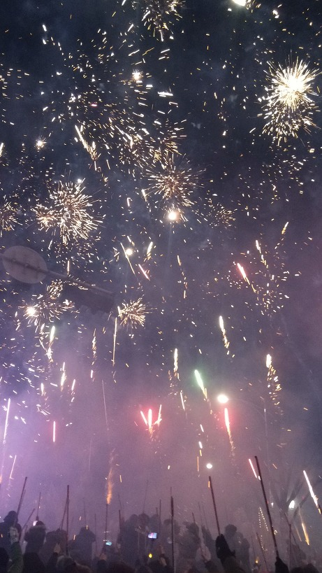
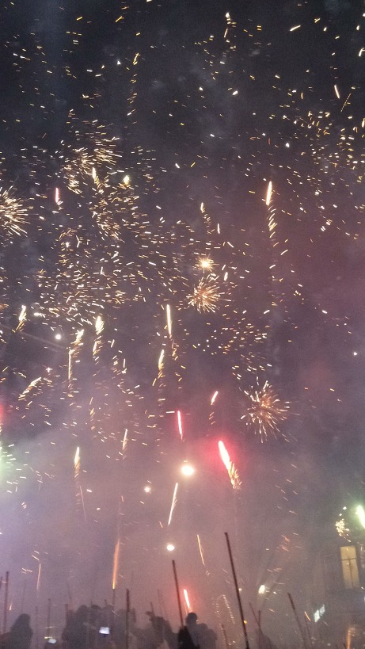
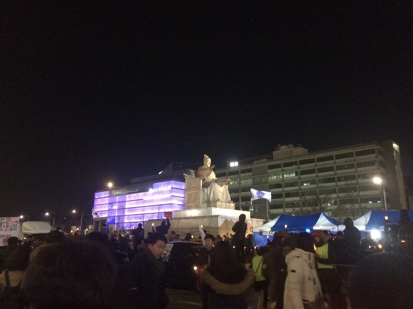
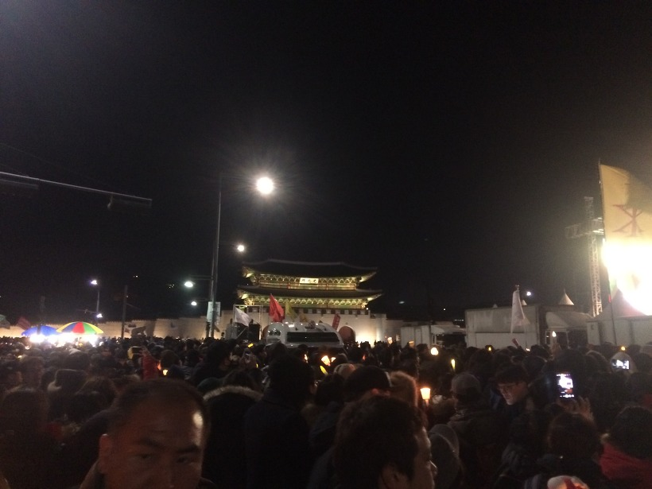
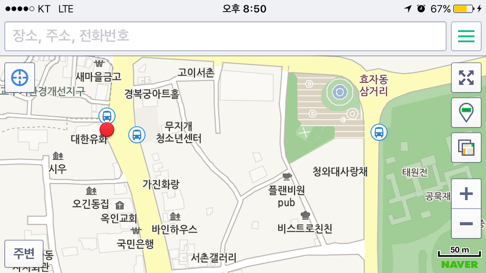

안녕하세요.

오늘은 제 블로그의 전반적인 주제와는 조금 다른 소식을 들고 왔습니다.

방문하신 분들께서도 아시는 것처럼 박근혜 대통령과 최순실 게이트로 6주 이상 매주 토요일 광화문에서 집회가 열리고 있는데요.

저도 오늘 12월 10일 집회와, 블로그에는 올리지 않았지만 11월 26일 집회에 참여하였습니다.

서울역에서 내려서 걸어가려다가 1호선으로 갈아타서 한 정거장 더 가서 시청역에서 내려서 광화문 집회 현장으로 이동했습니다.

11월 26일에는 이순신 장군상 주변에 설치된 스크린 근처에만 있었는데, 오늘은 광화문 바로 앞, 본 무대 주변까지 갈 수 있었습니다.

8시 전에 행진 시작해서 다시 본 무대 근처에 앉을 수 있었고, 폭죽도 바로 위에서 터졌네요. ㅋㅋㅋ

아래 사진은 폭죽 사진들 입니다.

한 3분정도 폭죽을 쏘아 올렸는데, 화약냄새와 재가 날려서 힘들었습니다.

처음 폭죽이 조금씩 터지기 시작해서 불꽃이 밤하늘을 수놓을때까지 약 3분정도 동영상이 멋지게 찰영되었습니다. 한번 꼭 감상해보세요.

눈감고 동영상 찍었는데, 나중에 확인해보니까 엄청 멋있더라고요. ㅋㅋ

50초 정도부터 보시면 됩니다.

[YouTube 영상: https://www.youtube.com/watch?v=gYOMx70Zy5o](https://www.youtube.com/watch?v=gYOMx70Zy5o)

아래는 이번 집회에서 찍은 사진중 개인 사진과 흐린 사진을 제외한 사진들입니다.

이순신 장군 동상과 세종대왕 동상을 지나 쭉 앞으로 밀리다보면 광화문 앞에 본 무대를 발견할 수 있습니다.

위 사진 전면 중앙에 광화문이 있고, 오른쪽에 집회 본 무대가 존재합니다.

약 7시 40분쯤 행진이 시작되었고, 저와 제 친구들은 위 사진의 왼쪽의 길로 행진을 하기 시작했습니다.

어쩌다보니 선두에 있더라고요. ㅋㅋ

행진은 제 아이폰의 GPS로 잡은 현재 위치인 빨간점 부분에서 끝나게 되었습니다.

솔직히, 청와대에서 집회 소리 전부 들린다고 생각합니다. 안들릴수가 없어요.

오늘 12월 10일 집회에 대해 더 궁금하신 분들을 위해 나무위키 링크 걸어드릴께요.

[https://namu.wiki/w/안나오면 쳐들어간다 박근혜정권 끝장내는 날](https://namu.wiki/w/%EC%95%88%EB%82%98%EC%98%A4%EB%A9%B4%20%EC%B3%90%EB%93%A4%EC%96%B4%EA%B0%84%EB%8B%A4%20%EB%B0%95%EA%B7%BC%ED%98%9C%EC%A0%95%EA%B6%8C%20%EB%81%9D%EC%9E%A5%EB%82%B4%EB%8A%94%20%EB%82%A0)

이상, 포스팅을 마치겠습니다.
