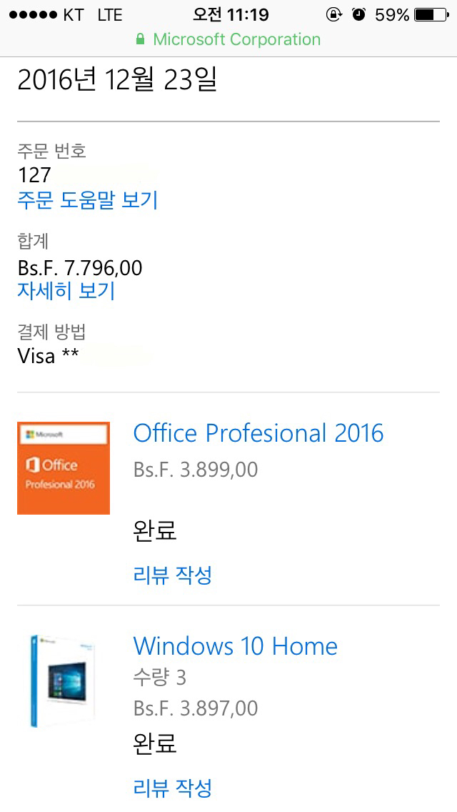
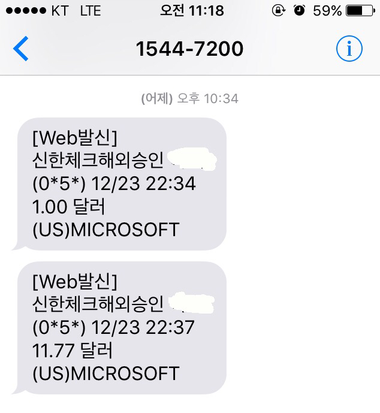
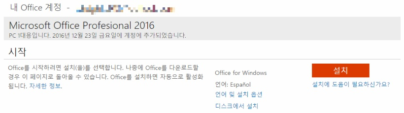
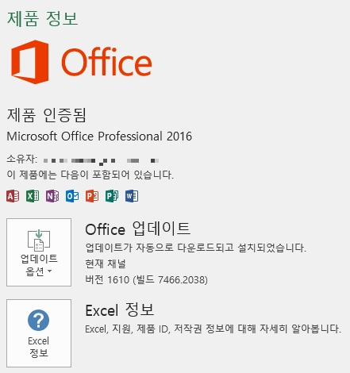

안녕하세요.  
혹시 어젯밤 소식 아시나요?  
  
어제 마이크로소프트의 베네수엘라 홈페이지에서 엄청난 하이퍼인플레이션으로 인해 환율의 심한 변동으로 우리나라를 비롯한 전세계에서 윈도우 10을 매우 낮은 가격에 구입할 수 있었습니다.  
  
베네수엘라의 화폐 가치가 터무니없이 낮아져서 발생한 일이라는 말도 있고 MS의 실수라는 말도 있지만 한가지 분명한 사실은 저를 비롯해서 많은 분들이 1만원 내외의 가격으로 윈도우 10와 오피스를 구입하셨다는 사실입니다.​

저는 윈도우 10 Pro 대신 Home 버전을 선택했습니다.  
​(그냥 Pro도 하나 넣을걸 생각하네요.)  
지금까지 구입한 디바이스는 윈도우가 기본 내장되어 있어서 따로 시리얼키가 필요하지 않았는데, 미래에 노트북을 사게 된다면 또는 데탑을 구매한다면 Free-Dos 제품으로 구입해서 제품의 가격을 낮출수 있을 것 같습니다.  
​

저는 신한 네이버페이 체크카드로 결제했는데요, 첫번째 1달러는 카드 확인용으로 ₩1,228원이고 두번째로 $11.77은 ₩14,482로 결제되었습니다.  
  
나중에 MS에서 전체 구매 취소를 할지는 잘 모르겠지만, 뜻하지않게 크리스마스 선물을 받은 기분이네요.ㅎ..

정상적으로 Office를 계정에 추가하였습니다.

컴퓨터에 Office 2016을 깔아 확인해보니 정상적으로 인증되네요.

+추가

오피스는 그대로 사용할 수 있는데, 윈도우는 전부 취소되었네요...
