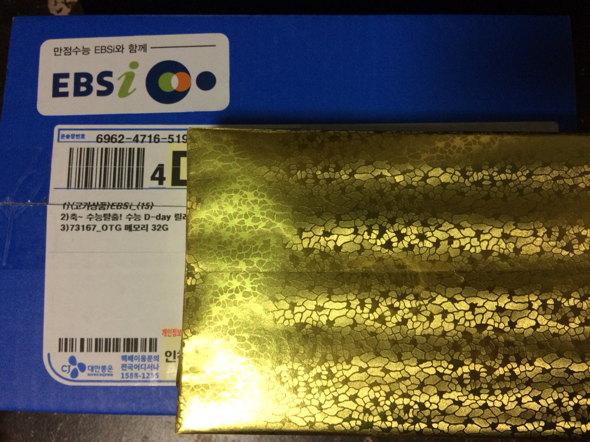
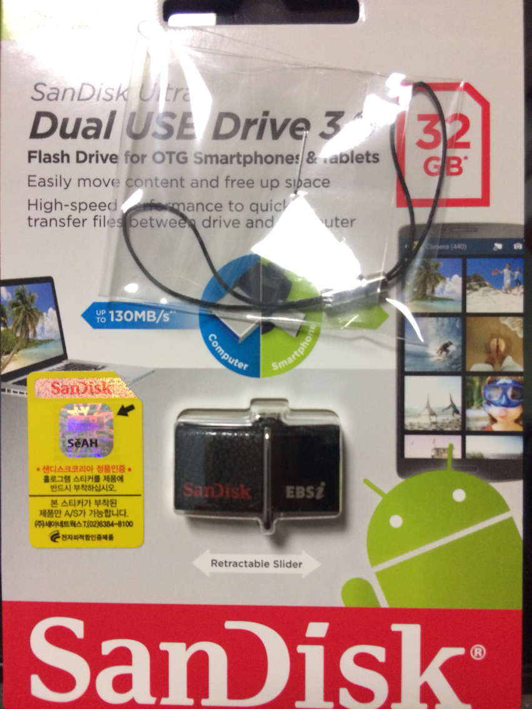

안녕하세요.  
2017년 새해들어서 처음으로 올리는 게시글이네요.  
새해 복 많이 받으세요!

수능 끝나고 EBS 이벤트에 참여한 뒤 USB를 받게 되었는데, 블로그에 포스팅을 안했더라고요. ㅋㅋ

늦었지만, 인증합니다. ㅋㅋ

USB는 San Disk의 32gb usb입니다.  
​

택배 상자를 열어보니 EBSi 마크가 각인된 San Disk USB를 확인할 수 있었습니다.  
​

위 사진의 USB 본체에서 오른쪽 아래 부분을 확인해보세요.  
  
EBS에서 하는 이벤트는 처음 당첨되었는데, 신기하네요. ㅋㅋ...
