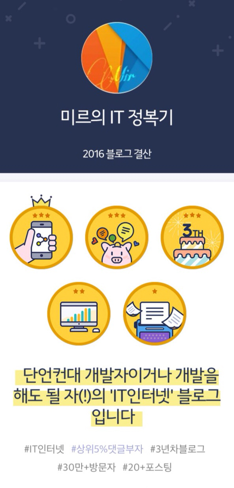
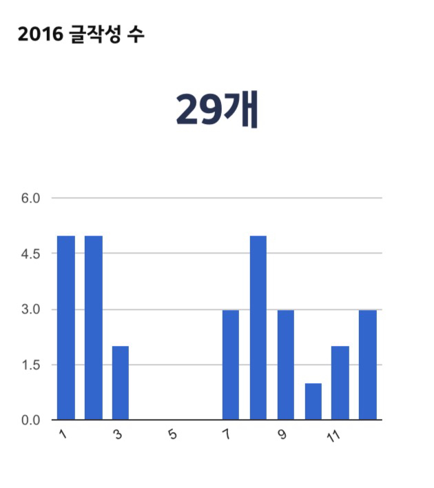
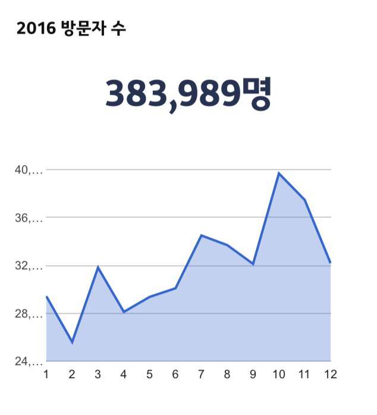

안녕하세요~  
벌써 2017년 1월 7일이 되었습니다.  
새해가 7일이나 지났네요..ㅎㅎ  
티스토리에서 블로그 총 결산을 할 수 있는 기능을 제공하고 있길래 제 블로그도 2016년도 블로그 총 결산을 해보았습니다.  
​

저기 아래에 있는 문구가 마음에 들더라고요. ㅋㅋ  
  
**​​**​**​****​****단언컨대 개발자이거나 개발을 해도 될 자(!)의 'IT인터넷' 블로그입니다.**  
  
작년 한 해 동안 성실하지 못한 활동을 해서 방문해주시는 분들께 정말 죄송한 마음이 들었습니다.  
제가 저런 말을 들어도 될지 잘 모르겠네요..  
​

1년 동안 작성한 게시글이 30개가 안되다니..;  
올해는 작년보다 조금 더 분발하도록 하겠습니다.  
​(아마 힘들수도...흑흑)​​  
​

한 해 동안 총 383,989명의 방문자께서 제 블로그에 방문해주셨습니다!  
  
다시 한 번 제 블로그에 방문해주셔서 정말 감사합니다!​
