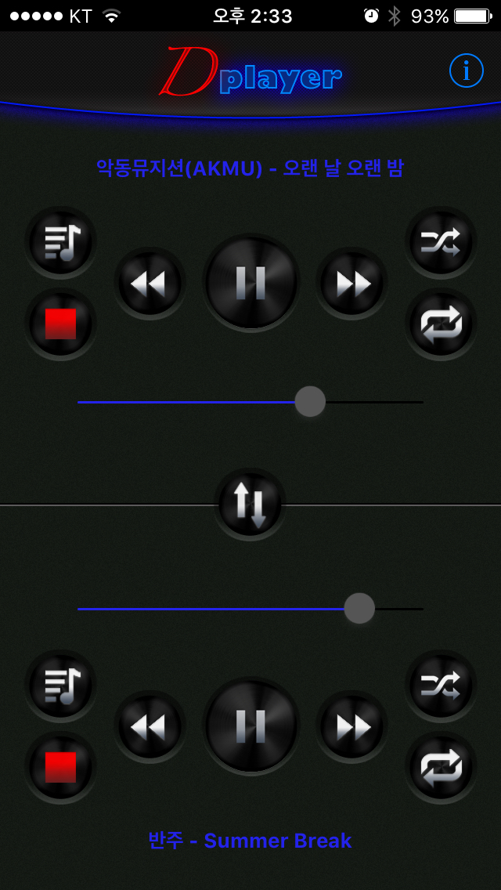
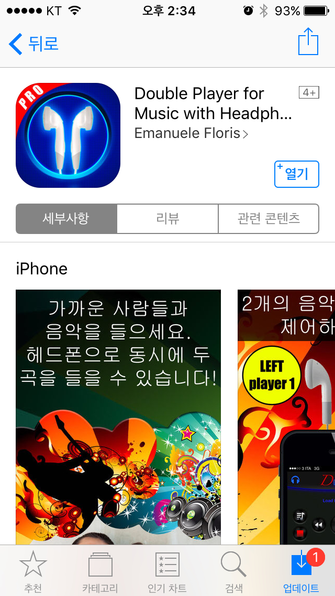

​안녕하세요.  
블로그에 정말 오랜만에 글을 남기는 것 같습니다. ㅋㅋ  
적어도 한 달에 2번은 포스팅을 하고 싶은데 맨날 까먹네요..  
  
  
아이폰 쓰면서 신기한 앱을 많이 구경해봤다고 생각했었는데, 오늘 더 신기한 앱을 발견했습니다.  
  
한 개의 이어폰으로 두 개의 음악을 재생할 수 있는 앱 입니다.

이어폰의 왼쪽과 오른쪽에 각각 별개의 음악을 재생할 수 있습니다.  
직접 해보니 정말 신기하더라고요. ㅋㅋ  
  
시중에 한 이어폰 단자로 두 개의 이어폰을 꼽을 수 있는 제품은 볼 수 있었지만, 이렇게 두 개 음악을 아이폰 하나에서 동시에 재생할 수도 있다는 사실을 알게 되었습니다.​

이 글을 올린 시점에는 Double Music 앱이 유료이지만, 무료로 풀려있습니다.  
어서 빨리 구매 기록에 남겨두세요. ㅎㅎ  
  
Emanuele Floris의 Double Player for Music with Headphones Pro  
https://appsto.re/kr/Wl\_NM.i  
  
정가는 $0.99이라고 합니다.
