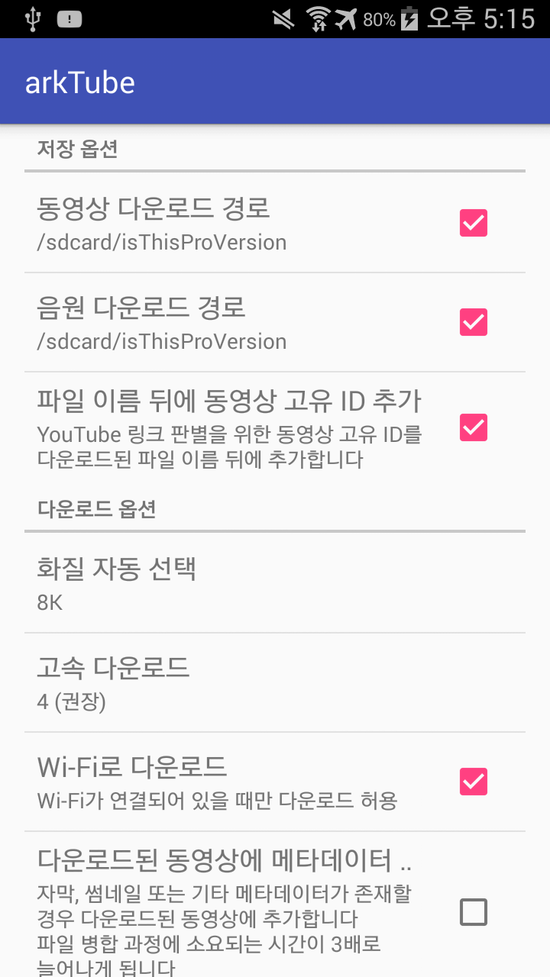

올해 1월 26일경, arter97님의 arktube를 크랙해보았습니다.

블로그에 포스팅하는 시점은 크랙을 시도한 시점보다 2달 정도 늦었지만, 결과 보고와 나중에 다시 시도하기 위한 밑거름으로 쓰기 위해 포스팅합니다.

결론부터 말씀드리자면.. 저는 arktube를 30% 정도 크랙할 수 있었습니다.

MainActivity의 onCreate()에 조금 장난을 치니 Pro버전 안내 알림을 없애고 비활성화되어 있던 기능들을 설정할 수 있게 되었습니다.

그러나.. 그다음에 맞닥뜨린 장면은.. 그야말로 충격과 공포..

아무짓도 안했는데, 구성요소 설치가, 안됩니다.

루팅한 기기로 /data/data/com.arter97.arktube/files를 확인해보고,

직접 들어가서 파일 복사도 해보고,

2시간동안 코드를 훑어보면서 쭉 살펴봐도 구동 원리를 잘 모르겠습니다.

com/arter97/arktube/b.smali a.smali 파일들과, Utils.smali 이걸 분석해야 한다는 직감은 들었는데..

더 이상 크랙을 진행하면 정말 삽질하는 단계라서 시도하다가 포기했습니다.

특히 난독화가 전반적으로 걸쳐 있어서 정말 읽기 힘들었습니다.

무슨 메소드 이름이 전부 a라서 ;)

파라미터값이랑 반환값 따져가면서 메소드 찾았네요;

8\_fkYn

이것도 자주 보였고요. (사실 원본 java소스에는 다른 글자인데 바뀐거라던가? xor연산?)

a.smali를 볼때는 MD5값부터 쭉 나와 있어서 그때부터 멘탈이 점점 나가기 시작했습니다.

왜 구성요소 설치가 진행되지 않을까해서 adb 로그를 확인해봤는데요.

W 3433  arkTube bootstrap: bin/python3.6 is missing

D 3433  arkTube Removing : /data/data/com.arter97.arktube/files/rList-com.arter97.arktube.MainActivity

D 3433  arkTube Removing : /data/data/com.arter97.arktube/files/rList-com.arter97.arktube.Intro

D 3433  arkTube Removing : /data/data/com.arter97.arktube/files

D 3433  arkTube Device is arm32

즉, 어떤 이유로 파일이 누락되서 더 이상 설치가 진행되지 않았고,

상단바 알림을 캔슬하는 코드(구성요소 진행중...알림)가 실행되지 않아서 전원이 꺼질때까지 상태바에 구성요소 설치 알림이 존재하게 되는 상태에 빠지게 되었습니다.

가장 유력한 검증 방법은 사인키 검사같은데요.

(확실하게 알아보려면 원본 파일에 사인만 다시해서 설치해보면 됩니다.)

지금 다시 해보니 사인키 검사는 아닌 것 같습니다. 그럼 뭘까요?; classes.dex 검사인가; **그런데 이게 맞았습니다!** by arter97

원본 apk 파일을 사인만 다시 해서 설치하면 되는 것 같고.

apktool -d로 디컴파일 한다음에 다시 컴파일 해서 사인하고 설치하면 안되는 이유는 뭘까요?

앱을 만들었던 사람으로서 이거 진짜 궁금하네요 ㅋㅋ

오랜만에 하려니까 진짜 피곤하네요;

구성요소 설치가 어떻게 일어지는지(assert에는 bootstrap파일이 있는데 python같은건 어디서 나온건지; 인터넷에서 다운받는건가요? 아니면 bootstrap 압축해제일수도)

+ Donation app 구해서 어떤 방식인지 확인해봤습니다.

Broadcast를 이용해서 값을 주고 받는 것 같긴한데..

정말 크랙하고 싶다면 어떤 값이 오고 가는지를 Log로 찍어보거나 아무튼 그렇게 해봐야 할 것 같습니다.

개인적으로 저는 언락커를 크랙하는 것 보단 본 앱을 크랙하는걸 더 좋아해서..

+ by arter97

정상적으로 설치될 때 adb 로그 값을 알려주셨습니다. : <http://pastebin.com/wYZPFJND>

로그값

01-26 23:11:47.042 13234 13234 D arkTube : Activities count: 1

01-26 23:11:47.391 13234 13254 W arkTube : bootstrap: bin/python3.6 is missing

01-26 23:11:47.400 13234 13254 D arkTube : Removing : /data/user/0/com.arter97.arktube/files/.nomedia

01-26 23:11:47.401 13234 13254 D arkTube : Removing : /data/user/0/com.arter97.arktube/files/ACRA-INSTALLATION

01-26 23:11:47.404 13234 13254 D arkTube : Removing : /data/user/0/com.arter97.arktube/files

01-26 23:11:47.686 13234 13254 D arkTube : Device is arm64

01-26 23:11:47.696 13234 13254 D arkTube : Skipping arm32/

01-26 23:11:47.696 13234 13254 D arkTube : Skipping arm32/bin/

01-26 23:11:47.696 13234 13254 D arkTube : Skipping arm32/bin/AtomicParsley

01-26 23:11:47.720 13234 13254 D arkTube : Skipping arm32/bin/aria2c

01-26 23:11:47.842 13234 13254 D arkTube : Skipping arm32/bin/ffmpeg

01-26 23:11:48.084 13234 13254 D arkTube : Skipping arm32/bin/python3.6

01-26 23:11:48.084 13234 13254 D arkTube : Skipping arm32/lib/

01-26 23:11:48.084 13234 13254 D arkTube : Skipping arm32/lib/libcrypto.so.1.0.0

01-26 23:11:48.169 13234 13254 D arkTube : Skipping arm32/lib/libpython3.6m.so

01-26 23:11:48.451 13234 13254 D arkTube : Skipping arm32/lib/libpython3.so

01-26 23:11:48.452 13234 13254 D arkTube : Skipping arm32/lib/libssl.so.1.0.0

01-26 23:11:48.472 13234 13254 D arkTube : Skipping arm32/lib/python3.6/

01-26 23:11:48.472 13234 13254 D arkTube : Skipping arm32/lib/python3.6/\_sysconfigdata\_m\_linux\_arm-linux-androideabi.pyc

01-26 23:11:48.473 13234 13254 D arkTube : Skipping arm32/lib/python3.6/lib-dynload/

01-26 23:11:48.473 13234 13254 D arkTube : Skipping arm32/lib/python3.6/lib-dynload/\_blake2.cpython-36m-arm-linux-androideabi.so

01-26 23:11:48.476 13234 13254 D arkTube : Skipping arm32/lib/python3.6/lib-dynload/\_hashlib.cpython-36m-arm-linux-androideabi.so

01-26 23:11:48.477 13234 13254 D arkTube : Skipping arm32/lib/python3.6/lib-dynload/\_json.cpython-36m-arm-linux-androideabi.so

01-26 23:11:48.479 13234 13254 D arkTube : Skipping arm32/lib/python3.6/lib-dynload/\_sha3.cpython-36m-arm-linux-androideabi.so

01-26 23:11:48.481 13234 13254 D arkTube : Skipping arm32/lib/python3.6/lib-dynload/grp.cpython-36m-arm-linux-androideabi.so

01-26 23:11:48.482 13234 13254 D arkTube : Skipping arm32/lib/python3.6/lib-dynload/termios.cpython-36m-arm-linux-androideabi.so

01-26 23:11:49.260 13234 13254 I arkTube : Changing permissions for /data/user/0/com.arter97.arktube/files/bin/dec

01-26 23:11:49.260 13234 13254 I arkTube : Changing permissions for /data/user/0/com.arter97.arktube/files/bin/AtomicParsley

01-26 23:11:49.260 13234 13254 I arkTube : Changing permissions for /data/user/0/com.arter97.arktube/files/bin/aria2c

01-26 23:11:49.260 13234 13254 I arkTube : Changing permissions for /data/user/0/com.arter97.arktube/files/bin/ffmpeg

01-26 23:11:49.260 13234 13254 I arkTube : Changing permissions for /data/user/0/com.arter97.arktube/files/bin/python3.6

01-26 23:11:49.260 13234 13254 I arkTube : Changing permissions for /data/user/0/com.arter97.arktube/files/bin/download

01-26 23:11:49.260 13234 13254 I arkTube : Changing permissions for /data/user/0/com.arter97.arktube/files/bin/downloadf

01-26 23:11:49.260 13234 13254 I arkTube : Changing permissions for /data/user/0/com.arter97.arktube/files/bin/getid

01-26 23:11:49.260 13234 13254 I arkTube : Changing permissions for /data/user/0/com.arter97.arktube/files/bin/getplaylist

01-26 23:11:49.261 13234 13254 I arkTube : Changing permissions for /data/user/0/com.arter97.arktube/files/bin/gettitle

01-26 23:11:49.261 13234 13254 I arkTube : Changing permissions for /data/user/0/com.arter97.arktube/files/bin/parse

01-26 23:11:49.261 13234 13254 I arkTube : Changing permissions for /data/user/0/com.arter97.arktube/files/bin/sslhelper

01-26 23:11:49.261 13234 13254 I arkTube : Changing permissions for /data/user/0/com.arter97.arktube/files/bin/youtube\_dl

그리고 classes.dex 검사가 맞다고 합니다.

웹에서 파이썬 다운받는 방법도 생각해보았지만, 서버 관리유지 문제상 bootstrap파일에 전부 내장시켜두었고(+압축과 암호화까지),

기존의 압축 포멧 + 개조 + 난독화..

4-5월쯤 다시 크랙 시도해보고 결과 알려드리겠습니다.

관련 게시글 : <http://cafe.naver.com/develoid/686161>
