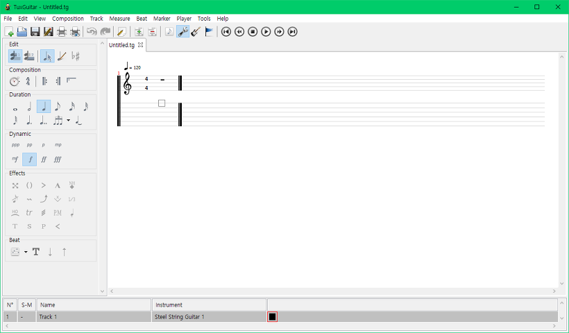
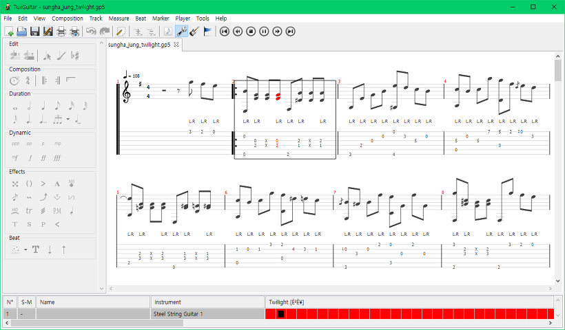

기타프로 프로그램을 구입하기에는 너무 비싸서 다른 프로그램은 없을까 찾아보니,

오픈소스 프로젝트로 gp5 파일을 열 수 있는 프로그램을 찾았습니다.

프로그램의 이름은 TuxGuitar입니다.

<https://sourceforge.net/projects/tuxguitar/>

오픈소스 프로젝트인 만큼, sourceforge.net 사이트에서 무료로 다운로드 할 수 있습니다.

게다가 일반 gp5 뷰어들은 음악을 재생하는 것만 가능한 반면,

이 프로그램은 기타프로보다는 조금 미흡하지만, 직접 악보를 수정할 수 도 있습니다.

물론 악보를 입력해서 직접 gp5파일을 만들 수도 있습니다.

메인 화면입니다.

처음에는 프로그램에 대해 별로 기대하지 않았는데, 사용하면 할수록 생각보다 기능이 다양합니다.

다른 gp5 파일 뷰어처럼 곡 재생을 할 수 있을 뿐만 아니라,

박자 수정, 뮤트처리, 슬라이딩, 헤머링 등 기타프로 부럽지 않게 많은 기능을 사용할 수 있습니다.

한 가지 단점이 있는데, 가사부분이라던가, 악보 제목에 있는 한글이 깨져보인다는 단점이 있습니다.

아래 스크린샷은 정성하의 Twilight gp5 파일을 TuxGuitar로 열어서 재생한 화면입니다.

기타프로가 무겁고 가격도 비싸던데, 쉽게 오픈소스 프로그램을 발견할 수 있어서 좋습니다.
