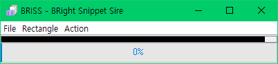
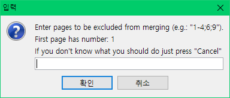
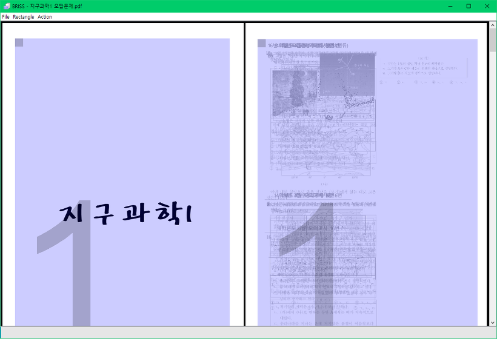

pdf 파일을 편집, 또는 인쇄할 때 등 여백을 제거해야 할 때가 있습니다.

여백이 많은 기출문제 시험지의 여백을 전부 제거한 다음, pdf 인쇄옵션 "맞추기"로 인쇄하면 A4용지에 꽉 체워서 인쇄할 수 있습니다.

이럴 때 유용하게 사용할 수 있는 프로그램이 있습니다.

이 프로그램의 이름은 briss입니다.

<https://sourceforge.net/projects/briss/> (gpl 라이센스)

briss-0.9를 다운 받아서 압축 파일을 열어보니 jar파일으로 구성되어 있었습니다.

즉, java로 동작하는 프로그램입니다.

그러니 혹시 java가 설치되지 않은 컴퓨터에서는 동작하지 않습니다.

프로그램을 실행한 다음, File - Load File을 통해 여백을 자르려고 하는 pdf 파일을 선택해주세요.

그러면 아래와 같은 입력 창이 나타납니다.

briss 프로그램은 기본적으로 홀수/짝수 페이지를 겹쳐서 한 번에 여백을 자르고 있습니다.

즉, 홀수/짝수 페이지를 겹쳐서 미리보기를 제공한 다음에 한번에 잘라주는 거지요.

따로 페이지의 여백을 잘라야 할 때, 저 위 스크린샷의 입력란에 페이지 숫자를 입력해주세요.

입력한 페이지는 홀/짝 페이지 모음에 들어가지 않고, 따로 여백을 자를 수 있습니다.

위 스크린샷의 왼쪽은 1페이지, 오른쪽은 나머지 페이지들 입니다.

원래는 첫 번째 페이지도 홀수 페이지에 들어가야 했지만, 두번째 스크린샷에 1페이지를 입력했기 때문에 따로 여백을 자를 수 있게 되었습니다.

파란색 영역으로 둘러싸인 영역이 잘릴 영역입니다.

여백을 지정하신 다음, 메뉴바에서 Action - Crop PDF를 눌러서 pdf를 자를 수 있습니다.

+참고

pdf의 여백을 자를 수 있는 프로그램은 briss 말고 여러 개 있습니다.

그 중 한 가지 프로그램을 더 알려드리겠습니다.

k2pdfopt : <http://www.willus.com/k2pdfopt/download/>

acrobat의 라이센스를 가지고 계신 분께서는 따로 프로그램을 사용하지 않으셔도 pdf 파일의 편집이 모두 가능합니다.
