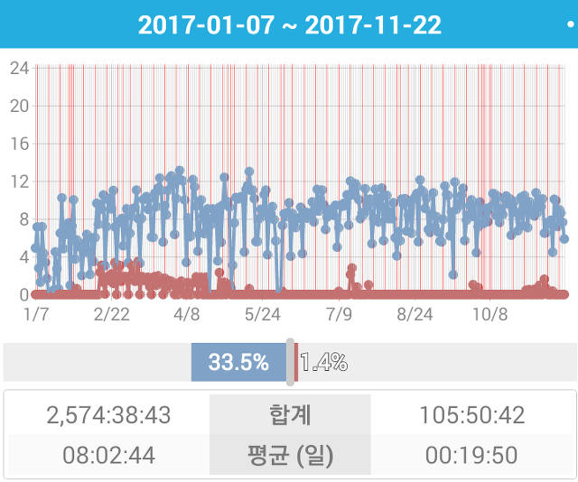
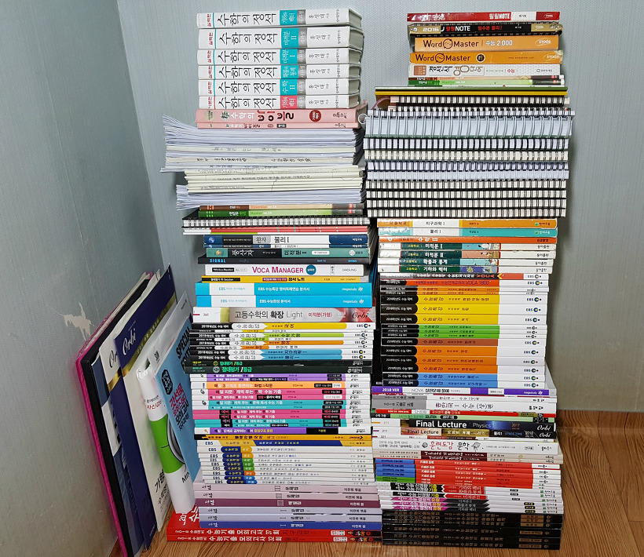
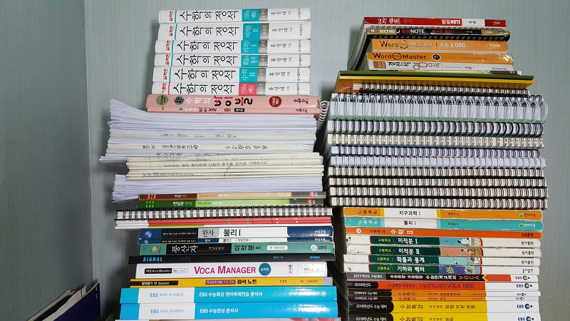
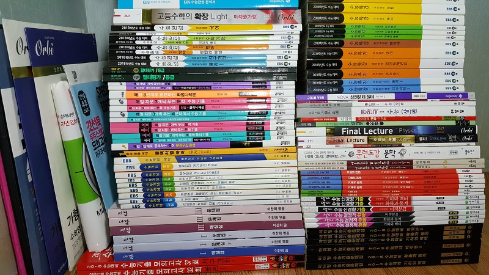

안녕하세요.

벌써 2018년이 다가왔습니다.

제가 블로그를 시작한 이후로 고등학생이 되었고, 첫 번째 수능(2017학년도)을 치뤘고,

이제 2018학년도 수능을 치른 뒤 다시 만나뵙게 되었습니다.

2016.11.17 [[DailyLife] - 대학수학능력시험을 치르고 왔습니다.](/archive/itmir/2016/628)

2017.11.23 [[DailyLife] - 2018학년도 수능을 치르고 왔습니다.](/archive/itmir/2017/639)

작년 한 해 2017년 동안 수능을 다시 한 번 준비하며 생각보다 많은 것을 얻은 것 같고, 체중을 잃은 것 같습니다. HaHa..

조금 늦은 감이 있지만, 그래도 작년 한 해를 결산해보고 싶어서 뒤늦게 나마 글을 작성하려 합니다.

이 포스팅에서 제가 어떻게 생활했는지 전반적인 내용을 알려드리고, 다음 포스팅에서는 어떻게 시기별로 공부했는지 포스팅하겠습니다.

예비 고3이나, n수생 등 수능을 준비하는 분께서는 제 경험을 바탕으로 1년 계획을 그려나가셨으면 좋겠습니다. (그리고 몇 개월 뒤에 아마 반수 하게 될 미래의 저도 참고할겁니다.HaHaHa..)

### 2018학년도 수능 포스팅

|  |  |
| --- | --- |
| 이 글 >> | [2018학년도 수능을 대비하며 느낀 점 총 정리 (전반적인 관점으로)](/archive/itmir/2018/644) |
|  | [2018학년도 수능 준비를 하며 어떻게 2017년도를 보냈는가? (시기별 관점으로)](/archive/itmir/2018/645) |
|  | 2018학년도 수능 전 과목 공부 과정/팁 |
|  | 2019학년도 수능 수험생을 위한 사소한 팁과 조언 |

### 생활 모습

재 작년(2016년) 12월, 수시 추가 합격에서 저는 예비 1번-2번에서 추가 전화 합격을 기다리다가 저녁 9시가 지나고... 재수를 직감했습니다.

저는 앱으로 1년간 공부시간을 기록했는데, 이에 따르면, 공부를 시작한 날짜는 2016년 12월 ~ 2017년 1월 경이지만, 공부가 궤도에 진입한 시기는 2017년 2월 말 이더라고요.

2017년 1월부터 2월 초(고등학교 졸업식)까지는 그냥 집에서 틈틈히 공부하는 정도였습니다.

고등학교 졸업 이후 독서실에 다니기 시작하면서 생활 태도가 형성되기 시작했는데요.

맨 처음의 기본적인 일상은 다음과 같았습니다.

9시 기상 및 식사

9시 30분 ~ 10시까지 독서실 입실

1-2시쯤 점심식사 (1시간)

6-7시쯤 저녁식사 (1시간)

AM 12시 30분 공부 끝

그런데 몇 달을 이렇게 보내고 나니 늦잠자는 날이 매우 많아져서 10시-11시 기상이 되더라고요.

구체적인 생활 모습의 반성할 점은 아래에서 다루도록 하겠습니다.

그 다음, 하루 일상은 정말 별거 없습니다.

고등학생 -> n수생이 되니까 학교 등교, 수업시간 사이의 자투리시간, 점심시간과 저녁시간 사이의 여백이 사실상 없어진 것과 마친가지가 되었고, 이 시간을 공부시간으로 바꾸는 것은 전부 제 몫이었습니다.

요약하자면,

기상 및 식사 - 독서실로 이동 - 공부 - 집에서 점심 식사(와 휴식, 화장실) - 공부 - 집에서 저녁 식사 - 공부 - 집에서 씻고 취침

의 반복 X 300일

이렇게 매번 같은 일상이 지속되니 봄이 되고 여름이 되니 이 짓이 정말 지겨워집니다.

왜 이런 생활을 할까?부터 시작해서 성적이 오르고 있긴 하냐?까지 별의 별 생각이 다 들고, 이 생각을 떨쳐내지 못하면 슬럼프가 오게 됩니다.

하루 이틀을 딴 짓(예를 들어 웹툰 정주행, 나무위키 들어갔다가 링크따라가기, 커뮤니티에서 논란이 되는 주제 탐구)하다 보면 자괴감도 올 때가 있죠.

가장 중요한 건, 커뮤니티는 아에 안하는게 좋고, 지금까지 본 웹툰 등을 전부 끊을 수 있는 의지가 있는가? 라고 생각합니다.

책 펴놓고 딴 짓하기도 하지 말아야 하고요. 지금 생각해보니 아에 스마트폰을 소지하지 않는 방법도 나쁘지 않은 것 같습니다.

나름 고등학교때 열심히 공부했다고 생각하셨다면, 초반에 개념을 듣다보면 질릴 수 있습니다.

다 알고 있는 건데 왜 이걸 다시 해야 하는지 이해가 안될 수도 있어요.

그런데 다시 개념을 보면, 그 전까지 모르던 내용이 무조건 있더라고요. 저는 개인적으로 이런 모르던 부분을 개념의 구멍이라고 생각합니다.

이렇게 몇 번 개념을 끝내면 이제 개념의 구멍을 전부 체웠을 거라고 또 착각합니다.

그러고 시험을 보면 꼭 문제를 또 틀리더라고요...

이런 생활 모습이 1년 동안 반복된다고 생각하시면 됩니다.

### 칭찬할 만한 부분

- 1월 초부터 11월 수능 전날까지 평균 8시간을 꾸준히 공부했다.

생각보다 꾸준히 공부한다는 게 너무 어려웠습니다.

많은 유혹을 이기고 공부한다는 게 쉬운 일이 아니더라고요.

초반에는 막 12시간 13시간도 달성했는데, 여름이 되고 가을이 되니 10시간을 채우는 것도 힘들었습니다.

결국 통계를 내보니 8시간이 나왔네요.. 원래 제 목표는 10시간이었습니다.

친구랑 같은 독서실에서 같이 공부 끝내고 집에 오니 병원에 있었을 때, 아팠을 때를 빼고는

하루도 빠짐없이 공부했습니다. 늦잠만 안 잤다면 더 공부할 수 있었는데.. 조금 아쉽네요...

- 인강에 너무 많이 의존하지 않았다.

저는 강의를 맨날 들어봐야 성적은 안오른다고 생각해서 일부러 프패도 안끊었습니다.(만 사실 조금 후회되네요.)

전과목 개념 강의는 ebs 수능 개념으로 들었고, 중간중간 이벤트로 이투스, 메가, 대성에서 강의 풀었을 때

몇 번 들어본 것 말고는 책으로 공부했던 것 같습니다.

제 말은, 즉, 인강만 주구장창 듣지 않아서 잘한 점이라고 생각했는데

지금 또 생각해보니 이게 잘한 점인가.. 생각이 드네요...

- 오픈채팅/밴드로 고민을 상담할 사람들을 만났고, 친구 1명과 같은 독서실에서 공부했다.

공부만 하다보면 대화를 안하게 되는데.. 다행히도 저는 같은 반 친구 한 명과 같은 독서실에서 공부했고

12시 자정에 같이 집으로 걸어오면서 대화했었습니다.

그 친구도 이 생활 힘든 것을 알고 저도 알았기 때문에 서로 대화하면서 우울증을 막았던 것 같네요..

같이 공부했던게 위로도 많이 되고 도움도 많이 받았습니다.

- 국어 지문을 읽는 방법을 알아냈다.

초반에 매3비, 매3문을 많이 붙잡고 늘어지면서 공부했는데,

지문 분석하고, 문제 발문과 선지를 보면서 이게 답일 수 밖에 없는 이유 / 왜 답이 아닐까?를

4월달까지 반복했습니다.

다행히 저만의 방법을 찾았는지, 6평 백분위 99, 9평 백분위 98, 수능 백분위 90을 받았네요..

수능이 너무 아깝고 어려웠네요...ㅠㅠ

- ebs 문제집 / 선생님과 친구들에게 받은 책 / 이벤트로 받은 책 등을 적극 활용했다.

- 한 번도 빠짐없이 스터디체커 앱으로 공부 시간을 측정했고, 이를 반성의 도구로 삼았다.

- 커뮤니티에서 유용하고, 쓸모 있는 자료를 많이 받았다.

### 반성할 만한 부분

- 늦잠 잔 것.

제일 후회하는 1위.

오답노트 만든다고 새벽까지 컴퓨터 한글 작업하고, 피직솔루션 뽑는다고 새벽까지 프린트 앞에 있고..

이렇게 잠을 놓치는 날이 몇 번 생기니 늦잠을 자게 되고,

공부 시작 시간이 늦어지니 공부 시간이 부족하다고 느껴져서 새벽까지 공부하고..

그러니 또 늦게 일어나고..

이게 반복되서 누적되었던 것 같습니다.

차라리 그 날의 공부시간이 부족해도 딱 11-12시에 잠들어서 일찍 일어난 뒤 그 다음날부터 일찍 공부시작했으면

좋았을 것 같네요..

- 웹툰, 웹소설에 빠진 날이 종종 있었다.

진짜 끊고 싶어도 잠깐이면 되겠지.. 하다가 정주행하고

이런 적이 몇 번 있었습니다.

제가 또 한 번 빠지면 끝까지 보고 싶어서 새벽까지 볼 때도 있었네요..

새벽 늦게까지 보니 또 늦잠자고 반복이었습니다.

- 구입한 문제집/모의고사를 수능 전날 까지 다 풀지 못했다.

충분히 수능 전날까지 풀 수 있을거라고 생각했는데, 저를 너무 과대평가했었습니다.

실모쇼핑 하지 말자고 생각했는데, 저도 문제집 쇼핑을 조금 한 것 같네요.

- 광클 이벤트에 참여한 것.

광클 이벤트로 괜찮은 책 얻은 적도 한 두 번 있었지만,

다 끝나고 생각해보니 한두 번 보고 끝난 책들이 오히려 더 많았습니다.

10시 광클이다. 그러면 9시 30-40분부터 집중이 깨지고, 10시 15분까지 집중이 안되는데

이게 큰 손해라고 생각해요.

그렇다고, 광클 이벤트에서 받은 책이 나쁘다는 말은 아닙니다. 제가 활용을 잘 못했습니다.

- 크게 중요하지 않은 일에 시간을 허비했다.

- 수학/과학 문제를 가려 풀었고, 너무 적은 문제를 풀어서 수능의 새로운 문제에 당황했다.

- 쓸데없는 정보를 찾고, 비교하는데 시간이 생각보다 많이 소요되었다.

- 오르비, 포만한 등 커뮤니티에 자꾸 들어갔다.

- 초반에 노래 들으면서 공부했다.

- '올해 수능 난이도가 불이네', '문학에 어떤 작가 작품이 나오네'와 같은 소식에 귀 기울인 것.

### 6월 9월 평가원 모의고사

고3때, 6월 9월 모의고사를 치른 분위기를 기억하기 때문에...

모교에서 치르지 않았고, 주변의 재학원생 외 평가원 모의고사를 볼 수 있는 학원에서 치뤘습니다.

6평과 9평 나름대로 제 생각보다 성적이 많이 올라서 기뻤어요.

특히 9평 성적이, 영어 3이 조금 아깝긴 했지만, 너무 잘 봐서 저도 모르게 자만하거나.. 우월감에 빠지는 일이 없도록 주의했어요.

그런데 10월 교육청 보니까 바로 멘탈 털려서 조금 정신 차린 것 같아요.

평가원 모의고사는 틀린 문제랑, 찍어서 맞은 문제, 그리고 헷갈린 문제만 확인하고

그 날 시험장에서 어떤 사고과정을 거쳐 이 문제의 답이 도출되었는가?

이 사실을 확인하는 시험이라고 생각해요.

n수생은 어처피 6월 9월 평가원 모의고사는 잘 나오던데, 그게 수능이랑은 독립시행이니까.. 아니, 오히려 6,9월 모의고사 성적보다 수능에서 낮은 성적을 받는 분도 계시니(저처럼) 꼭 자만하지 않도록 해야 합니다.

그리고 저는 그냥 평가원 모의고사 볼 때, 모르는 문제지만 왠지 답이 이거라는 감이 들어서 맞추거나, 찍어서 맞춘 문제도 있었는데요.

그게 자신의 점수가 아닌데.. 성적표 숫자를 보면 본인의 점수인 양 착각하게 되서...

아에 자신이 완전하게 푼 문제만 마킹하고 모르는 문제는 그냥 틀리게 하는 것도 자신의 현 위치 파악에 도움이 될 것 같아요.

### 11월 대 수능 연기

예비 소집 다녀와서 수험표 받고, 집에 왔는데..

스마트폰에서 지진 문자가 도착함과 동시에 지진을 느꼈습니다.

그리고 포항시 현황을 보면서.. 심각함을 알았습니다.

저녁에 마음의 준비를 다 하고(사실 그 날 기분은 내일이 수능이라는게 믿겨지지 않았습니다.) 씻고 자려는데,

포항 지진으로 수능을 일주일 연기합니다.

뉴스 보고 처음에는 뭐지.. 몰래카메라? 라고 생각했었어요.

그 다음에는 재수하는 애들이랑 전화하면서 일주일 추가됬다. 그러고...

이때 한국사를 공부했어야 했는데..

### 11월 대학 수학 능력 평가

일주일 연장된 것도 잠시, 시간이 정말 빨리 흐른다는 사실을 또 느낄 수 있었습니다.

어렸을때, 시간은 '나이' 속력만큼 빠르게 흐른다는 말을 들은 것 같은데, 정말 사실인 것 같아요.

고3때 2016년 1년보다 2017년의 1년이 더 빠르게 흐른 것 같습니다.

그렇게, 벌써 수능이구나...를 생각하며 시험장 교실에 입실했습니다.

아는 친구들이 거의 전부 저랑 같은 시험장이라서 고3때 분위기 같았어요. ㅋㅋ

1교시 국어

제가 글을 빨리 읽는 편인데, 너무 어려워서 몇 번 다시 읽기도 하고, 그래서 문제 전부 보니까 10분 남았더라고요.

바로 마킹한 다음 아직 못 풀었던 문제를 끝까지 봤습니다.

2교시 수학

끝나고 진짜 망했구나 생각했습니다.

가형 27번이었나, 이차곡선 + 원 문제의 키워드 '대칭'을 생각 못해서 확실하게 답을 못냈어요.

피타고라스 식 잡고 원의 반지름은 양수이므로, 하나씩 해보니까 제가 구한 식을 만족할 때, 대충 이정도 되겠다. 해서 답을 구했습니다.

그런데, 시험지 걷고 나서 바로 답이 맞았는지 틀렸는지 모르니까.. 전부 틀렸다고 가정하면, 망했구나! 생각만 들었습니다.

3교시 영어

6월 모평때 점심을 너무 많이 먹어서 영어 시간에 지장이 갔던 사실을 기억해서 점심을 조금만 먹고 돌아왔습니다.

3번부터 듣기문제 들으면서 간단한 내용일치, 실용문만 풀고 뒷부분의 듣기는 다시 집중해서 들었는데.. 하나 틀린 것 같더라고요.

영어는 진짜.. 10분 남았다고 하는데 그때 마킹 중간정도 하고 빈칸 4문제 못푼 상태였는데..

멘붕해서 진짜 빨리 마킹하고 바로 빈칸 문제 봤어요.

컴싸로 밑줄 치면서 읽으면서 답고르고 바로 마킹하고..

너무 촉박하고 무서웠습니다. ㅋㅋ

10분동안 빈칸 4문제 풀겠다고 머리를 팽팽 돌리니 쉬는시간 되자마자 현기증이 나더라고요.

머리가 너무 아팠는데, 그게 한국사랑 과탐 시간까지 지장을 줘서..ㅠㅠ

신기하게도 10분 전에 푼 빈칸 4문제중 3문제 맞았더라고요? ㅋㅋ

4교시 탐구 (한국사)

6월 9월 모두 쉬웠기 때문에, 아 교수님들이 한국사는 쉽게 내주시려나 보다... 라고 생각했지만..

바로 뒷통수 맞고 전사...

엄청 헷갈리고, 미쳐버릴 것 같았습니다.

그리고 이 멘탈 상태가 뒷 부분 과탐에도 영향을 미친 것 같아요.

4교시 탐구 (물리1, 지구과학1)

HaHaHa... 이 난이도에 이 등급 컷?

내 점수 실화?

작년에도 탐구가 통수 치던데, 올해도 역시나 기대를 저버리지 않았습니다.

더 이상의 자세한 이야기는 너무 슬프므로 패스...

### 한 해동안 사용한 수험서

예전부터 일 년간 사용한 책을 전부 쌓고 사진 찍어보고 싶었어요.

생각보다 많더라고요. ㅋㅋ

책 자세히 보기 열기

- 수험서 -

빨간책 마더텅 연도별 모의고사 물1, 지1

검은색 마더텅 단원별 모의고사 수학 전체

마닳1,3

EBS 수능개념 전과목

블랙라벨 국어 비문학

매3영 문장구조 독해, 절대평가 1등급

예비 매3비, 예비 매3문, 매3비, 매3문, 매3화작, 매3문법

EBS 수능 특강, 수능 완성

고등 수학의 확장 미적분2

조정식 분석서 (독해,수완), 조정호 분석노트

Voca Manager 실력, Word Master 등

천일문 핵심, 완성

셀파 수능 문제집

EBS 기출의 미래 미적분2, 물1, 지1

너희들의 기출 문제 미적분2, 기하와벡터

훈련도감 문학

파이널 렉쳐 2016, 2017, 펜들고

웃솔루션 1회

2017년 국어 기출 총만국1 수능 (상)

Nova 수능 실전 문제 풀이

수학/과학 교과서

수학의 정석 실력편, 바이블

- 제본한 책들 -

명작 확률과 통계

에라둔의 물리1 피직솔루션

그믐달 고난도 리트 Vol.1

2017년 마닳 플러스 알파닷

포카집 가형 n제

2016, 2017년 EBS 연계교재(수특,수완) 물1,지1 (총 4권)

- 프린트한 자료 -

수 많은 평가원/교육청 시험지

포카칩님의 공도회 칼럼을 비롯한 수많은 칼럼/자료

수학 기출 문제 미적분1/교육청/킬러/비킬러 선별 자료

천일문 완성 학습 자료

포만한 모의평가, 라플라스 모의평가 등 모의고사

수능완성 3개년 실전 모의고사(약 15회) 물1, 지1

- 모의고사 -

이해원 모의고사(2018 대비, Remaster)

김성재 물리1 버전업 모의고사

EBS 만점마무리 봉투 모의고사

시대인재 온라인 무료 1회

직접 구매한 책도 있고, 선생님과 친구들에게 받은 책도 있고, 이벤트로 무료로 받은 책도 있습니다.

또 제본한 책들도 있고요.

이렇게 쌓고 보니 생각보다 양이 많아서 놀랐습니다...

그렇지만, 이 중에서 아직 다 풀지 못한 문제집을 제외한다면 어느 정도나 될지...

수능 일주일 전까지 전부 풀기로 했는데 못 지켜서 너무 아깝네요.

### 2018학년도 수능 총 정리

제 처음 생각보다 더욱 힘든 한 해였습니다.

6월/9월 모의평가 성적이 좋다고 자만하지도 말고, 성적이 안 좋다고 실망하지도 말고, 꾸준히 해야합니다.

그렇지 않으면 물리1 9월:1 -> 11월:4 이렇게 떨어질 수도 있습니다.

실수를 줄이는 연습도 매우 중요하지만, 시간내에 새로운 문제/처음보는 문제를 당황하지 않고 풀 수 있는 능력도 중요하다고 생각합니다.

이렇게 2018학년도 수능을 대비하며 느낀 점을 마치겠습니다.