진학사에 정시 점수를 공개한 표본을 분석할 수 있는 엑셀 파일입니다.

상위 표본의 지망 대학을 보고, 이 표본이 다른 대학으로 빠진다면 몇 명까지 합격일 것인가?를 생각해 보기 위해 만들었습니다.

정시 접수 전에 만들었다면 표본 분석할 때 더욱 더 도움이 되었을텐데.. 조금 아쉽네요.

간단해보이는데 생각보다 엑셀이 너무 어려워서 오늘 새벽까지 작업했습니다.

받아가시고 간단한 댓글 남겨주시면 감사드리겠습니다!

### 안내

1) 이 엑셀 파일에 표본 데이터를 체워넣기 위해서는 진학사의 "정시 지원자 점수 공개"를 하신 후,

점공 리포트를 열람하실 수 있어야 합니다.

2) PC로 작업하셔야되며, 엑셀을 편집할 수 있는 MS Excel과 같은 프로그램이 필요합니다.

모바일에서도 가능하지만, MS에서 직접만들어서 엑셀파일을 편집할 수 있는 Excel App이 필요합니다.

3) 모자이크 하지 않은 데이터는 제가 임의로 입력한 데이터입니다.

4) 상세한 설명을 포스팅했습니다 : <http://itmir.tistory.com/647>

### 다운로드

[정시 점수 공개 (2018.01.11).xlsx

다운로드](./file/정시 점수 공개 (2018.01.11).xlsx)

파일이 업데이트 될 경우, <http://itmir.tistory.com/646>에서 확인해주세요.

### 표본 데이터 넣기

엑셀 파일을 열어주신 다음, 편집 허용해주시고, "대학정보" 시트에 들어가 주세요.

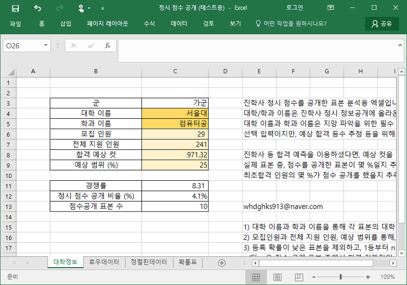

대학 이름과 학과 이름을 필수로 입력해주셔야 합니다.

모집 인원과 전체 지원 인원 등은 입력하지 않으셔도 상관 없지만, 정확한 계산을 위해서 입력하시는 것을 추천드립니다.

진학사 등 합격 예측 프로그램을 구매하셨다면, 최종 점수 컷을 아실 수 있으시다면, "합격 예상 컷"도 입력해주세요.

점수를 공개한 표본의 몇 등까지 최종 컷에 해당하는가?를 아실 수 있습니다.

이때, 주의하실게 하나 있는데요.

대학 이름과 학과 이름은 풀네임이 아닌, 진학사 점공에 나와있는 이름이어야 합니다.

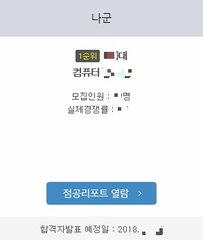

이렇게 점공 리포트에 나와있는 그대로!! 입력해주셔야 합니다.

대학 정보를 모두 입력하셨다면, 이제 표본 정보를 입력해봅시다.

진학사에서 점공리포트를 열람하신 다음, 수집된 원서 접수자 점수 분포를 봅시다.

1등부터 차례대로 점수가 공개되어 있으며, 가나다군까지 나와있습니다.

전체를 드래그해서 복사해주세요.

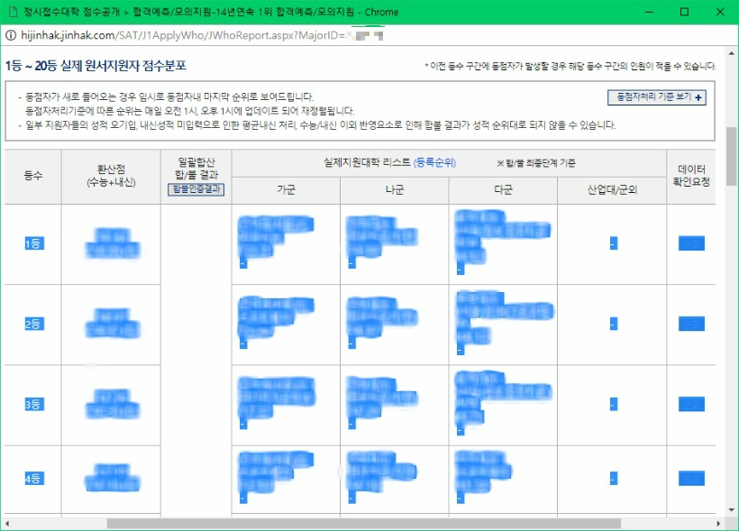

처음엔 1등부터 20등 끝까지 전부 드래그 한다음, 복사하시면 됩니다.

이제, 엑셀로 돌아와서, 로우데이터 시트로 와주세요.

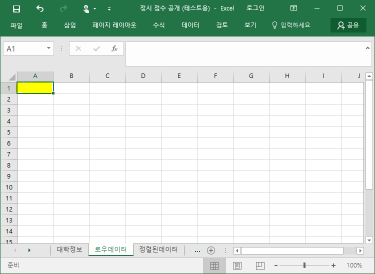

커서를 A1에 놓고, 붙혀넣기 하시면 됩니다.

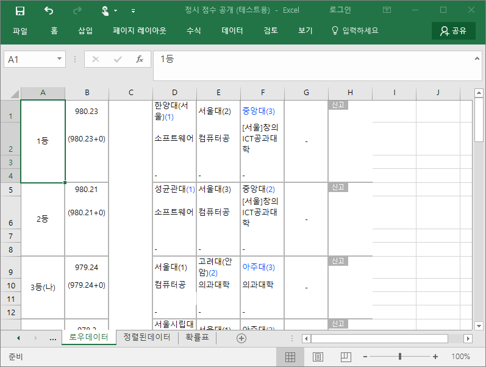

이어서 21등 이후로 공개된 끝까지 복사해서 이어서 붙여넣기 해주세요.

전부 넣어주셨다면, 이제 "정렬된데이터" 시트로 가주세요.

그러면 방금 붙여넣은 데이터들이 정리되서 표시됩니다.

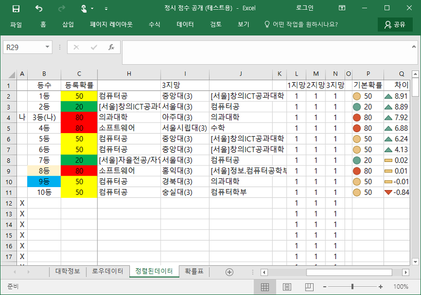

따라하기 어려우신 분께서는 여기까지만 참고하시면 됩니다.

아래부터는 몇 가지 기능과, 그 기능을 언제 사용하는지, 어떻게 작동하는지까지 살펴보겠습니다.

### 합격 등수 추정 및 허수 제거 안내

전문 업체나 컨설팅보다는 못하겠지만,

제 나름대로 합격 등수를 추정하는 방법과, 허수 표본을 제거할 수 있도록 만들었습니다.

먼저 **허수 표본을 거르는 방법**을 알려드리겠습니다.

표본 확인 작업을 하지 않는다면 다음과 같은 기준이 적용됩니다.

1) 모든 표본이 123지망에 전부 합격했다고 가정한다.

2) 분석 대상 대학이 1지망이라면 그 대학에 등록할 확률을 높게,

분석 대상 대학이 3지망이라면 그 대학에 등록할 확률을 낮게 계산한다.

이러한 이유때문에 확인 작업을 하지 않는다면, 실제로는 이 대학에 등록할 가능성이 높지만, 엑셀에 확률을 낮게 잡아서

합격 등수가 낮아지는 원인이 된다.

이를 막기 위한, 등수 판정에 제외할 표본에 대해서 두 가지 예를 들어보겠습니다.

1) 서울대와 의대를 지원한 학생이 3지망으로 낮은 대학을 지원했다고 하면,

그 학생은 3지망 대학에 등록할 확률은 낮다고 해도 되겠죠?

2) 1지망, 2지망 대학을 스나를 노리고 지원했을 경우,

이변이 없다면 3지망 대학에 갈 것 같다면 어떻게 해야 할까요?

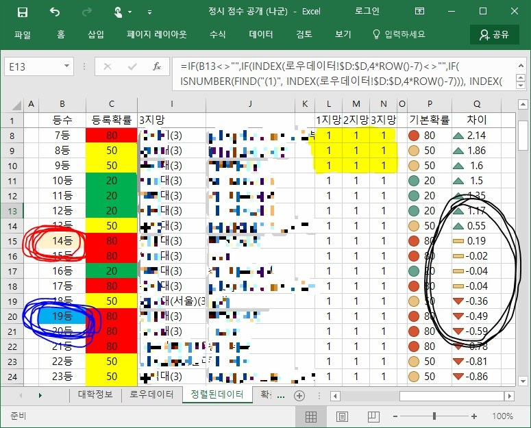

위 스크린샷에서 노란 형광펜으로 칠해진, 111이 가득한 부분을 봐주세요.

빨간펜, 파란펜, 검은펜으로 칠한 부분은 아래에서 설명합니다.

표본이 어떤 k지망 대학에 떨어질 것 같다고 생각하신다면, 1을 0으로 바꿔주세요.

아무 것도 건들지 않는다면, 123지망 대학에 모두 합격했을 때, 분석 대상 대학이 해당 표본에게 몇 지망이냐??에 따라 진짜로 등록할 확률의 가중치가 달라질 것입니다.

그런데, 아무래 생각해도 이 학생은 1지망에 못갈 것 같다면, 해당 1지망의 1을 0으로 바꿔주시면 됩니다.

ex) 분석 대상 대학 : 건국대

1지망 연대, 2지망 중앙대, 3지망 건국대에 지원한 표본이 있다고 합시다. 빵꾸를 노린다던가..

3대학이 모두 붙는다면 이 표본은 1지망 대학에 갈 것이므로 분석 대상 대학(건국대)에 합격할 확률은 낮겠죠?

그래서 분석 대상 대학(건국대)에 등록할 확률을 20%를 주었습니다.

그런데, 본인이 생각했을 때, 실제로는 이 표본이 1,2지망 대학에 합격할 확률이 낮다고 생각한다면,

이 표본은 3지망 대학에 등록할 확률이 높을 것입니다.

따라서, 20%의 확률을 보정해 주어야 하므로, 1지망과 2지망의 1을 0으로 바꿔줍시다.

그러면 이 표본이 합격한 대학은 001이 되고(3지망만 합격), 3지망 대학(분석 대상 대학, 즉 건국대)에 등록할 확률은 20%가 아닌, 70%가 주어지게 됩니다.

123지망 대학의 합격에 따라, 분석 대상 대학이 몇 지망이냐에 따라 얼마만큼의 등록 확률을 줄 것인가?

"확률표" 시트를 보시면 보정확률표가 있습니다.

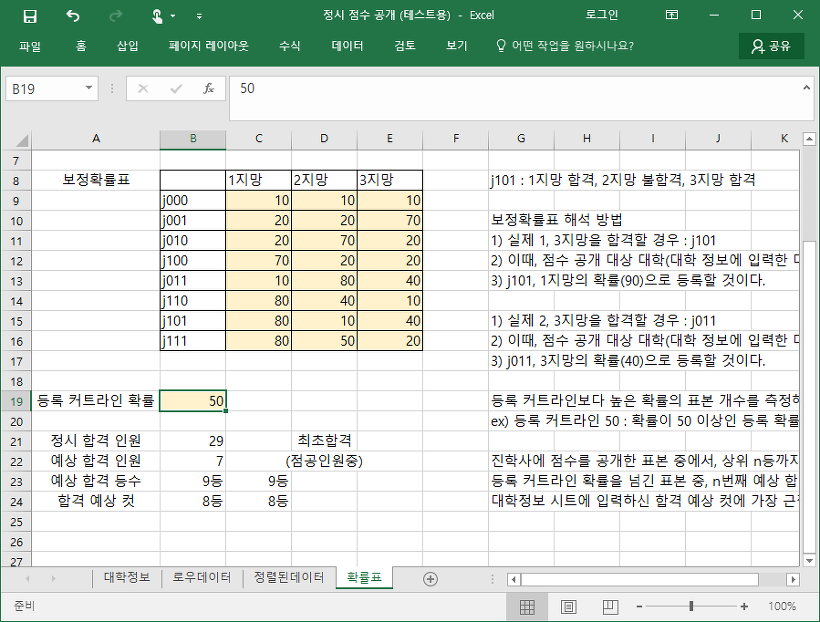

제 나름대로 확률을 준 것이기 때문에 어떠한 기준은 없습니다.

숫자가 마음에 안드신다면, 수정해서 사용하시면 됩니다.

이제 제 나름대로 만든, **합격 등수를 추정하는 부분**에 대해 설명드리겠습니다.

아까 윗 사진에 파란펜, 빨간펜, 검은펜으로 동그라미 그린 부분이 있었는데요.

그 부분도 설명해드리겠습니다.

빨간펜 부분 : "대학정보" 시트의 합격 예상 컷에 가장 근접한 등수를 표시합니다.

파란펜 부분 : 허수를 제거한 뒤, 일정 등록 확률이 넘는 표본의 수를 차례대로 세서 n번째 등수를 표시합니다.

(단, n은 아래에서 설명)

검은펜 부분 : 진학사 등 합격 예측 프로그램을 구매하셨다면, "대학정보" 시트에 합격 예상 컷을 입력하셨을텐데, 얼마만큼 차이나는가?에 해당하는 부분입니다.

이때, 파란펜 부분만 더 보충설명 해드리겠습니다.

진학사 점수 공개는 주로 상위권이 입력할 가능성이 높기 때문에, 이를 보정하기 위해 예상 범위를 만들었습니다.

"대학정보" 시트에 있는 예상 범위 (%)입니다.

이는 전체 모집 인원 중, 몇 %가 점수를 공개했을 것인가? 라는 생각으로 만들었으며,

이를 통해 "확률표" 탭의 예상 합격 인원을 계산합니다.

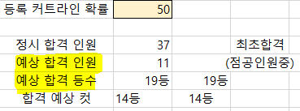

즉, 합격자 중에서 몇 명이 점수를 공개했을까?를 구하는 게 "예상 합격 인원"입니다.

그런데, 위에서 특이한 표본을 확인해서 등록확률을 조정했는데요.

이를 반영해서 합격 등수를 구한 것이 바로 "예상 합격 등수"입니다.

예상 합격 등수는 특정한 등록 확률 이상의 표본 중에서 n번째 등수를 구하는 것이고,

이떄 n은 당연하게도 예상 합격 인원입니다.

그러니까 한마디로 등록 커트라인 확률을 넘긴 표본중에서 위에서부터 합격 인원만큼 세보니까 등수가 나온다는 뜻입니다.

아래 사진처럼 예상 범위를 조정해서 합격 등수를 생각해볼 수 있습니다.

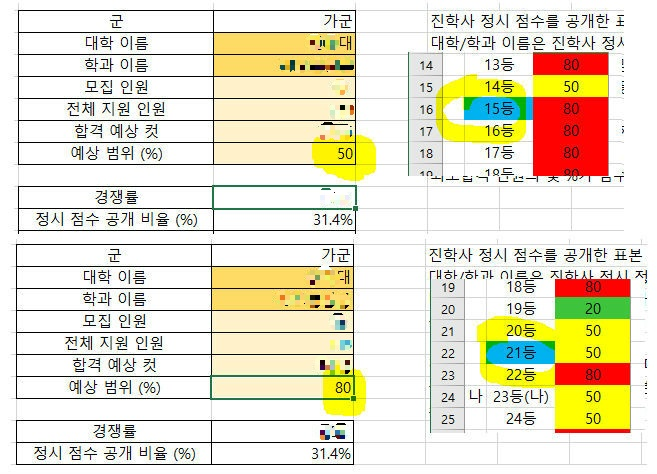

### 질문과 답변

Q) 표본 인원이 150명을 넘어가니 정렬된 데이터에 값이 뜨지 않습니다.

A) 표본이 얼마 없는 과가 많아서 일부로 수식을 150등까지만 체워넣었습니다.

150등 이상의 등수가 있다면, 첫번째 A열부터 마지막 Q열까지 마지막 한 줄을 드래그해서 선택하신다음 오른쪽 아래를 클릭하고 아래로 쭉 복사해주시면 됩니다.

수식을 어떤 row(행)에 넣어도 작동하도록 만들었기 때문에 같은 열(세로)에 같은 수식이 존재한다면 행(가로)의 차이는 상관없습니다.

Q) 모바일에서는 사용 불가능한가요?

A) MS에서 배포한, 엑셀파일 수정이 가능한 Excel 이라는 앱이 존재합니다.

이 앱을 사용하시면 조금 시간이 걸리겠지만, 사용은 가능합니다.

방법은 마찬가지로, 점공 리포트에서 1등부터 쭉 드래그래서 복사한다음 "로우데이터" 시트의 A1에 붙여넣기 하시면 됩니다.

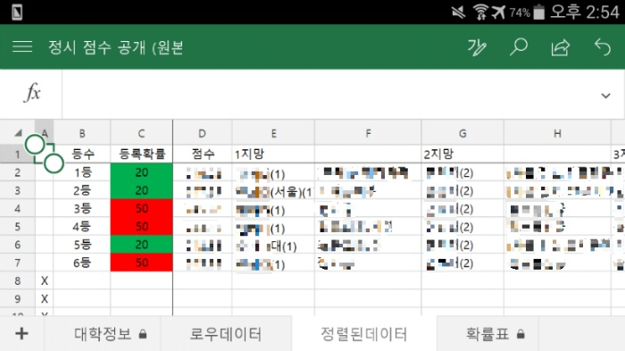

Q) 정렬된 데이터 시트에서 등록확률이 전부 20으로만 나옵니다.

A) "대학정보"탭에서 대학 이름과 학과 이름을 정확하게 입력했는지 다시한 번 확인해주세요.

대학 이름과 학과 이름은 "정렬된데이터" 시트의 123지망에 나오는 정보와 같아야합니다.

Q) 유료 구매를 하지 않아서 합격 예상 컷을 모르는데 어떡하나요?

A) 입력하지 않으셔도 상관 없습니다.

Q) "대학정보" 시트의 "예상 범위 (%)"는 어떤 값을 주어야 하나요?

A) 자신이 생각했을 때, 합격자 중 몇 명이 점수를 공개했을까?를 고려해보세요.

식은 다음과 같습니다 : (모집 인원 X 예상 범위 X 0.01)을 반올림

이렇게 구한 인원수를 30명이라고 하면, 1등부터 30등까지가 점수를 공개한 사람들 중 합격한 사람이라고 생각하는 겁니다.

이때, 1-30등 중 다른 대학에 합격해서 빠질 인원을 고려해서 등수를 산출한 것이 바로 파란펜으로 칠한, 확률표의 예상 합격 등수입니다.

Q) 군 외 대학은 없나요?

A) 제가 처음 작업할 때 군 외 대학에 지원한 표본이 없어서 만들지 못했습니다...

Q) 보호된 시트에 대해서

A) 수정하면 전반적으로 수식이 오류가 발생하거나, 수정할 필요가 없는 셀의 경우 수정이 불가능 하도록 잠금을 걸어두었습니다.

### 마무리

저는 입시 전문가가 아닙니다.

그냥 구글링으로 배운 엑셀을 조금 수정해서 만든 파일입니다.

따라서, 이 파일으로 생각해본 결과에 대해 저는 책임을 질 수 없습니다.

저도 다 만든 다음에 예상 범위 50%정도 주고, 몇 몇 표본 걸러서 등수 확인해봤는데..

제 바로 앞에서 컷이 나오더라고요? ㅠㅠ

제발 그러지마....ㅠㅠ

마지막으로, 지원하신 대학에 모두 합격하셨으면 좋겠습니다..!

긴 글 읽어주셔서 감사합니다!

---

## 첨부파일

- [정시 점수 공개 (2018.01.11).xlsx](https://github.com/itmir913/archive/releases/download/itmir-attachments/646-2018.01.11.xlsx) `46 KB`
