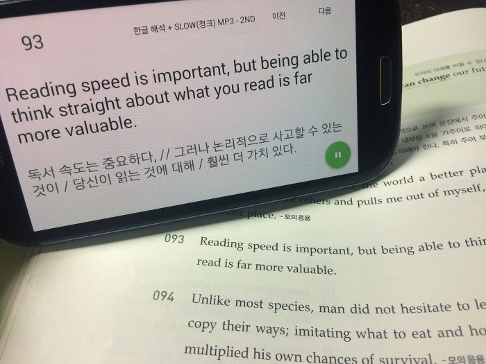

앱 배포와 관련된 내용은 [[Application] - 천일문 완성 어플에 대해서](/archive/itmir/2018/650) 글을 참고해주세요..!

예전에 천일문 기본편이 유료 앱으로 나왔다고 해서 완성편은 언제쯤 나올까 기다리고 있었는데..

기본편도 판매중단되었더라고요?

그래서 완성편 앱도 물건너갔구나... 생각하고 포기하고 있었습니다.

올해 아마 영어 공부를 천일문 완성을 바탕으로 다른 학습 자료를 추가해나갈텐데...

이번에도 mp3 폴더 이동하면서 천일문을 듣는게 너무 귀찮아서 아예 제가 직접 앱을 만들었습니다.

천일문 완성 앱..?

[임베드 콘텐츠: https://play-tv.kakao.com/embed/player/cliplink/v8b58FctctZtcRSShtRZZOU?service=daum_tistory](https://play-tv.kakao.com/embed/player/cliplink/v8b58FctctZtcRSShtRZZOU?service=daum_tistory)

오랜만에 잡는거라 머리도 안 돌아가고 UI도 어처피 혼자 쓸거니 대충 코딩하고 그러느라

진짜 진지하게 만드는 도중에 때려칠까 생각했었네옄ㅋㅋㅋ

아, 그리고 영어랑 한글 해석을 제가 일일히 손 타자 친건 아니예요.

이걸 만들어볼까? 생각한 게 정확히 어제 저녁 자기 직전 쯤이라.. 타자를 칠만한 시간은 없었고, 공개 자료를 이용했습니다.

천일문 완성의 부가 학습 자료는 쎄듀 홈페이지를 들어가면 '누구나' 다운받을 수 있게 되어 있어요.

로그인 제한도 없고, 책을 구입해야 확인할 수 있는 어떤 제한도 없이 공개되어 있는 자료입니다.

혹시나 해서 방금 다시 확인해봤는데, 여전히 지금도 로그인 없이도 누구나 부가서비스를 다운로드 받을 수 있게 공개되어 있었습니다.

<http://www.cedubook.com/sub/sub02_view.php?ptype=view&prdcode=1611150006&page=1&catcode=101101000&mode=1>

이 자료를 바탕으로 DB화 하여 만들었습니다.

영어 문장과 해석은 부가 자료 중, "본문 해석연습"에서, mp3는 청크학습용 mp3(문장별)랑 문장학습용 mp3(문장별)을 사용했습니다.

혹시나 이런 거 원리 궁금하시는 분들을 위해 부연설명 하자면..

본문 해석연습 파일에서 1-1001의 모든 영어 문장과 해석을 정리합니다.

이를 만능 프로그램인 엑셀을 이용해 csv파일로 정리한 다음, sqlite db파일로 변환합니다.

안드로이드에서는 sqlite db를 접근해서 읽을 수 있습니다.

예전에 학교 앱 프로젝트를 하면서 모든 앱에서 사용 가능한 db관련 java파일을 만들었는데요.

그 파일을 그대로 복붙해서 천일문 완성 앱 프로젝트에 넣어버린 다음, 문장 번호에 알맞은 정보를 불러오는 방식입니다.

그리고 mp3파일은 전부 압축 풀어서 /sdcard/의 특정 폴더에 전부 집어넣습니다.

이러면 이제 앱에서 mp3파일을 읽어서 순서에 맞게 재생하면 됩니다.

어떻게 재생할 것인지, 영어 문장과 한글 문장을 어떻게 표시하며 mp3를 재생할 것인지가 주요 논리라고 할 수 있을 것 같아요.

이건 DB랑 엮어서 코딩하면 되는데, 귀찮아서 생략.

설날이니까 조금 딴짓해도 되겠죠??ㅋㅋㅋ...