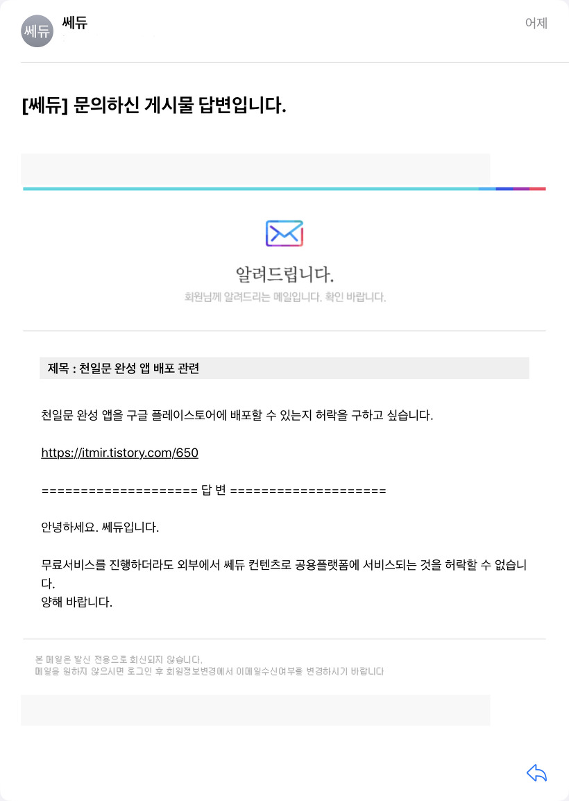
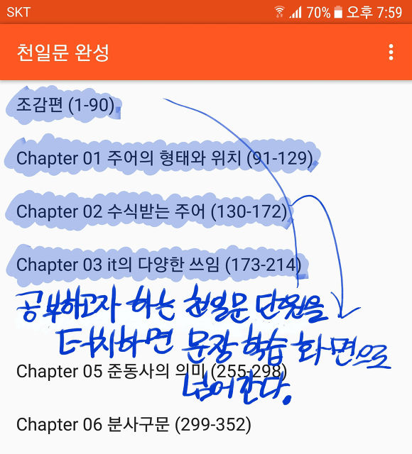
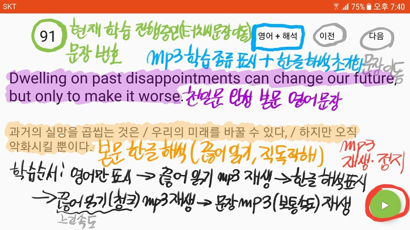
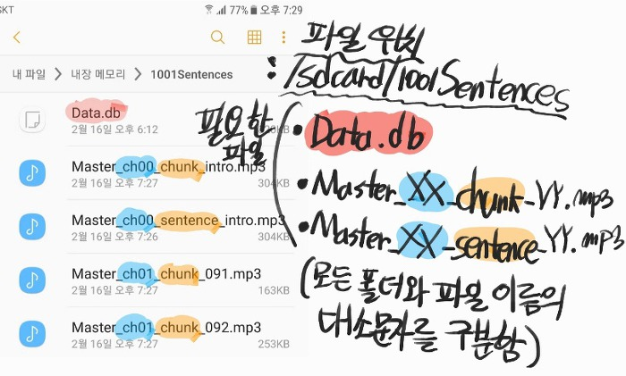
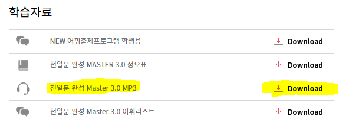
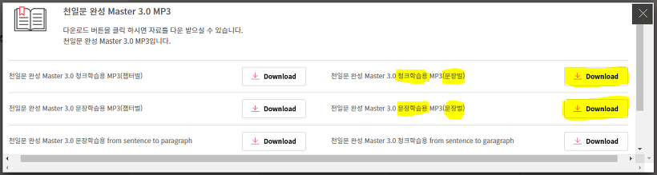
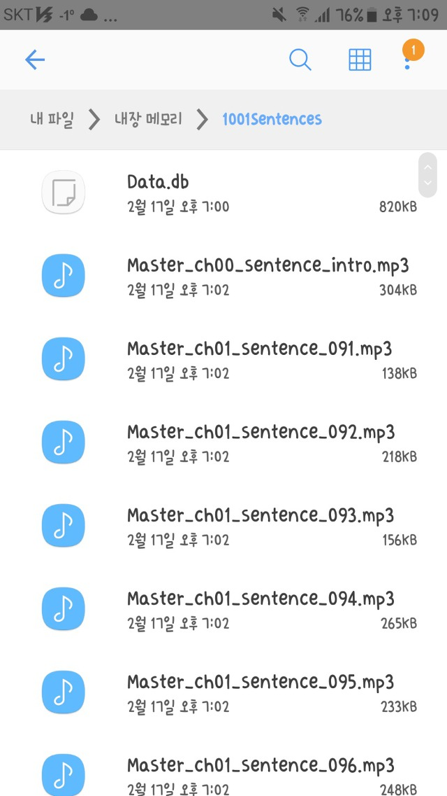

------------------------------

천일문 완성 앱의 배포를 위해 쎄듀의 허락을 구했으나, 외부에서 쎄듀 컨텐츠가 공유되는 것을 허락할 수 없다는 답변을 받았습니다.

따라서 천일문 완성 앱은 저작권 사유로 인하여 배포할 수 없습니다.

죄송합니다. 양해 부탁드립니다...

------------------------------

쎄듀 홈페이지에 업로드되어 있는, 전체 1001개의 영어 문장 정보와 끊어 읽기(직독 직해) 해석 정보를 이용해서 학습 앱을 간략하게 만들었습니다.

사실 앱 자체에 천일문 완성의 정보가 있는 게 아니라서 앱만 조금 수정하고 DB를 따로 추가해준다면 천일문 핵심, 천일문 기본편 앱도 큰 수정 없이 만들 수 있겠네요.

이에 대한 자세한 내용은 맨 아래에 서술했습니다.

작동 영상을 비롯해서 앱에 대한 대략적인 내용은 저번 포스팅에서 서술했습니다.

[[Application] - 천일문 완성 mp3 파일로 앱을 만들었습니다.](/archive/itmir/2018/649)

메인 화면입니다.

Chapter 리스트를 터치하면 해당 챕터의 맨 앞 문장 학습 화면으로 이동합니다.

너무 많은 시간을 앱에 쏟을 수 없기 때문에... 가장 간단하게 구현했습니다.

그래서 UI도 투박합니다.

예를 들어, Chapter 02를 터치하면 130번 문장으로 이동합니다.

아래 스크린샷은 문장 학습 화면의 자세한 정보를 필기한 사진입니다.

역시 시간을 너무 쏟을 수 없기 때문에 가장 간단하게 화면을 구성했습니다. 어떻게 보면 투박할 정도로... UI에 신경쓰지 않았고, 기능 구현과 큰 오류만 잡았습니다.

처음 들어가면 영어 문장만 표시됩니다.

오른쪽 아래의 재생 버튼을 누르면 청크(Chunk)단위 mp3가 먼저 재생됩니다. 의미 단위에서 잠시 쉬는 mp3파일입니다.

그 다음에는 한글 해석이 나타나며, 다시 한 번 청크 단위 mp3가 재생됩니다.

마지막으로 문장 단위 mp3(청크 단위에서 잠시 쉬는 부분이 없고, 빠릅니다.)가 재생됩니다.

총 3번 mp3가 재생되면(청크 단위 2번 + 문장 단위 1번) 다음 문장으로 자동으로 넘어가며 다음 문장의 mp3가 재생됩니다.

앞에서도 말했지만... 앱에 너무 많은 시간을 쏟을 수 없기 때문에 DB를 앱 자체에 내장하지 않았습니다.

대부분 이런 앱은 DB를 앱 자체에 내장한 다음, 사용자가 일반적인 방법으로 접근할 수 없는(단, 루팅하면 접근 가능) /data/data/ 폴더에 DB파일을 압축해제 하는 방법을 사용하는데, 고려해야 할 게 많기도 하고.. 시간도 없고.. 귀찮기도 해서... 그냥 /sdcard/ 최상단에 폴더 하나 만들어서 거기에 모든 파일이 들어가게 했습니다.

이제 Data.db를 앱 자체에 내장했고, 이를 앱이 자동으로 압축 해제해서 사용합니다.

예전에 만든 java 코드를 일부 수정해서 사용해서 많은 시간을 절약할 수 있었습니다.

암호화 역시 생략했습니다. DB 파일을 열면 그대로 문장이 보입니다.

안드로이드에서 사용할 수 있는 암호화에 대해 어떤 분께 들은 적이 있지만, 시간이 없으므로.. 그리고 암호화를 해야하는 당위성을 발견하지 못했기 때문에 생략했습니다.

(왜냐하면, 이 정보는 그냥 쎄듀 홈페이지에서 로그인 없이 다운로드 받을 수 있는 파일에서 바로 얻을 수 있기 때문입니다.)

/sdcard/1001Sentences/에 파일을 넣어야 하며, 이 폴더 안에는 Data.db가 있습니다.

Data.db 파일에는 천일문 완성의 문장에 대한 모든 정보(영어 문장 + 한글 직독직해 해석)가 담겨 있습니다.

(앱 자체에는 천일문 완성의 정보가 Chapter 목록을 제외하면 없습니다..)

그리고 쎄듀 홈페이지에서 다운로드 받을 수 있는 mp3파일(문장별)을 1001Sentences에 모두 넣어주면 앱이 정상 작동합니다.

mp3파일은 쎄듀에서 다운로드 받아 압축을 풀면 나오는 파일을 '이름 변경 없이' 그대로 넣어 작동하게 했습니다.

앱 자체에는 DB파일을 불러와서 문장 정보를 화면에 띄우는 역할과, mp3파일을 순서에 맞게 재생하는 기능만 담당합니다.

또한, 문장의 전체 개수(1001개)도 반드시 정해진 것이 아니기 때문에 DB를 만들 수 있고, mp3 파일만 있다면 천일문의 핵심편, 기본편은 물론이고, 다른 모든 영어 문장도 사용할 수 있을거라 생각합니다.

(그런데 다른 문장도 넣으려면 DB를 구성하는 건 둘째치고, 문장 단위로 mp3파일을 제공해야...)

제가 직접 타자 쳐서 만든 DB는 아니고, 이것도 역시 쎄듀의 천일문 완성 자료실에 보면 본문 해석 연습 파일이 있습니다.

이 hwp파일을 전체 복사해서 메모장에 붙여넣은 다음, 조금 다듬고 java 프로그래밍으로 아예 깔끔하게 출력하도록 코드를 만들어 출력값을 저장했습니다.

다시 말하면, 필요 없는 부분을 잘라내서 문장 정보만 표시되게 프로그래밍 코딩을 하고 이 출력값을 약간 다듬어서 DB를 만든 겁니다.

그런데, 이 앱을 공개적으로 무료 배포할 수 있을 지는 잘 모르겠네요.. (당연히 무료배포지만)

UI의 허접함은 둘째쳐도, 실제 출판된 책의 내용이 암호화되어 있지 않은 상태로 DB 파일에 담겨 있는거라 조심스럽습니다.

아무튼, 어제 잠들기 직전부터 급하게 만든 앱 치고는 쓸만한 것 같습니다.

쎄듀 자료실에 빈칸 넣기 파일 등등 자료가 많던데... 이를 어떻게 변환해서 앱으로 구현할 지 생각해보면 답이 나오겠지만...

나머지는 올해 수능이 끝나고.... 아마... 심심하다면? 그리고 점수가 잘 나왔다면? 해볼 것 같습니다.

지금은 기능도 단순한데, 떠오르는 기능(청크mp3랑 문장mp3랑 순서 변경, 반복 횟수 변경, 한글 뜻이 떠오르는 타이밍 변경 등등..)은 많지만 구현하기 귀찮으므로.. 시간도 없으므로... 생략했습니다.

지긋지긋한 수능 영어 빨리 버리고 싶네요.

감사합니다!

+ 2018-02-20 추가

/sdcard/1001Sentences 폴더에 Data.db파일을 넣을 필요가 없어졌고, 앱 자제에 Data.db를 내장하게 코드를 구성하였습니다.

그래서 이제는 /sdcard/1001Sentences 폴더에 mp3파일만 넣으면 됩니다.

이 외에도 배경을 어둡게 하는 야간 모드와, 일부 학습 단계를 생략할 수 있는 세부 설정 등을 추가했습니다.

<http://www.cedubook.com/sub/sub02_view.php?ptype=view&prdcode=1611150006&page=1&catcode=101101000&mode=1>

위 링크에서 mp3파일을 받을 수 있습니다.

천일문 완성 Master 3.0 MP3를 클릭하면 몇 가지 종류의 mp3파일을 받을 수 있는데, 그 중 필요한 파일은 "문장별" 청크 학습용 파일과 "문장별" 문장 학습용 파일입니다.

압축을 풀면 아래 두 개 폴더가 있습니다.

조감편, 구문, 독해편

두 폴더 안에 있는 모든 mp3파일을 전부 1001Sentences 폴더에 넣어주면 됩니다.

모든 mp3를 복사했다면,

내장 메모리 / 1001Sentences 폴더에는 총 2002개의 mp3파일이 존재하게 됩니다.