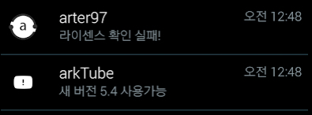
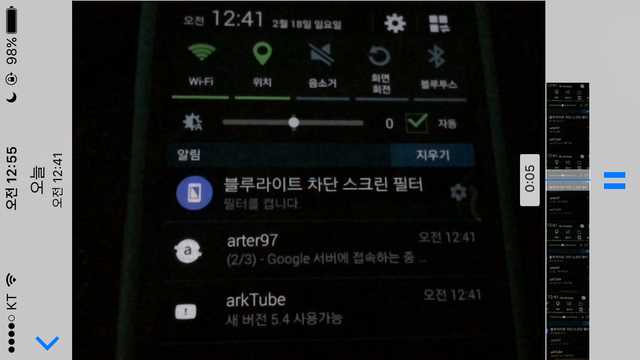
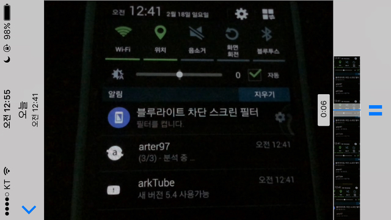
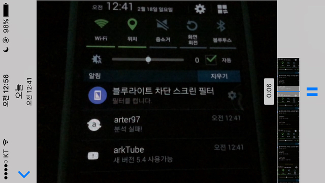

​2월 17일 저녁부터 18일 자정 무렵까지 arter97님의 ArkTube Donation 앱 크랙을 시도했습니다.  
  
작년 이맘때쯤 5.x.x 버전의 Arktube를 크랙 시도했었는데, classes.dex 검사에서 장렬하게 전사해서....  
  
이번에는 Donation 앱을 크랙 시도했습니다.  
앱이 작고 용량도 얼마 없어서 만만하게 봤는데, 이 역시 장렬하게 전사...  
  
라이센스 확인이 실패한다면 아래 스샷처럼 '라이센스 확인 실패!'가 나와야 하는데..

​  
  
도대체 어떻게 된건지, 구글 서버 체크 단계는 넘긴 것 같은데, 3단계 '분석중...'이 안되네요.

​

​  
도대체 이 분석중...이 뭘 분석하는 건지 알 수가 없어요...  
RunTime으로 뭘 돌리는 것 같은데, 그게 전부 극악 난독화 되어 있어서 알아볼 수도 없고;;..

거의 이정도면 완벽합니다...  
  
도네이션 앱에도 classes.dex 변조 검사가 있었다면 시작하자마자 때려쳤을 것 같아요. (근데, 역시 classes.dex 검사가 있었다고 합니다; ​이럴줄 알았어.)  
  
작은 틈도 찾기 힘든데 거기에 극도로 난독화까지 되어 있어서 진짜 쳐다보기도 싫네요.  
  
계속 분석하면서 대충 논리 전개 흐름은 알 것 같은데, 이걸 이제 어쩌라는건지......  
  
베가 키보드를 타 기기에 작동하도록 작업하면서.. 보통 방법으론 해결이 불가능하다고 생각한 기능을 작동시키기 위해 따로 액티비티를 만들어 작업한 경험이 있었는데, 이번에도 아예 라이센스 OK를 arktube에 보내는 앱을 추가하는 방향으로도 생각했거든요.  
  
그런데 도대체 뭘 보내는지 알 수가 있어야죠... smali에 log.e로 값 찍어서 확인해보려고 하다가 지금까지 시간도 너무 많이 잡아먹고.. 그래서 그냥 때려쳤습니다. ㅋㅋ  
  
라이센스 확인 성공시 어떤 작업이 있는지 알 필요가 있는데, 그럴려면 제가 앱을 사서 관찰하던가, 구글 서버에서 ok 권한을 주도록 arter97님께 허락을 받아 play consol에 계정을 추가하는 있을텐데..  
  
올해 12월에 다시 도전할께요.  
  
지금은 쳐다보기도 싫네요. ㅋㅋㅋ  
  
  
파워앰프 이후로 극악 난독화 + 변조 검사는 이 앱이 정말 처음이고 최초이고 최고입니다.
