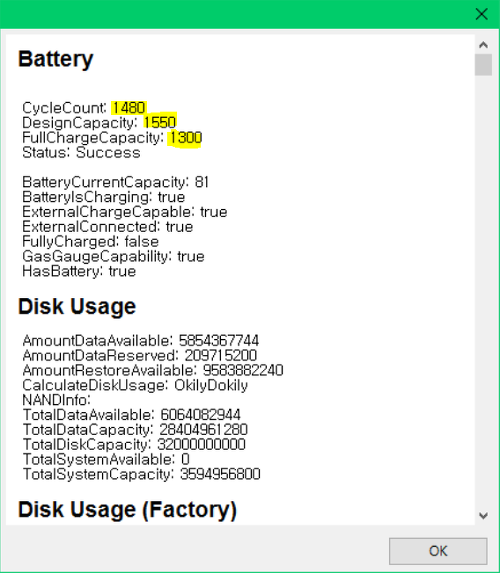

아이폰 5s의 배터리가 자꾸 꺼지는 현상이 발생하고, 갑자기 %가 떨어지는 현상이 발생해서 배터리를 교체해야겠다고 마음먹었습니다.

배터리 사이클을 확인해보니 1480 이더라고요.

혼자서 자가 교체하기에는 떨려서 주변 수리 업체에 가서 교체하기로 했습니다.

교체 후 사이클이 0이 된 모습입니다.

몇 개월 동안은 더 쓸 수 있을 것 같습니다.

이제 iOS 11.3이 나올 때까지 기다렸다가 후기를 지켜본 다음에 올려볼 생각입니다.
