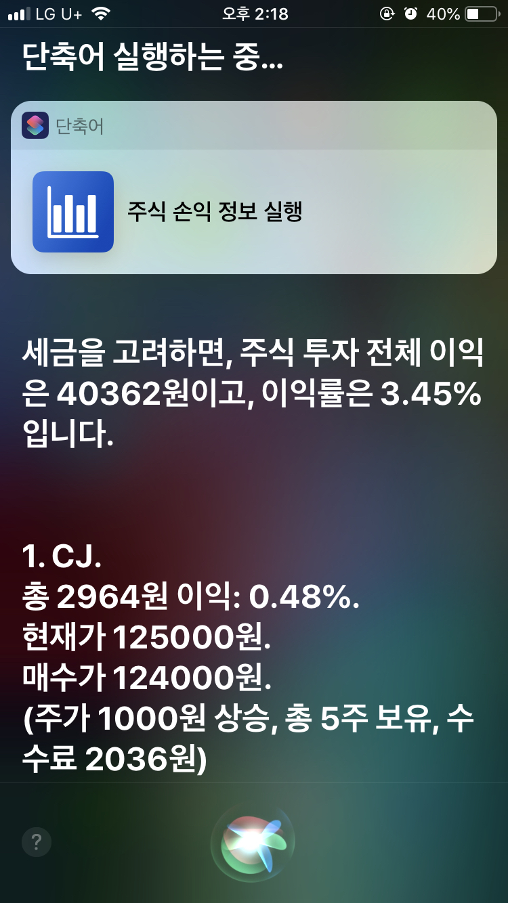
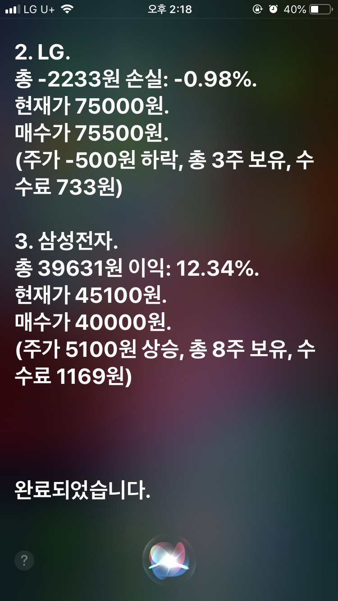
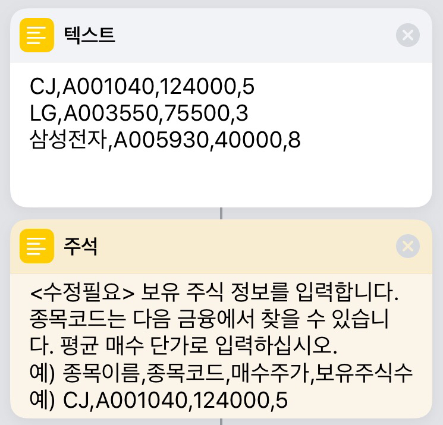
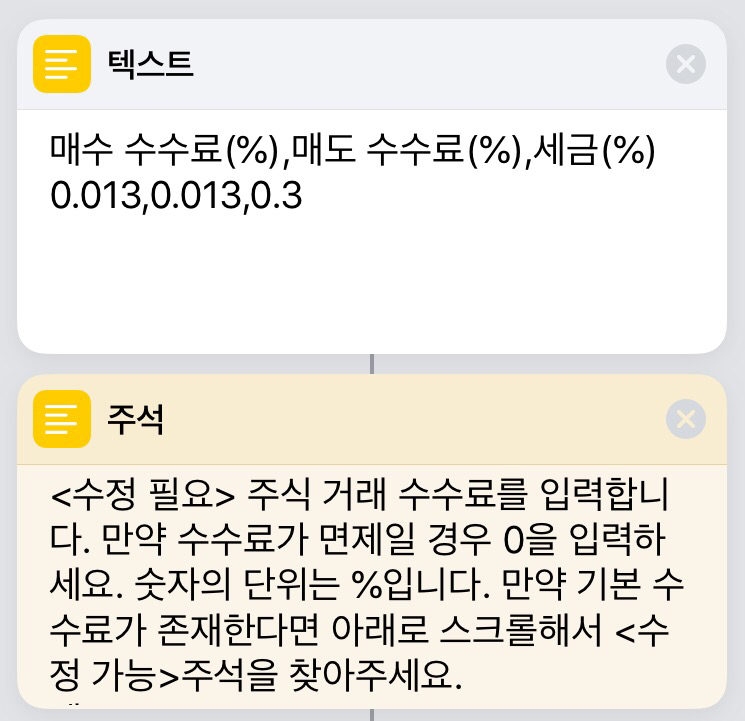
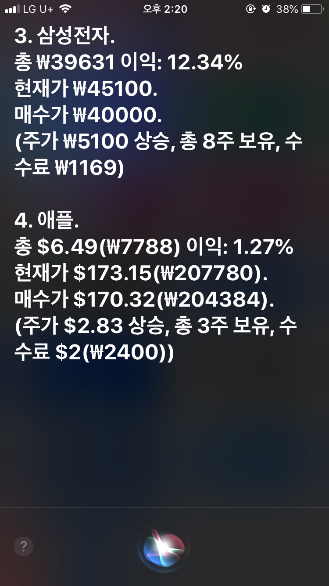
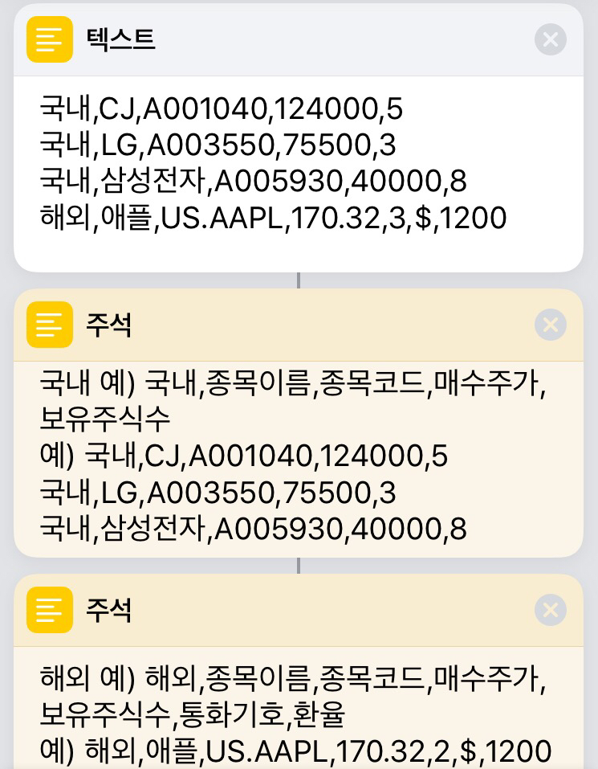
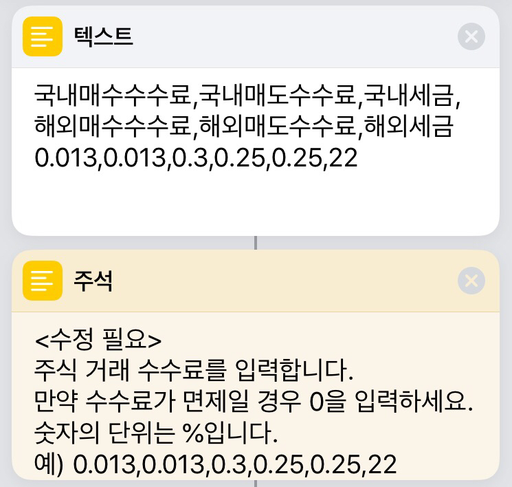

1. 국내 주식 전용 단축어​

​

단축어 상단에 자신이 보유중인 주식 정보를 입력하고 시리에 등록하면 이렇게 어느 정도 수익률인지 계산해서 표현해줍니다.  
  
종목 개수 제한 없이 가지고 있는 종목 전부 입력해두면 시리한테 묻는 것만으로 현재가를 가져와 매수가와 비교할 수 있는 단축어입니다.  
  
  
  
​  
사용법은 단축어를 추가한 다음 맨 위에 보유중인 종목 정보를 입력하면 됩니다.  
  
일단 사용 전에 보유중인 종목 정보와 수수료 정보를 입력해야 합니다.  
  
  
먼저 종목 정보입니다.  
​​

한 줄마다 한 종목 정보를 입력하면 됩니다.  
  
국내 전용 단축어의 양식은 아래와 같은데요.  
  
종목이름,종목코드,매수주가,보유주식수  
  
이때 종목코드는 다음 금융 사이트에서 찾거나 카카오스탁 앱에 들어가면 확인이 가능합니다.  
  
쉼표(,)의 앞 뒤에는 공백이 들어가면 안 된다는 점 명심해주세요.  
  
  
  
이어 수수료 정보입니다.  
​

국내 주식을 매매할 때 어느 정도의 수수료를 부과하는 지는 증권사마다 다르므로, 자신의 증권사에 맞는 수수료를 입력하면 됩니다.  
  
세금도 마찬가지로 사용하시는 시점의 세율을 찾아보셔서 입력해주세요.  
  
입력의 간편함을 위해 수수료와 세금은 % 그대로 입력하시면 됩니다.  
  
만약 MTS 거래시 0.013%의 수수료가 나온다면 0.013 그대로 입력하시면 됩니다.  
  
이렇게 하시면 시리를 이용하여 주식 수익률을 계산할 수 있습니다.  
  
단축어를 이용해서 주식 수익률을 계산할 수도 있고요!  
  
  
  
  
2. 국내와 해외 주식 겸용 가능 단축어  
  
해외 주식의 경우에는 환율 문제도 있지만, 수수료와 새금이 국내와 다른 기준으로 적용된다는 문제가 있습니다.  
그래서 국내 주식과 해외 주식을 함께 사용하려면 별도의 처리를 해주어야 합니다.  
​

해외 겸용 단축어는 국내 전용과 입력해야 하는 정보가 다른 점이 몇 가지 있습니다.  
​

국내 주식인지 해외 주식인지 구분해야 하기 때문에 국내 전용 단축어보다 다른 점이 있습니다.  
  
해외 주식에는 보유 주식수 뒤에 ‘통화기호’와 ‘환율’을 더 입력해야 합니다.  
​

국내와 해외 수수료가 다르기 때문에 이렇게 많은 정보를 입력해야만 합니다.  
  
해외 주식의 경우 2019.03.01 기준 알아본 바에 따르면 양도차익(100원에 사서 120원에 팔면 20원이 양도차익)의 22%를 세금으로 내야 합니다.  
  
이에 대한 계산 등이 포함되어 있기 때문에 국내 전용 단축어보다 해외 겸용 단축어의 속도가 느립니다.  
  
따라서 국내 주식만 거래하시는 분께서는 국내 전용 단축어를 사용해주세요.  
  
별다른 사용법은 해외 겸용 단축어도 국내 전용이랑 거의 같기 때문에 자세한 설명은 생략합니다.  
  
  
  
  
3. 공유 링크  
  
주식 손익 정보 (국내 주식 전용)  
<https://www.icloud.com/shortcuts/1620c782b1f24615aeb73c0c8b68a0db>​  
  
​  
주식 손익 정보 (국내 해외 주식 겸용)  
<https://www.icloud.com/shortcuts/5b10b67ba57b4f6eb5921091741e5bd3>​  
  
  
  
4. 사용법 요약  
  
① 단축어를 추가한다.  
② 자신이 보유중인 주식 종목의 정보를 입력한다.  
③ 시리에 등록하여 사용한다.  
  
  
  
5. 입력 정보 요약  
  
① 국내 전용  
- 주식 이름, 종목 코드, 매수 당시 주가, 매수 수량  
  
② 해외 겸용  
- 국내, 주식 이름, 종목 코드, 매수 당시 주가, 매수 수량  
- 해외, 주식 이름, 종목 코드, 매수 당시 주가, 매수 수량, 해외 통화 기호, 환율  
  
공통) 수수료 정보  
주의) 쉼표 앞뒤에는 공백이 없어야 한다.  
  
  
  
6. 표시하는 정보 수정하기  
  
단축어의 후반을 수정하면 표시할 주가 정보를 내 마음대로 바꿀 수 있습니다.  
  
  
  
  
  
감사합니다!
