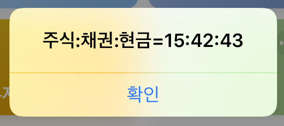

저번에 올린, 보유 주식 종목 정보 단축어와 같은 종류의 단축어입니다.

systrader79님의 ‘주식 투자 ETF로 시작하라’라는 책에서 다루는 내용 중, 평균 모멘텀 스코어라는 개념이 있습니다.

평균 모멘텀 스코어를 이용하여 주식 투자 비율을 구한 다음, 매 월 구한 비율대로 주식과 채권, 현금의 비중을 다시 맞춰주는 방법인데요.

아이폰의 단축어를 이용하여 투자 비율을 손쉽게 계산할 수 있도록 만들었습니다.

평균 모멘텀 스코어가 무엇인지?

이 비율대로 자산을 투자해야 하는 이유는 무엇인지?

어떻게 구하는 것인지?

이러한 내용들은 systrader79님의 블로그를 참고해주시면 감사드리겠습니다.

아직 이 방법을 적용해본지 얼마 되지 않은 제가 뭐라고 왈가왈부하기에는 너무 이른 것 같습니다.

아래에 systrader79님의 블로그 링크를 첨부하겠습니다.

<https://stock79.tistory.com/>

지금 2019년 3월 25일, 글을 쓰고 있는 당일에 투자 비율은 15:42:43이네요.

100만원의 총 투자 금액을 가지고 있다면, 평균 모멘텀 스코어 투자 방법은

15만원은 주식 ETF에

42만원은 채권 ETF에

43만원은 CMA등 현금 자산에

투자하는 방법입니다.

이 방법에 대해 제가 이해한 대략적인 개론을 말씀드리자면,

만약 현재 주식 시장이 상승세일 때는 주식 투자 비율이 높아져서 예를 들어 60:30:10의 비율로 주식에 투자합니다.

그 반대의 경우에는 안전 자산인 현금을 보유하고 있으라는 신호를 주는 것이지요.

감사합니다!

<https://www.icloud.com/shortcuts/48a20ee851d64116899a25b9edb26e9e>
