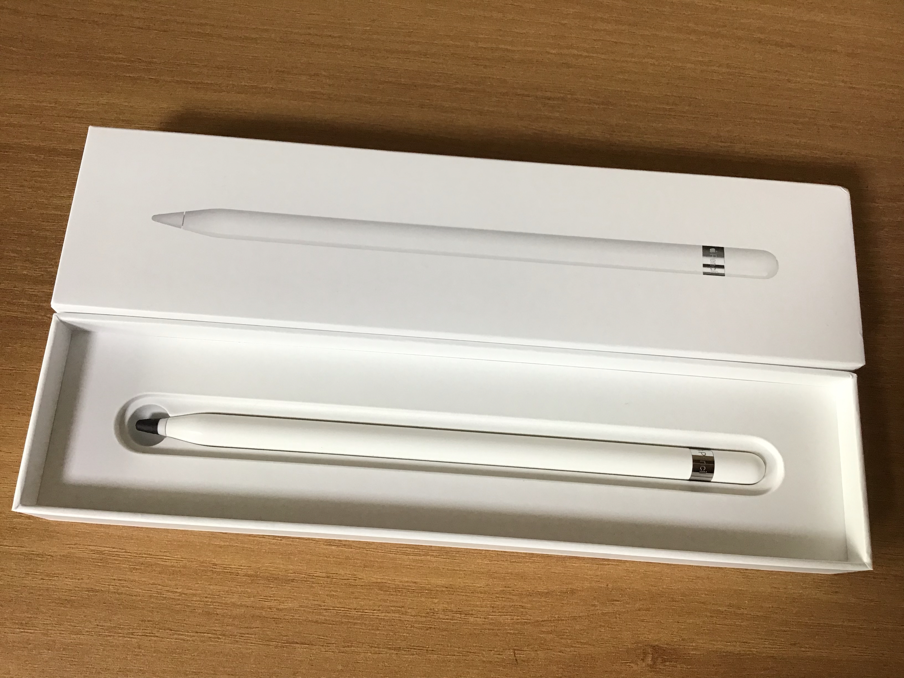

애플 펜슬의 필기감 향상이나, 화면과 닿으면서 생기는 소음을 줄이기 위해 애플 펜슬 펜촉에 수축 튜브를 끼우는 데요.

제가 다이소에서 산 수축튜브는 크기가 조금 커서 그런지 자꾸 빠지더라고요.

주변에 철물점이 없어서 더 작은 수축 튜브를 구하기가 어려워서...

어떻게 하면 안 빠지게 만들까 하다가 펜촉에 끼울 때 양면 테이프를 붙혔습니다.

수축 튜브를 고정하는 방법을 고민하다 양면 테이프가 눈에 들어온 거예요!

이렇게 저 정도 위치에다가 작게 자른 양면 테이프를 먼저 감아주고 수축 튜브를 씌워주면 됩니다.

테이프의 위치가 수축 튜브의 맨 끝에 오도록...

아직까진 별 문제 없이 쓰고 있습니다. 수축 튜브가 빠지는 문제점은 해결한 것 같아요.

하지만 기울여서 쓰기 등등 일부 기능이 잘 안되는 문제가 발생할 수도 있을 것 같습니다.

저는 필기 용도로만 사용할 예정이라 별로 상관 없다고 생각하지만요...
