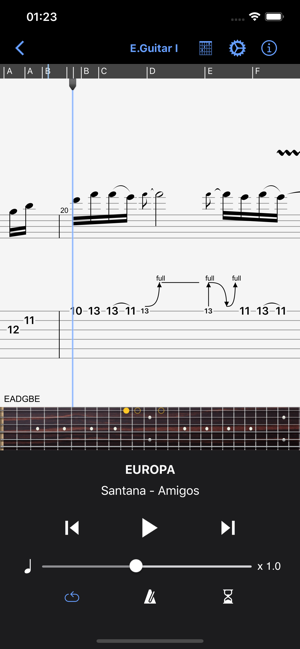
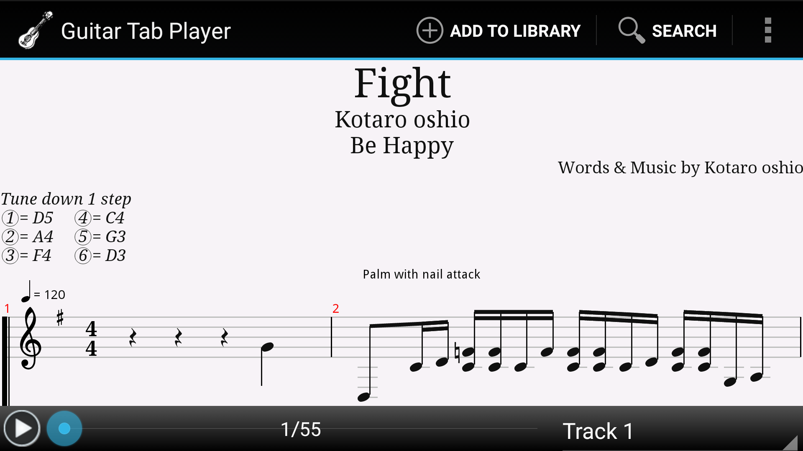
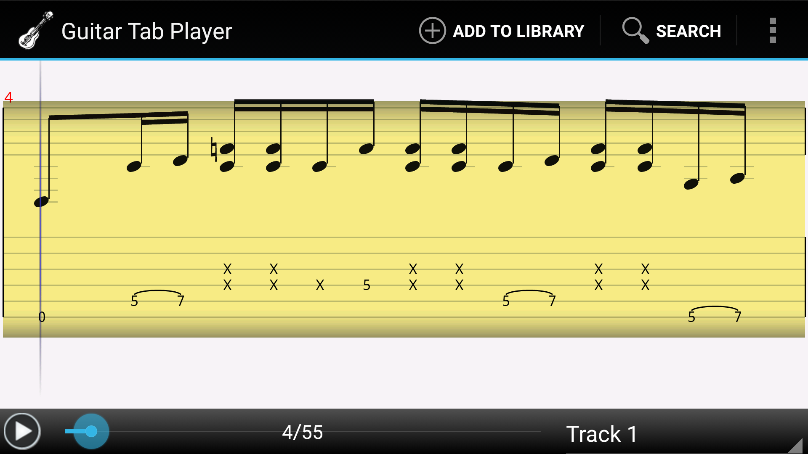
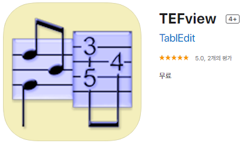
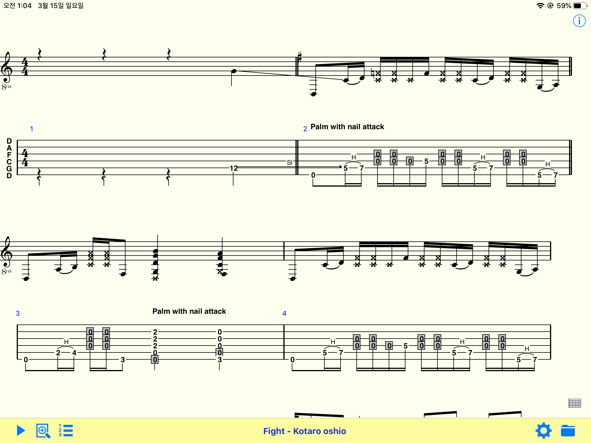

안녕하세요.

정말 오랜만에 블로그에 글을 써보네요.

## 서론

앱스토어에는 기타 프로 타브 악보를 읽을 수 있는 수많은 앱이 존재합니다.

gp4, gp5, gpx 등의 확장자를 가지고 있는 Tab 악보를 큰 화면의 아이패드에서 읽을 수 있다면 정말 좋겠는데요.

중요한 것은 대부분이 '유료' 앱이라는 겁니다.

TIP) IOS 기타 프로 타브 악보를 재생할 수 있는 무료 앱을 빠르게 찾으시려면 가장 아래로 스크롤하세요.

## 기타 프로 정식 앱

예를 들어, 기타 프로 정식 앱을 살펴보겠습니다.

<https://apps.apple.com/kr/app/guitar-pro/id400666114>

[‎Guitar Pro](https://apps.apple.com/kr/app/guitar-pro/id400666114)

Guitar Pro : 8,900원 (2020-03-15 기준)

약 9천원의 값을 지불하고 앱을 구매하셔야 합니다.

다행히도 Guitar Pro 앱은 현재 구독 방식이 아니라 한 번 결제하면 영구적으로 사용할 수 있지요.

## Mulody Guitar 앱

기타 프로 공식 앱의 가격이 부담스러운 분들은 아래 앱을 사용하실 수도 있습니다.

Mulody Guitar 라는 앱인데, 인앱 결제로 2,500원을 지불해야 곡 전체를 재생할 수 있습니다. 시험 버전에서는 앞부분 일부만 재생할 수 있어요.

즉, 이 앱의 가격은 2,500원이죠.

<https://apps.apple.com/kr/app/mulody-guitar-tab-player/id1109966537>

[‎Mulody - Guitar Tab Player](https://apps.apple.com/kr/app/mulody-guitar-tab-player/id1109966537)

하지만 필자는 이 앱을 적극 추천하지 않습니다.

## Tabtoolkit 앱

Tabtoolkit이라는 앱도 있습니다. 4,900원이네요.

Guitar Pro나 Tabtoolkit 중 하나를 구매하시는 분이 많으실 거에요.  
[Tabtoolkit](https://apps.apple.com/kr/app/tabtoolkit/id325946571)

https://apps.apple.com/kr/app/tabtoolkit/id325946571

## 안드로이드 앱

안드로이드를 사용한다면 어떨까요? 안드로이드에는 어떤 무료 타브 악보 앱이 있을까요.

안드로이드에는 Guitar Tab Player라는, 무료 타브 어플이 존재합니다.

무료 앱임에도 상당히 만족스럽습니다. 제가 안드로이드 스마트폰을 사용하던 당시에는 타브 앱을 이 Guitar Tab Player 앱만 사용했었습니다.

<https://play.google.com/store/apps/details?id=guitartab.player>

[Guitar Tab Player - Google Play 앱](https://play.google.com/store/apps/details?id=guitartab.player&hl=ko)

만약 이 글을 보시는 분들 중에, 나는 안드로이드 스마트폰을 사용하시는 분이 계시다면 무료 기타 타브 앱 중에서는 고민하지 마시고 이 앱을 설치하시면 됩니다.

## PC 컴퓨터 프로그램

PC 컴퓨터로 타브 악보를 본다면 TuxGuitar라는 오픈소스 프로그램이 존재합니다.

제가 과거에 포스팅한 적이 있는 프로그램인데요. 자세한 내용은 아래 링크를 통해 확인해주시면 감사드리겠습니다.

[[Computer/PC] - 무료 기타프로 프로그램 TuxGuitar](/archive/itmir/2017/640)

[무료 기타프로 프로그램 TuxGuitar](/archive/itmir/2017/640)

그러면 IOS 환경에서 무료 타브 악보 앱은 없느냐.

안타깝지만 제가 만족스러울만한 완성도를 지닌 "무료" 앱은 없었습니다. 유료로 범위를 넓혀도 위에서 소개한 두 개의 앱 말고는 딱히 마음에 드는 앱이 없더라고요.

그러니까 유료로 구매하고 싶으신 분이시라면 그냥 기타 프로 정식 앱을 결제하시면 됩니다. 괜히 다른 유료 앱 찾으실 시간에 8,900원 기타 프로(Guitar Pro) 결제하시는 걸 추천드립니다.

쓸만한 타브 악보 앱이 거의 없어서요.

제가 타브 악보 앱을 골랐던 기준은 아래와 같습니다.

1) 구독형이 아니어야 한다.

앱의 가격이 무료거나, 한 번 구매하면 모든 기능을 사용할 수 있어야 한다.

구독형은 매 달 가격을 지불해야 하므로 장기적으로 보면 오히려 손해가 될 수 있다.

2) 아이폰 파일 공유 버튼을 통해 아이튠즈를 통하지 않고서도 타브 악보 파일을 넣을 수 있어야 한다.(중요) PC 아이튠즈 프로그램으로만 타브 악보를 넣을 수 있다면 매우 불편하니까.

3) 템포, 피치 조절 등 쓸만한 보조 기능이 구현되어 있어야 한다.

이 정도 기준을 가지고 앱스토어를 찾아보았습니다.

## iOS 무료 기타 타브 앱 추천

그 결과 겨우 앱 하나를 건졌습니다. 위 세 가지 기준을 모두 만족하면서, 특히 두 번째 기준까지 만족하지만 심지어 현재 무료입니다!

바로 TEFview라는 어플입니다.

<https://apps.apple.com/kr/app/tefview/id492060413>

[‎TEFview](https://apps.apple.com/kr/app/tefview/id492060413)

저는 이미 앱을 설치했기 때문에 "무료" 버튼이 나타나지 않더군요. 스크린샷을 찍어 TEFView가 무료 앱이라는 기록을 남겨두겠습니다.

아래는 아이패드6에서 TEFview를 실행한 모습입니다.

물론 완벽하지는 않습니다. 사소한 오류가 존재합니다. 그러나 이를 감안해도 충분히 사용할만한 앱이라고 생각합니다.

아래는 Fight를 TEFview 앱으로 재생한 영상입니다.

아이패드6에서 화면 녹화를 하였습니다.

[임베드 콘텐츠: https://play-tv.kakao.com/embed/player/cliplink/407268944?service=daum\_tistory](https://play-tv.kakao.com/embed/player/cliplink/407268944?service=daum_tistory)

영상을 보기 귀찮으신 분을 위해 요약해드리겠습니다.

1) gp5 타브 악보 재생.

2) 타브 악보 PDF로 인쇄 가능. (PDF Print)

3) Track 악기 변경 가능. (MIDI Synthesizer 변경)

4) Tone, Tempo 조절.

5) 메트로놈(Metronome) 재생 가능.

6) 악기 파트 음량 각각 조절 가능.

7) (영상에는 나오지 않지만) 구간 반복도 가능, etc.

저는 2,500원을 지불하고 Mulody Guitar의 인앱 결제를 했는데요. 솔직히 TEFview(무료) 앱이 Mulody(2,500원)보다 더 자주 사용할 것만 같은 기분이 듭니다.

솔직히 지금 인앱 결제 살짝 후회하고 있거든요. 차라리 기타 프로를 사던가, 아예 사지 말고 당분간은 TEFview를 쓰던가.

제가 발견한 버그는 아래와 같습니다.

1) 도돌이표 처리가 조금 미흡하다. 한 번만 반복해야 하는 구간을 두 번 반복하거나, 아예 반복을 무시하는 경우가 종종 있는 듯 하다.

2) 유니코드를 지원하지 않아 한글이 깨진다.

3) (아이패드에서) 스플릿 뷰(Split View)나 슬라이드 오버(Slide Over)로 앱을 사용할 때 버튼이 사라지는 등의 UI상 버그가 있다.

4) 오류는 아니지만, 악보를 스크롤하기가 제 기준 조금 불편하다.

이를 감안해도 파일 앱이나 Document 앱을 통해 TEFview 앱에 gp5 파일을 컴퓨터 없이 직접 집어넣을 수 있고(아이튠즈로도 집어넣을 수도 있다), 구간 반복도 가능한 장점이 단점을 가린다고 생각합니다.

당분간 구매한 Mulody앱과 이 TEFview 앱을 쓰다가 정 불편하면 정식 기타 프로 앱을 구매해야겠네요.

Mulody 앱에서 Fight를 재생한 영상을 확인하시려면 아래 접은 글을 펼쳐주세요. TEFview 영상과 함께 비교하시라는 의미에서 Mulody 앱도 녹화했습니다.

[임베드 콘텐츠: https://play-tv.kakao.com/embed/player/cliplink/407269125?service=daum\_tistory](https://play-tv.kakao.com/embed/player/cliplink/407269125?service=daum_tistory)

참고) 이 포스팅에 사용된 코타로 오시오 Fight gp5 파일은 네이버 핑거스타일 카페 "호야"님께서 올려주신 파일입니다. 출처: <https://cafe.naver.com/fingerstyle/46087>