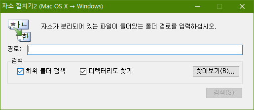

## 서론

윈도우에서 아이클라우드 드라이브를 사용하다보면 파일 이름의 한글 자음과 모음이 분리되는 경우가 종종 있다.

이는 윈도우와 Mac OS 간의 한글 인코딩 방식 차이에서 비롯된 현상인데, 두 OS에서 사용하는 인코딩 체계가 모두 표준이라 해결될 낌새가 보이지 않는다고 한다.

## 해결책

그래서 자소가 분리되어 있는 파일명을 교정해주는 프로그램을 찾았고, 어떤 국내 개발자분께서 오픈소스로 공개하신 프로그램을 발견하였다.

<https://namocom.tistory.com/630>

[[Windows] 한글 자소 교정기 ver.2

라이센스 본 애플리케이션은 오픈 소스 소프트웨어(Open Source Software)입니다. 개인용 및 회사에서 사용이 가능하고 재배포 또한 가능합니다. 다만, 재배포시에 댓글로 재배포 하는 내용(URL 등)을 남겨주세요...

namocom.tistory.com](https://namocom.tistory.com/630)

재배포 가능하고 개인 컴퓨터, 회사에서 모두 사용 가능하다고 하셨으니 마음껏 사용해도 된다.

[HangulJasoFixer2.exe

0.08MB](https://github.com/itmir913/archive/releases/download/itmir-attachments/HangulJasoFixer2.exe)

- 2020.10.03 내용 추가

원 개발자분께서 Mac OS 버전까지 개발해주셨다고 하셨다.

Mac을 사용하는 분들께서는 아래 사이트를 방문하여 정보를 얻기를 바란다.

<https://namocom.tistory.com/m/901>

[[macOS 10.11+] Contact(한글 자모 합치기 for mac)

2020-10-12 버전: 2.0이 릴리즈 되었습니다. 2020-10-09 버전: 1.09가 릴리즈 되었습니다. 라이센스 본 애플리케이션은 오픈소스 소프트웨어(Open Source Software)입니다. 개인용 및 회사에서 사용이 가능하고

namocom.tistory.com](https://namocom.tistory.com/m/901)

## 요구 사항

요구 사항은 다음과 같다.

.NET Framework 4.0 이후 닷넷 프레임워크가 설치된 윈도우. (Windows 8 ~ 10은 기본 포함된 프로그램이니 따로 무언가를 설치할 필요가 없다. Windows 7은 4.0 버전 이후의 닷넷 프레임워크가 필요하다.)

<https://dotnet.microsoft.com/download/dotnet-framework-runtime/net472>

[Download .NET Framework 4.7.2 | Free official downloads

Downloads for building and running applications with .NET Framework 4.7.2 . Get web installer, offline installer, and language pack downloads for .NET Framework.

dotnet.microsoft.com](https://dotnet.microsoft.com/download/dotnet-framework/net472)