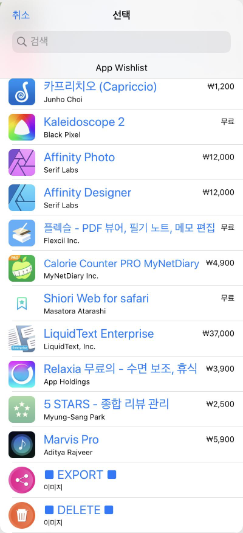
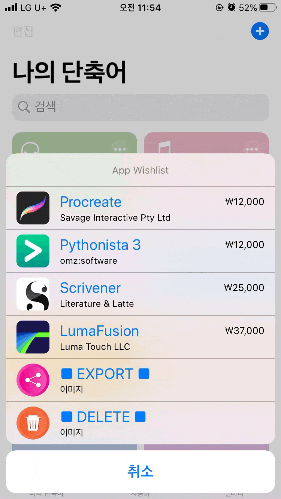
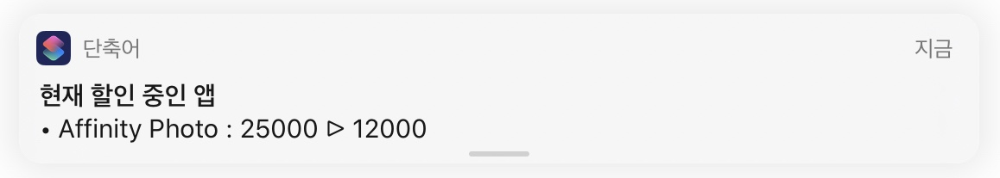
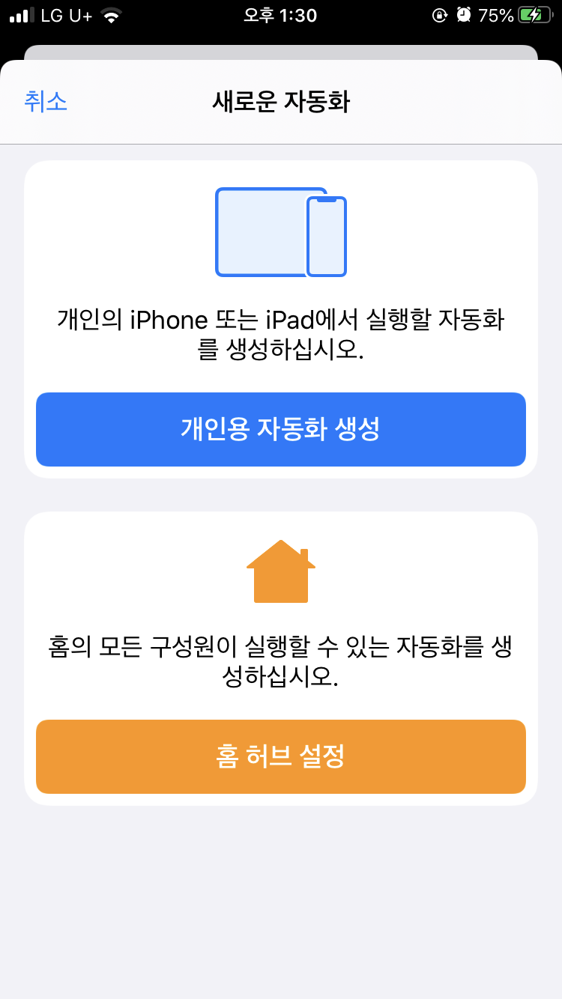
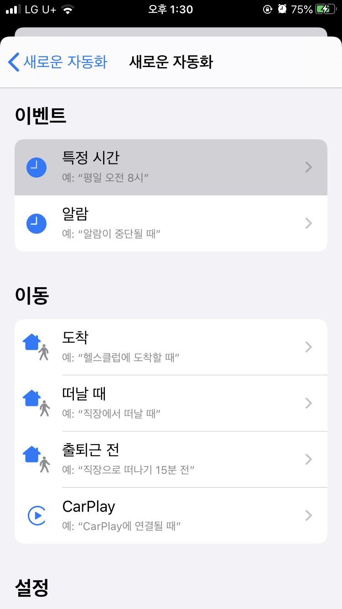
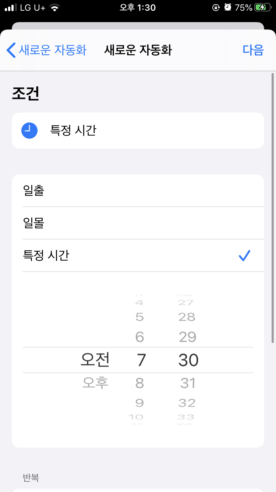
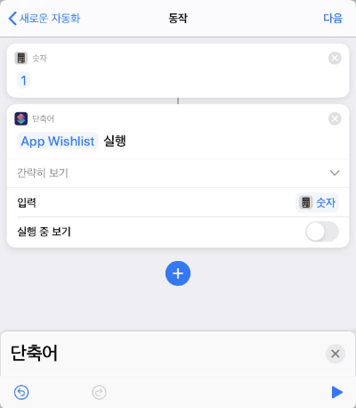
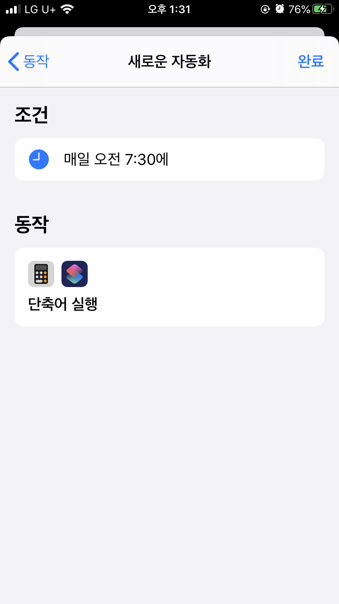

## 서론

안녕하세요.

Apple App Store에는 언제부터인가 위시 리스트 기능이 사라졌습니다.

사고 싶은 앱이 있다면 Wishlist에 담아두지 말고 바로바로 사라는 애플의 뜻일까요?

당장 필요하지는 않지만 언젠가 유용하게 써먹을 수 있을만한 앱을 발견했다던가, 할인할 때 구매하고 싶다는 이유 등 위시 리스트가 필요한 경우는 생각보다 많습니다.

## 단축어를 이용한 앱 위시리스트

iOS의 단축어를 이용하면 이 위시 리스트 기능을 간략하게나마 구현할 수 있습니다.

먼저, 이 단축어는 coldpza님께서 공유해주신 앱바구니 단축어를 제가 직접 수정하고 개량한 것임을 밝힙니다. 기반이 된 단축어 출처는 <https://coldpza.tistory.com/14> 입니다.

[앱스토어 위시리스트 (업데이트 18.12.07.)

업데이트 알림 18.11.02. - 위시리스트 로딩 속도 향상, 삭제 메뉴 아이콘 표시 18.12.07. - 최초 실행 시 휴지통 이미지를 등록하지 않아도 작동하도록 수정 언제부터인가 앱스토어에 위시리스트 기능이 없어졌..

coldpza.tistory.com](https://coldpza.tistory.com/14)

단축어 링크는 이 글의 가장 아래에 있습니다. 중요 사용법을 먼저 익히신 다음 단축어를 추가해주세요.

## 사용방법 안내

App Wishlist

사용방법은 간단합니다.

앱스토어에서 위시 리스트에 넣고자 하는 앱에 들어가신 다음, 공유 버튼을 누르고 App Wishlist 단축어를 실행해주세요.

Wishlist에 앱 추가하기

위 gif 이미지처럼 자동으로 Wishlist에 앱을 추가합니다.

위시 리스트에 담긴 앱 목록을 확인하는 방법도 간단합니다.

단축어 어플에서 App Wishlist를 실행해주기만 하면 됩니다.

Wishlist에 담긴 앱 확인하기

목록에서 앱을 터치하면 위 스크린샷처럼 앱스토어로 이동합니다.

DELETE 버튼과 EXPORT 버튼은 각각 아래와 같이 동작합니다. 위시리스트의 앱을 삭제할 수 있고, 전체 목록을 클립보드로 복사할 수도 있지요.

App Wishlist에서 앱 삭제하기

App Wishlist에서 앱 목록 내보내기

이렇게 해서 App Wishlist 단축어의 대략적인 설명이 끝났습니다.

## 매일 할인하는 앱 알림 받기

이 단축어는 위시 리스트에 앱을 추가할 당시의 앱 가격도 기록해둡니다. 그래서 앱이 할인 중이라면 단축어가 실행될 때 알림도 함께 띄워줍니다.

그러나 별다른 설정이 없다면 단축어를 실행했을 때만 할인 알림이 뜨는데요.

그러므로 할인 중인 앱을 추적하기 위해서는 단축어의 자동화 기능을 이용하여 이 단축어를 일정 주기마다(매일) 실행시켜줘야 합니다.

매일 매일 위시리스트에 담긴 앱의 할인 정보를 받아보기 위해서는 이 설정이 필수적이니 잘 따라와주세요.

1. 단축어 앱의 자동화 탭에 들어간 다음, 새로운 자동화를 만들어주세요.

App Wishlist - 자동화 - 1

개인용 자동화 생성을 터치해줍시다.

2. 단축어가 실행될 조건을 설정하는 메뉴입니다. 특정 시간을 눌러 매일 어떤 시간에 App Wishlist 단축어가 실행되도록 해봅시다. 알람을 선택한다음 일어날 때 알람을 지정하셔도 좋습니다.

App Wishlist - 자동화 - 2

App Wishlist - 자동화 - 3

3. 동작 부분에서 추가해줘야 하는 액션은 두 개 입니다.

"앱 및 동작 검색" 에서 숫자를 검색하신다음 끌어옵니다. 숫자에는 아무거나 입력하셔도 상관 없지만 무슨 숫자를 입력해야 할지 모르시겠다면 1을 입력하세요.

그다음 단축어 실행도 찾으셔서 끌어오시면 아래 스크린샷처럼 나옵니다.

단축어 실행의 '입력' 부분에 숫자가 들어가야 합니다.

4. 새로운 자동화를 추가하시면 완료입니다.

App Wishlist - 자동화 - 5

그러면 매일 특정 시간에 App Wishlist 단축어가 조용히 실행되면서 가격 할인 중인 앱이 있을 경우 알림을 띄워줄 것입니다.

## 단축어 다운로드

App Wishlist 단축어는 아래 링크를 통해 받으실 수 있습니다.

2020.12.02 : <https://www.icloud.com/shortcuts/e9060f6b6ec14556b2183b4cd4b3a3d4>

-2020.05.02 PM 5:39 링크 수정

-2020.05.30 PM 1:51 링크 수정

-2020.06.06 PM 2:44 링크 수정 (noname09님 피드백 반영 - items-apps://)

-2020.06.07 PM 7:58 링크 수정 (Jeno님 피드백 반영 - 애플 아케이드 게임, 사전예약 앱 등 가격 정보가 없는 앱의 삭제가 정상적으로 이루어지지 않는 오류 수정)

-2020.06.19 AM 12:18 링크 수정 (한국 앱스토어에 없는 앱일경우 미국 앱스토어를 검색하도록 설정)

-[2020.11.29 PM 11:20 링크 수정](https://www.icloud.com/shortcuts/a4b6e2f5374e4dc58ea10ae10aef1a89)

-2020.12.02 PM 5:22 링크 수정 (iPad OS에서 앱이 위시리스트에 들어가지 않는 문제 수정: 단축어 공유 시트 유형을 App Store 앱에서 App Store 앱 + URL으로 URL을 추가해줍니다.)

얼마든지 링크 공유하셔도 좋습니다. 따로 허락을 받으시지 않으셔도 됩니다.

감사합니다.
