해외 직구를 한 이후, 언제쯤 물건이 통관될지 기대가 되는데요.

관세청 유니패스 홈페이지에서는 개인통관고유부호를 통해 자신의 통관 부호로 통관되는 물건의 현 상황을 조회할 수 있습니다.

유니패스 사이트에서 통관 정보를 조회하기 위해서는 공인인증서가 필요합니다.

즉 공인인증서로 본인 인증을 해야 하므로 귀찮은 pc를 사용할 수 밖에 없지요..

관세청 모바일 앱을 다운받아 살펴봤지만 관련 메뉴가 존재하지 않더라고요. 검색해보니 어느순간 모바일 유니패스 사이트가 삭제된 듯 합니다..

따라서 모바일 기기에서 통관 상황을 알아보기 힘들어졌습니다.

공인인증서가 필요하니까요...

그런데 인증서 클라우드 서비스를 이용하면 아이패드에서도 공인 인증서를 불러올 수 있습니다.

바로 브라우저 인증서를 이용한 방법입니다.

거두절미하고 어떻게 하는지 설명드리겠습니다.

아이패드에서 작동을 확인하였습니다. 아이폰도 가능합니다.

## 금융결제원 클라우드에 공인인증서 저장하기

금융결제원의 클라우드 인증서를 이용하기 위해서는 먼저 pc에서 인증서를 클라우드에 저장해야 합니다.

PC 작업에서는 금융결제원 클라우드에 자신의 공인인증서를 저장하는 방법을 서술해보겠습니다.

관세청 홈페이지로 접속해봅시다.

<https://www.customs.go.kr/kcs/main.do>

[관세청 - 선진무역강국을 실현하는 World Best 관세청!

수리일 기준(백만불, %(전년동기대비)) 당월(5.1 - 5. 31) 수출 34,856 -23.7 수입 34,420 -21.1 연간(1.1-5.31) 수출 201,774 -11.2 수입 194,414 -8.5 조업일수[(’19) 23일,(’20) 21.5일] 통관실적 더보기

[www.customs.go.kr](https://www.customs.go.kr/kcs/main.do)

이후 주요 서비스에서 "해외직구 여기로"으로 접속해주세요.

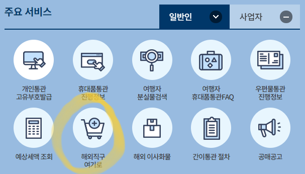

그러면 아래와 같은 화면이 나옵니다.

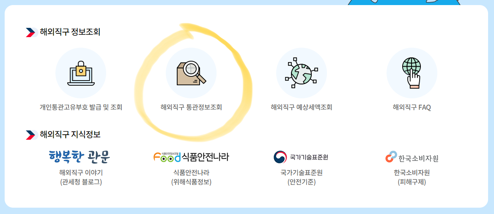

"해외직구 통관정보 조회"를 들어가주세요.

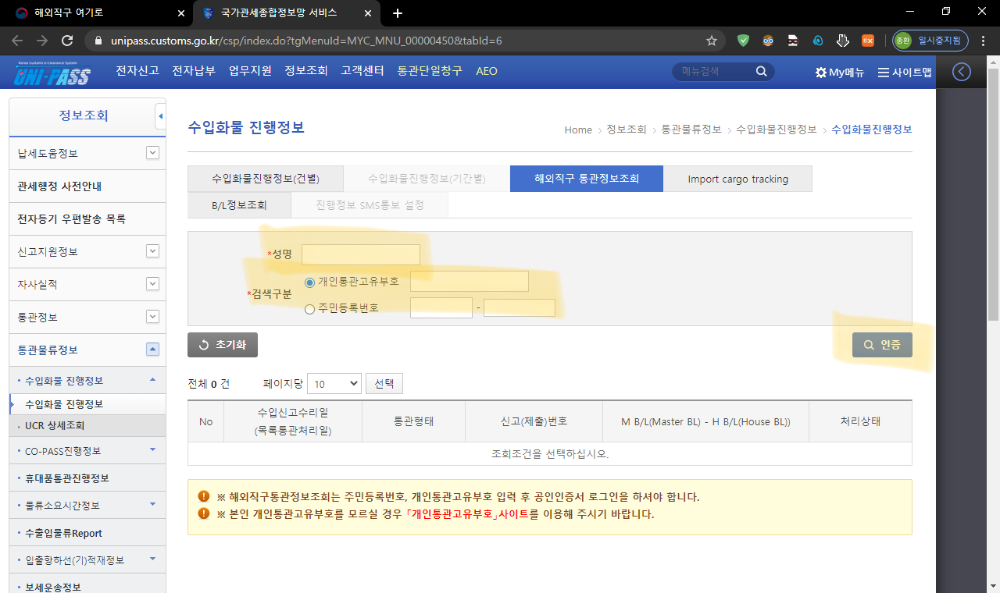

Uni-Pass 사이트로 들어왔습니다.

해외직구 통관정보 조회에서 자신의 이름과 통관고유부호(혹은 주민번호)를 입력하고 인증 버튼을 클릭합니다.

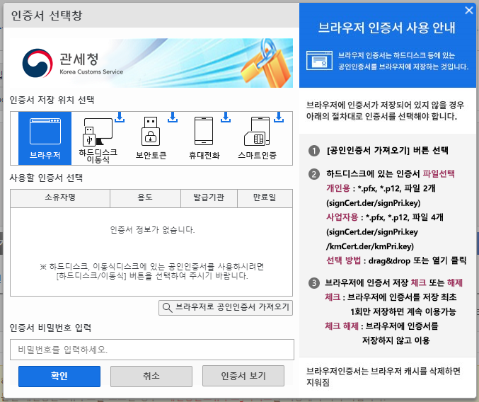

이렇게 인증서 선택창이 뜹니다.

그리고 구석에 아래 사진과 같은 창이 나타날겁니다.

조금 있다가 클라우드 서비스에 연결한 다음, 위의 "브라우저로 공인인증서 가져오기"를 클릭할 예정입니다.

일단은 아래 스크린샷을 확인해주세요.

인증서 클라우드 연결하기.

이를 클릭해줍시다.

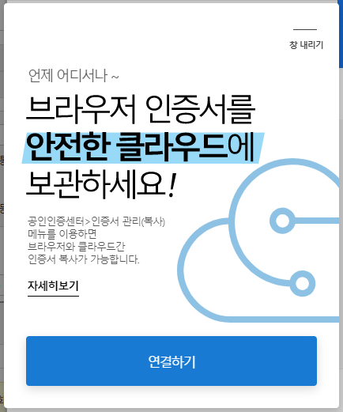

그러면 위 스크린샷처럼 브라우저 인증서를 클라우드에 저장할 수 있다는 안내 문구가 나옵니다.

연결하기를 클릭합시다.

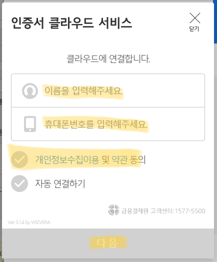

본인의 이름과 전화번호를 입력합니다.

개인정보수집이용 및 약관 동의를 체크하고 "다음"을 클릭하면 아래 스크린샷처럼 인증서 클라우드 서비스에 연결중이라는 알림이 나타납니다.

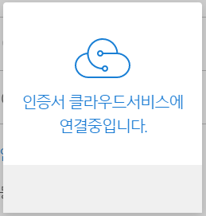

잠시 기다리면 아래 스크린샷처럼 휴대폰 인증 화면이 뜨는데요.

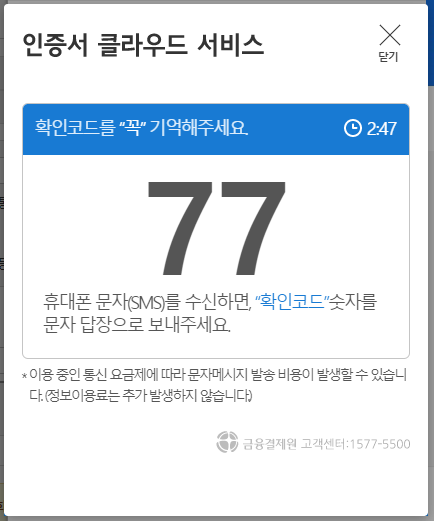

이 확인코드 숫자를 기억하고 있다가, 입력한 휴대전화번호로 문자가 오면 답장해줍시다.

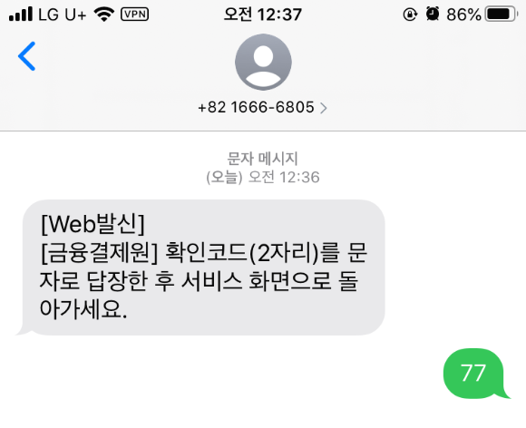

이렇게 위의 스크린샷처럼 숫자만 답장해주면 인증서 클라우드 서비스가 연결됩니다.

이렇게 파란색으로 변하며 연결되었다고 뜨면 성공입니다.

PC에 저장된 인증서를 클라우드로 전송해야 합니다.

브라우저 인증서 가져오기와 동시에 금융결제원 클라우드에 인증서를 저장할 수 있습니다.

이제 "브라우저로 인증서 가져오기"를 눌러주세요.

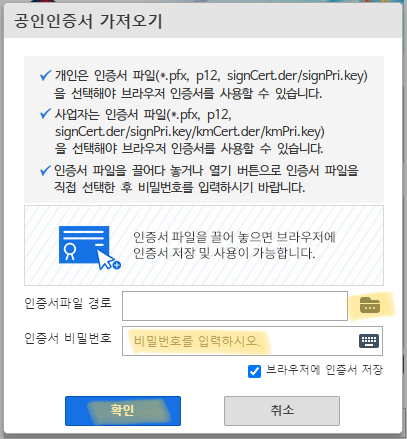

여기서 인증서 파일 경로를 클릭하여 파일을 불러와줍시다.

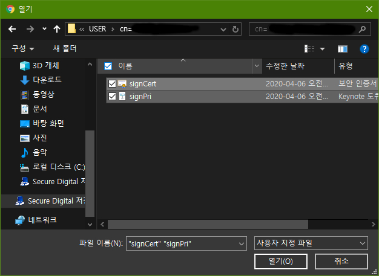

공인인증서 파일을 찾아서 signCert, signPri 두 개 모두를 동시에 불러오면 됩니다.

인증서 암호까지 입력하면 클라우드에 저장할거냐는 물음이 뜹니다.

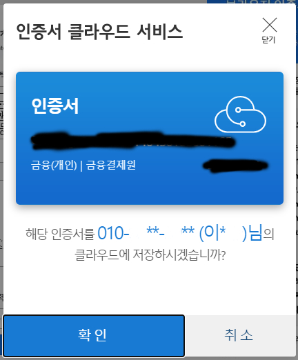

여기서 "확인"을 누르면 클라우드에 저장됩니다.

그러면 PC에서 할 작업은 끝납니다.

## 아이패드에서 인증서 불러오기

먼저 설정 앱 - Safari - 팝업 차단을 off 해줍시다.

이제 똑같은 사이트를 아이패드(혹은 아이폰) 사파리로 접속해주세요.

관세청 홈페이지 - 해외 직구 여기로 - 해외직구 통관정보 조회.

그 다음 사파리에서 데스크탑 웹 사이트 요청을 켜줘야 합니다.

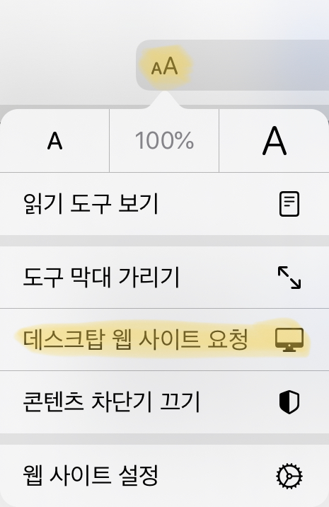

이후 이름과 통관부호(주민번호)를 입력해줍시다. PC와 똑같습니다.

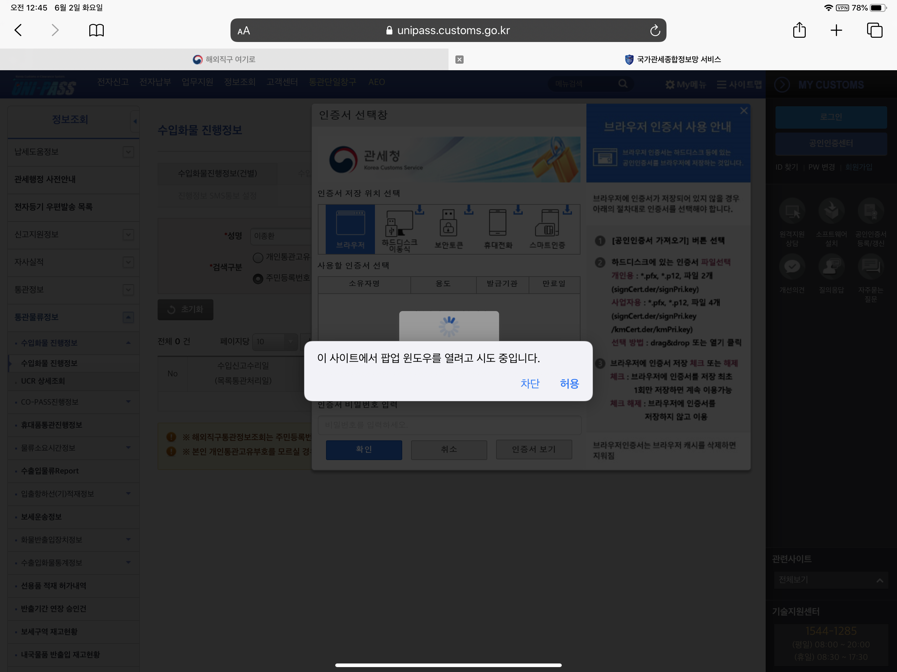

팝업창이 뜬다는 알림에 "허용"해줍니다.

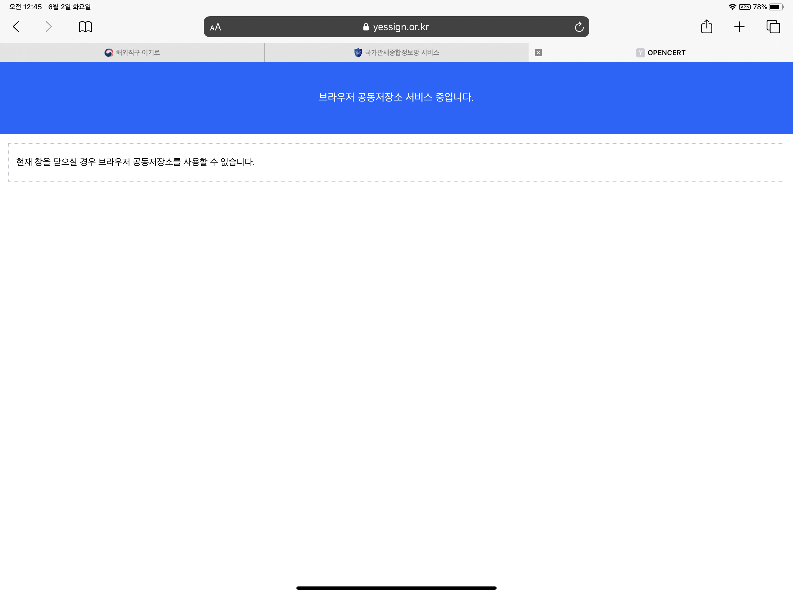

이런 창이 팝업으로 뜨는데요.

여기서 할 건 없고, 다시 유니패스 사이트로 돌아오면 됩니다.

이제 PC처럼 똑같이 "인증서 클라우드 연결하기"가 뜰겁니다.

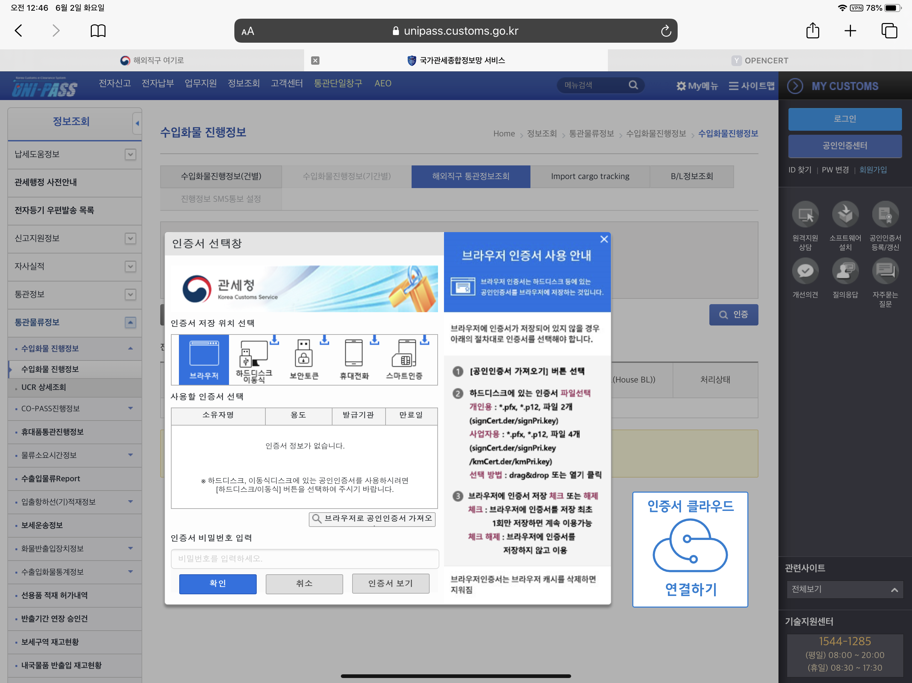

아까 PC에서 한 것처럼 "인증서 클라우드 연결하기"를 터치해줍시다.

본인 인증을 다시 반복하시면 클라우드 연결을 할 수 있습니다.

아이패드에서 클라우드에 연결하는 부분은 PC와 똑같으므로 생략합니다.

클라우드가 연결되면 아이패드 사파리에서 인증서를 불러올 수 있습니다.

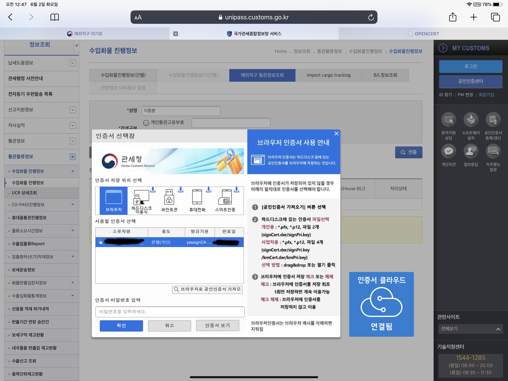

이제 인증서 비밀번호를 입력하세요.

가상 키패드입니다.

그러면 공인인증이 완료됩니다.

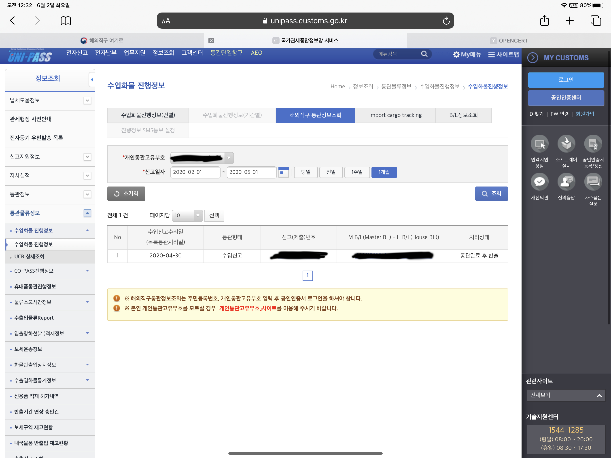

위 스크린샷은 올해 4월달에 통관된 내용을 아이패드에서 확인한 모습입니다.

이러면 통관 정보를 확인하기 위해 PC를 켤 필요가 없어집니다.

감사합니다.
