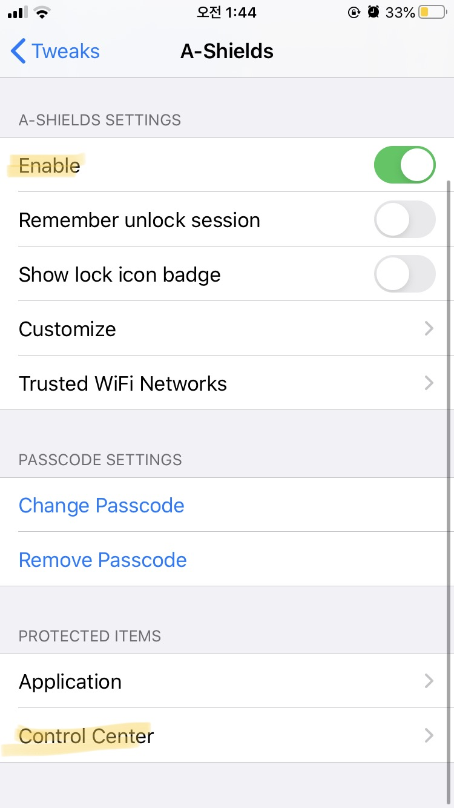
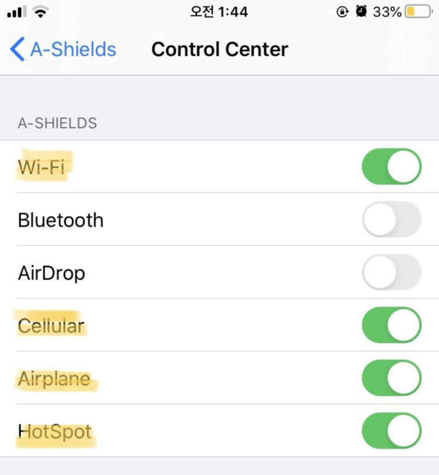
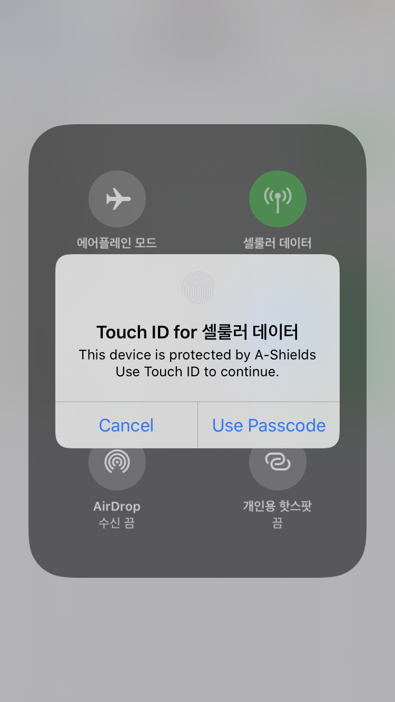
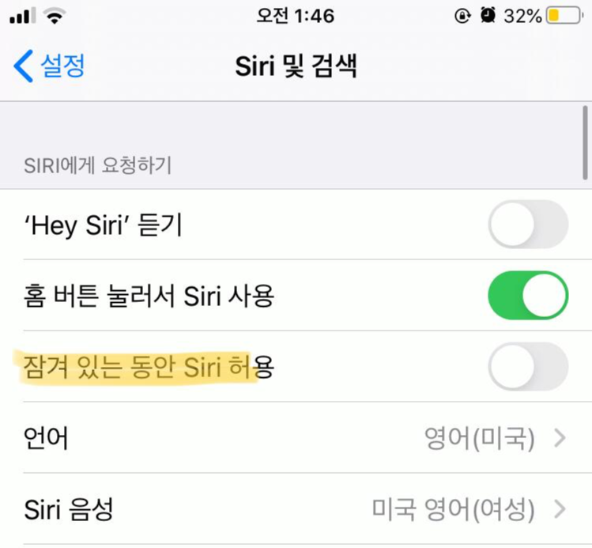
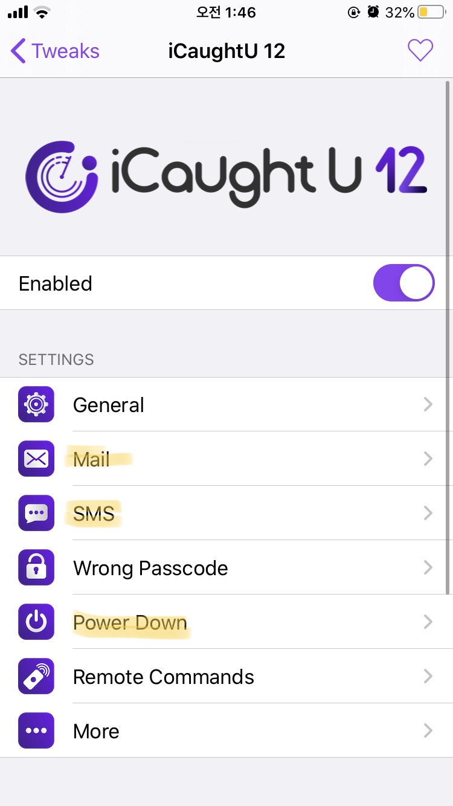
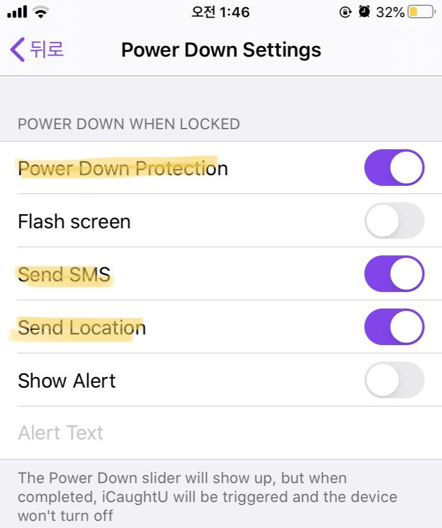
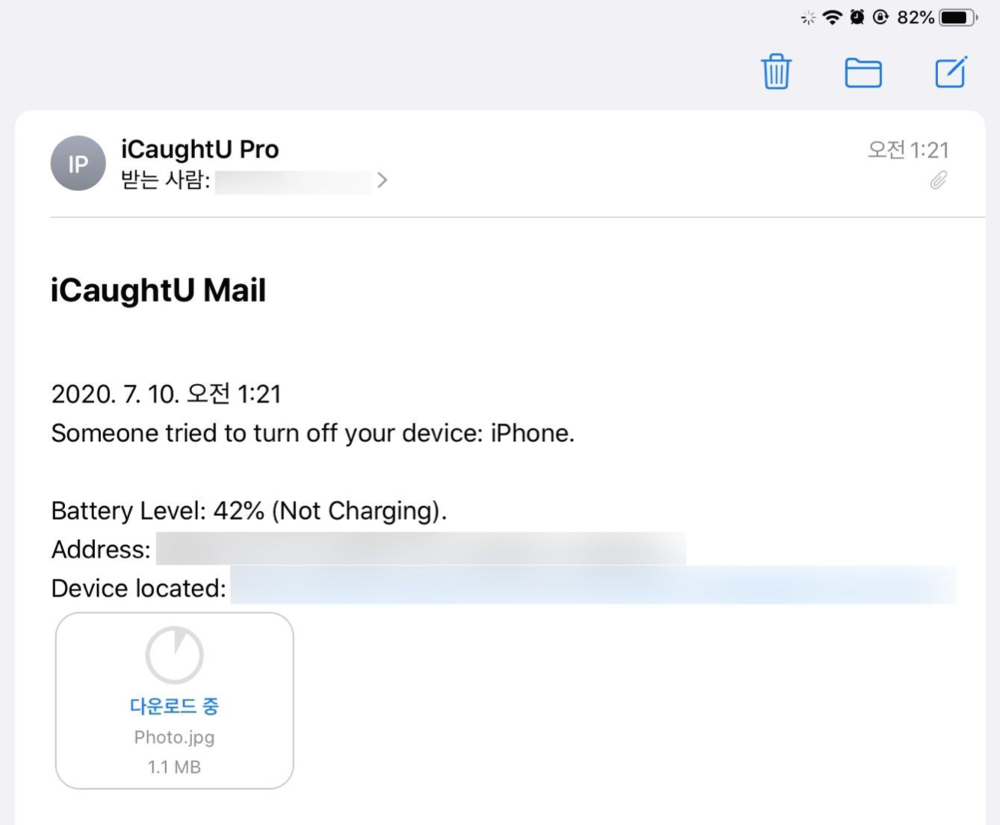
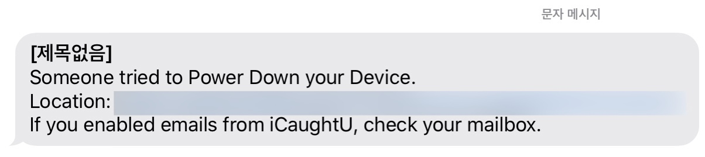

이 글에서 다루는 내용은 탈옥된 아이폰만 적용 가능한 방법입니다.

만약 탈옥이 무엇인지 모르신다면 이 글의 내용을 적용할 수 없습니다.

필자의 테스트 기기는 아이폰7 13.5, unc0ver입니다.

## 서론.

아무리 주의를 기울여도 순간의 실수나 부주의로 스마트폰을 분실할 가능성은 항상 존재합니다.

필자 또한 설마 항상 갖고 다니는 스마트폰을 분실하겠냐는 생각을 갖고 있었습니다.

그러나 분실은 예상치 못하게 누구에게나 다가오나봅니다.

필자는 최근 버스에서 아이폰을 분실하였는데, 자리에서 일어나면서 바지 주머니에 들어있던 스마트폰이 스르륵 저도 모르게 빠진 것이 원인이었습니다.

다행히 차고지에서 아이폰을 되찾을 수 있었지만, 다시 스마트폰을 되찾기까지의 몇 시간이 너무 길게 느껴졌습니다.

애플은 나의 아이폰 찾기 기능을 통해 아이클라우드에 접속하여 기기를 원격에서 확인할 수 있는 기능을 이미 만들어두었습니다.

이 기능은 기본적으로 활성화되어 있으며, 다음과 같은 동작을 지원합니다.

- 사운드 재생

- 분실 활성화

- 위치 추적 및 기기가 있는 위치로 네비 안내

그러나 국내의 애플 사용자는 마지막 위치 추적 기능을 사용할 수 없다는 단점이 있습니다.

## Find My를 사용하지 못할 수 있다.

서론이 길었습니다.

이 글에서 살펴볼 내용은 Find My 기능을 보안하는 트윅 두 개 입니다.

내 아이폰 찾기 기능은 기본적으로 분실 상태라는 것을 전제로 합니다.

즉, 사용자의 손에 기기가 없다는 것이지요.

누군가 아이폰을 습득했다고 가정해봅시다.

그리고 습득자가 선량한 이라는 보장은 전혀 할 수 없습니다.

악의적인 습득자가 할 수 있는 방법은 여러 가지가 있는데, 바로 다음과 같습니다.

1. 데이터와 와이파이를 끈다.

2. 비행기모드를 활성화한다.

3. 기기의 전원을 끈다.

습득자가 이러한 세 단계를 거칠 경우, 아무리 Find My 기능을 사용하려 해도 속수무책입니다.

일단 분실된 기기가 인터넷에 연결되어 있어야 분실 기능을 활성화할 수라도 있지요.

## 악의적 습득자의 기기 조작을 방지하기.

이 글에서 소개하는 두 개의 탈옥 트윅을 이용하면, 위에서 언급한 3개의 행동을 막을 수 있습니다.

바로 다음 트윅입니다.

1. A-Shields (무료) : <https://repo.co.kr/>

2. iCaughtU ($2.5) : <https://www.icaughtuapp.com/repo/>

A-Shields 트윅은 무료 트윅이지만, iCaughtU 트윅은 2.5 달러입니다. 대략 3,000원 정도의 가격입니다.

이 두 개의 트윅이 하는 역할은 다음과 같습니다.

A-Shields 트윅은 1, 2를 담당합니다. 즉, 제어센터에서 데이터와 와이파이를 off하거나, 비행기 모드를 on하는 것을 막습니다.

iCaughtU 트윅은 3을 담당합니다. 즉, 습득자가 기기의 전원을 끄는 것을 막고, 전원 종료 시도시 전면 카메라로 모습을 찰영하여 현재 기기의 위치와 함께 메일/문자로 통지합니다.

이렇게 되면 기기를 강제 재부팅하여 탈옥을 풀어버리거나, DFU 모드 진입 시도를 하지 않는 이상 배터리가 꺼질 때까지 기기를 추적할 수 있습니다.

이 방법이 100% 통하지는 않습니다.

기기를 물리적으로 분실/탈취당했다는 것은 100% 보안을 장담할 수 없다는 뜻과도 같기 때문입니다.

습득자가 DFU로 진입하는 등의 기기 전원을 강제로 꺼서 탈옥을 풀어버리거나 초기화를 해버리면 사실상 방법은 없습니다.

그래도 없는 것보다는 좋으니까요.

## A-Shields 설정

트윅을 설치한 다음, 다음과 같이 설정합니다.

트윅을 활성화 하시고, 맨 아래 Control Center에 들어갑니다.

기본적으로 Wi-Fi, Cellular, Airplane, 세 개를 활성화해줍니다.

그러면 제어센터에서 설정을 변경할 때마다 아래 스크린샷처럼 인증을 해야 합니다.

이러면 습득자는 함부로 기기의 데이터를 차단할 수 없습니다.

다만 이 트윅을 통해 시리를 사용하여 데이터를 끄는 것을 막을 수는 없습니다.

\

따라서 아이폰이 잠긴 상태에서 시리를 부르는 것을 막아야만 합니다.

잠겨있는 동안 Siri 허용을 off 해주세요.</p

## iCaughtU 설정

트윅을 설치한 다음 들어가시면 구매하는 버튼이 나옵니다.

페이팔을 통해서 2.5 달러를 결제하시면 정상 사용 가능합니다.

아래 스크린샷을 봐주세요.

iCaught 메인 화면에서, Mail과 SMS 메뉴에 들어가신 다음, 자신의 메일 주소와 번호를 입력합니다.

이후 Power Down 메뉴에 들어갑니다.

맨 위의 Power Down Protection을 활성화하시면 기기 전원을 끄는 것을 막을 수 있습니다.

만약 누군가 기기 전원을 끄게 되면 다음과 같이 메일이나 sms가 날라옵니다.

이상으로 아이폰을 분실하였을 때를 대비한 트윅을 알아보았습니다.
