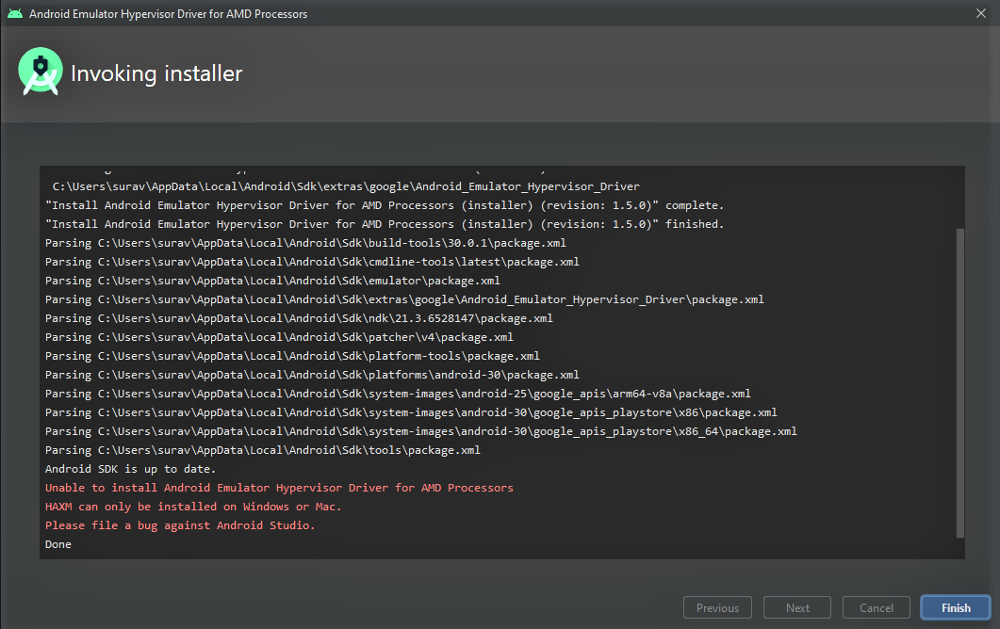
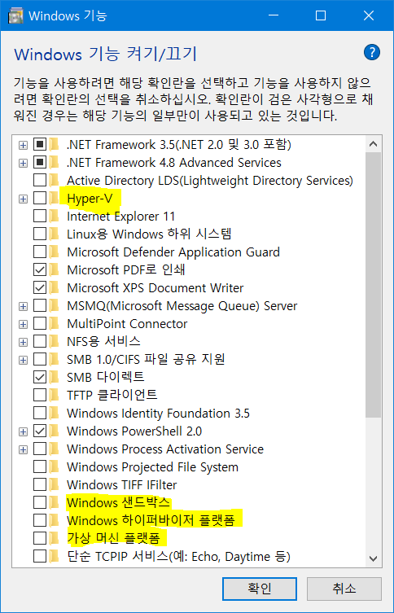
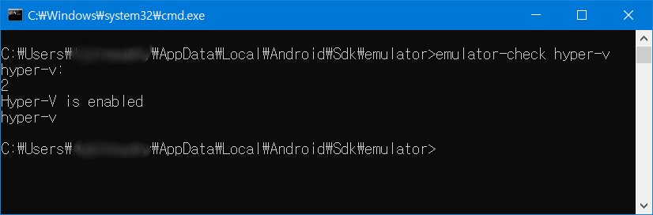
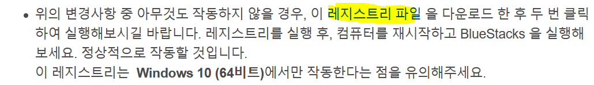
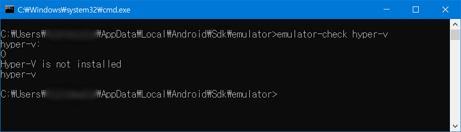

## 서론

AMD 컴퓨터에서 Android Emulator를 돌리려고 했다.

그런데 Android Emulator Hypervisor Driver for AMD Processors를 설치하려고 하면 다음과 같은 오류 메세지가 발생하였다.

필자는 이 오류 화면을 캡쳐하는 것을 까먹고 있어서 위 스크린샷은 아래 사이트에서 퍼왔다.

이미지 출처 : <https://stackoverflow.com/questions/63218262/unable-to-install-android-emulator-hypervisor-driver-for-amd-processor>

## Hyper-V 등을 비활성화 하라는 구글 신의 답변

구글에 쳐보니 Hyper-V 기능을 끄면 된다고 하였다.

Windows 기능 켜기/끄기에서 다음과 같은 항목을 끄라는 답변을 얻었다.

Hyper-V

Windows 샌드박스

Windows 하이퍼바이저 플랫폼

가상 머신 플랫폼

구글에서 얻은 해결책을 합집합하면 위에서 언급한 네가지 항목을 끈 다음 재부팅하고 다시 시도하라는 결론을 얻는다.

그러나 필자는 분명 저 네 개를 껏음에도 계속 오류가 발생하였다.

다음과 같은 오류가 발생하며 자꾸 설치가 되지 않는 것이다.

[SC] ControlService 실패 1062:

서비스가 시작되지 않았습니다.

[SC] DeleteService 성공

[SC] 4294967201 오류가 발생하여 StartService이(가) 실패했습니다.

Android Emulator Hypervisor Driver for AMD Processors installation failed. To install Android Emulator Hypervisor Driver for AMD Processors follow the instructions found at: https://github.com/google/android-emulator-hypervisor-driver-for-amd-processors

Done

혹시나 싶어서 VMWare나 투몬 SE같은 가상화를 이용하는 프로그램까지 모두 지워봤지만 역시 해결되지 않았다.

## emulator-check.exe로 hyper-v 확인하기

안드로이드 SDK 안에는 emulator-check 라는 툴이 있어서 hyper-v 여부를 확인할 수 있다고 한다.

(SDK 설치 위치)\emulator 폴더 안의 emulator-check.exe를 통해 hyper-v 여부를 확인해볼 수 있다.

설치 위치를 변경하지 않았다면 대부분 C:\Users\(사용자이름)\AppData\Local\Android\Sdk\emulator 일 것이다.

cmd로 저 폴더에 이동한 다음, 아래 명령어를 입력한다.

emulator-check hyper-v

그랬더니 hyper-v가 설치되어 있다고 나왔다...;;

분명히 Windows 기능 켜기/끄기에서 체크 박스를 해제했는데도 emulator-check에는 hyper-v가 활성화되어 있다고 나온 것이다.

## 해결책

윈도우를 포멧하고 다시 깔아야 하나 싶던 도중, 해결책은 생각치 못한 곳에서 나왔다.

[https://support.bluestacks.com/hc/ko/articles/115004254383-Hyper-V-기능을-사용하지-않으려면-어떻게-설정해야-합니까-](https://support.bluestacks.com/hc/ko/articles/115004254383-Hyper-V-%EA%B8%B0%EB%8A%A5%EC%9D%84-%EC%82%AC%EC%9A%A9%ED%95%98%EC%A7%80-%EC%95%8A%EC%9C%BC%EB%A0%A4%EB%A9%B4-%EC%96%B4%EB%96%BB%EA%B2%8C-%EC%84%A4%EC%A0%95%ED%95%B4%EC%95%BC-%ED%95%A9%EB%8B%88%EA%B9%8C-)

이 페이지의 마지막 문단에는 위 스크린샷과 같은 문장이 적혀 있었다.

필자는 "[이 레지스트리 파일](http://cdn3.bluestacks.com/nilanshu/hyper_v.reg)"을 다운로드 한 다음, 관리자 권한으로 실행한 뒤 재부팅하였다.

그러니 emulator-check에서도 Hyper-V is not installed라고 나왔으며, 정상적으로 sdk가 설치되었다.

필자와 같은 오류 때문에 골머리를 썩을 분들을 위해 기록을 남긴다.

저 페이지가 없어질 경우를 대비하여 파일을 첨부하겠다.

[hyper\_v.zip](https://github.com/itmir913/archive/releases/download/itmir-attachments/hyper_v.zip)

추후 티스토리나 카카오에서 악성코드라고 오인하여 파일이 내려갈 가능성을 대비하기 위해 암호를 1234로 걸었다.

파일이 이상할까 걱정되는 분은 아래 더보기를 누른 다음 텍스트를 메모장에 붙여넣은 다음, hyper\_v.reg로 저장하면 된다.

Windows Registry Editor Version 5.00

[HKEY\_LOCAL\_MACHINE\SYSTEM\CurrentControlSet\Control\DeviceGuard]

"RequireMicrosoftSignedBootChain"=dword:00000000

[HKEY\_LOCAL\_MACHINE\SYSTEM\CurrentControlSet\Control\DeviceGuard\Scenarios]

[HKEY\_LOCAL\_MACHINE\SYSTEM\CurrentControlSet\Control\DeviceGuard\Scenarios\HypervisorEnforcedCodeIntegrity]

"WasEnabledBy"=dword:00000000

"Enabled"=dword:00000000

이렇게 오류 해결 기록을 마친다.