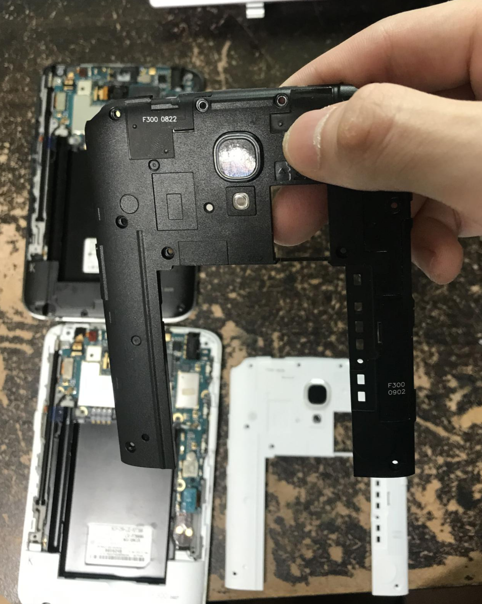
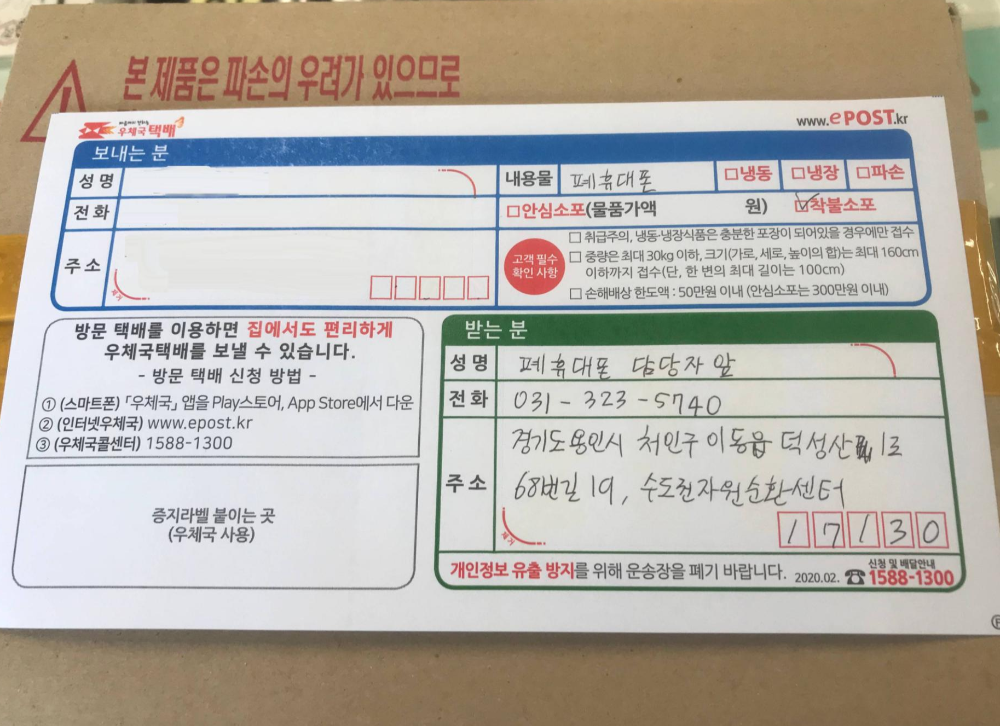
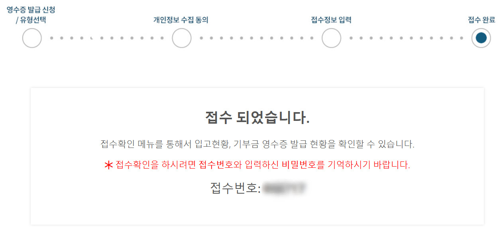

## 서론

필자가 과거에 사용했던 아이폰 5s는 중고로 처분하였지만, 필자와 필자의 가족이 오래전에 사용했던 구형 안드로이드 스마트폰은 중고로 판매하지 않았었습니다.

그 이유는 별 다를 게 없었는데, 중고로 팔아야지~ 생각만 했다가 까맣게 잊어버린 탓이 가장 큰 것 같아요.

그래서 적게는 5년 전에 쓰던 구형 안드로이드 스마트폰이 계속 자리를 차지하고 있었습니다.

오늘, 책상을 정리하면서 계속 자리만 차지하고 있던 구형 스마트폰을 폐기하기로 결정했습니다.

일일히 전원을 켜서 초기화를 해준 다음, 배터리를 분리하여 버릴 준비를 마쳤습니다.

갤럭시 넥서스, 갤럭시 S3 3G, kt 에그, 넥서스s, 노키아 710, LG 뷰3 2개

위의 스마트폰을 사용했었을 때의 안드로이드 버전이 진저브레드~킷캣 부근이었으니 생각보다 엄청 오래된 것 같습니다.

배터리도 전부 분리하여 사진을 찍어봤습니다. 어떤 배터리는 외관에 흠집이 나서 불안하더라고요.

대부분 조금씩 부풀어서 빨리 폐기해야 할 듯 싶습니다.

## 뷰3 뒷면 교체

그리고 예전에 저와 엄마, 제 동생 3명이 모두 뷰3를 사용했었는데요.

한 기기는 액정이 부셔졌고, 다른 한 기기는 카메라 외관에 엄청난 흠집이 나있었습니다.

그래서 액정이 멀쩡한 기기에다가 카메라만 옮기고 싶었는데요.

오늘 기기 버리기 전에 한 번 뒷면을 뜯어봤습니다. 망가지면 버려야지라고 생각하니 별로 어렵지 않았고, 실제로 분리 난이도도 없는 것과 마찬가지더라고요.

카메라에 난 흠집은 저 뒷판 플라스틱에 난 기스였던 것 같습니다.

카메라 센서 자체에 기스가 난 건 아니었나봐요.

카메라 센서를 뜯어서 옮겨야 할거라고 생각했었는데, 그냥 저 뒷판만 바꿔끼면 되는 간단한 문제였습니다... 이걸 왜 지금까지 몰랐을까.

아무튼 이렇게 뷰3 기기 하나만 남겨두고 나머지는 다 버려야겠습니다.

남은 하나도 사실 쓸데가 별로 없긴 하네요...  
  
  
스마트폰 박스도 수두룩하게 나왔는데, 이것 중에 쓸만한건 자잘한 물건을 담는 상자로 써먹을 생각입니다.

## 결론

이렇게 오늘 있었던 일을 간단하게 정리해봤습니다.

전 지난 며칠간 과거에 쓴 글의 오타를 잡거나 각종 정보를 업데이트 하는 등 블로그 정리를 하였는데요. 정리를 하면서 오래전에 쓴 글을 읽어보았습니다.

거기에다가 이렇게 예전에 쓰던 안드로이드 스마트폰까지 정리하니 감회가 새롭습니다.

## 폐 휴대폰 처리 방법

이렇게 쌓인 폐 휴대폰은 <https://나눔폰.kr/notice/show/15> 사이트를 참고하여 버릴 생각입니다.

정부의 폐휴대폰 수거 사이트에 안내되어 있는 것처럼 착불로 폐휴대폰을 보냈습니다.

이제 저 휴대폰들은 과거 속으로 사라졌네요..

추가로 기부 영수증까지 신청했습니다.

얼마나 기부될지는 모르겠지만 기부에 의의를 둘 수도 있겠네요.
