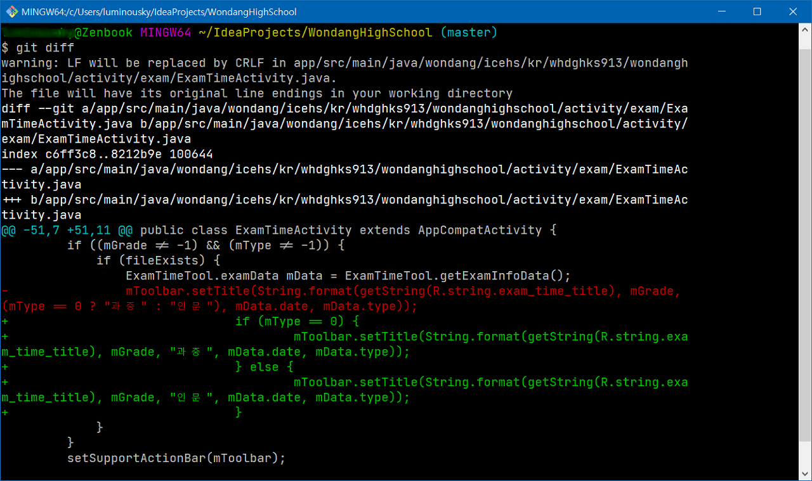
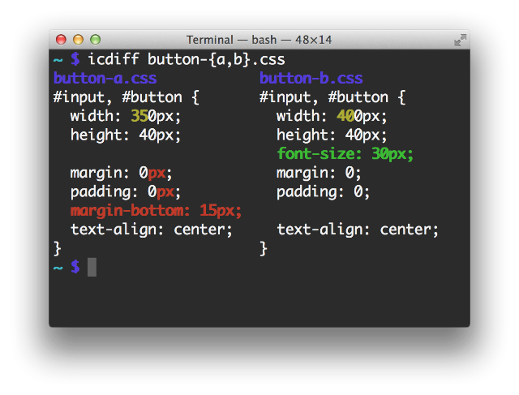
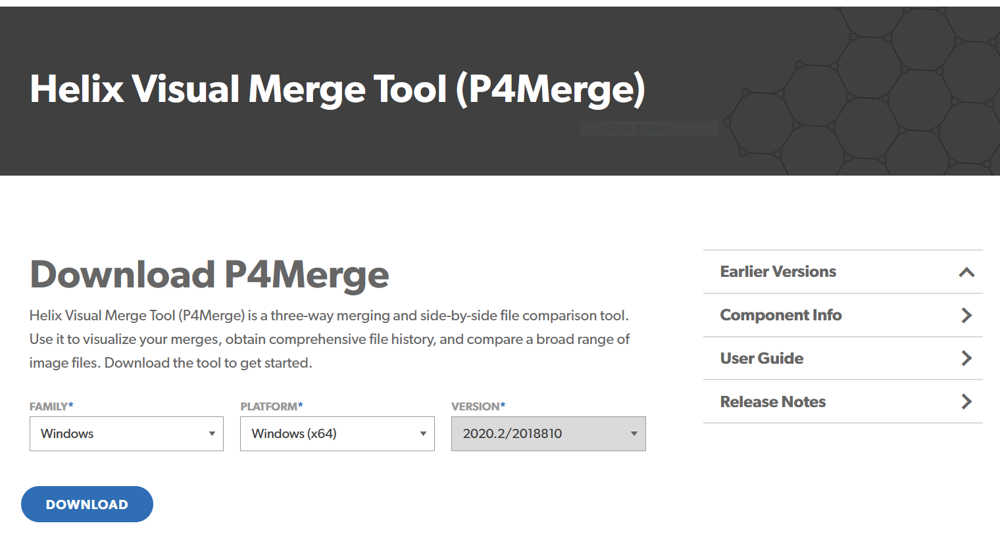
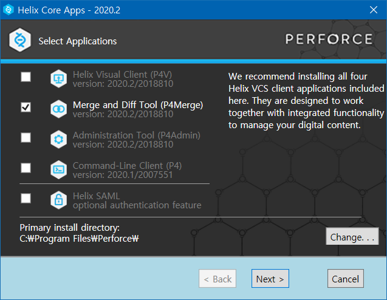
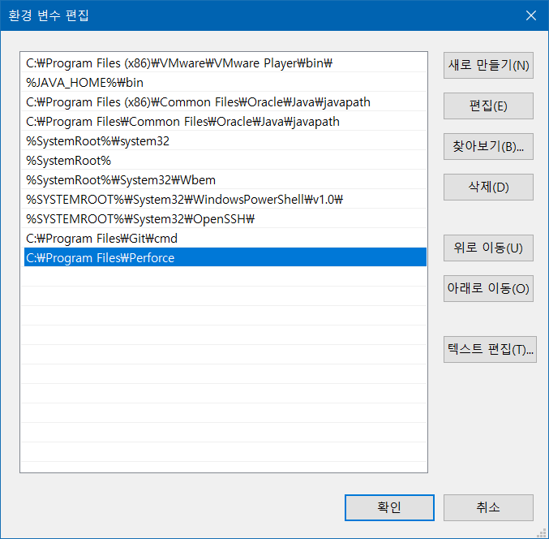
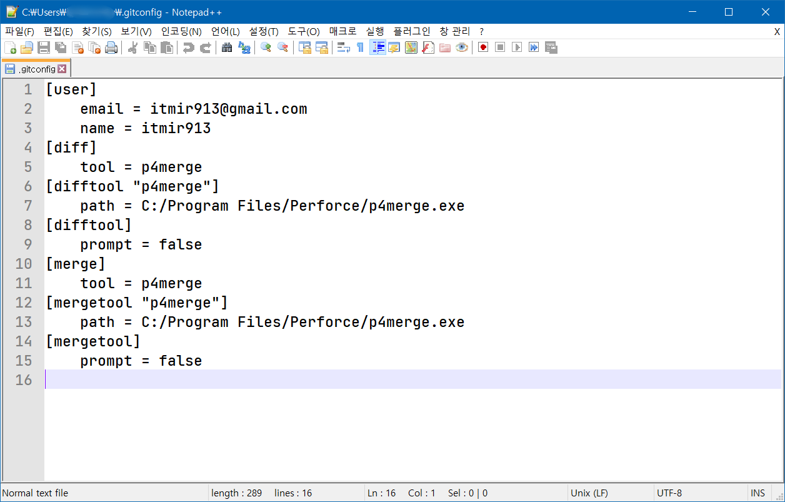
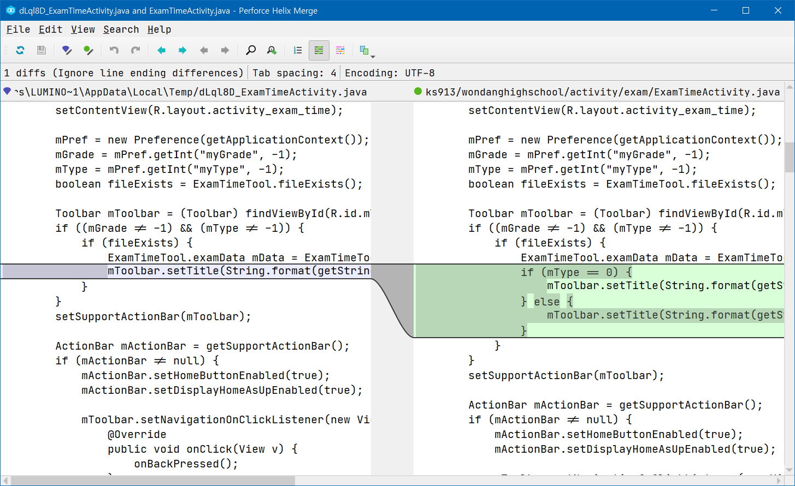
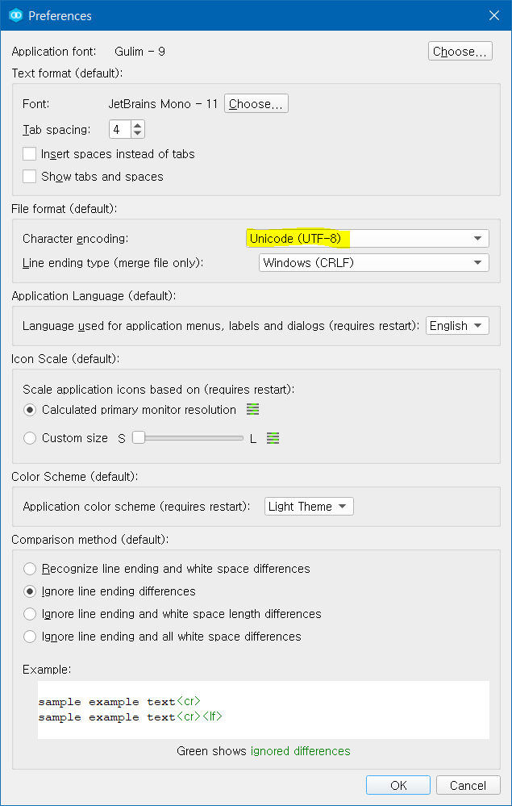
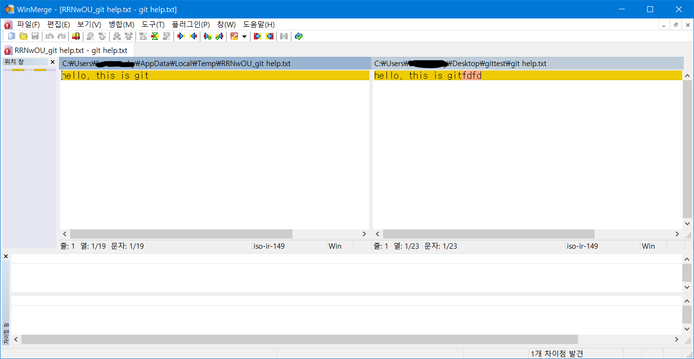
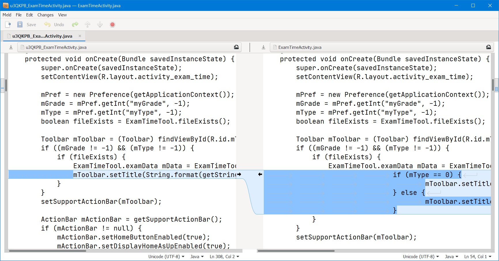

## 서론

git은 익숙해질수록 개발에 있어서 엄청난 편리함을 가져다 주는 것 같습니다.

필자는 git을 알게된 지는 꽤 오랜 시간이 흘렀지만, 아직도 git의 기능 전체를 알고 있다고 자신하지 않습니다.

[이 사이트](https://git-scm.com/book/ko)에서 git에 대해 알아가던 중, git diff 기능을 gui 프로그램인 P4Merge로 작동할 수 있도록 설정하는 방법을 발견하여 이를 공유하기 위해 포스팅합니다.

이 글에서는 P4Merge, Meld, WinMerge 세 툴을 git difftool으로 설정하는 방법을 소개합니다.

## default git diff

아무런 설정을 하지 않으면 git diff는 다음과 같습니다.

기본 git diff는 어느 부분이 수정되었는지 알아보기 힘듭니다.

수정된 전체 라인을 표시하기 때문입니다.

이러한 점을 해결하기 위해 icdiff를 적용할수도 있습니다.

아래 스크린샷은 icdiff 홈페이지에서 가져온 스크린샷입니다.

이미지 출처: <https://www.jefftk.com/icdiff>

그러나 필자는 윈도우 환경에서 icdiff를 적용해보기 위해 알아보았지만 딱히 원하는 결과를 얻지는 못했습니다.

이 프로젝트는 파이썬으로 코딩되어 운영체제에 상관없이 실행할 수 있으나, icdiff를 윈도우 환경의 git과 연동하는 부분에서 마땅한 해결책을 알아내지 못했습니다.

## P4Merge 설치

그리고 icdiff 역시 터미널 환경에서 차이점을 보여주므로 불편합니다.

gui와 터미널 환경은 그 편의성에서 확연한 차이가 있습니다.

이러한 이유로 필자는 icdiff는 포기하고, gui 환경의 diff 툴을 알아보았습니다.

P4Merge는 무료이고 맥, 리눅스, 윈도우 환경을 모두 지원하므로 대다수 사용자에게 적절한 프로그램일 것입니다.

[이 곳](https://www.perforce.com/downloads/visual-merge-tool)을 눌러 P4Merge를 다운로드해주세요.

다운로드한 파일을 실행하면 P4Merge를 설치할 수 있습니다.

나머지는 모두 체크 해제해도 무방하며, Merge and Diff Tool (P4Merge)만 체크하여 설치합니다.

## 환경 변수 등록

별다른 설정을 건들지 않고 설치하였다면 P4Merge의 설치 위치는 다음과 같을 것입니다.

C:\Program Files\Perforce

이 폴더를 PATH에 등록합시다.

환경 변수에 C:\Program Files\Perforce 폴더를 추가해주면 됩니다.

이 방법은 인터넷에서 쉽게 찾을 수 있으므로 생략합니다.

## git config 등록

마지막으로 p4merge를 git에서 사용할 수 있도록 config을 등록해줘야 합니다.

git bash를 열고, 아래 명령어를 입력해주세요.

git config --global diff.tool p4merge

git config --global difftool.p4merge.path "C:/Program Files/Perforce/p4merge.exe"

git config --global difftool.prompt false

git config --global merge.tool p4merge

git config --global mergetool.p4merge.path "C:/Program Files/Perforce/p4merge.exe"

git config --global mergetool.prompt false

프로그램 설치 경로가 다르다면 자신의 환경에 맞게 바꿔서 입력합니다.

위의 세 줄은 diff 툴을 p4merge로 설정한다는 config이며, 아래 세 줄은 merge 툴을 p4merge로 설정한다는 config입니다.

merge 툴으로 p4merge를 사용하지 않으려면 (단순히 difftool으로만 사용하려면) 위의 세 줄만 입력해주세요.

정상적으로 입력되었다면 C:\Users\(유저명)\.gitconfig 파일에 다음과 같이 설정이 기록됩니다.

4번째 줄부터 15번째 줄 까지가 이번 포스팅으로 추가된 config 내용입니다.

## git difftool

이렇게 설정한 p4merge는 git difftool 명령어로 사용 가능합니다.

merge 역시 git mergetool 입력하시면 됩니다.

bash에서 git difftool을 입력하면 아래 스크린샷처럼 변경된 내용이 나타나게 됩니다.

p4merge를 이용하여 변경된 내용을 확인할 수 있습니다.

만약 한글이 정상적으로 표시되지 않을 경우, 인코딩을 변경해주면 되는데요.

Edit - Preferences에 들어가서, Character encoding을 Unicode (UTF-8)로 바꿔주세요.

## git difftool을 WinMerge로 사용하기

WinMerge는 윈도우 환경에서 유명한 diff 툴입니다.

[여기](https://winmerge.org/downloads)를 클릭하여 WinMerge 공식 홈페이지에 방문하시면 WinMerge를 다운로드 할 수 있습니다.

WinMerge를 difftool과 mergetool으로 사용하는 방법은 다음과 같습니다.

위에서 살펴본 것처럼 .gitconfig 파일을 텍스트 편집기로 연 다음, 아래 파란 박스 안의 내용을 입력합니다.

[diff] tool = winmerge

[merge] tool = winmerge

[difftool "WinMerge"]

    cmd = \"C:\\Program Files\\WinMerge\\WinMergeU.exe\" -e -u -dl \"Old $BASE\" -dr \"New $BASE\" \"$LOCAL\" \"$REMOTE\"

    trustExitCode = true

[mergetool "WinMerge"]

    cmd = \"C:\\Program Files\\WinMerge\\WinMergeU.exe\" -e -u -dl \"Local\" -dm \"Base\" -dr \"Remote\" \"$LOCAL\" \"$BASE\" \"$REMOTE\" -o \"$MERGED\"

    trustExitCode = true

    keepBackup = false

참고 : <https://coderwall.com/p/76wmzq/winmerge-as-git-difftool-on-windows>

그리하면 아래 스크린샷처럼 WinMerge를 git difftool과 git mergetool으로 사용할 수 있습니다.

## git difftool을 meld로 사용하기

diff 툴 중에는 Meld라는 프로그램도 있습니다.

[여기](https://meldmerge.org/)를 클릭하여 Meld 공식 홈페이지에 방문하신 다음, Meld를 다운로드 할 수 있습니다.

Meld를 git difftool과 git mergetool으로 사용하는 방법은 다음과 같습니다.

git config --global diff.tool meld

git config --global difftool.meld.path "C:/Program Files (x86)/Meld/Meld.exe"

git config --global merge.tool meld

git config --global mergetool.meld.path "C:/Program Files (x86)/Meld/Meld.exe"

git bash에서 위와 같은 명령어를 입력하면 Meld를 사용할 수 있습니다.

difftool으로 Meld를 사용한 모습입니다.

## 결론

git diff를 gui 프로그램으로 설정하는 방법을 알아보았습니다.
