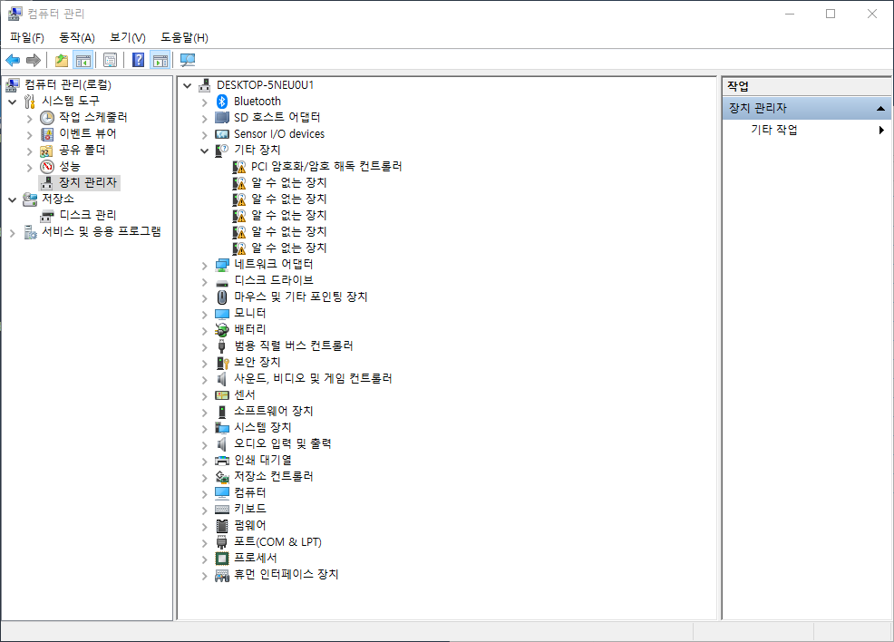
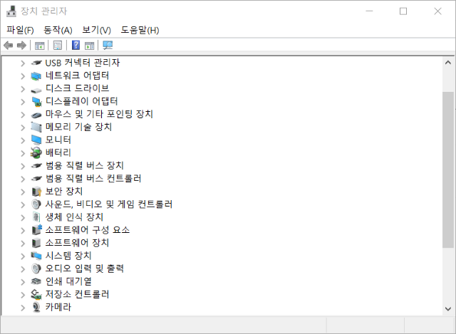
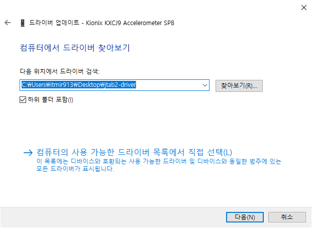
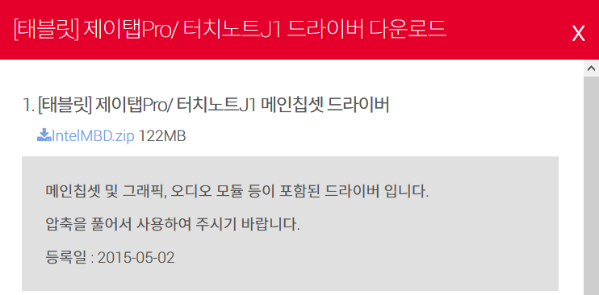
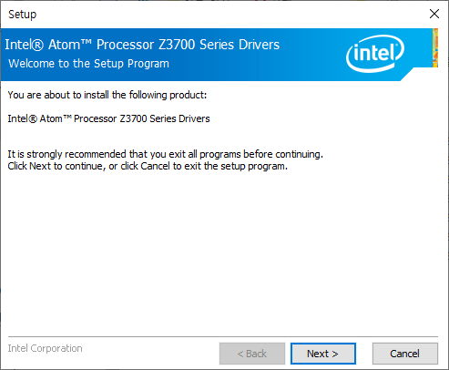
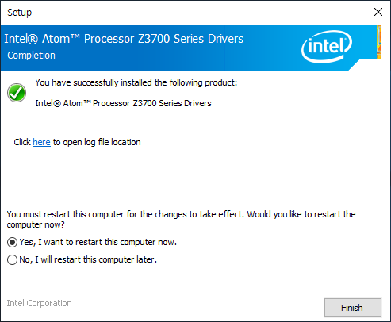

## 서론

주연테크에서 출시한 윈도우 태블릿인 제이탭2를 오랜만에 클린설치했다.

그런데 이번에도 어김없이 각종 드라이버를 잡지 못했다.

카메라와 사운드는 물론이고, 화면 터치까지 잡지 못했다. 아무리 장치 관리자에서 드라이버 업데이트를 해도 도무지 잡을 생각을 하지 못하는 것이다.

## 온라인 드라이버 설치 실패

그래서 주연테크 홈페이지에 들어가서 온라인 드라이버 설치를 해보았다.

<https://www.jooyon.co.kr/onlinedriver.php>

[주연테크](https://www.jooyon.co.kr/onlinedriver.php)

요즘 시대에 Active-X를 이용하는 것도 어이가 없지만, 무엇보다 제이탭을 인식하지 못했다.

복구 영역까지 모두 지우고 클린 설치한 게 원인일지는 몰라도, 주연테크 기기가 아니라는 알림과 함께 아무런 도움도 되지 않았다.

그래서 포기할까 생각하던 도중, 주연테크 홈페이지를 꼼꼼하게 살폈다.

하지만 드라이버는 커녕 별다른 메뉴얼도 없는 것 같았다.

그러던 중 주연테크 홈페이지에서 Intel Intel Atom Processor Z3700 Series Drivers 파일을 다운받았다.

제이탭2 기기 역시 Z3700 시리즈를 사용하고 있으므로 속는 셈 치고 이 드라이버 파일을 설치했다.

그러니 카메라와 화면 터치를 포함하여 모든 드라이버를 잡을 수 있었다.

전면 카메라와 후면 카메라, 사운드, 화면 터치를 비롯하여 대부분의 드라이버를 잡은 것 같다.

적어도 장치 관리자에서 알 수 없는 기기라고 뜨는 게 하나도 없었다.

낡은 구형 모델이지만 혹시나 하는 마음에 지금까지 시도한 방법을 블로그에 포스팅한다.

## 드라이버 설치

먼저 인터넷에서 구한 각종 드라이버 파일을 압축해둔 파일을 아래 링크를 클릭하여 다운로드 받는다.

[jtab2-driver.zip](https://github.com/itmir913/archive/releases/download/itmir-attachments/jtab2-driver.zip)

이 파일을 다운로드한 뒤에 압축 해제한 각각의 폴더 들어가서 각각 설치하지 **않는다.**

폴더 안의 드라이버를 설치하는 게 아니라, **장치관리자를 통해서 설치**하자.

파일을 압축해제 한 다음, 장치 관리자로 들어간다.

그러면 아래 스크린샷처럼 드라이버를 찾지 못한 장치가 나온다.

모든 드라이버가 잡혔다면 아래 스크린샷처럼 "알 수 없는 장치"가 하나도 없어야 한다.

드라이버를 잡지 못해 알 수 없는 장치라고 뜨는 곳에 마우스 오른쪽 클릭 후 드라이버 업데이트를 누른다.

"컴퓨터에서 드라이버 찾아보기"를 클릭한 후, 위에서 압축을 해제한 폴더의 경로를 입력하고 다음(N) 버튼을 누른다.

이때 하위 폴더 포함을 체크해야 한다.

이렇게 드라이버를 잡지 못하는 알 수 없는 장치에 위와 같은 작업을 계속 반복하면 몇 개 빼고는 전부 드라이버를 잡을 수 있다.

필자는 5개를 제외하고 전부 잡을 수 있었다.

이제 맨 마지막으로 Intel Atom Processor Z3700 Series Drivers를 설치한다.

이 파일은 용량이 100MB를 넘어서 10MB까지만 업로드할 수 있는 티스토리 블로그 특성 상 첨부파일로 제공하지는 못한다.

[여기](http://confirm.jooyon.co.kr/Common/DownloadFile?downloadFileId=934)를 눌러 파일을 다운로드 할 수 있다.

이 파일은 주연테크 공식 홈페이지에서 다운받는 링크인데, 드라이버 파일의 위치가 골때린다.

즉, 제이탭2가 아니라 제이탭Pro라는 다른 기기의 드라이버에서 찾은 파일인 것이다...

혹은 Intel 홈페이지에서도 다운받을 수 있는 것 같다.

<https://downloadcenter.intel.com/ko/product/85552>

[인텔 아톰® 프로세서 Z3700 시리즈용 인텔® HD 그래픽용 다운로드](https://downloadcenter.intel.com/ko/product/85552)

시도하지는 않았지만, 주연테크 홈페이지에 있는 Z3700 시리즈 드라이버 대신 인텔 홈페이지에서 다운받아도 무방할거라고 생각한다. 오히려 더 최신버전일 수도 있다.

아무튼 Z3700 Series Drivers를 다운로드 한 다음 BXInstall.exe 파일을 실행하면 다음과 같은 창이 뜬다.

이제 설치를 완료하면 된다.

필자는 Z3700 프로세서 드라이버를 설치한 이후로 카메라, 화면 터치 등이 모두 잡혔다.

## 결론

이렇게 드라이버를 잡느라 시간을 보내고 싶지 않으려고 다들 국내 대기업 완제품을 사는구나라는 생각이 들었다.