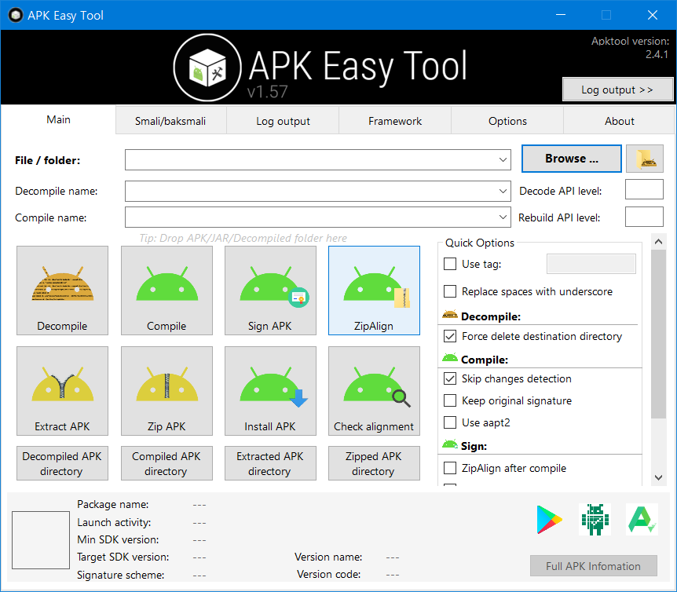
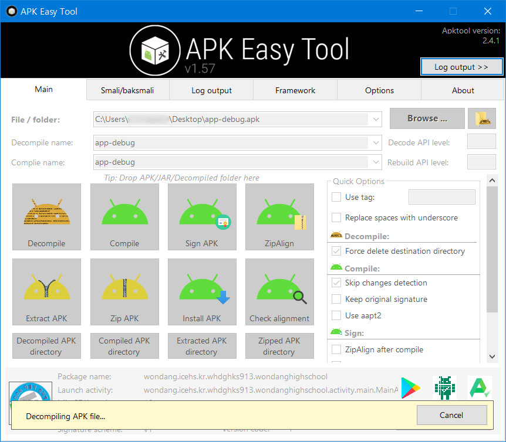
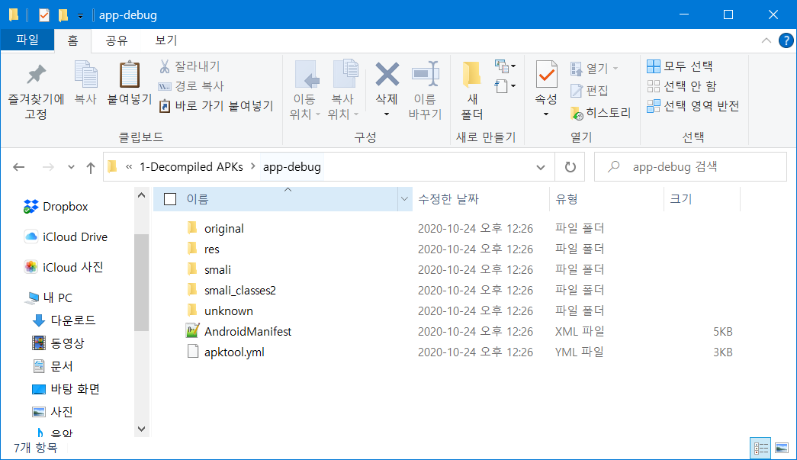

## 서론

필자는 오래전에 Apk Manager에 대해 포스팅한 적이 있었다.

[[SmartPhone/Android] - Apk Manager 5.0.2 다운/사용법 및 Java 설정](https://itmir.tistory.com/121)

[[SmartPhone/Android] - Apk Dex Tools (Apk Manager)](https://itmir.tistory.com/399)

apktool.jar 파일을 이용하여 안드로이드 앱 파일인 apk를 디컴파일하고, 수정한 뒤에 다시 컴파일할 수 있는 도구 중에서 가장 대중적인 도구가 바로 Apk Manager였다.

그러나 Apk Manager는 윈도우 배치파일(.cmd, .bat)으로 만들어진 도구라서 UI도 별로 아름답지 못할 뿐더러 각종 오류를 발견하고 대처하기가 생각보다 까다롭다.

## GUI 기반 Apk Easy Tool

그러던 중 필자는 apktool.jar을 이용한 Tools 중에 Apk Easy Tool을 발견하였다.

이는 GUI로 이루어져 있어서 CUI에 가까운 Apk Manager보다 훨씬 편하게 앱을 분석할 수 있도록 도와준다.

위 스크린샷은 Apk Easy Tool의 메인 화면이다.

Apk Manager보다 확실히 정돈되고 아름다운 UI를 자랑한다. 이게 바로 GUI 프로그램의 장점이다.

필자는 과거에 만들었던 학교앱 프로젝트를 APk Easy Tool로 디컴파일 해보았다.

디컴파일된 앱은 하위 폴더 속 "1-Decompiled APKs" 폴더에 위치한다.

## 요구사항

아래에서 소개할 공식 배포 사이트에는 이 프로그램의 요구사항을 다음과 같이 설명하고 있다.

- Windows 7 or above

- .NET Framework 4.7.2 or above

- Java SE/JDK for decompile, compile, and sign APK. If you don't have Java installed, you can only use Zipalign or Install APK. Download and install Java SE/JDK now

## 다운로드

<https://forum.xda-developers.com/android/software-hacking/tool-apk-easy-tool-v1-02-windows-gui-t3333960>

[[TOOL][Windows] APK Easy Tool v1.57 (12 june 2020)

Screenshot of APK Easy Tool v1.57 Apk Easy Tool is a lightweight application that enables you to manage, sign, compile and decompile the APK files for th…

forum.xda-developers.com](https://forum.xda-developers.com/android/software-hacking/tool-apk-easy-tool-v1-02-windows-gui-t3333960)

위의 공식 사이트에서 파일을 받을 수 있다.

혹은 아래 압축 파일을 받은 뒤에 apktool.jar 파일을 따로 넣어주는 방법도 있다.

[APK Easy Tool v1.57 Portable.zip

7.72MB](./file/APK Easy Tool v1.57 Portable.zip)

위 압축 파일 내에는 티스토리 용량 관계 상 apktool.jar이 없으므로 [여기](https://ibotpeaches.github.io/Apktool/)를 클릭하여 apktool.jar을 다운 받은 다음, 하위 폴더 내의 Apktool 폴더 안에 jar파일을 넣어주어야 한다.