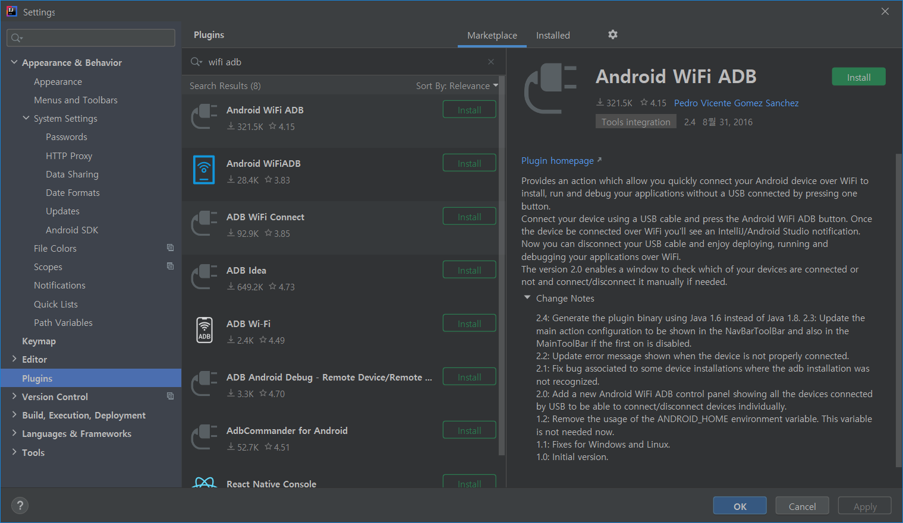
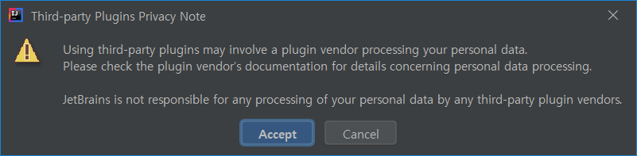
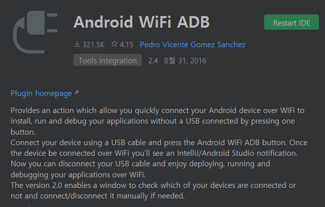
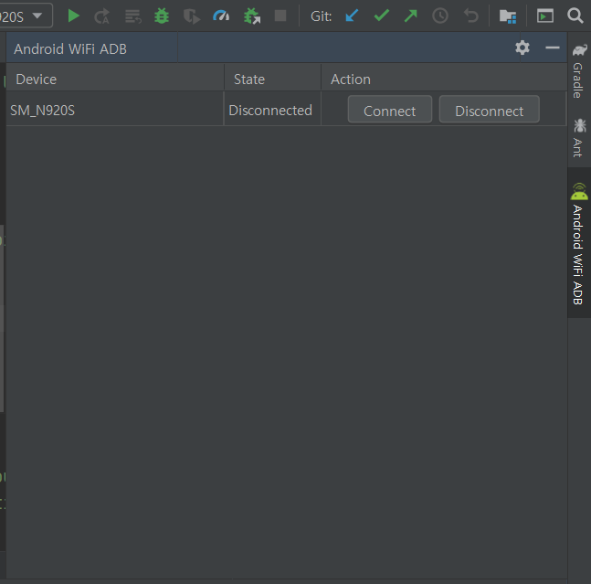
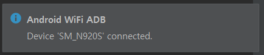
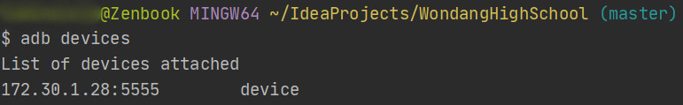

## 서론

앱 개발 시 실제 기기와 PC를 USB로 연결하는 것은 생각보다 번거롭다.

요즘 같은 무선 클라우드 시대에 언제까지 거치장스러운 USB 선을 꼽아야 디버깅이 가능한지 의심스러운데, 이미 그 해답은 수 년 전에 필자가 포스팅한 글에 있었다.

[[SmartPhone/Android] - Adb Over Network 사용 방법](/archive/itmir/2013/239)

[[Android/App] - 안드로이드 무선 ADB 사용하기 (Wi-Fi로 디버깅하기)](/archive/itmir/2015/594)

그러나 이 방법 역시 cmd 배치파일을 이용하는 방법이기 때문에 CUI에 익숙하지 않은 사람이라면 상당히 번거롭다.

## JetBrains Plugin Android WiFi ADB

대부분의 안드로이드 앱 개발자는 안드로이드 스튜디오를 사용할 것이다.

필자는 안드로이드 스튜디오의 기반이 되는 IntelliJ에 Android SDK를 설치하여 사용 중이다.

IntelliJ를 사용하던지, Android Studio를 사용하던지 상관은 없다.

Intellij는 각종 플러그인을 지원하는데, 찾아보니 이미 JetBrains에 Android WiFi ADB라는 Plugin이 개발되어 있었다.

사이트는 <https://plugins.jetbrains.com/plugin/7983-android-wifi-adb> 이며, IDE의 Plugins 설정에서 쉽게 설치할 수 있다.

한 가지 고려해야할 점은 2016년 이후 버전 업데이트가 이루어지지 않았다는 점이다. 그러나 2020년인 글 작성 시점에도 잘 작동한다.

## 플러그인 설치 방법

필자의 개발 IDE은 IntelliJ이므로 이를 기준으로 설명하겠다.

Android Studio도 이름이 살짝 다를 뿐, Plugins을 찾으면 된다.

Settings - Plugins으로 들어간다.

이후 Marketplace에서 wifi adb라고 검색한다.

이제 Install 버튼을 누르면 된다.

Third-party 플러그인을 설치하면 보안상의 문제가 발생할 수 있다는 경고다.

수락(Accept) 버튼을 눌러 Plugin을 설치한다.

이제 IDE를 재시작하면 Android WiFi ADB Plugin을 사용할 수 있다.

IntelliJ를 재시작하면 다음과 같은 탭이 생긴다. 만약 탭이 보이지 않는다면, View - Tool Windows - Android WiFi ADB를 클릭하면 된다.

## 스마트폰과 PC를 무선으로 연결하기

무선으로 adb를 사용하기 위해서는 [[Android/App] - 안드로이드 무선 ADB 사용하기 (Wi-Fi로 디버깅하기)](/archive/itmir/2015/594)에서도 언급한 것처럼, PC와 스마트폰이 동일한 무선 와이파이에 접속되어 있어야 한다.

또한, 첫 연결 시에는 먼저 USB로 컴퓨터와 스마트폰을 연결해야 한다.

Connect를 눌러 연결한다.

연결되었다는 알림과 함께 이제부터는 무선으로 adb를 할 수 있다.

시험삼아 launch 해보니 무선 환경에서도 앱이 잘 실행된다.

adb devices를 해보면 이렇게 평소와는 달리 스마트폰의 내부 ip주소가 표시된다.

