## 서론

JetBrains는 상당히 매력적인 IDE를 많이 개발하였다.

안드로이드 앱을 개발하는 IDE인 Android Studio 역시 구글이 JetBrains의 IntelliJ를 기반으로 만든 IDE이다.

파이썬을 공부할 때 한 번 쯤 들어봤을만한 파이참(PyCharm) 역시 JetBrains가 만들었으며, C 언어의 IDE인 CLion 역시 JetBrains의 IDE다.

이러한 IDE는 오픈소스로 공개된 버전이 있긴 하지만, 상용 IDE로서 정식 라이센스를 받아야 사용할 수 있다.

그런데 만약 학생이라면, 중고등학생을 포함하여 학생이라면, 학생 전용 교육 라이센스를 받아서 무료로 JetBrains 사의 각종 유료 기능을 누릴 수 있다.

이에 이번 글에서는 학생용 라이센스를 발급받는 과정을 알아보겠다.

## Student License 발급받기

다음 사이트에 접속한다.

<https://www.jetbrains.com/student>

[Free Educational Licenses - Community Support

Learn or teach how to code with best-of-industry tools from JetBrains. Free Educational Licenses for JetBrains' tools.

www.jetbrains.com](https://www.jetbrains.com/student/)

접속하면 아래와 같은 모습이 나올 것이다.

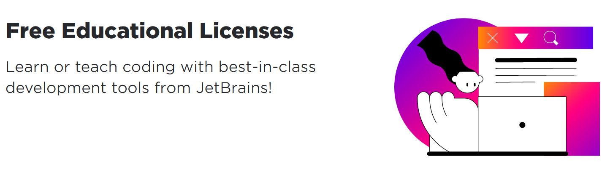

스크롤을 내리면 학생 라이센스를 받을 수 있는 버튼이 나온다.

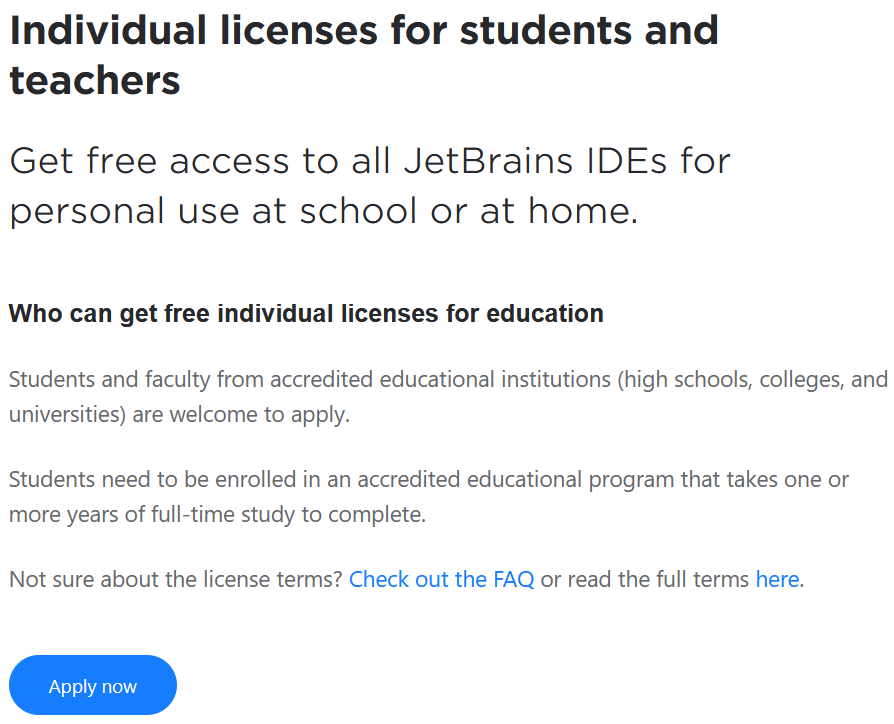

Apply now 버튼을 눌러 학생 계정을 발급받기 시작해보자.

JetBrains는 각종 방법으로 학생임을 인증할 수 있도록 하였다.

대학교 이메일, 국제 학생증, 기타 공식적으로 학생 신분을 증명할 수 있는 문서 등을 이용하여 학생 신분을 인증하면 된다.

고등학생의 경우에는 학생증이나 고등학교 재학 증명서 등의 서류를 제시하면 가능할 거라고 본다. 실제로 검색해보니 대학생 미만의 경우에도 학생 인증을 받았다는 사례를 찾을 수 있었다.

필자의 주위에 고등학생 이하인 지인이 없으므로 대학교 이메일 인증 위주로 설명을 이어나가겠다.

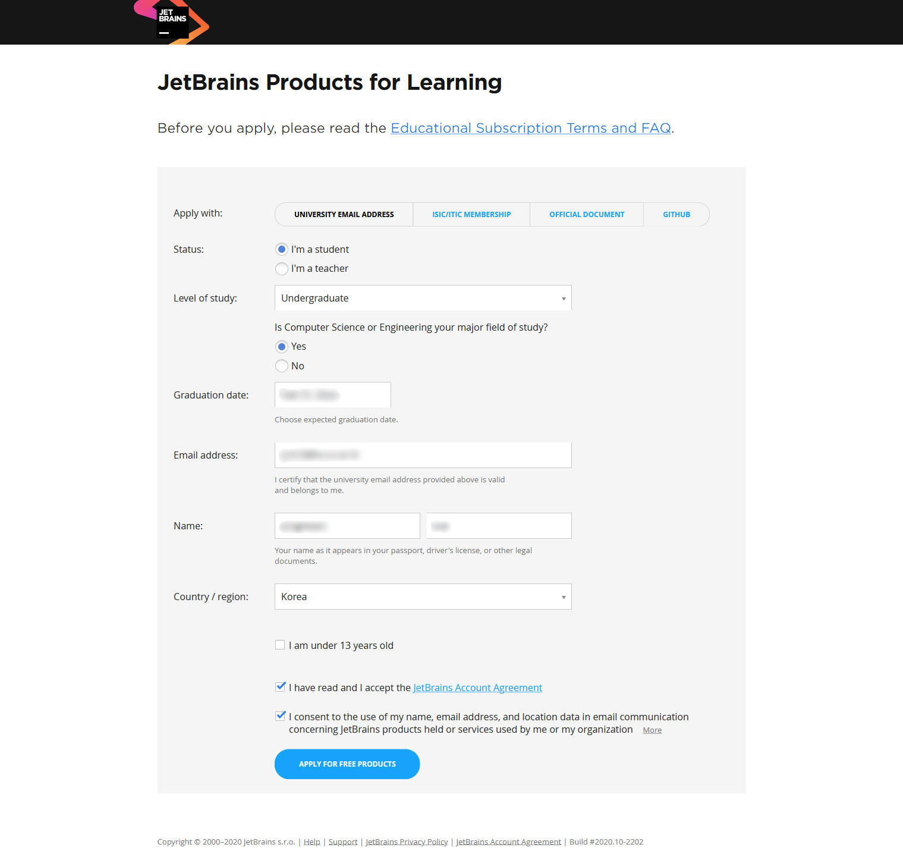

필자는 현재 학부생이므로 Undergraduate로 선택했다.

졸업 예정일 등의 정보를 입력하고 맨 아래의 Apply for Free Products 버튼을 누르면 된다.

여기서 이메일은 자신이 현재 재학 중인 학교의 이메일을 입력해야 한다.

iD@school.ac.kr 형태의 이메일 등 자신의 학교 메일 주소를 입력하면 된다.

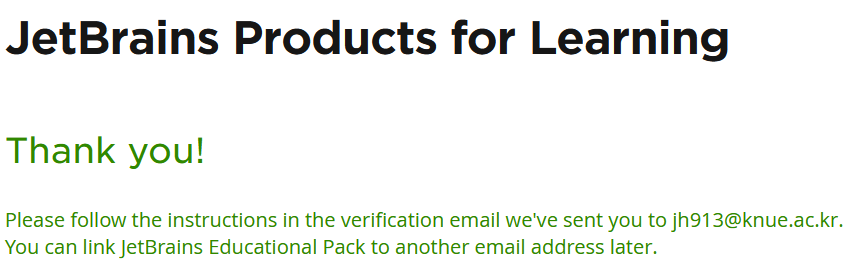

학교 이메일을 확인하라는 메세지가 출력되었다.

이제 재학 중인 학교의 포털 등에 접속하여 메일을 확인해본다.

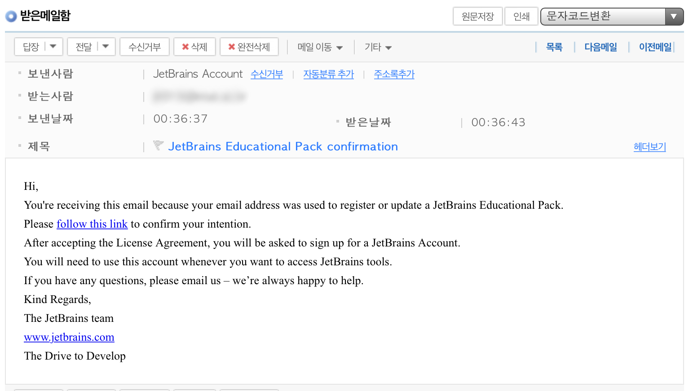

이렇게 JetBrains Account에서 메일이 하나 왔을 것이다.

세 번째 줄의 follow this link를 눌러 계속 진행한다.

저 링크를 누르면 먼저 약관에 동의하라는 창이 뜬다.

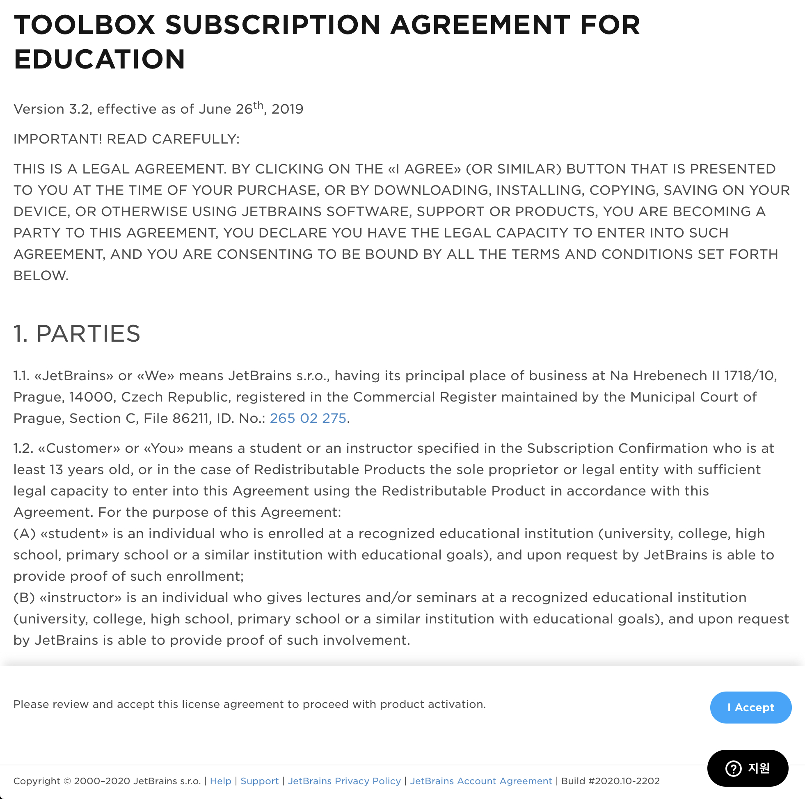

약관을 맨 아래로 스크롤하면 I Accept 버튼이 활성화된다.

동의 버튼을 누르면 이제 학생 라이센스가 인정된다.

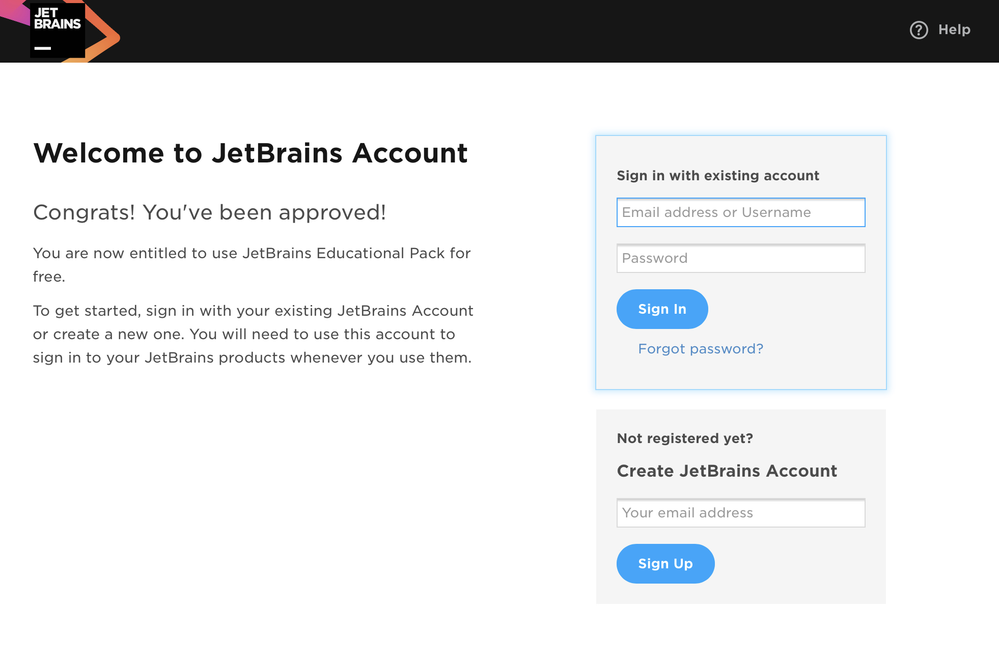

원래 있던 JetBrains 계정으로 로그인하여 학생 라이센스를 그 계정에 부여할 수도 있고, 혹은 새로운 JetBrains 계정을 만들 수도 있다.

이 창을 닫는다면 처음부터 다시 해야하니 주의하길 바란다.

만약 당신이 JetBrains 계정을 갖고 있다면, 여기서 자신의 계정으로 로그인하면 끝난다.

하지만 필자는 JetBrains 계정이 없으므로 Create JetBrains Account에 이메일을 입력하였다.

참고로 이 단계에서 입력하는 이메일 주소는 학교 메일 주소가 아니라도 상관 없다.

메일 주소를 입력하면 다시 입력한 메일 주소를 검증해야 한다.

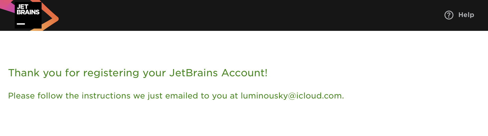

메일함을 열어보면 아래 스크린샷처럼 메일이 또 하나 왔을 것이다.

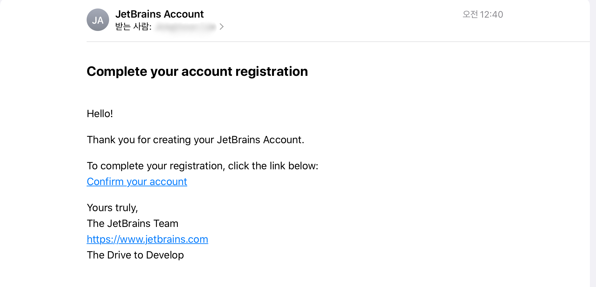

Confirm your account를 눌러 계정 생성 절차를 마무리하자.

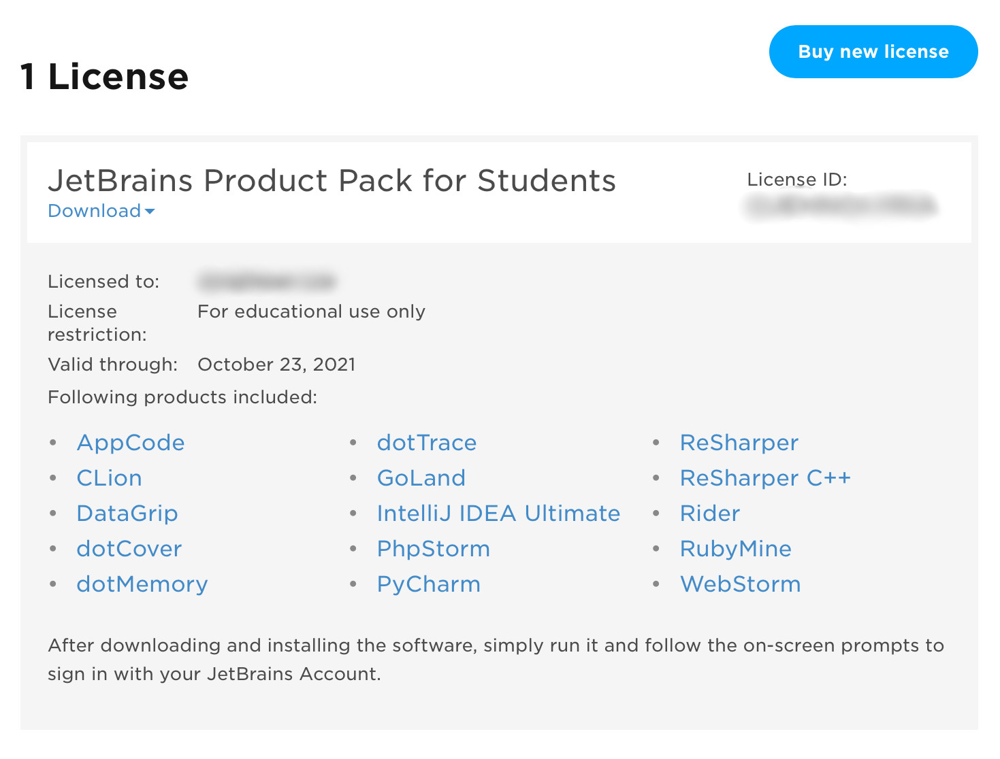

드디어 학생 라이센스를 발급 받았다.

License restriction : For educational use only라고 뜬다면, 축하한다. 학생 라이센스를 발급받은 것이 성공한 것이다.

## JetBrains 계정으로 로그인하여 활성화하기

이제 PyCharm, CLion 등의 IDE를 설치한 다음, JetBrains 계정으로 로그인하면 된다.

필자는 CLion을 다운받았다.

실행하면 License Activation 창이 뜨는데, 여기서 JetBrains Account로 로그인하면 된다.

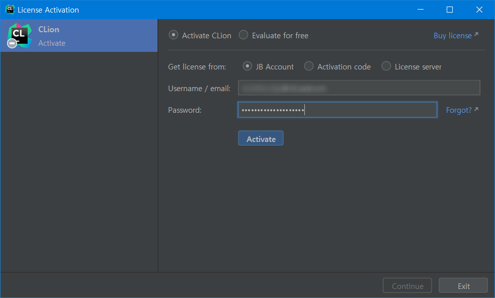

Activate 버튼을 눌러 로그인하면 끝난다.

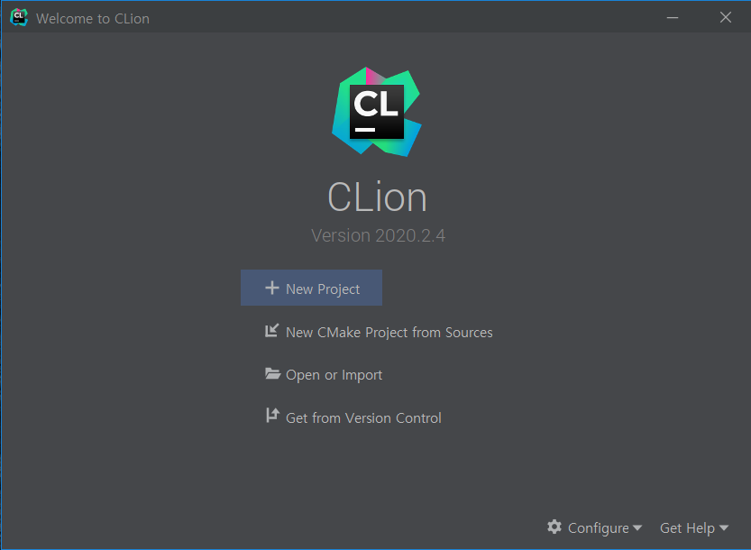

이렇게 CLion 메인 화면이 뜨면 이제 IDE를 사용할 준비가 끝난 것이다.

## 결론

여러 기업이 학생 라이센스를 무료로 뿌리는 이유를 고민해보았다.

이는 미래를 위한 포석이 아닐까?

추후에 이들(학생)이 직장인이 되고 사회 활동을 한다면, 이미 손에 익어 익숙한 환경을 벗어나기는 쉽지 않을 것이다.

필자 역시 Java, Android, Python은 물론이고 이제 C까지 JetBrains 사의 IDE를 사용하게 되었다.

이렇게 익숙해진 환경을 쉽게 벗어나기란 쉽지 않을 것이다.

그럼에도 당장은...

JetBrains 만세.
