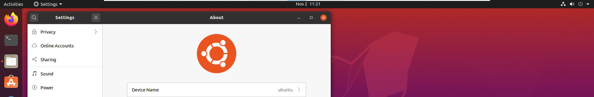
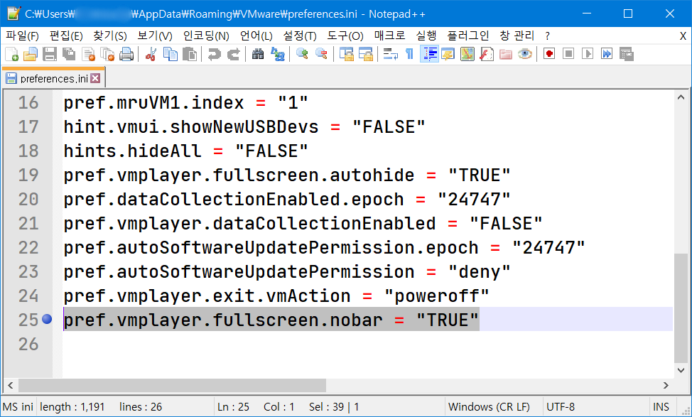
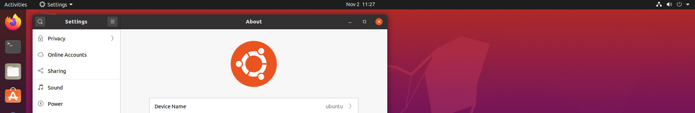

## 서론

VMWare를 전체화면으로 사용했을 때, 보통 툴바가 자동으로 사라지도록 설정한다.

그런데 문제는 1px ~ 2px 정도 툴바가 자리를 차지한다는 점이다.

즉, 전체화면에서 툴바가 완전히 사라지지 않는다는 문제가 있다.

아래는 툴바가 완전히 사라지지 않고 자리를 차지하고 있는 모습을 스크린샷으로 찍은 사진이다.

사진 상으로는 잘 안 보일 수도 있는데, 중앙 상단에 하얀 툴바가 그대로 남아 있는 것을 확인할 수 있다.

## Preferences.ini 수정하기

이를 해결하기 위해서는 vmware의 설정 파일을 수정하면 된다.

파일 경로는 다음과 같다.

C:\Users(User Name)\AppData\Roaming\VMware\preferences.ini

이 파일을 메모장과 같은 텍스트 에디터로 연 다음, 맨 아래에 한 줄을 추가해주자.

pref.vmplayer.fullscreen.nobar = "TRUE"

이 한 줄만 추가해준 다음 VM을 다시 실행하면 전체 화면에서 툴바가 완전히 사라진 것을 확인할 수 있다.

다만, 이럴경우 툴바를 이용하여 전체 화면을 종료하는 게 불가능해진다.

전체 화면에서 빠져나오는 방법은 다음과 같다.

1. 먼저 Ctrl + Alt를 눌러 VM에서 호스트 컴퓨터로 빠져나온다.

2. 이후 Ctrl + Alt + Enter를 눌러 전체 화면을 종료한다.

이제 VM을 열심히 사용하면 된다.

## 참고

<https://superuser.com/questions/246644/can-i-completely-hide-toolbar-in-vmware-workstation>
