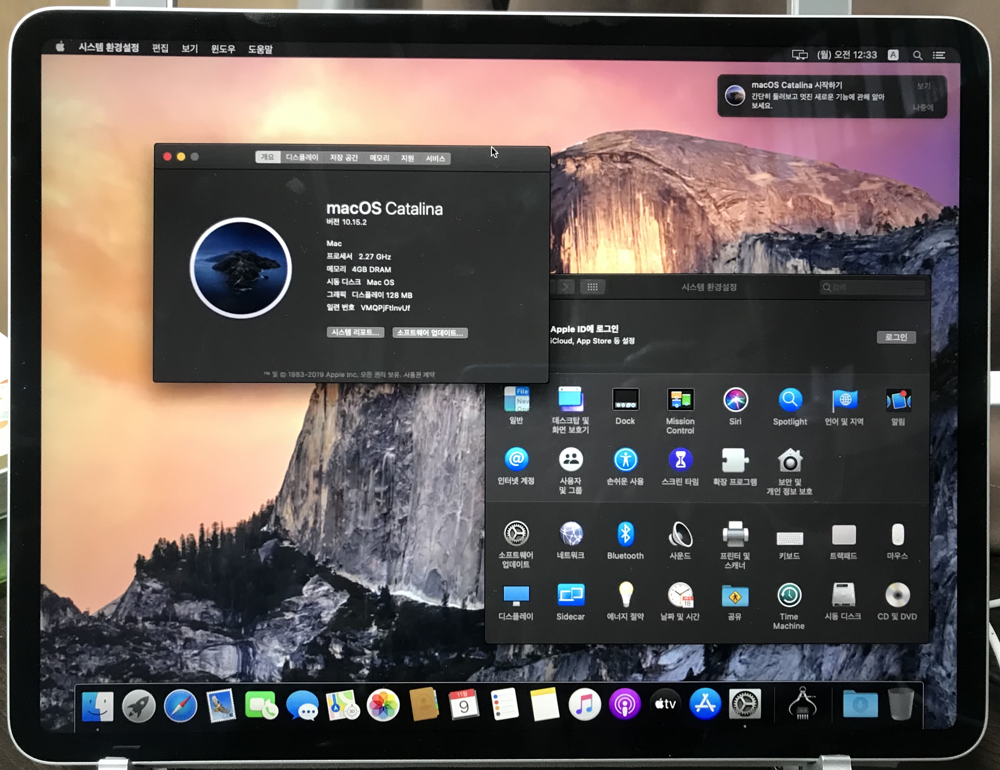
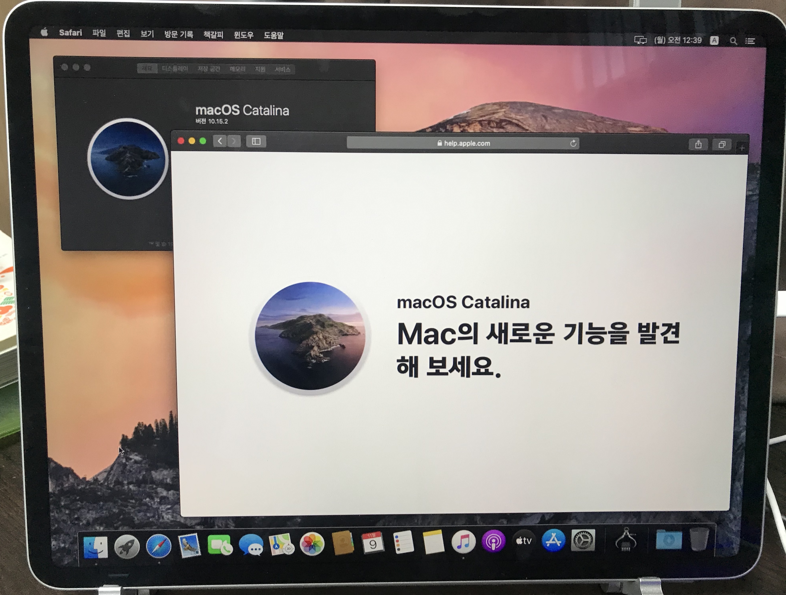
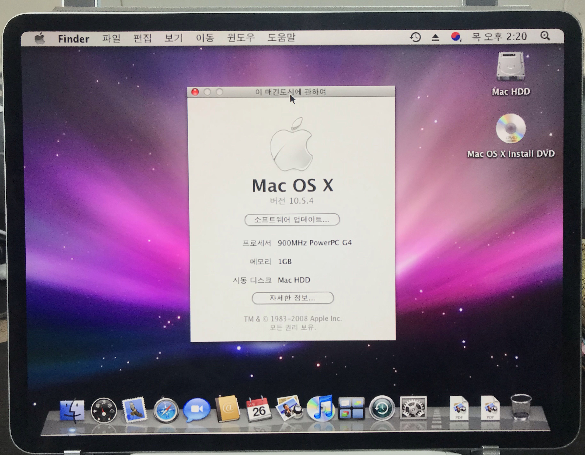

## 서론

Apple이 ARM Mac을 출시하겠다고 한지도 벌써 반년 정도의 시간이 흘렀다.

그리고 애플이 출시한 Arm 맥북 에어는 출시부터 엄청난 성능과 매력적인 가격으로 인하여 맥 OS만 필요로 하는 사람들에게 큰 관심을 끌었다.

애플이 인텔 CPU에서 ARM으로 완전 이주를 선언하였으므로 앱 호환성 문제는 점차 나아질 것이다. 따라서 윈도우를 전혀 사용하지 않는 사람들에게는 윈도우 사용 불가능이라는 현재의 단점이 크게 다가오지 않을 것이다.

## iPad Pro에서 Mac OS가 돌아갈 가능성은?

만약 아이패드에서 맥 OS가 돌아간다면 어떨까?

필자는 급 나누기를 철저하게 하는 애플이 아이패드에서 맥이 돌아가도록 허락할 가능성은 거의 0에 수렴한다고 생각한다.

그러나 ARM으로의 전환을 보면 나중에는 맥과 아이패드 프로의 경계가 사라지는 날이 오지 않을까?

이러한 생각에 iPad Pro에서 Mac이 돌아간다면 어떨지 궁금한 마음이 들었다.

## 만약 iPad에서 Mac이 돌아간다면.

필자는 지난 포스팅에서 가상머신에 Mac Catalina를 설치해보았다.

[[Computer/PC] - AMD Ryzen CPU로 VMWare에서 Mac OS 설치하기](https://itmir.tistory.com/676)

그리고 아이패드 유료 앱 추천 목록 중에서 투몬 SE라는 앱을 추천한 적이 있었다.

[[SmartPhone/iPad] - 아이패드 프로 (iPad Pro) 필수, 권장 유료 앱 추천 100+개](https://itmir.tistory.com/661)

이 투몬 SE 앱은 아이패드를 하나의 모니터로 쓸 수 있도록 만들어주는 앱이다.

이를 이용하여 가상머신 화면을 아이패드에 띄워보았다.

단지 흉내낸 것뿐이지만, 상당히 멋있었다.

iPad에서 맥이 돌아간다면 아마 이러한 모습이 아닐까?

## iOS Emulator UTM

그러던 중, 필자는 [UTM](https://getutm.app)이라는 프로젝트를 발견하였다.

이 오픈소스 프로젝트는 iOS에서 가상머신을 돌릴 수 있는 프로젝트인데, 이를 통해 ArchLinux, Ubuntu, Windows XP / 7 / 10 등을 돌릴 수 있다고 한다.

상당히 흥미로운 프로젝트여서 조금 자세하게 알아본 결과, iOS에 Mac OS X를 올린 영상을 유튜브에서 찾을 수 있었다.

[YouTube 영상: https://www.youtube.com/watch?v=UEa9APPw22w](https://www.youtube.com/watch?v=UEa9APPw22w)

호기심이 발동한 필자는 수 시간에 걸쳐 Mac OS X를 아이패드에서 돌려보았다.

UTM iOS VM 앱으로 돌린 Mac 버전은 Mac OS X 10.5.4이다.

화면 공유나 원격 데스크톱으로 돌린 게 아니라, VM 앱을 통해 실행한 화면이다.

이 외에도 윈도우 XP, 7, 10도 각각 올려보았는데, UTM 앱과 UTM VM을 통해 설치한 윈도우에 대한 자세한 이야기는 ~~추후 포스팅에서 다룰 생각이다.~~ 아래 링크를 통해 확인할 수 있다.

[[SmartPhone/iPad] - UTM iOS Virtual Machines 앱으로 iPad에 윈도우, 맥 설치하기](https://itmir.tistory.com/684)
