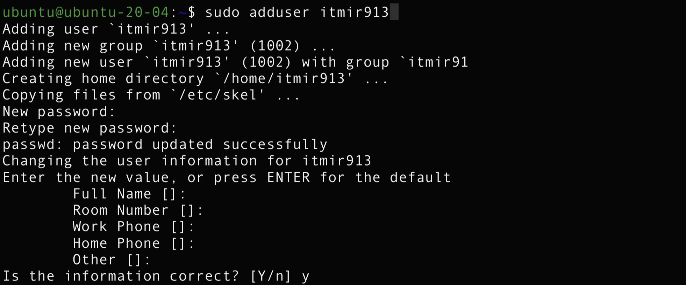
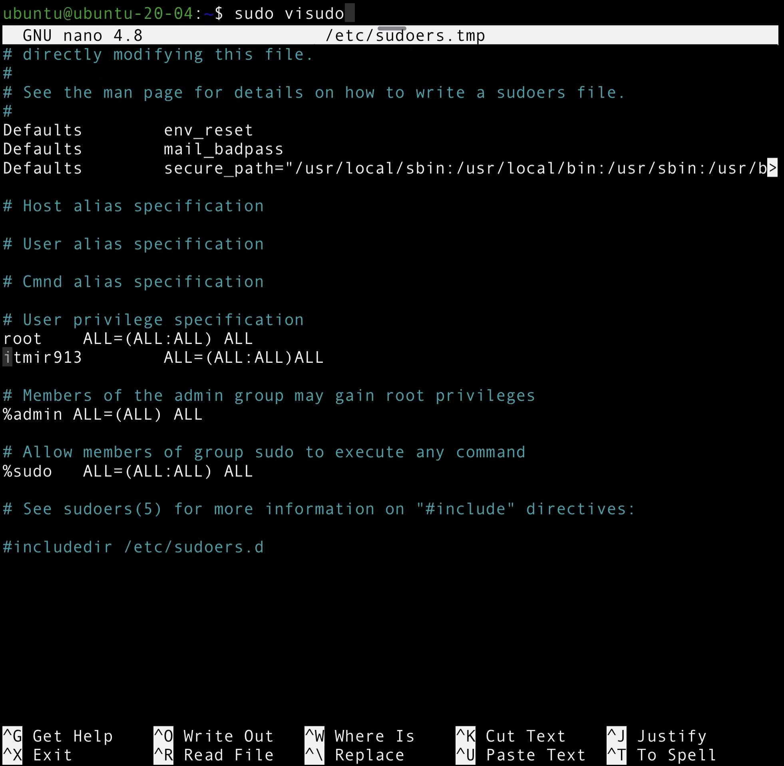

## adduser 명령으로 사용자 계정 추가하기

터미널에서 다음과 같이 입력하여 사용자 계정을 추가합니다.

```
$ sudo adduser username
```

예시로 itmir913 이라는 계정을 만들어보겠습니다.



```
$ sudo adduser itmir913
Adding user 'itmir913' ...
Adding new group 'itmir913' (1002) ...
Adding new user 'itmir913' (1002) with group 'itmir913' ...
Creating home directory '/home/itmir913' ...
Copying files from '/etc/skel' ...
New password:
Retype new password:
passwd: password updated successfully
Changing the user information for itmir913
Enter the new value, or press ENTER for the default
	Full Name []:
	Room Number []:
	Work Phone []:
	Home Phone []:
	Other []: 
Is the information correct? [Y/n] y
```

이렇게 adduser 명령어를 이용하여 계정을 추가할 수 있습니다.

저는 비밀번호를 입력하고, 계정 정보 입력 시에는 모두 엔터를 눌러 기본 값으로 설정하였습니다.

사용자 계정은 useradd 명령어로도 추가할 수 있는데요.

이 useradd는 단순히 계정만 추가할 뿐, 홈 디렉터리(/home/username/) 생성을 포함한 각종 설정을 직접 명령어를 입력하여 처리해야 합니다.

따라서 전 각종 설정을 바로 해주는 adduser 명령으로 계정을 추가하였습니다.

이후 sudo 사용을 위한 설정을 해줍니다.

```
$ sudo visudo
```



vi 또는 nano가 실행되면,

root ALL=(ALL:ALL) ALL

아래에 다음 한 줄을 입력합니다.

itmir913 ALL=(ALL:ALL) ALL

이후 nano라면 Ctrl + X, vi라면 :wq를 이용하여 저장하고 빠져나옵니다.

## 이전 계정에서 ssh 가져오기

원래 사용자 계정마다 각각의 ssh 키를 사용하는 것이 보안상 좋겠지만, 필자는 단순히 ubuntu 계정에서 itmir913 계정으로 바꾸기만 할 예정이므로 이전에 쓰던 ssh 키를 가져와서 사용할 생각입니다.

```
$ sudo cp -r /home/ubuntu/.ssh /home/itmir913/.ssh
$ sudo chown -R itmir913:itmir913 /home/itmir913/.ssh
$ sudo service ssh restart
```

맨 마지막 줄에서 ssh 서비스를 재실행해주는데요.

우분투의 경우 ssh이며, 다른 리눅스판의 경우 sshd일 수 있습니다.

이렇게 ssh 키 파일까지 복사하고 나면 우분투에 새로운 계정을 추가하는 작업이 모두 끝납니다.

## 참고.

[https://jongmin92.github.io/2016/09/20/Linux & Ubuntu/add_user](https://jongmin92.github.io/2016/09/20/Linux%20&%20Ubuntu/add_user/)
