## 서론

신형 노트북을 구매하면서, 이전까지 사용하던 윈도우 태블릿은 이제 구형 기기가 되었습니다.

약 7년 동안 썼던 기기이다보니 액정에 하얀 멍도 있고 상태가 그리 좋다고 말할 수 없습니다. 그렇기 때문에 중고로 처분한다고 하더라도 얼마 받지 못하더라고요.

따라서 구석에 계속 처박혀 있을 예정이었던 기기였습니다.

그러던 중 android-x86 이라는 프로젝트를 알게 되었습니다. 구형 x86 기기에 안드로이드를 부팅시키는 프로젝트입니다.

## Android-x86 iso 설치 USB 만들기

[www.android-x86.org/download.html](https://www.android-x86.org/download.html)

위 사이트를 통해 android-x86.iso 파일을 다운 받습니다.

이후 [Rufus](https://rufus.ie/)라는 프로그램을 통해 빈 usb에 Android-x86 설치 USB를 만들어주면 됩니다.

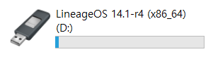

이후, 바이오스 부팅 옵션을 설정하여 방금 만든 부팅 USB를 통해 부팅하면 1단계가 끝납니다.

USB로 부팅하기 전에 Android-x86을 설치할 파티션을 미리 윈도우에서 만들어주는 것을 추천합니다.

윈도우에서 GUI로 파티션을 설정하는게 텍스트를 입력하여 설정하는 것보다 더 편하기 때문입니다.

이렇게 파티션을 따로 만들면 윈도우와 안드로이드를 오가며 부팅할 수 있습니다.

윈도우를 깔끔하게 지우고 설치하실 분은 파티션을 미리 잡아두지 않아도 됩니다.

## Android-x86 설치하기

이제 Android-x86을 본격적으로 설치해봅시다.

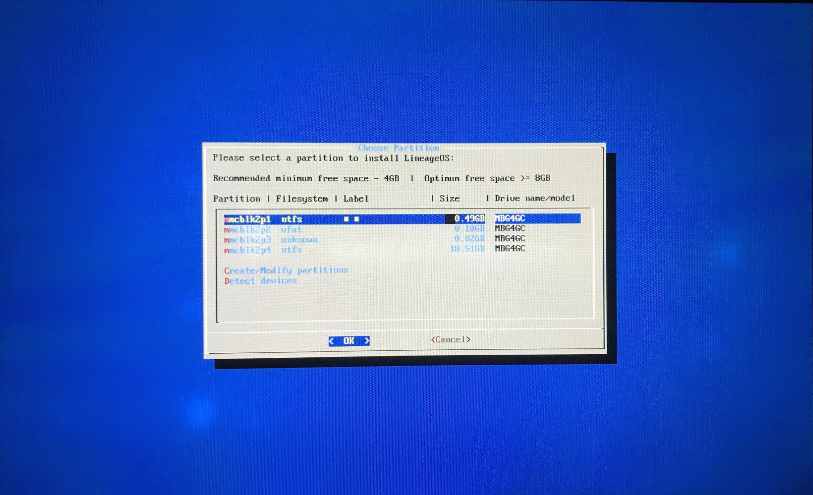

윈도우에서 이미 파티션을 잡아두었다면 그걸 바로 선택하시면 되고,

그렇지 않다면 Create/Modify pertitions 메뉴를 선택하여 파티션을 편집해줍시다.

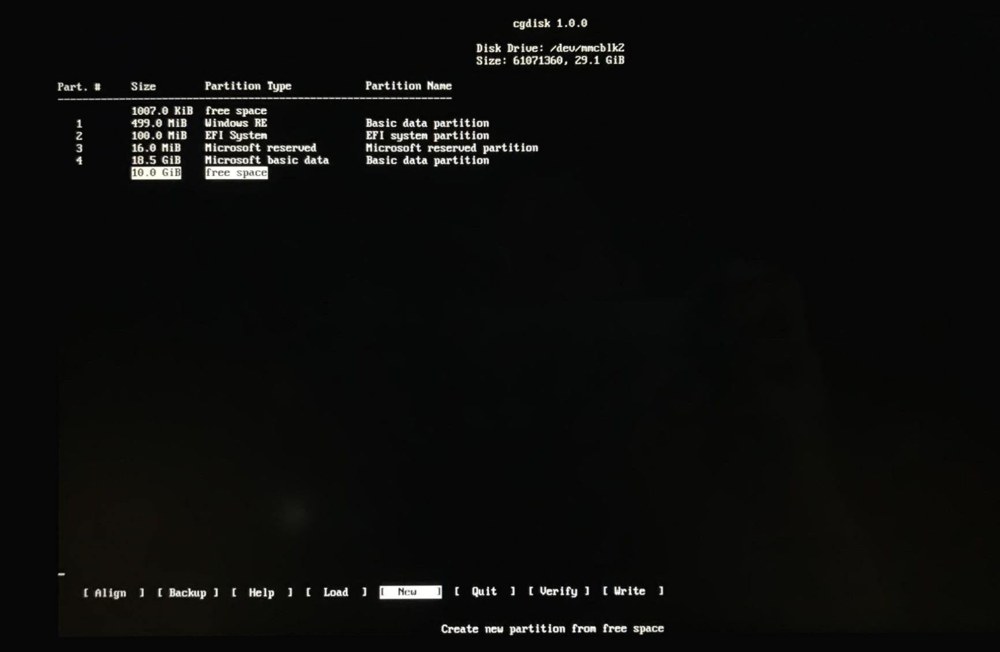

저는 윈도우에서 빈 공간(free space)만 잡아두었고, 파티션을 만들지는 않았습니다.

New 메뉴를 선택하여 빈 공간에 파티션을 잡아주고, Write를 통해 변경 내용을 실제로 적용합니다.

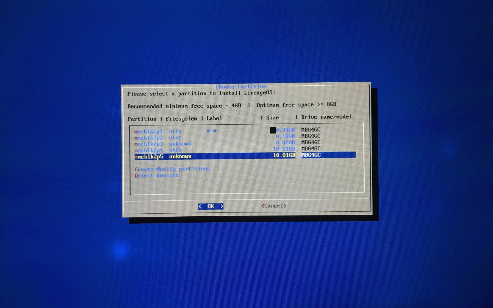

이제 unknown이라는 빈 볼륨이 만들어졌는데요.

이 파티션을 선택해주면 포맷 방식을 결정하고 다음 단계로 넘어갑니다.

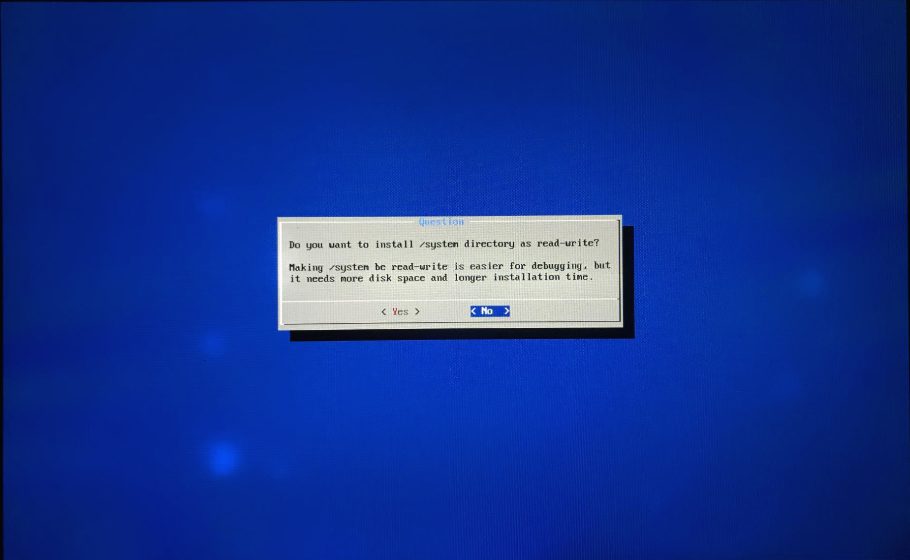

/system에 접근할 수 있도록 할 것인지 선택하는 부분입니다.

저는 Yes를 선택하여 /system 쓰기 권한을 얻기로 결정했습니다.

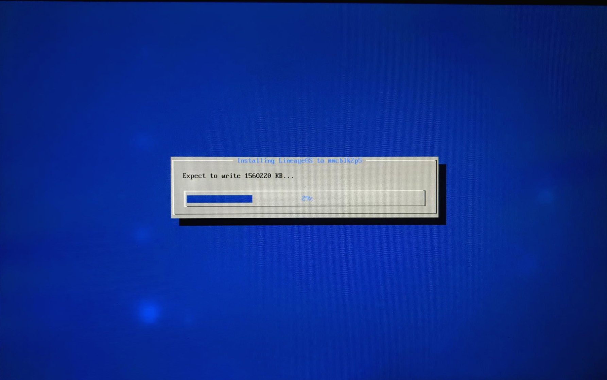

이제 선택한 파티션에 Android가 설치되기 시작합니다.

용량이 크지 않아 윈도우보다 훨씬 빠르게 설치되므로 화장실 한 번 갔다 오시면 설치가 거의 끝나갈 겁니다.

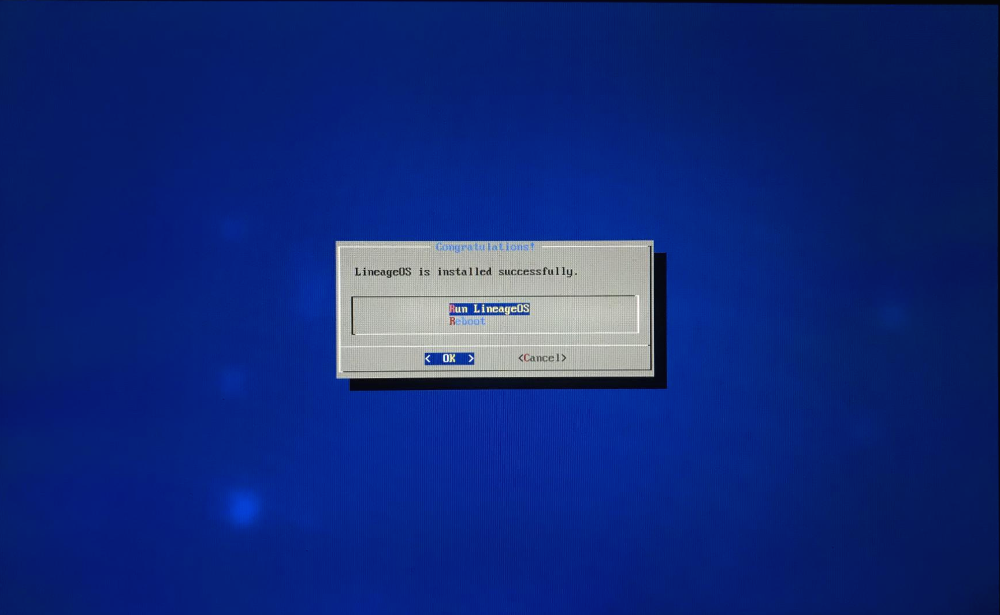

이제 설치가 완료되었다는 문장이 나왔습니다.

Run LineageOS를 선택하여 안드로이드를 부팅해봅시다.

참고로 LineageOS의 전신이 CyanogenMod 입니다. 커스텀 롬으로 유명했던 CyanogenMod가 맞습니다.

부팅을 조금 기다리면 아래처럼 초기 설정 화면이 나옵니다.

화면의 멍 자국이 신경쓰이네요. ㅠㅠ

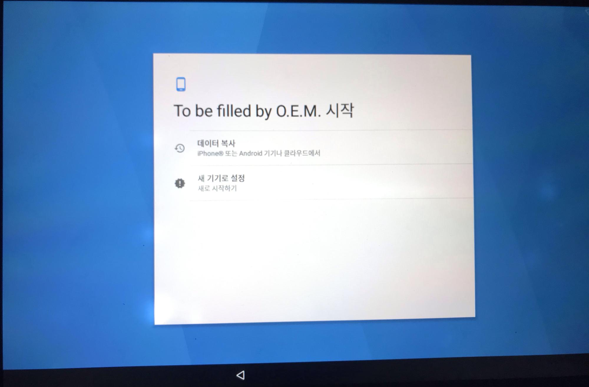
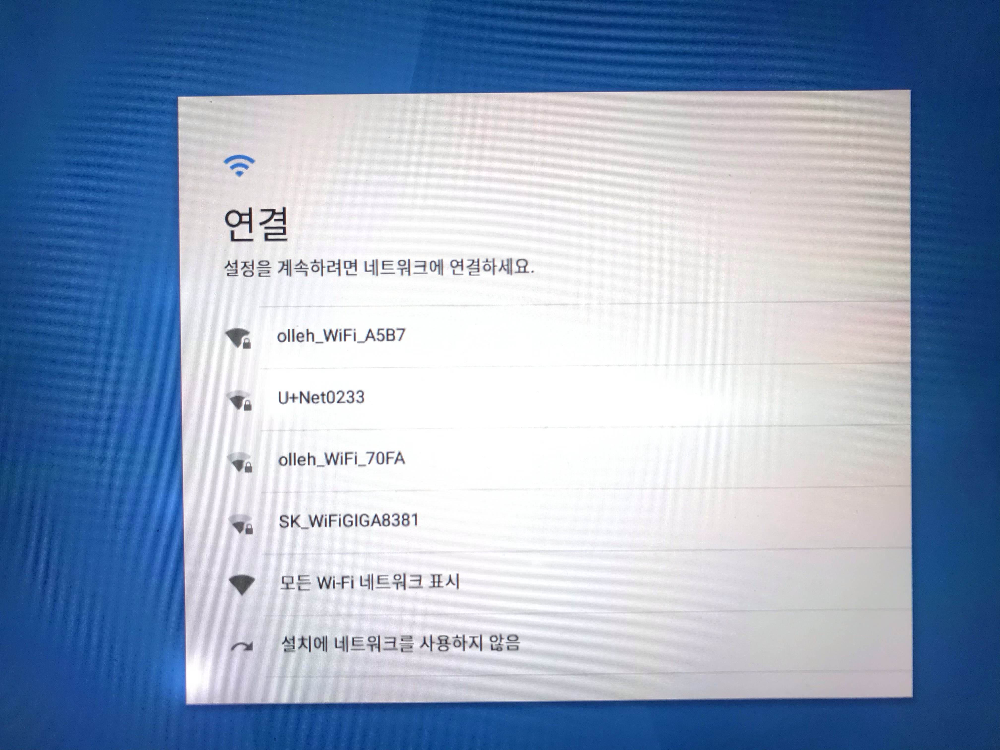
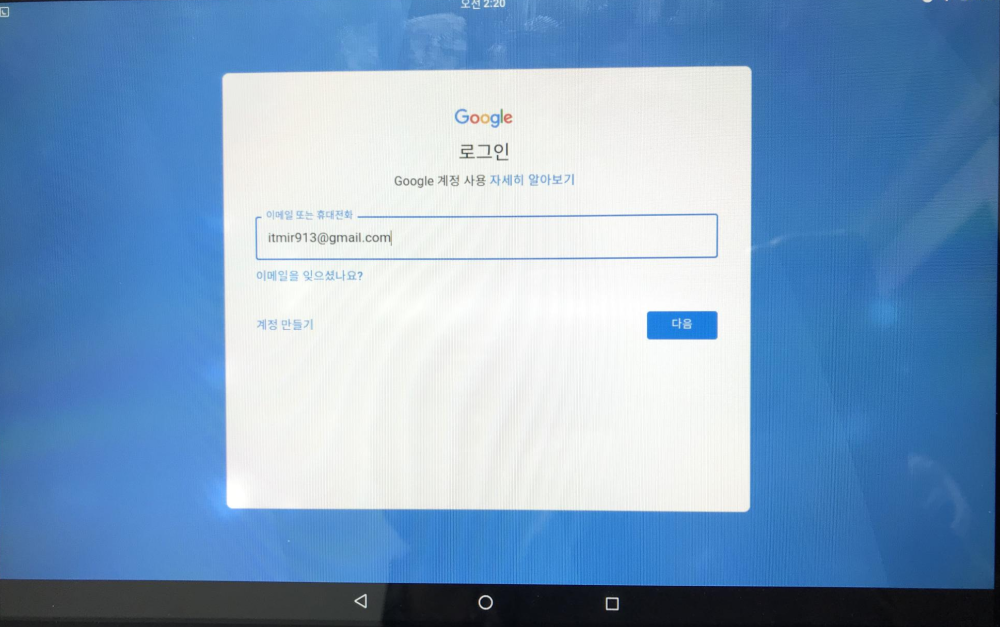

이렇게 초기 설정을 끝내면, 드디어 홈 화면이 나오며 설치가 끝납니다.

## Android-x86 구동 화면

드디어 안드로이드를 윈도우 태블릿에 부팅했습니다.

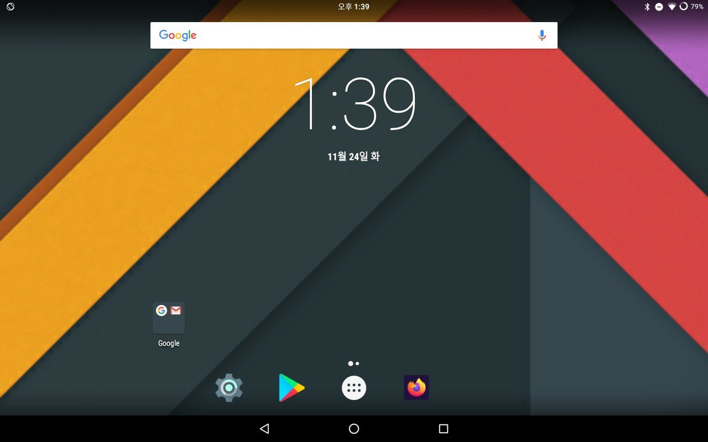

위 스크린샷은 제가 각종 앱을 설치한 후 캡쳐한 홈 화면입니다.

안드로이드 태블릿이 하나 늘어난 기분이네요.

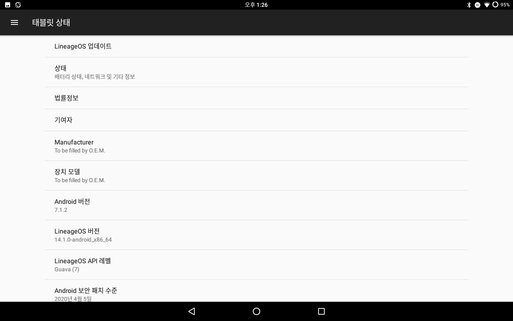

안드로이드 버전은 7.1.2 입니다.

## 앱 호환성 및 버그 목록

아쉽게도 모든 앱이 호환되지는 않습니다.

arm으로 빌드된 앱은 대부분 작동하지 않는 것 같으며, 어떤 앱은 아예 실행되지도 않았습니다.

그래서 작동하는 기능과 작동하지 않는 기능을 분류해보았습니다.

#### Working

물리버튼(전원,볼륨키)

터치디스플레이

내장스피커

마이크로 USB포트

SD카드

전원충전

3.5파이이어폰잭

Wi-Fi

Bluetooth

#### Not Working

전후면카메라

내장마이크

가속도계센서(화면회전)

일부앱호환성

#### Unknown

hdmi화면출력포트

스크린샷과 Working 리스트를 보면 Wi-Fi가 잡힌다는 것을 알 수 있는데요.

첫 부팅시에는 저도 인터넷이 잡히지 않았습니다.

그래서 구글링을 해본 결과, [이러한 영상](https://www.youtube.com/watch?v=o4cVjTT_oJo)을 발견할 수 있었습니다.

부팅 시에 Android-x86 (Debug) 모드로 진입하신 다음, 텍스트가 주르르 내려가다가 멈추면 exit를 두 번 입력하여 디버그 모드를 빠져나옵니다.

이러하니 Wi-Fi가 잡히기 시작했습니다...(도대체 무슨 원리인지는 모르겠습니다.)

## 유튜브 영상 스크린샷

무엇을 찍을까 생각하다가, 유튜브를 찍어보았습니다.

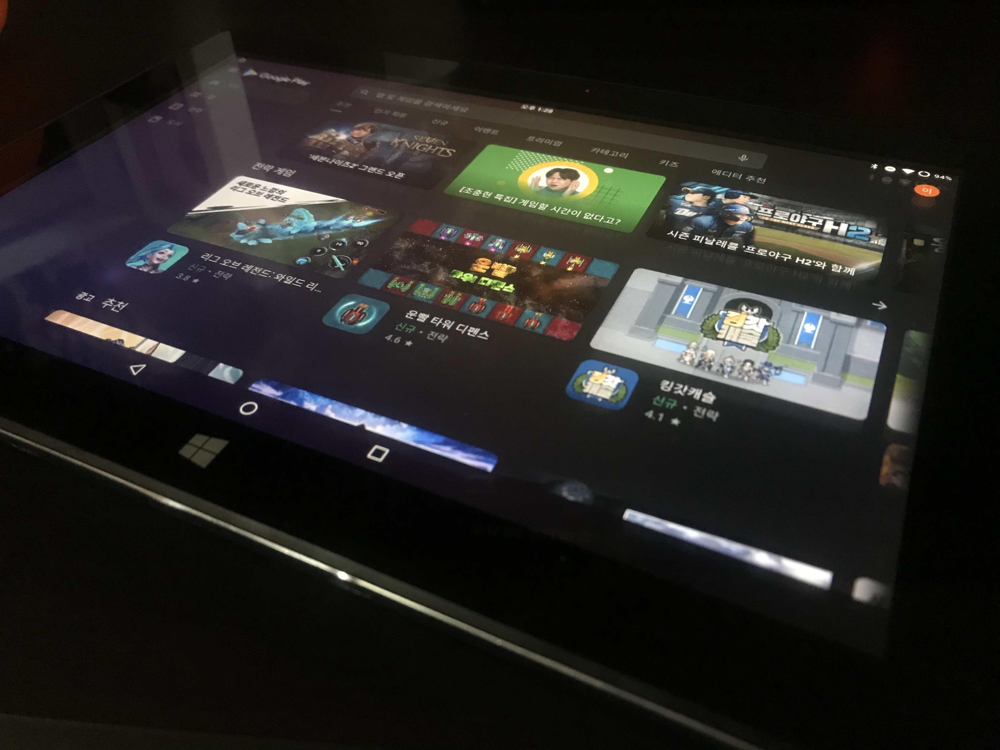
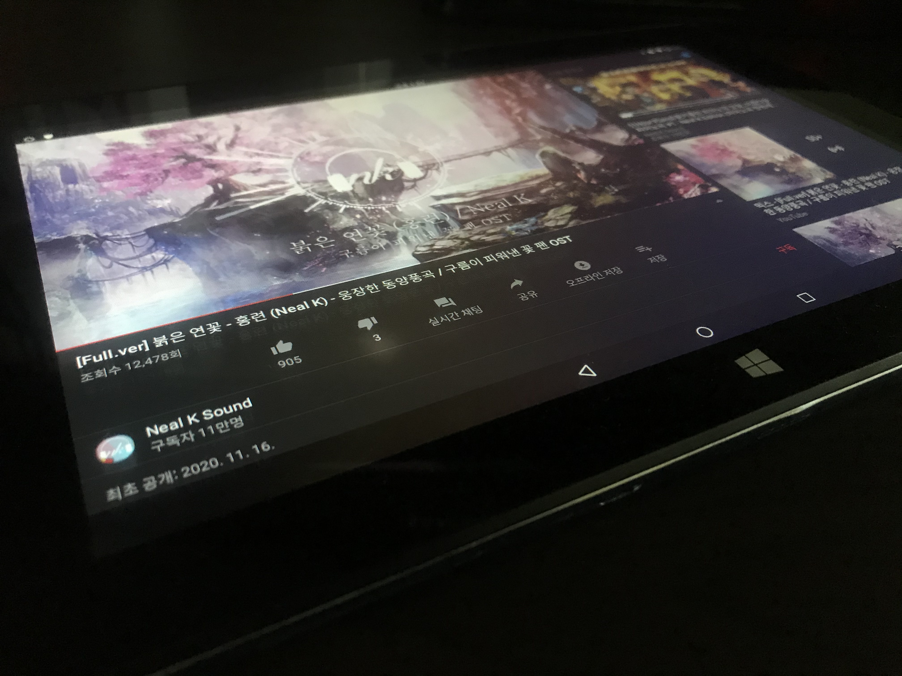

몇 년 전부터 계속 듣던 Neal K님의 자작곡 영상입니다.

화면만 멀쩡하다면, 유튜브 머신으로 상당히 쓸만한 것 같네요

## 결론

카메라 드라이버가 잡히지 않아서 작동 LED가 계속 켜져있습니다.

배터리도 생각보다 빨리 닳아서 실사용하기에는 약간 무리가 있다고 봅니다.

장난감으로 쓰기에는 상당히 쓸만한 안드로이드 태블릿이 되었네요.

구형 기기의 생명이 연장되었습니다.
