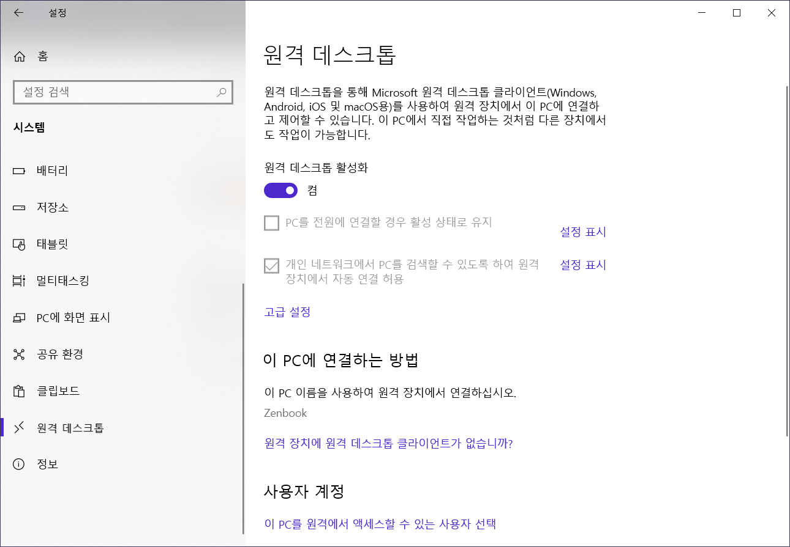
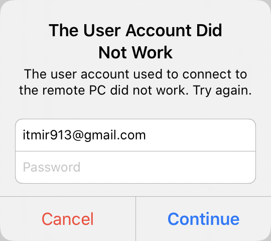
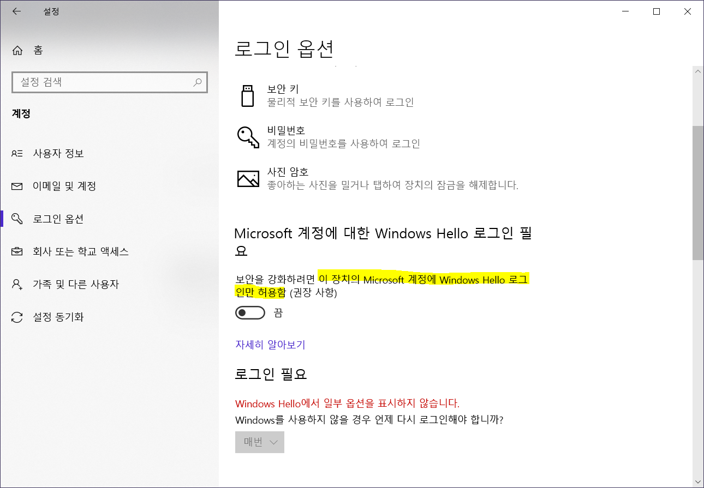
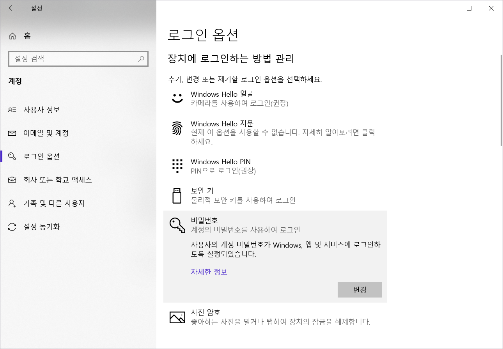

## 원격 데스크톱 로그인 실패.

대학교에서 윈도우10 Education 시리얼 키를 제공함에 따라 필자는 오랜 기간 사용하던 Home 버전을 버리고 윈도우 Pro 버전의 기능을 맛볼 생각에 설레었다.

Bitlocker를 설정한 필자는 이제 원격 데스크톱을 사용해볼 생각이었다.

그런데, 원격 데스크톱을 활성화해도 아이패드에서 접속이 되지 않는 것이다.

다음과 같은 오류와 함께 인터넷 상의 어떠한 해결 방법을 시도해도 원격 데스크톱 접속이 되지 않았다.

이에 필자는 수차례동안 구글링을 통해 각종 해결법을 찾아보았고, 드디어 오늘에서야 그 원인을 알아낼 수 있었다.

## 원인은 Windows Hello.

결론부터 말하자면, 윈도우 헬로 로그인만 허용하도록 설정한 것이 원인이었다.

원격 데스크톱 로그인을 위해서는 비밀번호 로그인이 살아 있어야 한다.

하지만 Windows Hello 로그인만 허용하는 옵션이 켜져 있으면 아무리 사용자 계정과 비밀번호가 맞아도 로그인이 되지 않는다.

따라서 이 옵션을 꺼줘야만 한다.

일단 로그인 옵션 중 Windows Hello 얼굴인식, 지문인식 등을 모두 제거한다. 그 후에 Windows Hello PIN까지 제거한다.

그리고 다시 설정 창을 껐다가 키면 비활성화된 옵션 OFF 버튼이 활성화되어 있을 것이다.

이제 옵션을 꺼주고 다시 설정 창을 키면, 아래 스크린샷 처럼 다양한 잠금 해제 옵션이 등장한다.

사용자의 계정 비밀번호가 Windows, 앱 및 서비스에 로그인하도록 설정되었습니다.

이러한 문구가 표시된다면, 이제 윈도우 원격 데스크톱 로그인을 다시 시도해보자. 분명 로그인이 될 것이다.

참고로 저 옵션을 해제한다고 해서, Windows Hello 얼굴 인식이나 지문 인식을 사용하지 못하는 것은 아니다.

오로지 Windows Hello로만 로그인할 수 있는 제한을 없앤 것이지, 얼굴 인식을 금지한 것이 아니기 때문에 기존 사용하던 로그인 옵션을 여전히 사용할 수 있다.

## 결론.

윈도우 로그인 옵션 때문에 원격 데스크톱에 접속할 수 없었을 거라고는 전혀 생각하지 못했다.

이 글을 읽으시는 분들께서도 다른 방법을 모두 사용해보았는데 여전히 원격 데스크톱에 접속할 수 없다면, 저 옵션이 활성화되어 있는지 확인하시길 바란다.

## 참고.

https://itons.net/윈도우10-핀pin-번호-제거-및-계정-자동-로그인/

<https://answers.microsoft.com/en-us/windows/forum/all/remote-desktop-password-incorrect-windows-10/0720c735-196e-4550-9704-41d17b3551b3?page=3>

<https://techcommunity.microsoft.com/t5/windows-insider-program/logging-on-to-remote-desktop-using-windows-hello-for-business/m-p/218401>
