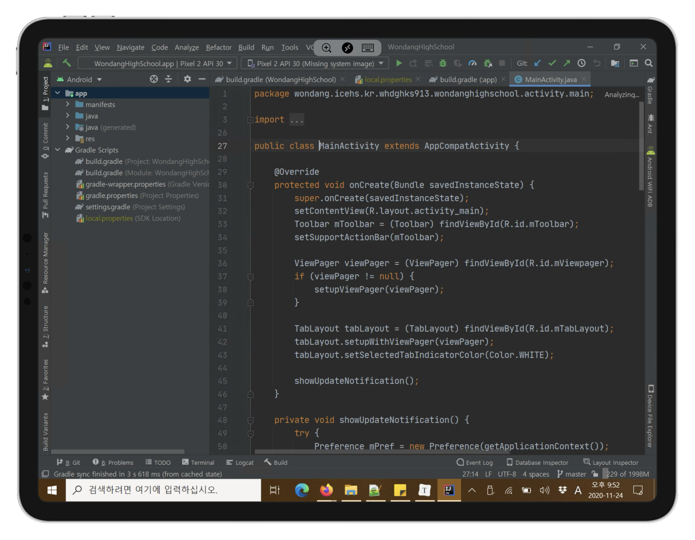
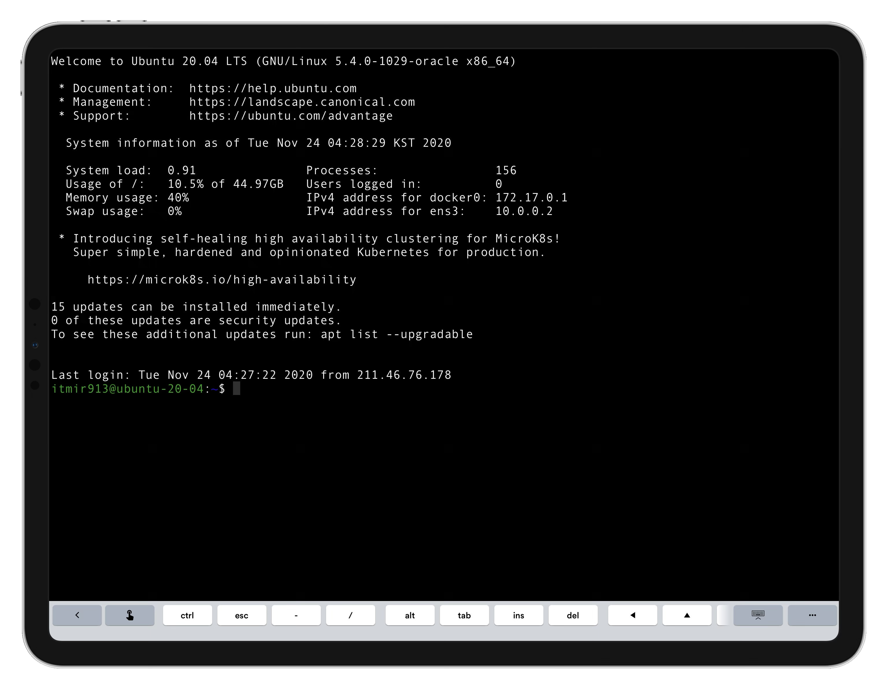
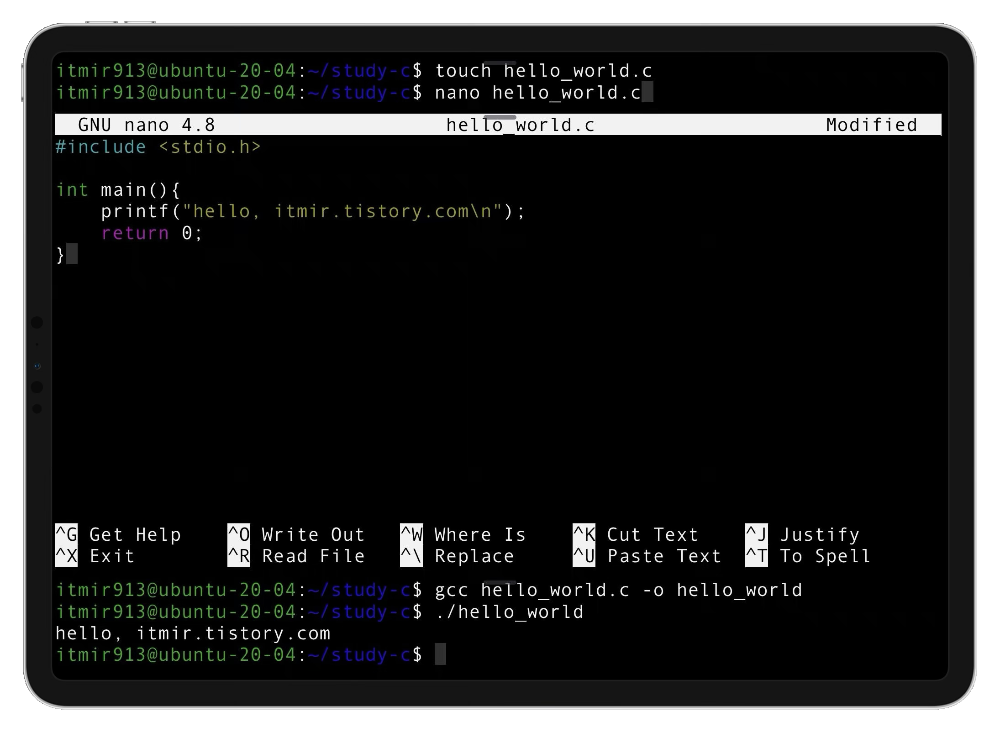
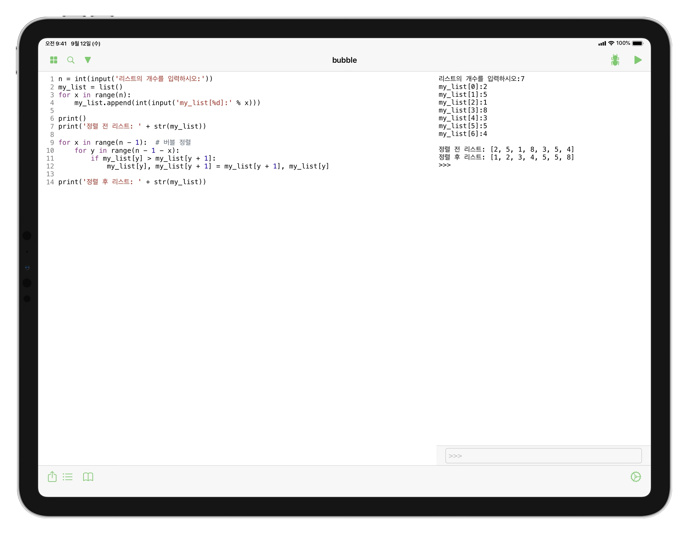

## 서론

iPad의 막강한 AP 성능은 노트북과 비교해도 밀리지 않을 정도며, 학부생 수준의 언어 공부에서 간단한 수준의 개발까지 가능할 만큼 뛰어나다.

그래서 아이패드를 통해 코딩을 하고 싶은 사람들의 수요는 지금까지도 꾸준히 있어왔다.

하지만 결론부터 말하자면, 필자는 아이패드만 가지고 언어를 공부한다는 것을 포기한지 오래다.

이유는 여러가지가 있겠지만 가장 큰 원인을 말해보자면 바로 다음과 같다.

쓸만한 IDE 앱이 전무하기 때문이다.

iOS 특유의 폐쇄성으로 인하여 개발 환경을 구축하는 것부터 어렵다.

또한, 굳이 좋은 PC 환경을 버리고 아이패드에 IDE 앱을 개발하려는 시도가 거의 없다고 알고 있다.

따라서 아이패드로 코딩을 하겠다는 여러분의 생각을 실현하기란 상당히 힘들 것이다.

이는 필자만의 결론이 아니라, 필자 주위의 사례와 인터넷의 사례를 모두 모아 종합하여 내린 결론이다.

이 글은 지금까지 필자가 iPad Pro를 코딩 공부 용으로 사용하기 위해 시도해본 내역을 기록한 글이다.

결론은 노트북으로 공부하라는 것이지만, 과거의 필자처럼 굳이 아이패드로 코딩을 하고 싶다고 생각하는 분들을 위해 기록을 남긴다.

## 서버 PC와 원격으로 연결하여 개발하기

아이패드 단독으로 개발 관련 무언가를 하기에는 상당히 무리가 있었다.

그래서 먼저 PC와 연결하여 원격 데스크탑을 이용하는 방법부터 설명해보겠다.

이 방법은 크게 두 가지로 나눌 수 있는 듯 싶다.

1. Windows 10 원격 데스크톱, Chrome 원격 데스크톱, 유료 앱 Jump Desktop 또는 팀뷰어 프로그램을 이용해서 화면을 가져오기.
2. 리눅스 서버를 구축한 뒤에 Terminus 앱과 같은 SSH 터미널을 사용하여 CUI 터미널 환경에서 작업하기.

즉, 아이패드는 단지 화면을 출력하는 디스플레이의 역할만 할 뿐, 모든 작업은 PC나 리눅스 서버 상에서 이루어지는 부류다.

1번 방법은 자신이 지금 갖고 있는 컴퓨터를 그대로 둔 채로 PC 화면만 아이패드에 띄워서 작업하는 것이며, 2번 방법은 GUI가 아니라 Command-Line Interface에서 작업한다는 차이가 있다.

두 방법 모두 실제 동작은 아이패드 상에서가 아니라 원격 서버 상에서 처리된다는 공통점을 갖고 있다.

### 윈도우 원격 데스크톱(Windows Remote Desktop)으로 코딩하기

개발 용 컴퓨터에 WOL(Wake-on-LAN)을 설정하고, 외부에서 접속할 수 있도록 공유기 포트포워딩을 완료한다.

그 다음, 윈도우의 원격 데스크톱 기능을 이용한다.

이러면 밖에 나갈 때 아이패드만 들고 나간 뒤, 코딩이 필요할 때 원격 데스크톱 기능을 이용하여 인터넷이 되는 환경이라면 언제든지 개발을 이어나갈 수 있다.

위 스크린샷은 원격 데스크톱 기능을 이용하여 아이패드에서 PC 화면을 띄운 다음, Intellij를 이용하여 앱 개발을 하고 있는 모습이다.

자신의 윈도우가 HOME 버전이여서 원격 데스크톱 기능을 사용하지 못하는 경우, 점프 데스크탑 등의 유료 앱을 이용하면 된다. 이 글의 맨 아래로 스크롤을 내려 관련 추천 글을 참고하기 바란다.

### 리눅스 서버 ssh / mosh로 접속하여 개발하기

라즈베리파이나 안 쓰는 안드로이드 공기계 등에 리눅스를 설치하였다면, 해당 리눅스 서버로 ssh를 이용하여 접속할 수도 있다.

필자는 오라클에서 제공하는 평생 무료 프리티어 VM을 가지고 있는데, 이를 이용하면 인터넷이 되는 환경 어디서든 나만의 Ubuntu Server로 접속할 수 있다.

이와 관련된 내용은 구글에 '오라클 클라우드 평생무료'라고 검색해보기를 바란다.

다음 스크린샷은 아이패드에서 Terminus 앱을 통해 VM에 접속한 모습이다.

리눅스 서버이므로 gcc와 같은 패키지를 설치하면 다음과 같은 C 프로그래밍 공부도 가능하다.

아래는 vi와 비슷하지만 더 편리한 nano 에디터를 이용하여 hello world를 표시하는 간단한 C 프로그램을 작성하는 장면이다.

이 방법 역시 위와 마찬가지로 아이패드는 결과를 표시하는 디스플레이의 역할만 할 뿐, 실제 작동은 서버에서 이루어진다.

## 아이패드 상에서 코딩하기

지금까지 살펴본 방법은 모두 다음과 같은 공통점이 있다.

아이패드는 화면을 출력하는 역할만 할 뿐, 실제 개발이 이루어지는 위치는 원격 PC라는 점이다.

그렇다면, 오프라인에서 돌아가는 개발 환경은 없을까?

~~역시 결론부터 말하자면, 아쉽게도 필자는 Python을 제외하고 쓸만한 IDE 앱을 찾지 못했다.~~

~~즉, 파이썬을 공부하는 학부생 수준까지는 아이패드만 갖고 사용할 수 있지만, 그 이상의 수준을 원한다면 아이패드만으로는 무리라는 것이다.~~

~~이 글을 작성하는 시점인 2020년 11월 24일까지, 파이썬을 제외한 다른 언어의 경우, 아이패드 상에서 코딩할 수 있는 만족스러운 앱을 찾지 못했다.~~

~~뛰어난 IDE 앱을 발굴할 경우 이 글을 업데이트 할 예정이며, 지금으로서는 파이썬의 경우만 포스팅하겠다.~~

2022.04.05 추가.

간단한 코딩을 하기에 나쁘지 않은 앱을 찾아서 추가 포스팅한다.

• Code App (₩5,900) : https://apps.apple.com/kr/app/code-app/id1512938504

이 앱은 vscode IDE의 UI를 기반으로 하는 앱인데, Python, JS, C, C++, PHP를 오프라인에서 코딩할 수 있고, 인터넷에 접속하여 다른 언어 실행 결과를 원격 서버를 이용하여 확인할 수 있다.

### 파이썬

필자는 지난 아이패드 유료 앱 추천 글에서 Pyto 앱을 추천한 바가 있다.

이 Pyto 앱으로 간단한 파이썬 코딩은 오프라인에서도 아이패드 네이티브 상에서 할 수 있다.

아래는 버블 정렬 알고리즘을 파이썬으로 작성한 py파일을 Pyto 앱에서 실행한 스크린샷이다.

게다가 이 앱은 iOS 13부터 추가된 파일 앱의 API를 사용한다.

따라서 Working Copy 앱과 같이 이용하면, 아이패드 상에서 파이썬을 코딩한 후, 곧장 git push를 할 수 있다는 막강한 편리함을 누릴 수 있다.

## 결론

비싼 돈 주고 산 아이패드를 프로그래밍에도 쓰려는 필자의 노력은 가상했다. 그러나 수 개월간의 검색에도 썩 만족스러운 결과를 찾지는 못했다.

아이패드에 맥 OS가 올라가거나, 애플이 아이패드에 XCode를 포팅해주지 않는 이상, 앞으로도 뛰어난 아이패드 IDE 앱이 등장할 가능성은 낮아보인다는 것이 안타까울 뿐이다.

## 같이 보기

[[SmartPhone/iPad] - 아이패드 프로 (iPad Pro) 필수, 권장 유료 앱 추천 100+개](/archive/itmir/2020/661)

## 참고

<https://arslan.io/2019/01/07/using-the-ipad-pro-as-my-development-machine/>

<https://boxnwhis.kr/2020/01/11/coding_with_ipad.html>

<https://brunch.co.kr/@hancoma/414>