## UTM VM on iOS

필자는 지난 글([iPad Pro에 Mac OS가 돌아간다면?](/archive/itmir/2020/678))에서 아이패드에 맥이 돌아간다면 어떠할지 막연한 기대감을 표출하였다.

그러던 중 UTM이라는 흥미로운 프로젝트를 발견하게 되었다.

이는 오픈소스로 개발되는 iOS 가상머신 프로젝트이며, 공식 사이트는 [https://getutm.app](https://getutm.app/)이다.

홈페이지에 접속하면 이 프로젝트를 간단하게 요약한 문장을 읽을 수 있다.

> Run virtual machines on iOS

즉, 이 앱은 화면 공유나 원격 데스크톱이 아니라 iOS 환경에서 실제로 가상 머신을 돌리는 앱이다.

게다가 탈옥이 필요 없다는 장점도 있다.

## UTM 앱 설치 방법

애플이 앱스토어에서 VM을 비롯한 에뮬레이터 앱을 허락하지 않기 때문에 앱스토어에서 정식으로 배포되지는 않는다. 그러나 ipa로 배포되기 때문에 누구나 ipa 설치 방법을 익힌다면 탈옥하지 않고서도 이 UTM 앱을 설치할 수 있다.

ipa 파일은 <https://github.com/utmapp/UTM/releases/latest>에서 다운로드 받을 수 있으며, [공식 홈페이지](https://getutm.app/install/)에서는 AltStore를 이용한 설치 방법을 안내하고 있다.

만약 자신이 애플 개발자 계정을 가지고 있다면, Github에서 소스를 다운받아 XCode에서 빌드 후 직접 설치할 수 있다.

대부분의 사람들은 연간 10만원에 이르는 애플 개발자 계정을 갖고 있지 않을 것이므로 알트 스토어를 이용하여 ipa를 설치하거나, 탈옥한 사람이라면 Filza를 이용하여 ipa 파일을 설치해주면 된다.

이 글에서는 UTM ipa를 설치하는 구체적인 방법은 생략하도록 하겠다.

## UTM on iPad Pro

필자는 탈옥한 아이패드 프로를 갖고 있으므로 Filza를 통해 UTM 앱을 설치하였다.

그 후에 필자는 구글을 수 시간동안 검색한 끝에 여러 OS의 iso파일을 기여코 찾아내어 UTM 앱에서 설치해보았다.

필자가 설치한 OS는 Windows XP, 7, 10, 그리고 Mac OS X다.

지금부터 각 OS별로 설치 사진과 후기를 남겨보겠다.

### Windows XP

가장 먼저 작성하는 OS는 Windows XP Professional 이다.

시스템 설정은 다음과 같다.

아키텍쳐: x86_64

시스템: pc

필자는 아이패드 프로 4세대 모델을 사용 중이며, 경험 상 메모리를 2기가까지 잡아줘도 앱이 튕기지 않았다. 그러나 설치 시에 메모리 부족으로 앱이 튕기면 골치아프므로 1024MB만 잡아주었다.

iOS는 전체 메모리의 80% 이상을 사용하면 애플리케이션을 강제로 종료한다고 UTM이 경고하니 이를 참고하여 메모리 값을 설정하기 바란다.

또한, 이 설정은 맥을 제외한 모든 윈도우에도 공통적으로 사용된 설정이다. 따라서 7, 10 버전에는 UTM 시스템 설정을 생략하겠다.

UTM 앱에서 XP iso 파일을 CD 드라이브로 잡아준 후, 하드 디스크 이미지를 생성한 뒤에 VM을 실행하면 윈도우 XP 설치 iso 파일으로 부팅한다.

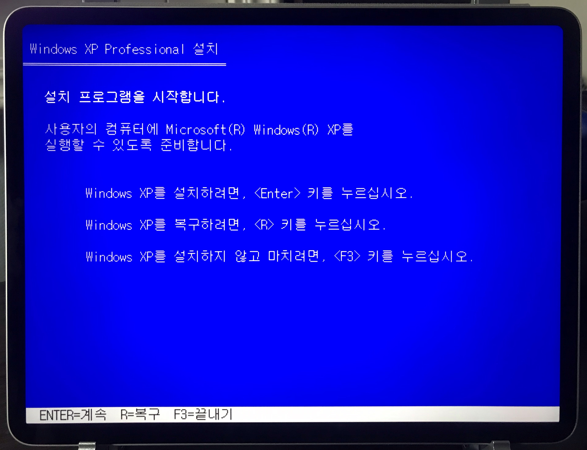

정말 오랜만에 보는 파란 화면이다. 필자는 이 화면을 안 본지 대략 십 년 이상 된 듯 싶다.

대충 설치 파티션을 잡아주면 파일을 복사하는 단계로 넘어간다.

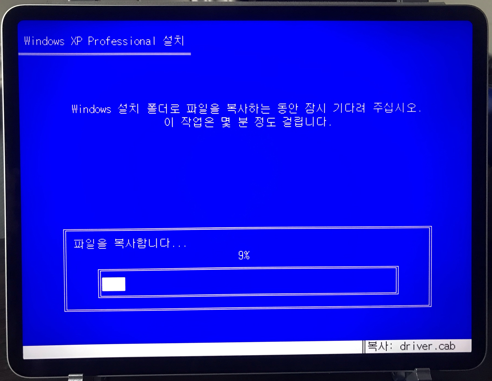

이제 조금 기다려주는 일만 남았다.

기다리다보면 설치 과정 중 일부가 끝났다며 자동으로 재부팅 한다는 안내가 뜬다.

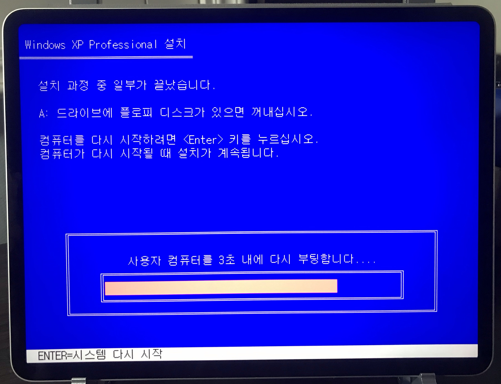

이제 iso 파일으로 부팅하는 게 아니라 하드 디스크 이미지로 부팅해줘야 한다.

가만히 있어도 하드 디스크로 부팅할 것 같지만, 그렇지 않은 경우 UTM 앱의 VM 설정을 변경해줘서 첫 번째로 부팅할 항목을 hdd로 설정하면 된다.

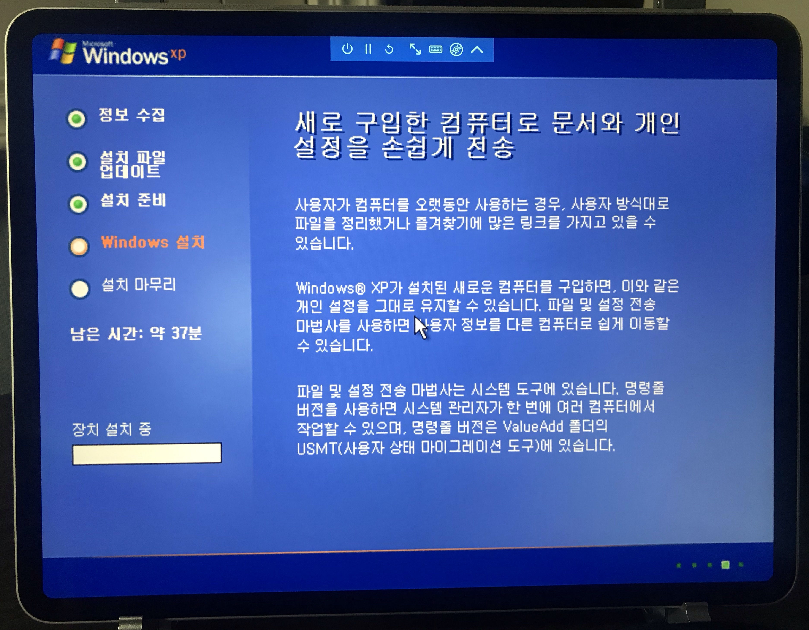

이 화면 역시 오랜만에 봐서 상당히 낯선 화면이다.

UI를 보니 XP가 얼마나 오래된 OS인지 조금 감이 잡히는 것 같다.

필자가 구한 iso 파일은 일명 무인 설치 버전이 아니었다.

따라서 아이패드 앞을 떠날 수 없고 앞에서 계속 기다렸다가 사용자 설정이 뜰 때마다 진행해줘야만 했다.

이제 조금 더 진행하면 정말 반가운 화면이 뜬다.

바로 XP 부팅 화면이다.

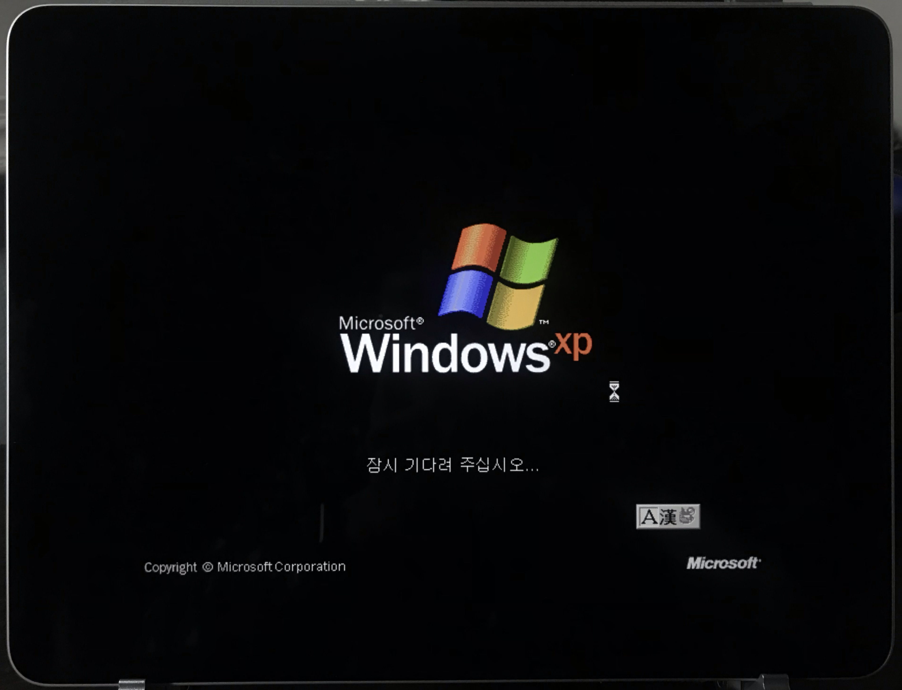

필자가 중학교 때도 XP를 사용한 적이 없었던 것 같은데...

이 화면을 다시 본 지도 정말 수 년이 지난 것 같다.

계속 진행하면 XP 특유의 초원 배경화면이 뜨며 XP 설치가 끝나게 된다.

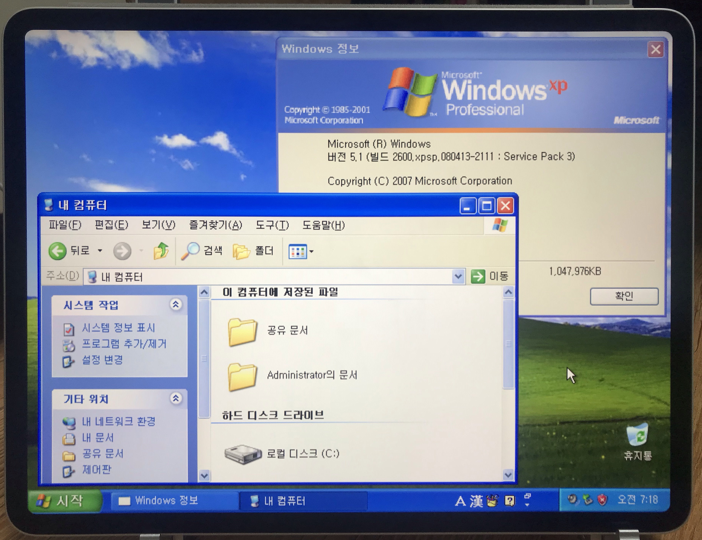

winver으로 확인한 XP 버전과, 탐색기 화면을 띄워놓고 찍은 사진이다.

이 화면을 보기 위해 3시간이 넘는 시간을 소모했다는 것... 너무 감격스럽다.

그러나 아이패드 프로의 강력한 A12Z 성능으로도 XP를 돌리기에는 아직 버거운 것 같았다.

반응 속도는 최악이며, 각종 프로그램도 잘 열리지 않았다.

UTM 공식 홈페이지를 보면, XP에서 게임도 돌리는 영상을 확인할 수 있다.

반면 필자가 설치한 XP는 10년 전 컴퓨터보다 느린 반응 속도를 보여주었다.

이러한 차이가 발생한 원인이 필자가 UTM 앱 설정을 잘못했기 때문일수도, XP 서비스팩 3을 설치했기 때문일수도 있다.

그러나 필자는 너무 느리고 수많은 오류가 뜨는 바람에 결국 3시간 넘게 설치를 끝내기가 무섭게 20분 만에 XP를 삭제하게 되었다.

### Windows 7

XP에 이어 두 번째는 윈도우 7이다.

윈도우 7 부터는 필자도 몇 번 혼자서 깔아본 적이 있을 만큼 친숙한 OS이다.

그래서 XP 만큼의 낯섦은 없었지만, 그래도 10에 비해 신선했다.

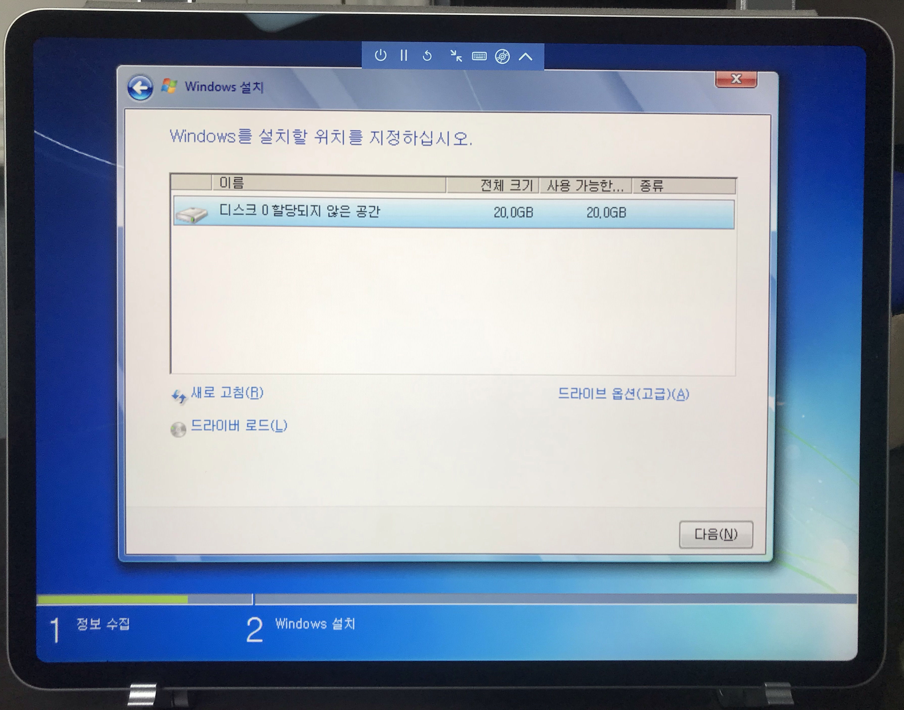

윈도우 7을 설치할 디스크를 선택하는 화면이다.

필자는 가상 하드 디스크 이미지의 용량을 20기가로 주었기 때문에, 저 사진에서 디스크 0가 20.0GB로 나타난다.

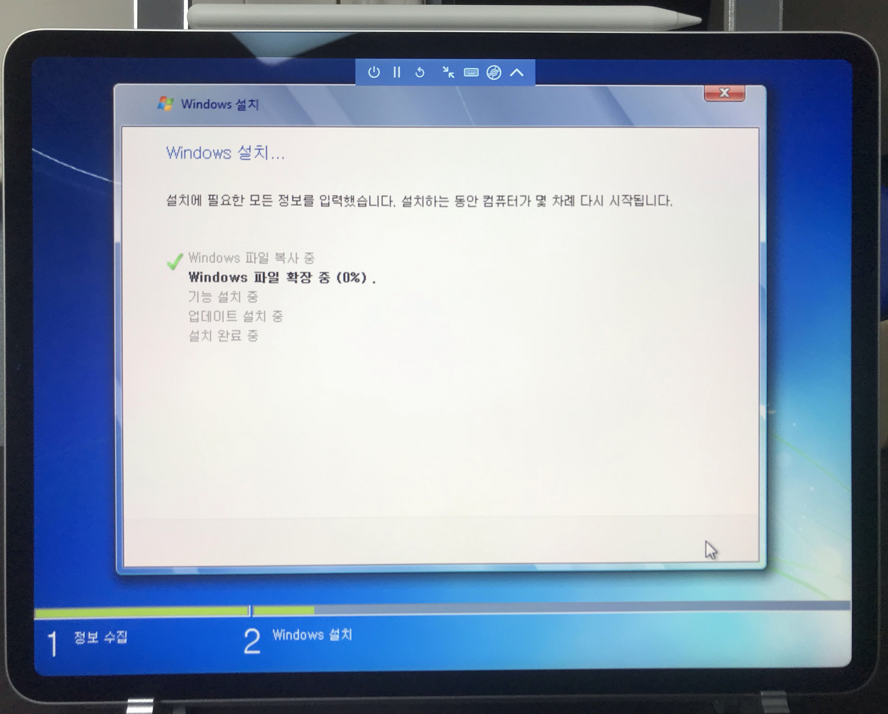

간단한 설치 정보 수집이 끝나면, 바로 윈도우 파일 복사가 시작된다.

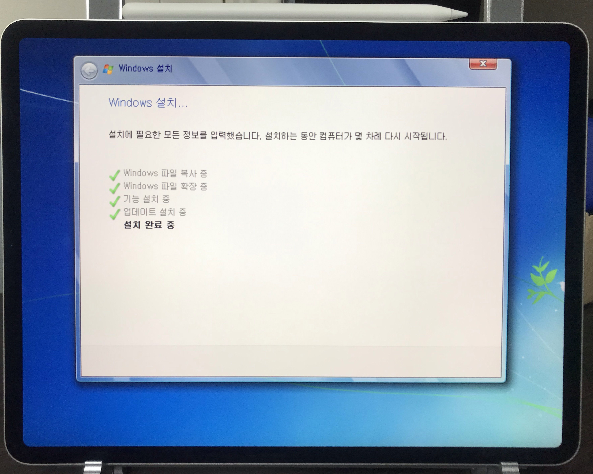

설치 완료 단계에서 시간을 조금 많이 잡아먹었지만, 인내심을 갖고 기다리니 진행이 되었다.

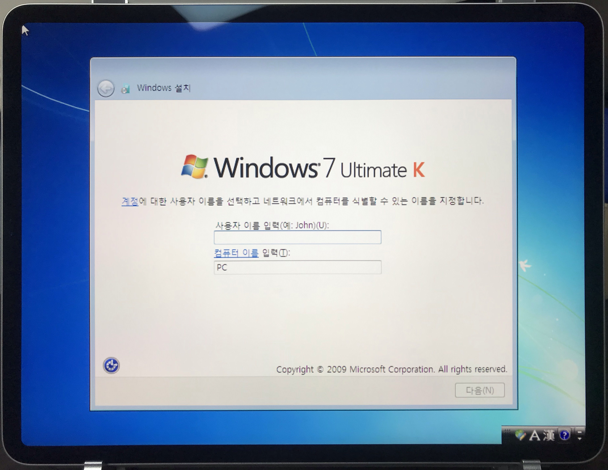

사용자 이름을 입력하는 단계까지 왔다.

블루투스 키보드와 마우스를 아이패드에 연결하면, 실제 PC와 다를 게 없어진다.

엄청 느린 컴퓨터지만...

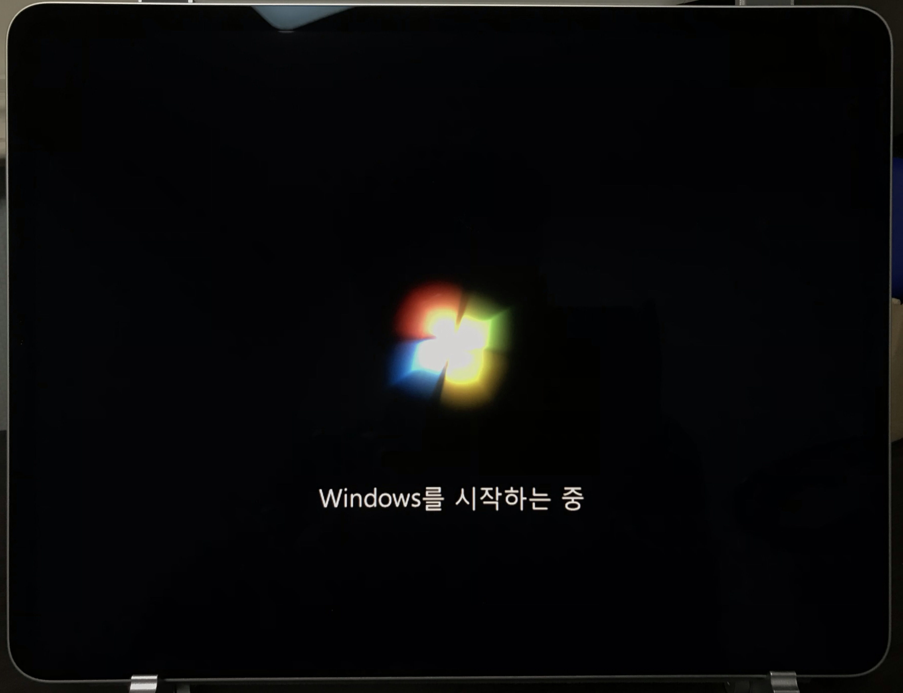

그러면 조금은 익숙한 윈도우 7 부팅 화면이 뜨며, 곧 이어 배경화면과 함께 윈도우 7 설치가 완료된다.

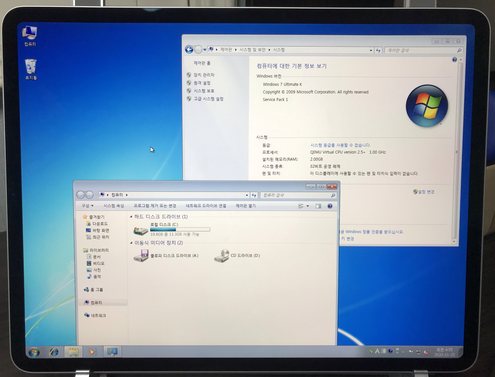

이번에도 역시 윈도우 버전과 탐색기를 같이 띄워놓고 사진을 촬영했다.

신기하게도 이미 서술한 XP와 후술할 10과는 달리, 필자가 설치한 7 버전은 그마나 쓸만한 반응 속도를 보여주었다.

사운드도 처음에는 잡지 못했지만, UTM 설정에서 hda (Intel HD Audio)로 변경해주니 인식되었으며 해상도를 변경해주니 꽤 그럴듯한 모습이 나왔다.

그러나 단순히 탐색기를 여는 작업 정도만 할 수 있으며, 여기서 사양을 먹는 작업은 못할 것 같았다.

따라서 윈도우 7에서 VSCode 등의 IDE를 설치해보려는 생각은 곧장 사그라들었다.

### Windows 10

윈도우 7에 이어 설치한 버전은 바로 윈도우 10이었다.

비스타와 8 버전은 과감하게 생략하였다.

필자가 설치한 윈도우 10 버전은 1607 x32버전이다.

사실 필자는 이 버전을 설치하기 전에 1903 x64를 설치했었다. 그러나 이 버전은 설치 후 부팅이 되지 않았다.

유튜브 영상을 계속 검색하여 UTM으로 윈도우 10을 설치한 영상을 확인하였고, 한 영상에서 1607 버전을 설치했다는 것을 확인한 후에서야 1607을 설치하게 되었다.

이 1607 x32 ko 버전의 iso를 얻는 것도 상당히 힘들었다.

오래된 윈도우 iso 파일을 다운받을 수 있도록 도와주는 프로그램을 구글에서 찾은 후에, 그 프로그램을 통해서야 그제서야 iso 파일을 다운받을 수 있었다.

글로 옮기니 짧은 것 같지만, 여기까지 체감 상 대략 반나절 정도의 시간이 흐른 것 같다.

긴 서론을 끝내고, Windows 10 1607 x32를 설치하는 사진을 올리겠다.

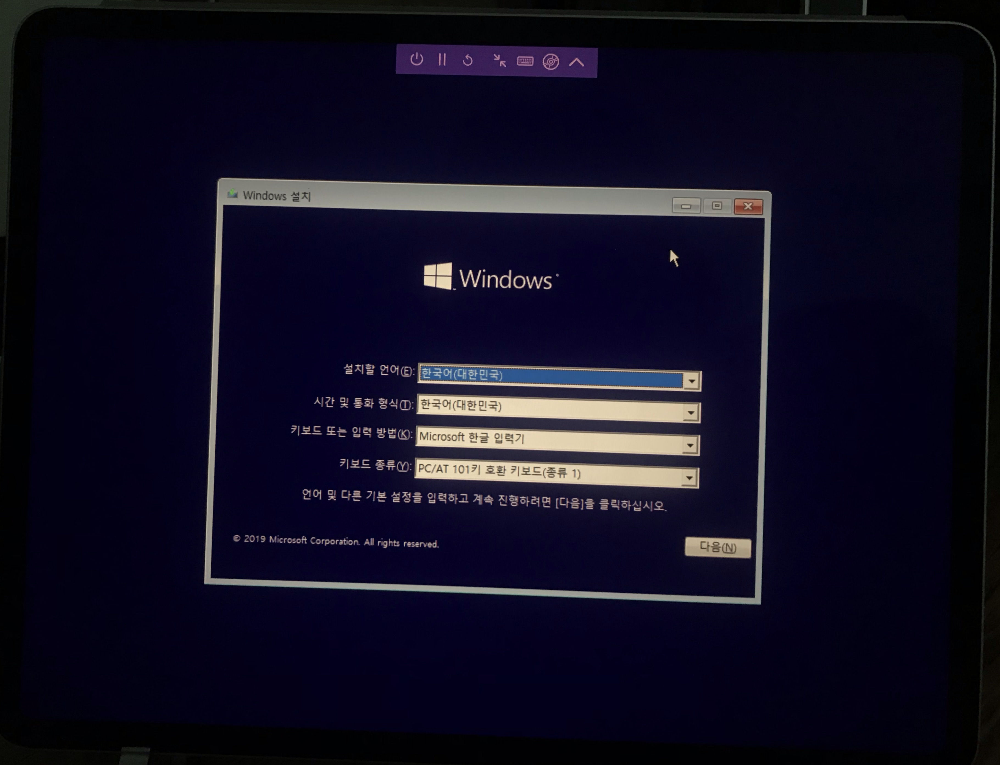

이제 오히려 익숙해진 윈도우 10 설치 화면이다.

참고로 사진 색상이 조금 이상할 수 있는데, 필자가 노출을 줄이고 촬영했기 때문이다.

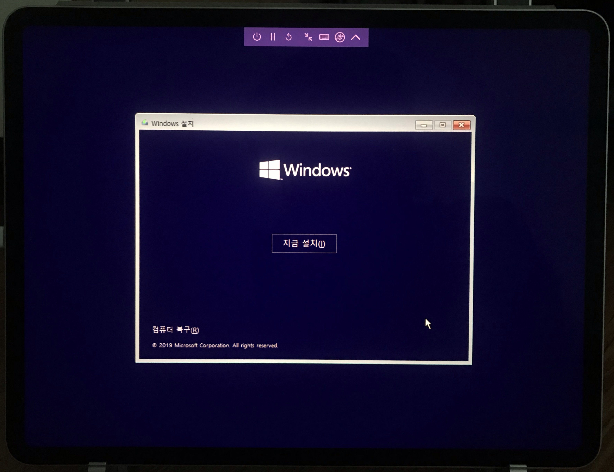

지금 설치를 눌러 윈도우 10을 아이패드에 설치해보자.

각종 디스크 파티션 할당 단계는 모두 생략하고, 윈도우 설치 장면만 찍었다.

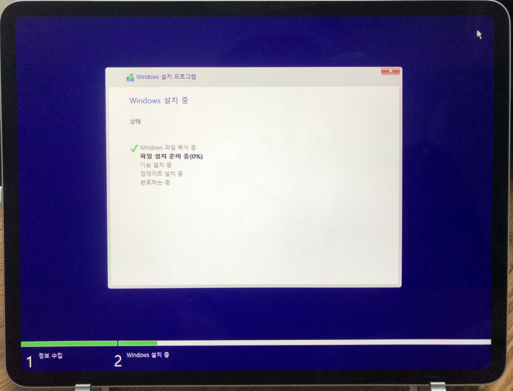

윈도우 7과 비슷한 화면의 윈도우 설치 장면이다.

긴긴 기다림이 지나고 계정 설정을 끝내면, 이제 다음과 같은 윈도우 10 로고 화면을 볼 수 있다.

이 글에서는 윈도우 10 설치를 빠르게 생략하였지만, 실제로 여기까지 도달하는 데 걸린 시간도 생각보다 만만치 않다. 오랜 기다림과 강한 인내심이 필요하였다.

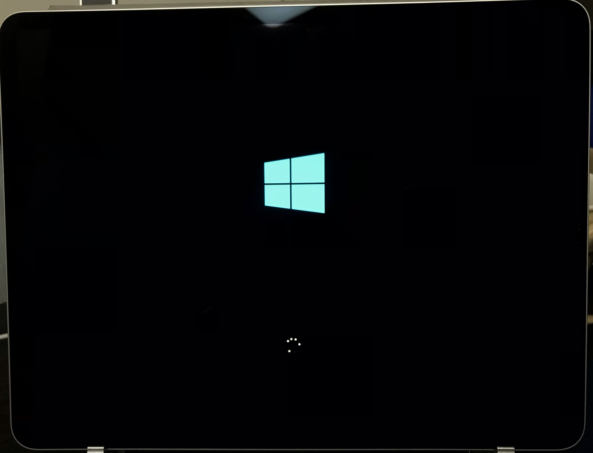

이제 계정 설정 등의 초기 설정을 마치면, 아래 사진처럼 로그인 화면을 볼 수 있다.

역시 초기 설정 사진은 블로그 글 작성 과정에서 전부 탈락하여 생략되었다.

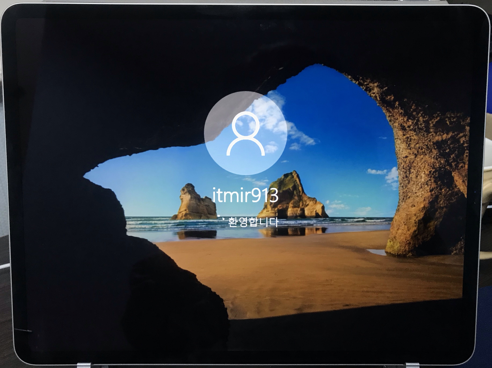

환영합니다!

이 환영을 받으려고 몇 시간을 윈도우 10 설치에 쏟아부었는지 모르겠다.

물론 설치 내내 다른 작업을 하지 못했던 것은 아니지만, 그래도 피곤한 시간이었다.

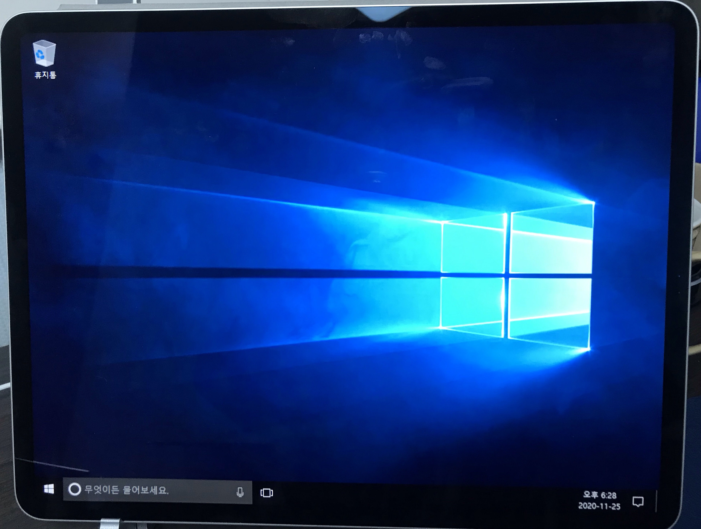

이제 드디어 윈도우 10 배경화면이 나타났다.

오른쪽 아래의 시간을 보시면, 오후 6:28이라고 되어있다. 거의 하루 종일 걸려서 설치한 셈이다.

이제 뭐라도 구경해보려고 했는데, 필자의 생각보다 렉이 너무 심했다.

그리고 여기서 재부팅을 했더니, 배경화면이 검은 화면으로 변경되었다.

엣지 브라우저라도 실행해보려고 했는데, 반응하지 않고 오류만 뜬다.

시작 화면과 검색 화면 역시 아무리 클릭해도 반응하지 않았다.

오류만 뜨고 전혀 사용할 수 없는 동작 속도에 지친 필자는 이번에도 윈도우 버전만 촬영하였다.

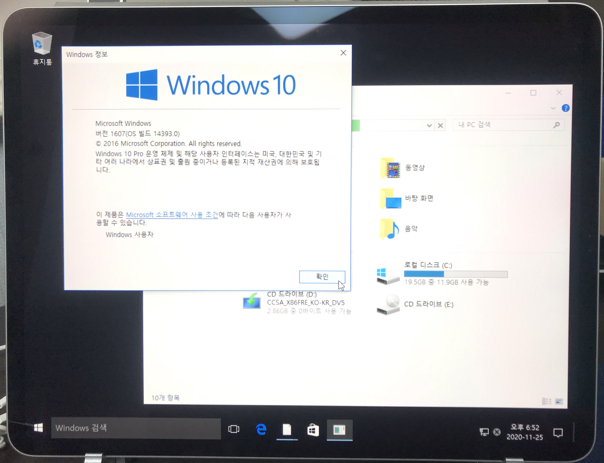

이 사진을 찍은 후, 필자는 윈도우 10을 곧장 삭제하였다.

아직까지는 호기심으로도 동작해볼만한 단계가 아닌 듯 하다.

### Mac OS X

슬슬 UTM 앱으로 돌리는 VM이 힘들어질 무렵, 마지막으로 도전해본 OS는 바로 맥이었다.

사실 아이패드에서 맥을 돌려보는 것을 가장 처음에 하고 싶었는데, 마땅한 iso 파일을 찾기가 생각보다 까다로워서 먼저 윈도우부터 설치해본 것이다.

윈도우와는 달리, Mac OS X를 설치하기 위해서는 UTM 앱의 시스템 설정을 변경해야 한다.

Mac OS X의 시스템 설정은 다음과 같다.

아키텍쳐: ppc (PowerPC)

시스템: mac99 (Mac99 based PowerMAC)

만약 아키텍쳐와 시스템을 윈도우와 동일한 설정으로 한 뒤에 iso 파일으로 부팅하면, 오류가 뜨며 실행되지 않는다.

참고로 필자가 선택한 Mac OS 버전은 Mac OS X 10.5.4 Leopard 버전이다.

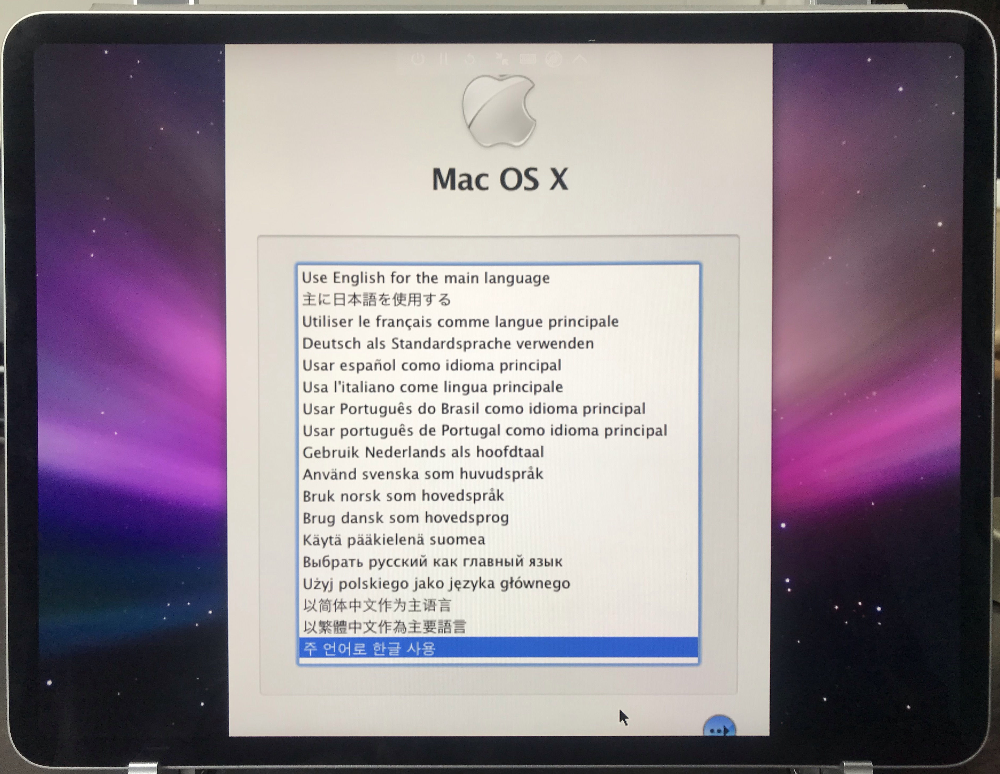

설치 iso로 부팅하면, 사용할 언어를 선택하는 화면이 가장 먼저 뜬다.

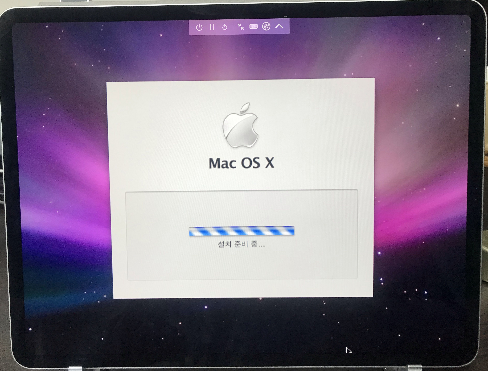

설치 준비중...

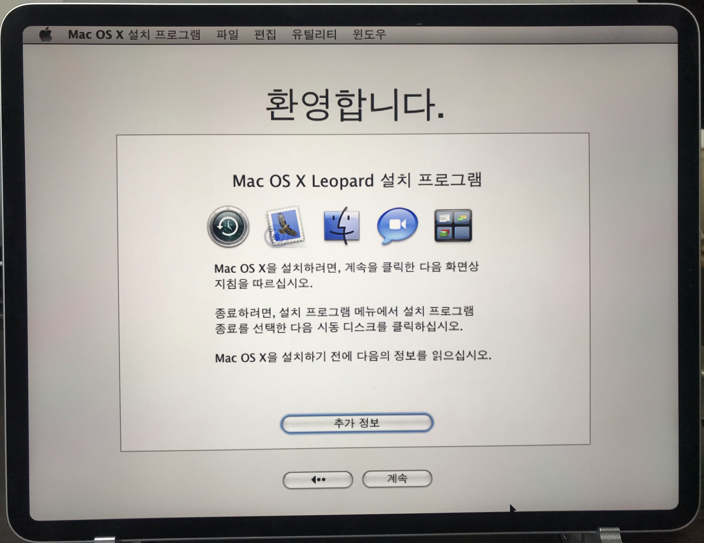

맥을 한 번도 접해본 적이 없어서 필자는 이 설치 화면도 낯설지만, 누군가에게는 이 화면이 추억의 화면일 것 같다.

계속 버튼을 눌러 진행하고 싶지만, 먼저 디스크를 포맷하는 과정을 해주어야 한다.

유틸리티 - 디스크 유틸리티로 들어가서 UTM에서 생성한 가상 디스크를 포맷해준다.

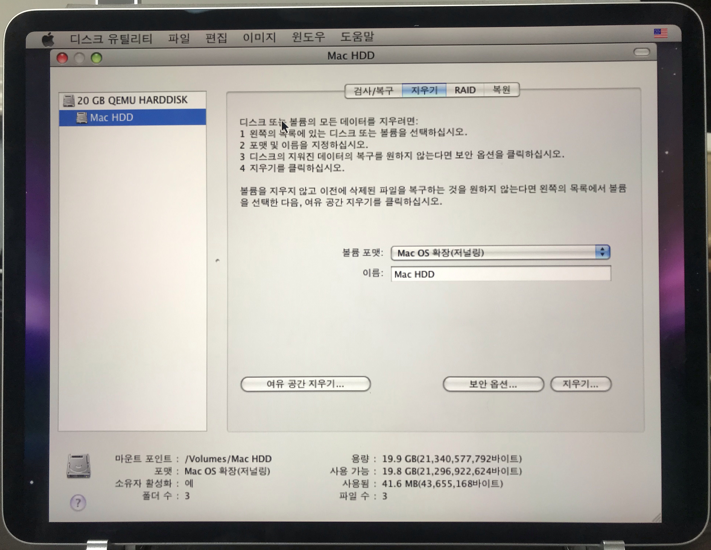

필자는 Mac HDD라는 이름으로 포맷했다. 용량은 20 GB.

이제 디스크 유틸리티를 끄고 다시 돌아오면 어디에 Mac OS X를 설치할 것인지 결정하라는 GUI 화면이 뜬다.

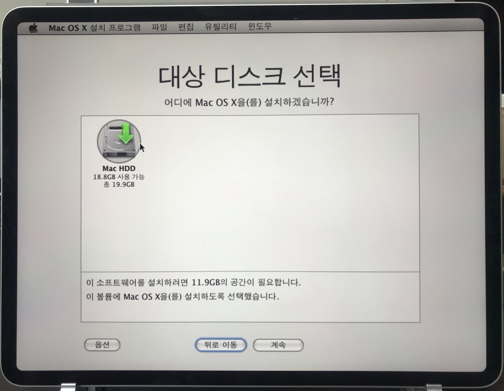

디스크 유틸리티에서 디스크를 포맷하지 않으면, 여기에 아무 것도 뜨지 않는다.

Mac HDD를 선택한 후, 계속 버튼을 눌러 진행해본다.

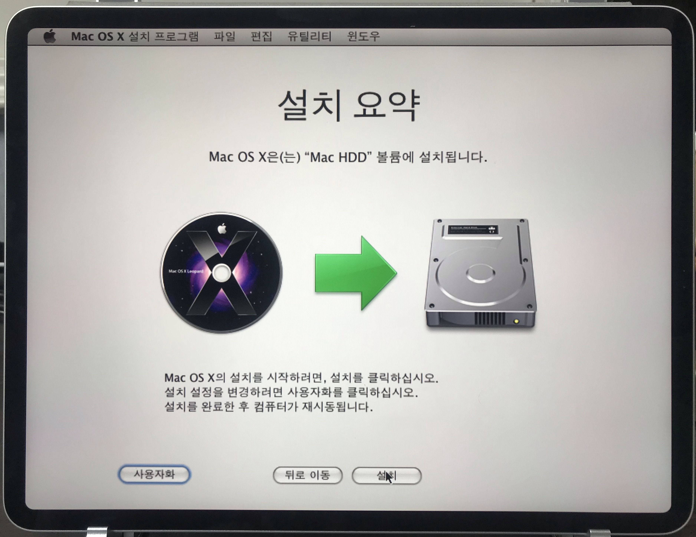

설치 요약 화면이 뜬다.

직관적인 그림으로 Mac OS 설치를 알려주었다.

당연히 설치 버튼을 눌러 진행하였다.

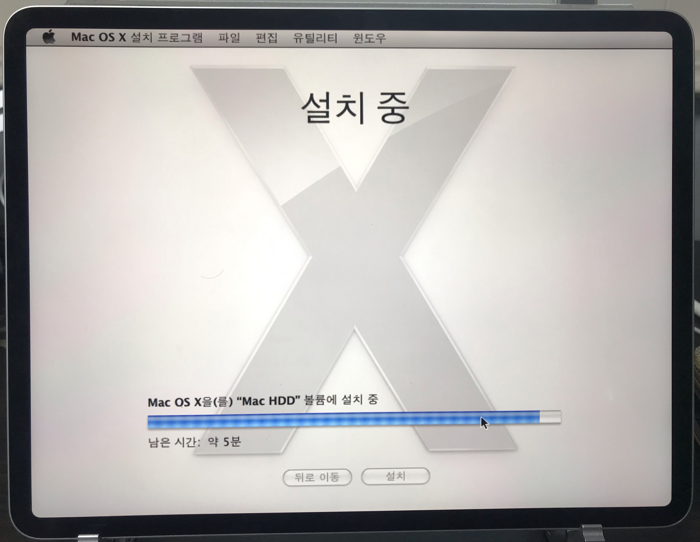

그리고 엄청난 기다림의 시간을 다시 겪어야 했다.

하지만 설치 결과는 아래와 같았다.

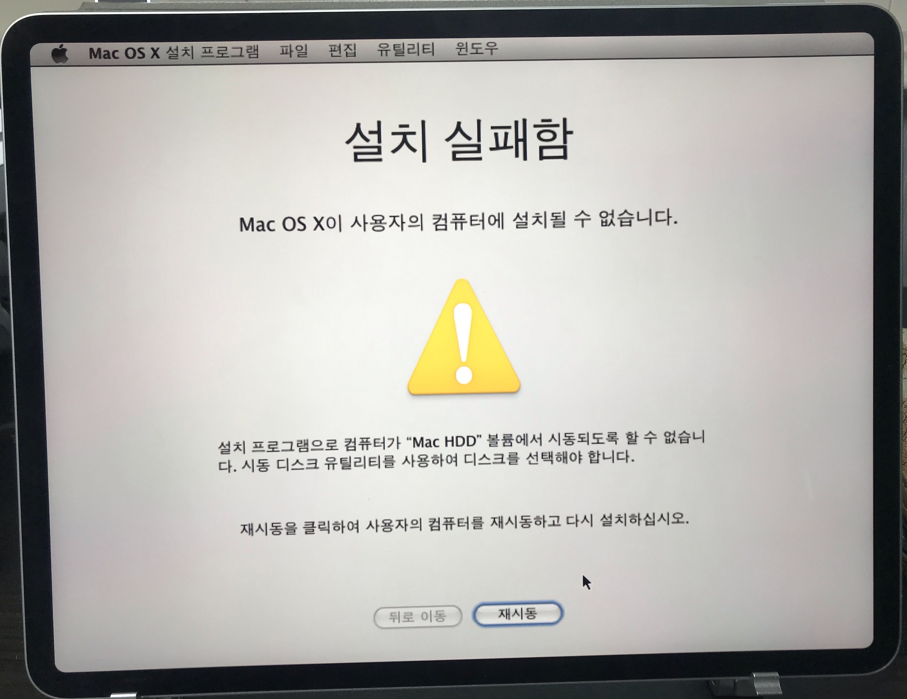

남은 시간: 1분...

이 글씨가 대략 10분 넘게 유지되다가, 위 사진처럼 Mac OS 설치에 실패하였다는 화면이 떴다.

필자는 이대로 Mac 설치가 수포로 돌아가는 것 같아서 마음이 아팠다.

그냥 지워버릴까 고민하다가 hdd로 부팅 한 번 해보고 지우자고 생각했다.

그래서 iso 파일을 제거하고, hdd로 부팅할 수 있도록 UTM 앱의 설정을 변경해주었다.

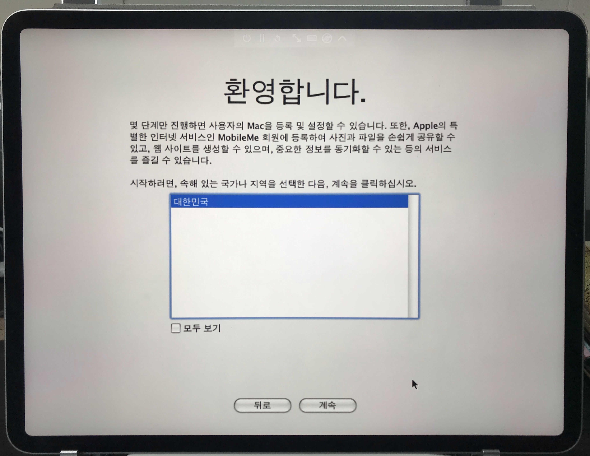

???

그랬더니 이렇게 다음 단계가 정상적으로 진행되는 것이었다.

그리고 초기 설정을 모두 마쳤더니 이렇게 맥이 등장했다.

파인더를 열어놓고 다시 찍어보았다.

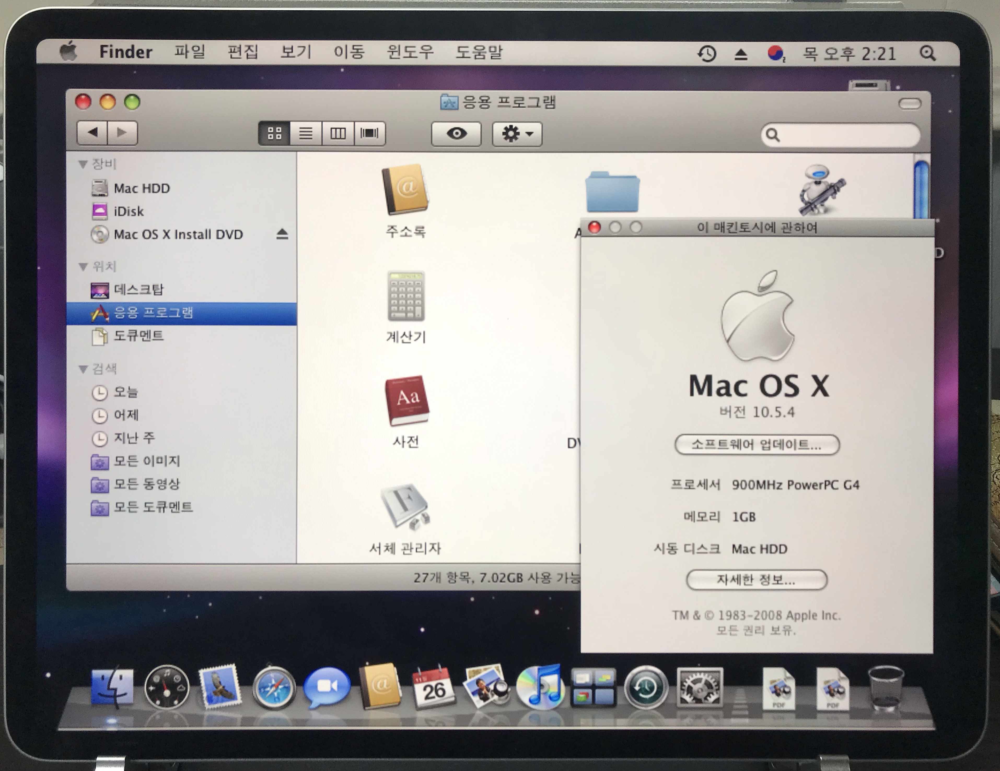

그러나 필자의 기대와는 달리 맥 역시 장난감으로 사용하기에도 반응 속도가 너무 느렸다.

아쉽지만 몇 번 더 실행해보다가 이 역시 삭제할 것 같다.

## 결론

UTM 앱은 생각보다 재미있었다.

공식 홈페이지에서 받을 수 있는 샘플 VM에는 안드로이드와 우분투까지 있었다. 두 OS 모두 다운받아서 실행해보았지만 필자의 인내심 부족으로 부팅되는 사진을 얻지는 못했다.

개선이 더 이루어진다면 아이패드 프로 정도의 AP 성능으로는 충분히 저사양의 OS 정도는 돌릴 수 있지 않을까 기대한다.