## XPEnology를 설치하기까지

지난 달, 당근마켓에 사무용 컴퓨터가 2만원에 올라왔었습니다.

사양은 다음과 같았는데요.

CPU: Intel Celeron G1840

HDD: 450GB

RAM: 2GB

VGA: Intel HD Graphics Family

MAIN BOARD: H81M-DS2V

최신 사양과 비교하기에는 성능이 낮은 매물이었지만, 필자는 이 컴퓨터를 사서 나스 용도로 굴려보고 싶었습니다.

일요일 새벽에 이 매물을 보고 채팅을 걸었고, 당일 오후 1시에 약속을 잡아 2만원에 거래를 완료했습니다.

그런데 집에 와서 돌려보니 파워가 나갔더라고요..

주변 컴퓨터 대리점에 가서 다른 파워로 테스트를 해보니 정상적으로 부팅되었습니다.

이대로 버리기에는 아까워서 파워를 하나 구입하기로 결정합니다.

가격은 대략 15000원. 슬림형 케이스라 M-ATX 규격으로 구입해야 했습니다.

기존 장착된 파워와 동일한 용량인 250W 파워가 도착한 뒤, 파워를 교체하니 정상 부팅이 되더라고요.

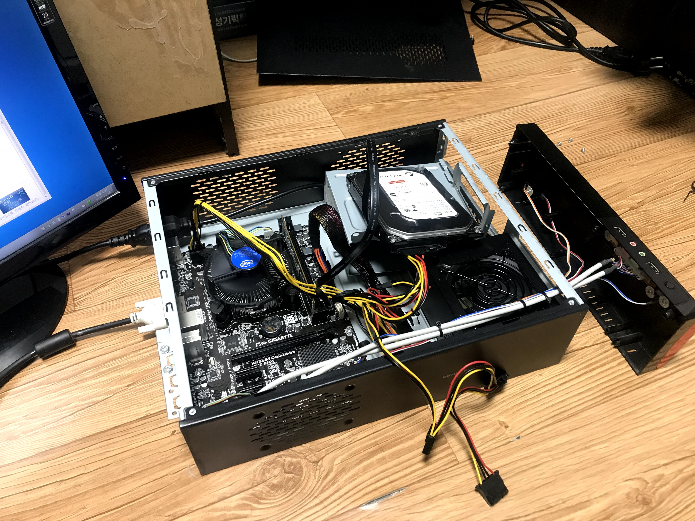

여기까지 들어간 비용은 총 35000원.

이제 본격적으로 헤놀로지를 설치할 시간이 되었습니다.

## Synology Web Assistant

시놀로지 DSM의 수정판이라 말할 수 있는 헤놀로지를 자신의 컴퓨터에 설치하려면 먼저 부트로더 역할을 해줘야 하는 USB가 필요합니다.

이 USB는 부팅 시에만 필요하고 시놀로지 부팅 이후에는 사용되지 않으므로 용량이 클 필요가 없습니다.

오히려 용량이 클 수록 낭비가 되지요...

집에 굴러다니던 2GB짜리 USB가 드디어 자기 할 일을 찾았습니다. ㅋㅋ

구글링을 통해 알아낸 방법으로 USB에 부트로더를 작업한 후, USB로 부팅합니다.

이후 랜선을 꼽은 뒤 다른 컴퓨터로 [http://find.synology.com](http://find.synology.com/#)에 접속합니다.

그러나 초반에는 계속 아래처럼 DiskStation을 찾을 수 없다는 오류가 뜨더라고요.

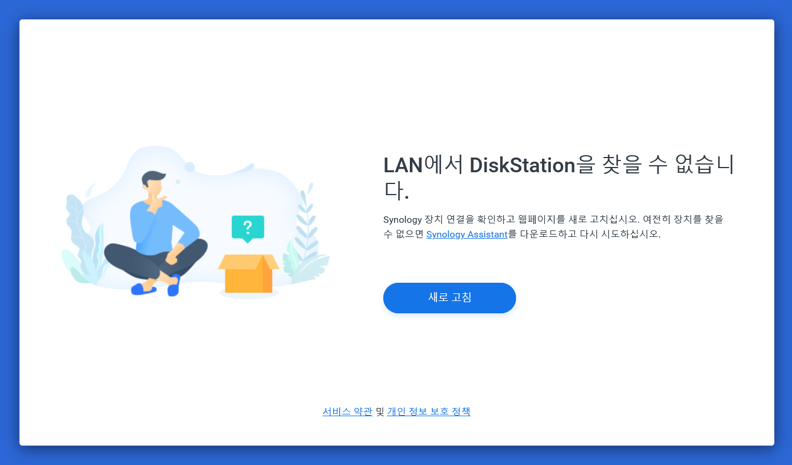

원인은 간단하게도, 같은 네트워크 상에 두 컴퓨터가 존재하지 않았던 것이었습니다.

제가 꼽은 랜선이 공유기에서 나온 랜선이 아니라, 모뎀에서 나온 랜선이더라고요...

원인을 알아낸 후, 같은 네트워크 상의 다른 컴퓨터에서 작업을 계속합니다.

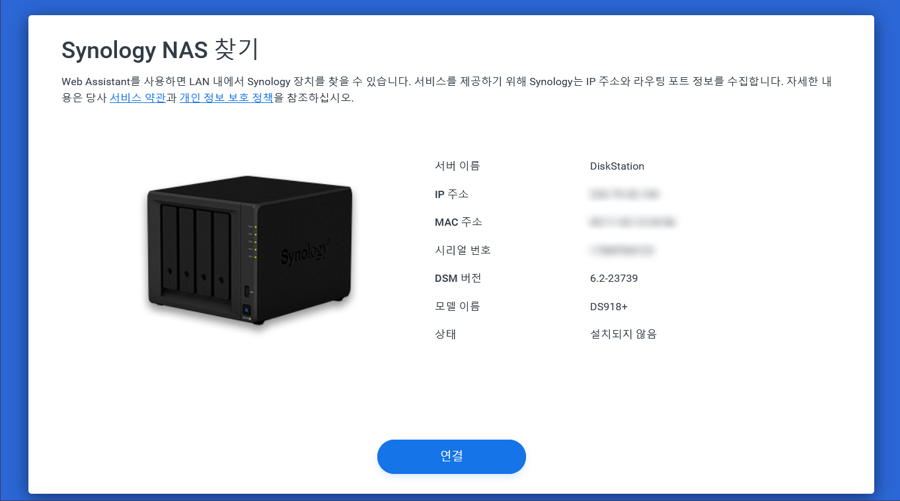

같은 네트워크 상에 나스와 컴퓨터가 존재한다면, Synology Web Assistant 상에 이렇게 위 스크린샷처럼 헤놀로지가 잡히게 됩니다.

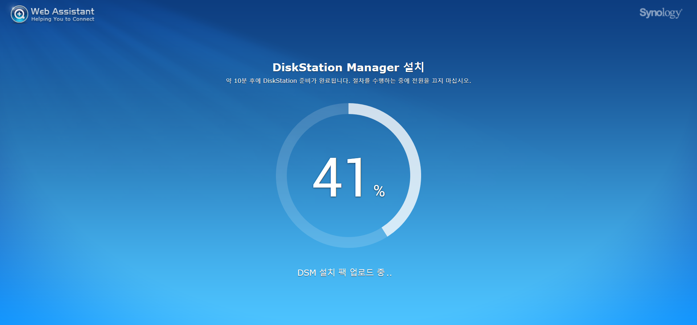

구글링에서 찾은 방법대로 DSM을 설치해줍니다...

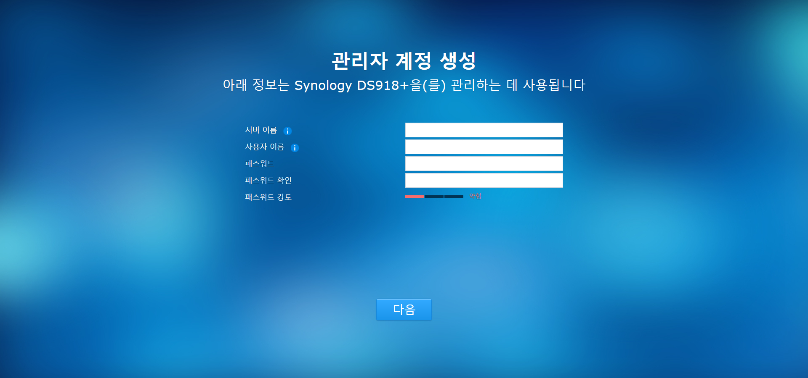

관리자 계정을 생성하면 첫 작업은 끝나게 됩니다.

나중에 돌이켜보니, 이 작업이 이제야 첫 삽을 뜬 셈이더라고요.

## 각종 서비스 구축하기

이제는 DSM 상에서 시놀로지의 각종 서비스를 구축해줄 차례였습니다.

현재 제가 구축한 서비스 중에서 몇 개를 골라보면 다음과 같습니다.

1. Docker: Youtube-dl-nas (youtube-dl을 이용하여 동영상 다운로드)

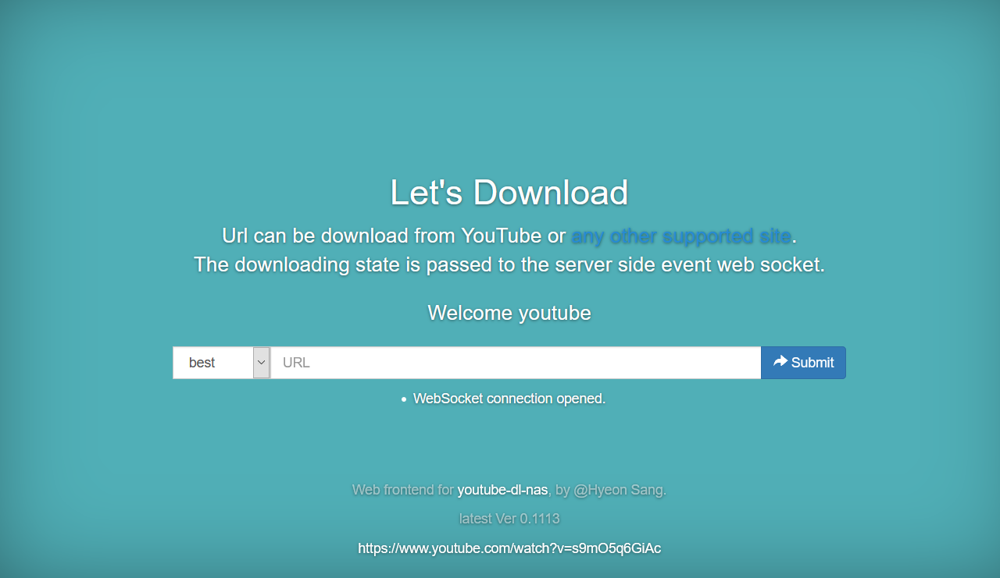

2. WebDav 서버 구축 (나스 파일에 직접 접근하기)

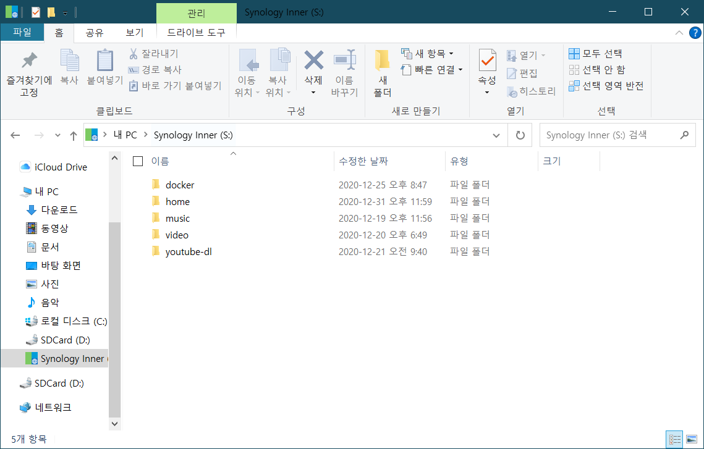

3. Calibre Book Server (전자책 관리 도구)

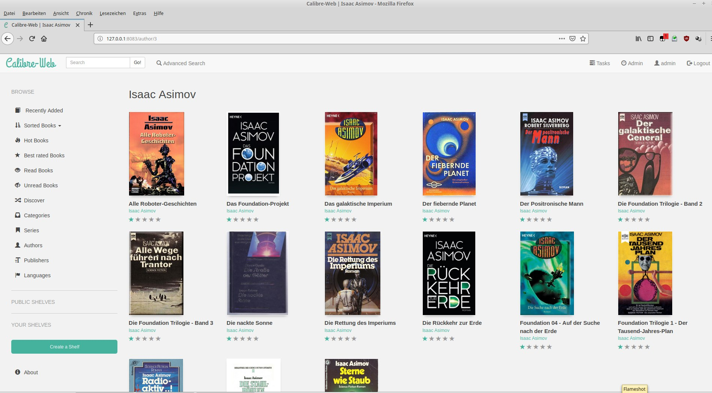

출처: https://github.com/janeczku/calibre-web

이 외에도 시놀로지의 Moments, Download Station 등의 설정도 포함되어 있습니다.

## DuckDNS.org

지금까지는 내부 IP 주소를 통해 접속하였습니다.

이 내부 IP는 172.30.xx.xx, 192.30.xx.xx처럼, 내부 망(공유기 등)에서만 유효한 IP 이므로 외부 네트워크에서는 나스에 접근할 수 없습니다.

이 나스를 이제 외부에서도 접속할 수 있도록 설정하려고 합니다.

외부에서 접속하는 방법은 크게 두 가지 정도 있습니다.

물론 공유기 포트포워딩은 이미 되어 있다는 전제 하에 설정해야 합니다.

1. 외부 IP 주소를 직접 입력해서 접속하기.

2. DDNS를 이용하기

집의 공유기 공인 IP를 쳐서 나스에 접속할 수도 있겠지만, 이는 상당히 불편합니다. IP 주소를 암기하기도 힘들고요.

게다가 따로 통신사에 돈을 내서 IP를 고정하지 않는 이상, 통신사에서 할당된 IP는 주기적으로 바뀌는데요.

외부에 있는 동안 IP 주소가 변할 경우, 새로운 IP를 알아낼 때까지 외부 접속은 불가능해진다는 치명적 단점이 있습니다.

이러한 이유로 DDNS가 필요합니다.

시놀로지 정품의 경우에는 시놀로지 자체에서 제공하는 도메인인 xxx.synology.me로 설정할 수 있는데, 헤놀로지의 경우에는 불가능합니다.

저는 DuckDNS를 선택했습니다.

무료라는 점이 가장 큰 이유였습니다.

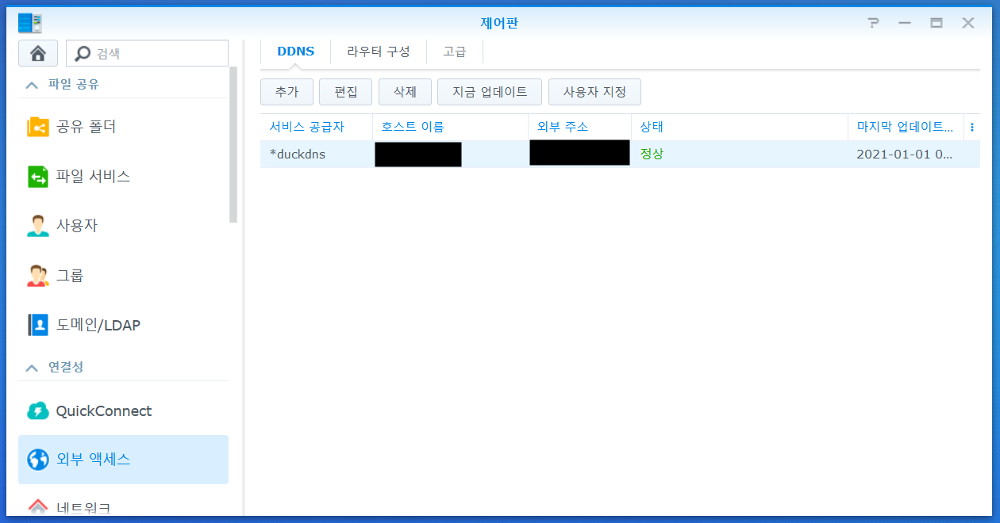

시놀로지 제어판의 DDNS에 DuckDNS를 등록하는 것으로 끝이 납니다.

이제 제가 발급받은 도메인만 입력하면 외부에서도 집에 있는 나스에 접속할 수 있게 되었습니다.

## Nginx Proxy Manager

그런데 이렇게 나스를 구축하다보니 문제가 발생했습니다.

바로 나스에 설치한 서비스에 접근하려면, 포트 번호를 암기하고 있어야 한다는 문제였습니다.

또한, 이후에 각종 서비스를 추가할 때마다 포트 포워딩과 함께 암기해야 하는 포트가 계속 늘어난다는 점도 걸리고요.

이는 Calibre(전자책 관리 도구)를 추가하면서 직면한 문제였습니다.

Webdav 서버, Youtube 다운로드 서비스를 추가하면서 포트를 각각 열어줌과 동시에 각 포트를 암기하고 있어야 했습니다.

그런데 여기에 캘리버 서비스를 추가하면서 제가 암기해야 하는 포트가 3개로 늘어난 겁니다.

이후 각 서비스를 추가할 때마다 포트를 계속 암기해야한다고 생각하니 눈 앞이 아찔해졌습니다.

따라서 저는 포트를 암기하지 않을 방법을 찾아야 했고, 시놀로지 제어판에서 역방향 프록시를 발견했습니다.

하지만 이 서비스는 적어도 제 경우에선 작동하지 않았고, 저는 차선의 방법을 찾아야 했습니다.

그리하여 적용한 서비스가 Nginx Proxy Manager 입니다.

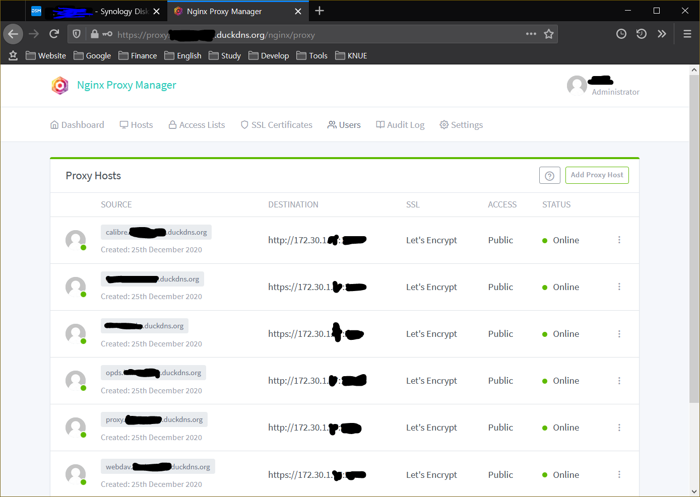

이제 공유기 포트포워딩을 깔끔하게 정리할 수 있게 되었어요.

포트를 암기할 필요도 없어졌다는 이점도 있고요.

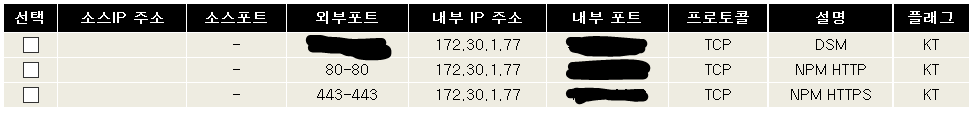

또한, Let's Encrypt SSL 인증서를 적용함과 동시에 인증서 자동 갱신 스케쥴도 등록했습니다.

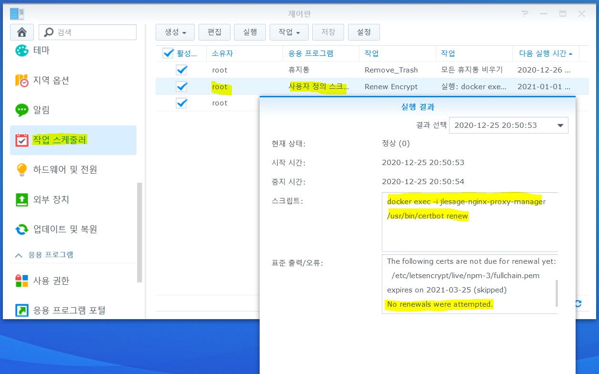

여기까지 설정하기까지 대략 일주일 이상의 시행착오를 겪은 것 같네요...

이제 NPM을 통해 포트 번호를 외울 필요 없이 도메인 주소를 통해 각종 서비스에 바로 접속할 수 있게 되었습니다!

## Up-Time 12 Days

위와 같은 험난한 설정을 마치고, 나스용 컴퓨터의 전원을 안 끈 상태로 계속 작동시켰습니다.

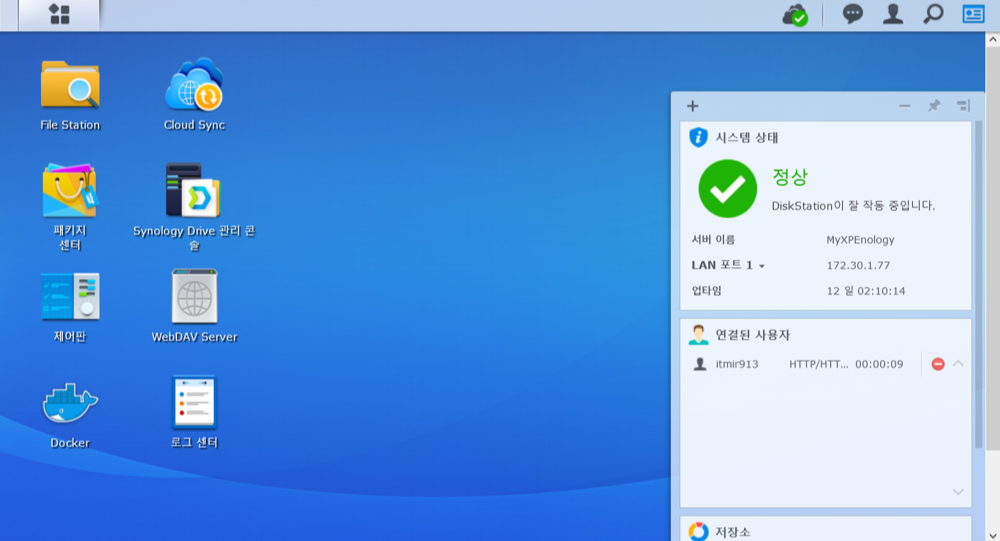

오늘 2021년 01년 01일 기준 12일 동안 중간에 전원 꺼짐 없이 연속으로 작동했네요.

정식 시놀로지 제품과 비교할 수는 없지만, 아직까지는 꽤 안정적으로 작동하는 것 같았습니다.

## 결론

이 서버가 이대로만 계속 지속된다면 좋겠네요.

저렴한 가격에 상당히 만족스러운 나스 서버를 얻은 것 같습니다.

이상 Synology 서버 구축기를 마칩니다.

감사합니다.

## Uptime 1 Month

2021.01.20 추가합니다.

오늘로 헤놀로지 나스가 연속으로 구동된지 한 달이 지났습니다.

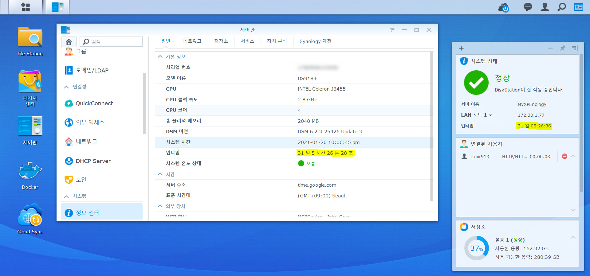

이렇게 한 달 동안 연속으로 작동하는 모습을 보니 나스 안정성에 대한 의문을 조금 씻을 수 있지 않을까 싶습니다.

이제 나스에 대한 관심을 조금씩 접어도 될 것 같아 기분이 좋네요.
