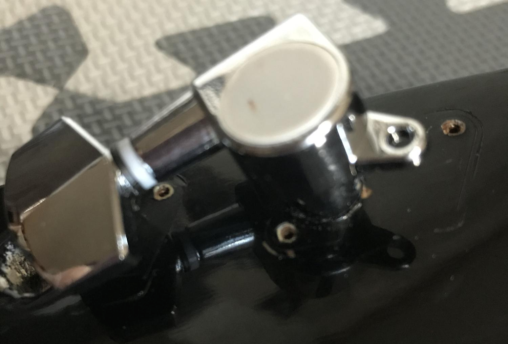
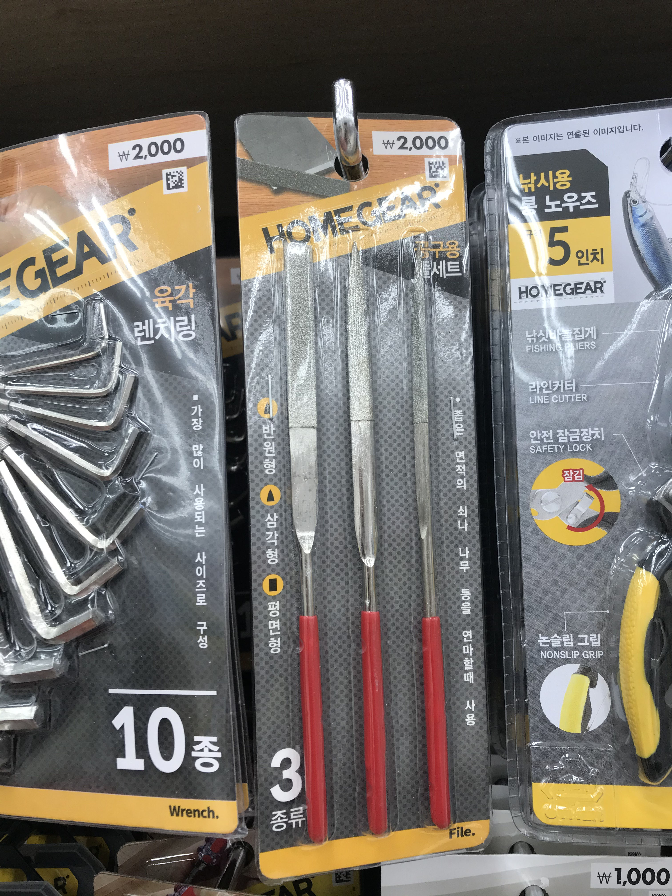
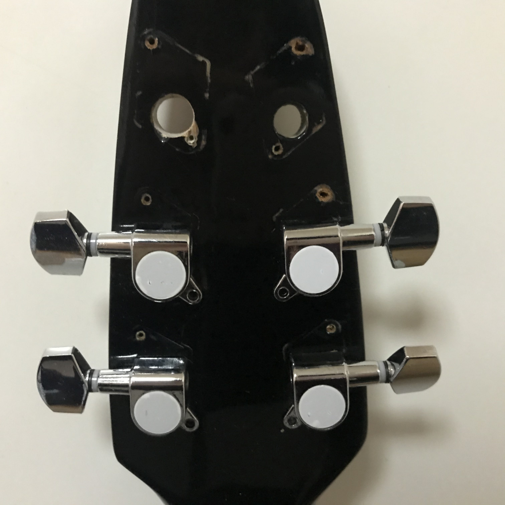
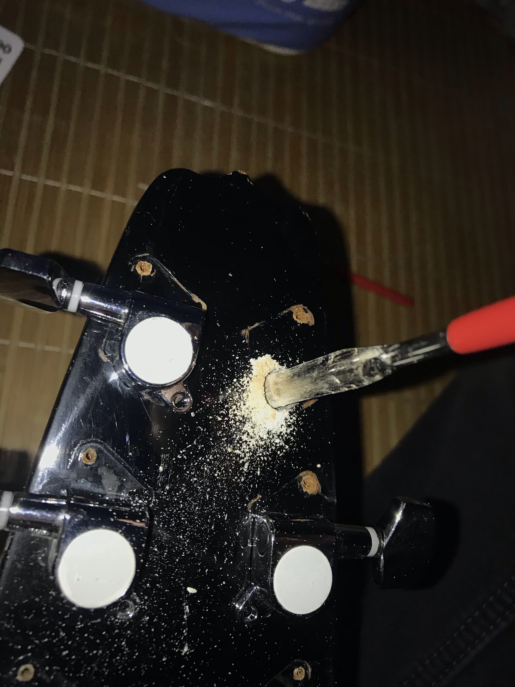
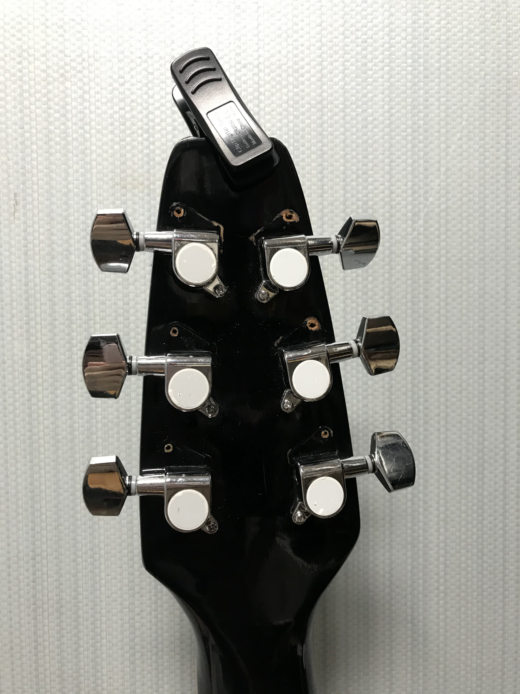

## 서론

지난 1월 5일 화요일, 당근마켓에서 파손되어 방치된 통기타를 나눔받아왔습니다.

먼지를 털고 프렛의 녹을 적당히 제거한 뒤, 헤드머신을 점검했는데요.

6개의 헤드머신 중 거의 절반 넘게 파손되어 사용할 수가 없는 지경이더라고요..

그냥 버리기에는 여기에 들인 시간이 아까웠기에 저는 인터넷에서 최저가로 기타 헤드머신을 구입했습니다.

그리고 금요일인 오늘, 줄감개(헤드머신)가 도착했습니다.

원래는 목요일 즈음 도착할거라고 예상했는데, 하필이면 이 기간에 폭설이 내려서 하루가 늦어졌습니다.

설레는 마음으로 새로운 헤드머신을 끼웠는데, 여기서 문제가 발생했습니다.

## 헤드머신 구멍 크기가 맞지 않는 상황

통기타 헤드 부분의 구멍이 너무 작아서 새로 산 헤드머신이 들어가지 않는 문제가 발생한 겁니다.

이렇게 크기가 안 맞아서 구입한 헤드머신 6개가 모두 무용지물이 되었습니다..

인터넷을 검색하니 그냥 리페어샵에 맡기라는 말만 나오더라고요. ㅜㅜ

물론 비싼 기타라면 혼자서 무언가를 할 생각을 하지 말고 그냥 전문가에게 부탁드리는 게 맞습니다.

하지만 이 기타의 헤드머신을 교체하기 위해 그정도의 시간과 노력, 비용을 투자하기란 솔직히 아깝더라고요.

그리고 중요한 건, 주변에 기타 수리점이 아예 없다는 겁니다.

버스타고 멀리 나가야 해서 수지타산이 안 맞더라고요.

여기서 끝났다면 이 기타는 아까워도 그냥 버려졌을 겁니다.

## 해결책

이 방법은 필자의 경험담이며, 필자가 권하는 방법은 절대 아닙니다.

기타 수리점에 기타를 맡길 생각이 없으신 분들만 시도하시기 바랍니다.

이를 따라함으로써 발생하는 모든 문제는 필자가 책임지지 않습니다.

헤드머신의 구멍을 넓힐 방법을 생각해보았습니다.

먼저 사포를 길게 잘라서 다듬어보는 방법을 해보았는데요.

갈리긴 갈리는데, 수십 시간이 걸릴만한 속도였습니다...

그리고 해결책은 다이소에서 찾을 수 있었습니다.

다이소 공구 코너에서 아래와 같은 공구를 발견했습니다.

"좁은 면적의 나무를 연마할 때 사용"

이 문구를 보고 재빨리 집어왔어요.

결과는 성공입니다..!

통기타 헤드의 구멍을 저 반원형 공구로 연마하면 구멍을 넓힐 수 있습니다.

다이소가 근처에 없거나, 주변 다이소에 이런 공구가 없으신 분들을 위해 쿠팡에서 찾은 제품 몇 가지 링크를 걸어두겠습니다.

[Tree 3p 세공용 야스리 세트](https://coupa.ng/bQ7cxT)

[제이앤씨 다이아몬드 야스리 10종 세트 160 x 4 mm](https://coupa.ng/bQ7cJv)

위 링크를 클릭하면 쿠팡 파트너스 활동을 통해 필자는 일정액의 수수료를 제공받을 수 있습니다.

야스리 세트라고 검색하면 나오니 참고해주세요.

이제 통기타 헤드머신 구멍을 어떻게 넓혔는지 사진으로 보여드리겠습니다.

여섯 구멍 중 4개는 이미 헤드머신을 끼워둔 상태이며,

왼쪽은 구멍을 넓힌 상태, 오른쪽은 아직 구멍을 넓히지 않은 상태입니다.

딱 봐도 구멍 크기가 왼쪽이 더 크죠?

다시 말씀드리지만, 왼쪽이 구멍을 넓힌 구멍이고, 오른쪽이 아무 것도 손대지 않은 상태입니다.

여섯 개 구멍을 전부 넓히는 데 대략 30-50분 정도 소요되었네요.

이렇게 위 사진처럼 반원형 나무 연마 도구를 이용해서 헤드의 구멍을 넓혀주시면 됩니다.

나무 가루가 생각보다 많이 나오기 때문에 마스크를 쓰시고 청소기를 옆에 두신 뒤에 작업을 시작하시기 바랍니다.

## 완성된 사진

삽질 끝에 통기타 헤드의 구멍을 성공적으로 넓혀 헤드머신을 전부 교체한 사진입니다.

방치된 기타라서 그런지 나눔 받고 가져왔을 당시 상태가 썩 좋은 편은 아니었습니다.

그래서 트러스로드도 안심하고 돌려볼 수 있었네요. ㅋㅋㅋ

막 쓰고 굴릴 용도로 생각 중입니다.

전투적으로 쓸 수 있는 통기타가 하나 생겼네요..

하지만 기타 줄이 넥과 너무 들떠있어서 손가락이 매우 아플 것 같습니다.

나중에 브릿지 새들을 좀 갈아주어야 할 것 같아요.

이상, 샵에 가지 않고 기타 헤드의 구멍을 넓힌 후기를 마치겠습니다.
