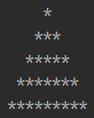
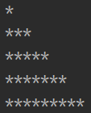
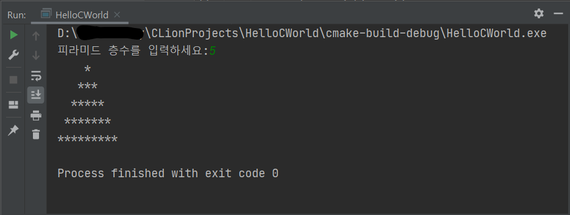

# 서론

프로그래밍 언어를 배우면서 표준입출력을 배운 후에 꼭 하는 일이 있다.

바로 \*(별)으로 피라미드를 쌓는 것이다.

아마 대부분의 교수님들께서 이 동일한 과제를 내는 것으로 봤을 때, print 문과 반복 구조를 시험하기에 피라미드 쌓기 문제만큼 효과적인 게 없는 게 아닐까?

# 피라미드 쌓기

별(\*)으로 피라미드를 어떻게 쌓아야 하는가는 사람마다 다르지만, 보통 이러한 출력을 콘솔창에 띄울 수 있으면 된다.



여기서 포인트는 피라미드가 가운데 정렬되어야 한다는 사실이다.

다행히 별의 오른쪽에 공백을 출력할 필요는 없었다.

즉, 아래처럼 출력하면 감점 사유가 된다.



# 문제 해결 알고리즘

필자는 이 문제를 해결하기 위해 몇 가지 생각을 거쳤다.

일단 입력받는 숫자는 피라미드의 층 수이다.

그리고 가장 처음에 출력되는 별이 정확하게 가운데 있기 위해서는 공백(" ")까지 출력해줘야 한다.

별의 개수와 공백의 개수는 피라미드의 층 수에 따라 달라지므로, 이 둘 사이의 관계를 찾으면 문제 구상이 끝나며 코딩만 남는다.

피라미드의 층 수를 num이라 하고, 한 층에 출력되는 \*(별)의 개수와 공백의 개수 사이의 관계를 찾아보자.

이를 위해 위에서 언급한 6층 짜리 피라미드를 살펴보자.

6층 - 별1개, 공백 5개

5층 - 별3개, 공백 4개

4층 - 별5개, 공백 3개

3층 - 별7개, 공백 2개

2층 - 별9개, 공백 1개

1층 - 별11개, 공백 0개

즉, 피라미드 층 수가 내려갈수록,

별의 개수는 첫 항이 1이고 공차가 2인 등차수열을 따르고,

공백의 개수는 하나씩 감소하여 가장 아래 층에서는 0이 된다.

이 관계를 프로그래밍 언어로 구현하면 끝이다.

# C로 구현한 피라미드 쌓기 문제

```
#include <stdio.h>

int main(void) {
    int num;
//    FILE * fp = fopen("pyramid.txt", "w");

    printf("피라미드 층수를 입력하세요:");
    scanf("%d", &num);

    if (num <= 0) {
        printf("(오류) 자연수를 입력해야합니다.");
        return -1;
    }

    for (int i = 0; i < num; i++) {
        int star_number = 2 * (i + 1) - 1;
        int blank_number = (num - 1) - i;

        for (int p = 0; p < blank_number; p++) {
//            fprintf(fp, " ");
            printf(" ");
        }

        for (int q = 0; q < star_number; q++) {
//            fprintf(fp, "*");
            printf("*");
        }

//        fprintf(fp, "\n");
        printf("\n");
    }

//    fclose(fp);

    return 0;
}
```



잘 출력되었다.
