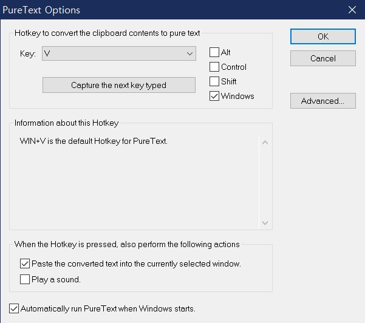
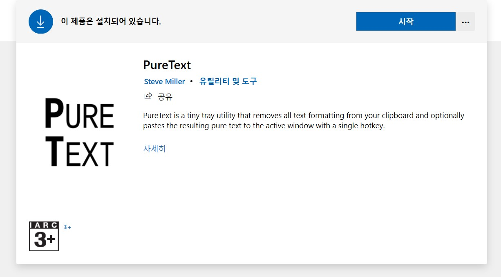

인터넷에서 각종 텍스트 글자를 복사한 후, 붙여넣기를 할 때 문제점이 하나 있었습니다.

바로 각종 서식까지 붙여넣기가 되는 경우를 말하는데요.

글자색부터 폰트, 밑줄 등 불필요한 부분까지 붙여넣기가 되어 상당히 골치아플 때가 많습니다.

이때 유용하게 사용할 수 있는 프로그램이 바로 PureText 입니다.

[https://stevemiller.net/PureText/](https://stevemiller.net/PureText)

[PureText

PureText is a tiny tray utility that removes all text formatting from your clipboard and optionally pastes the resulting pure text to the active window with a single hotkey. Have you ever copied some text from a web page or Word document, and wanted to pas

stevemiller.net](https://stevemiller.net/PureText)
> PureText is a tiny tray utility that removes all text formatting from your clipboard and optionally pastes the resulting pure text to the active window with a single hotkey.

서식 없이 텍스트만 붙여넣는 단축키를 설정하여 사용할 수 있으며, 저는 기본값인 윈도우키+V로 사용중입니다.

이 프로그램은 [MS Store](https://www.microsoft.com/store/apps/9PKJV6319QTL)에서도 받을 수 있습니다.

공식 홈페이지에서 받은 PureText 6.2 프로그램을 백업용으로 첨부해둡니다.

[puretext\_6.2\_32-bit.zip

0.04MB](./file/puretext_6.2_32-bit.zip)
[puretext\_6.2\_64-bit.zip

0.04MB](./file/puretext_6.2_64-bit.zip)